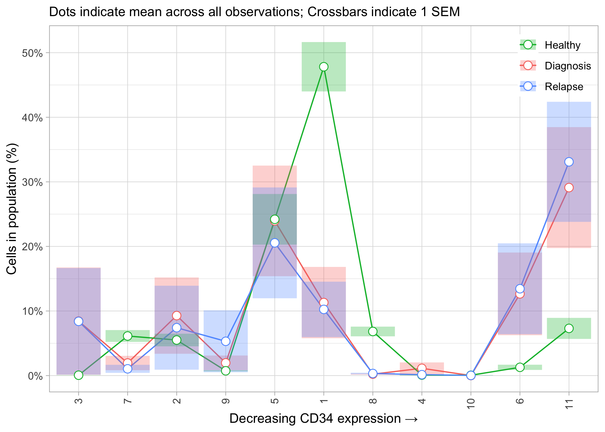
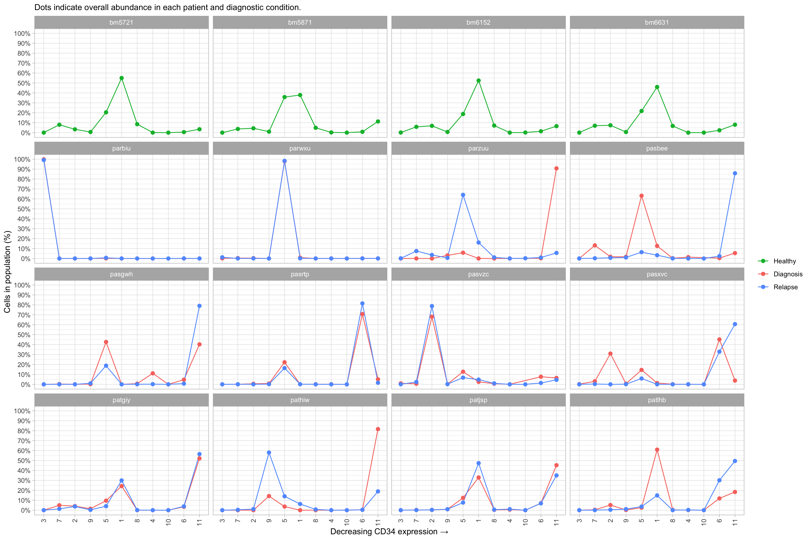

Diagnosis vs. Relapse Abundance Analysis
================
Timothy Keyes
2020-09-08

  - [Executive Summary](#executive-summary)
  - [Analysis](#analysis)
      - [Basic setup](#basic-setup)
      - [Differential abundance
        visualization](#differential-abundance-visualization)
      - [Conclusions](#conclusions)

# Executive Summary

In this analysis, we look at the abundance of different clusters of
myeloid cells (in both healthy and AML bone marrow) in paired diagnostic
and relapse samples from the same patients.

# Analysis

``` r
# Libraries
library(tidyverse)
#library(CATALYST)

# Parameters
input_path <- here::here("data", "AML_matrix_clustered.rds")

CLASSIFIER_POPULATIONS <- 
  c(
    'HSC',
    'MPP',
    'CMP',
    'GMP',
    'MEP',                          
    'Monocyte', 
    'DC', 
    'Macrophage', 
    'Thrombocyte'
  )

#===============================================================================

#source necessary files
source('~/GitHub/aml-cells/scripts/setup/marker_setup.R')
source('~/GitHub/aml-cells/scripts/setup/patient_setup.R')
```

### Basic setup

Algorithm (in words):

  - Read in previously pre-processed data
      - arcsinh transform
      - compensation
      - filtered on `time` variable to remove weird CD34/CD38
        “debarcode-gate”
  - filter to only include paired samples (with both `Dx` and `Rx`
    present as well as healthy controls)

<!-- end list -->

``` r
#### set up global varibles
marker_setup()
patient_setup()

recode_vars <- 
  tibble(
    from = 1:length(CLASSIFIER_POPULATIONS), 
    to = CLASSIFIER_POPULATIONS
  ) %>% 
  deframe()

#read in paired data (and healthy data) 
aml_data <- 
  input_path %>% 
  read_rds() %>%
  mutate(
    patient = 
      patient %>% 
      as.character() %>% 
      str_to_lower() %>% 
      if_else(. == "pastrp", "pasrtp", .), 
    Mah.cluster = 
      recode(Mah.cluster, !!! recode_vars) %>% 
      factor(levels = CLASSIFIER_POPULATIONS)
  ) %>% 
  mutate_at(
    .vars = vars(phenograph.metacluster, FlowSOM.metacluster, kmeans.cluster),
    ~ (.) %>% 
      as.character() %>% 
      fct_reorder(., CD34, .fun = mean, .desc = FALSE)
  ) %>% 
  filter(patient %in% c(PAIRED_PATIENTS, HEALTHY_CONTROLS)) %>% 
  rename_at(
    vars(everything()), 
    ~ (.) %>% 
      str_to_lower() %>% 
      str_replace_all(pattern = "[:punct:]", replacement = "_")
  )
```

### Differential abundance visualization

#### Classifier populations

**In aggregate:**

Algorithm (in words):

  - For each patient and diagnostic condition (i.e. “Healthy”,
    “Diagnosis”, and “Relapse”), find the abundance of each classifier
    population (calculated using these markers):

| marker |
| :----- |
| CD45   |
| CD34   |
| CD38   |
| CD61   |
| CD14   |
| CD135  |
| CD45RA |
| CD90   |
| HLA-DR |
| CD41   |
| CD13   |
| CD11b  |
| CD11c  |

  - Find the mean and standard error of the mean for each population in
    each condition (across all patients)
  - Plot

<!-- end list -->

    ## `summarise()` ungrouping output (override with `.groups` argument)

    ## `summarise()` regrouping output by 'patient', 'condition' (override with `.groups` argument)

    ## `summarise()` regrouping output by 'condition' (override with `.groups` argument)

<!-- -->

From this plot, as discussed before, we can see that primitive
populations (including HSC, MPP, CMP GMP, and MEP) are expanded in the
cancer samples relative to healthy patients. However, there don’t seem
to be many populations that are very different between diagnostic and
relapse samples at least in aggregate. However, we can take a closer
look by doing a patient-specific analysis…

**Patient by patient:**

``` r
patient_plot("mah_cluster")
```

    ## `summarise()` regrouping output by 'patient', 'condition' (override with `.groups` argument)

<!-- -->

From these plots, a qualitative analysis might suggest that there are 3
main “types” of relationship between `diagnosis` and `relapse`
timepoints:

1)  **Patients who don’t seem to change much:** PARBIU, PATGIY, PATJSP,
    PARWXU, PATHIW
2)  **Patients who shift from 1 main population to another:** PARZUU,
    PASXVC, PASBEE
3)  **Patients with minor shifts (across multiple populations):**
    PASGWH, PASVZC, PASRTP, PATLHB

#### Phenograph populations

**In aggregate:**

Algorithm (in words):

  - For each patient and diagnostic condition (i.e. “Healthy”,
    “Diagnosis”, and “Relapse”), find the abundance of each phenograph
    population (calculated using all surface markers, as done in the
    original Phenograph paper).

  - Find the mean and standard error of the mean for each population in
    each condition (across all patients).

  - Order the populations by mean `CD34` expression (used as a marker of
    immaturity in the original Phenograph paper)

  - Plot

<!-- end list -->

``` r
cluster_plot("phenograph_metacluster") + 
    labs(x = "Decreasing CD34 expression →")
```

    ## `summarise()` ungrouping output (override with `.groups` argument)

    ## `summarise()` regrouping output by 'patient', 'condition' (override with `.groups` argument)

    ## `summarise()` regrouping output by 'condition' (override with `.groups` argument)

<!-- -->

From this plot, we can see that most phenograph clusters don’t have SEM
error bars, indicating that they are only present in 1 patient in a
given diagnostic condition. For that reason, PhenoGraph clustering may
need to be run with alternative parameters if patient-to-patient
comparisons are to be made.

In addition, we can see that there isn’t quite as much specificity for
expansion in the “immature” compartment (i.e. the CD34-high compartment)
compared to the classifier’s immature populations. This is likely
because CD34 expression is really a “poor man’s” way to indicate
immaturity, and a more rigorous way of expressing this idea would be to
explicitly compute a pseudo-time axis of some kind.

#### FlowSOM populations

**In aggregate:**

Algorithm (in words):

  - For each patient and diagnostic condition (i.e. “Healthy”,
    “Diagnosis”, and “Relapse”), find the abundance of each FlowSOM
    population (calculated using all surface markers).

  - Find the mean and standard error of the mean for each population in
    each condition (across all patients).

  - Order the populations by mean `CD34` expression (used as a marker of
    immaturity in the original Phenograph paper)

  - Plot

<!-- end list -->

``` r
cluster_plot("flowsom_metacluster") + 
  theme(legend.position = c(0.92, 0.9)) + 
  labs(x = "Decreasing CD34 expression →")
```

    ## `summarise()` ungrouping output (override with `.groups` argument)

    ## `summarise()` regrouping output by 'patient', 'condition' (override with `.groups` argument)

    ## `summarise()` regrouping output by 'condition' (override with `.groups` argument)

<!-- -->

Here, we can see similar results to that found in the classifier:
several populations are expanded in the cancer samples relative to the
healthy samples, with 2 of them (8 and 1) reduced in the cancer samples
relative to the healthy samples overall.

Note that a simliar issue w.r.t. using `CD34` expression as a maturity
marker is seen as above.

**Patient-by-patient:**

When we look at similar plots on a patient-by-patient basis, we can see
that the same kinds of patterns between `diagnosis` and `relapse` time
points within a single patients are observed using FlowSOM clustering as
were observed using the classifier populations.

``` r
patient_plot("flowsom_metacluster") + 
  labs(x = "Decreasing CD34 expression →")
```

    ## `summarise()` regrouping output by 'patient', 'condition' (override with `.groups` argument)

<!-- -->

Once again, our qualitative analysis might suggest that there are 3 main
“types” of relationship between `diagnosis` and `relapse` timepoints:

2)  **Patients who don’t seem to change much:** PARBIU, PATGIY, PATJSP,
    PARWXU, PATHIW
3)  **Patients who shift from 1 main population to another:** PARZUU,
    PASXVC, PASBEE
4)  **Patients with minor shifts (across multiple populations):**
    PASGWH, PASVZC, PASRTP, PATLHB

### Conclusions

  - Abundances of different cell populations are likely to be
    informative features in a predictive model of relapse, as difference
    between patients (and between time points) suggest a role in relapse
    biology

  - There is variability between patients (i.e. 3 types of patient) re:
    shifts in population abundance from diagnosis to relapse. This may
    indicate that a model that can take into account the relationships
    between populations may capture more relevant information than one
    that only considers them independently (the current gold standard).

  - Pseudo-time calculations among healthy and cancer cell populations
    may yield a relevant feature for modeling (interaction term, see
    point above) or may simply help with visualization.

  - Statistics to evaluate the descriptive differences above would be
    nice. Currently, I am evaluating between the two main approaches
    that people use for single-cell data:
    
      - SAM-like permutation tests.
      - Linear mixed models (i.e. `diffcyt` and `limma` packages).
