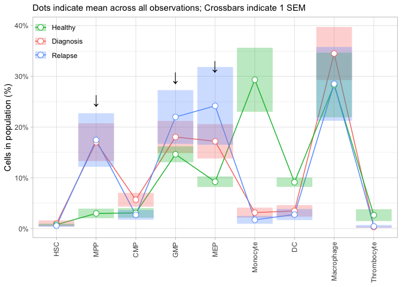

Abundances EDA
================
2020-09-04

  - [Read in data](#read-in-data)
  - [Wrangle data](#wrangle-data)
  - [Abundance plots](#abundance-plots)

``` r
# Libraries
library(tidyverse)
library(rlang)

# Parameters

data_path <- 
  file.path(
    "~", 
    "Box", 
    "Tim", 
    "Lab", 
    "SL_root_simulation", 
    "home", 
    "groups", 
    "kardavis", 
    "Tim", 
    "results", 
    "data", 
    "AML_matrix_clustered.RData"
  )

cluster_column <- "Mah.cluster"
plot_out_path <- file.path("~", "Desktop", "new_plots")

metadata <- c("patient", "condition")

CLASSIFIER_POPULATIONS <- 
  c(
    'HSC',
    'MPP',
    'CMP',
    'GMP',
    'MEP',                          
    'Monocyte', 
    'DC', 
    'Macrophage', 
    'Thrombocyte'
  )

#===============================================================================
```

## Read in data

``` r
load(data_path)
clustered_data <- expression.matrix
rm(expression.matrix)

recode_vars <- 
  tibble(
    from = 1:length(CLASSIFIER_POPULATIONS), 
    to = CLASSIFIER_POPULATIONS
  ) %>% 
  deframe()

clustered_data <- 
  clustered_data %>% 
  mutate(
    Mah.cluster = recode(Mah.cluster, !!! recode_vars)
  )

glimpse(clustered_data)
```

    ## Observations: 22,527,298
    ## Variables: 61
    ## $ CD45                   <dbl> 0.7355991, 0.8844033, 0.7848036, 0.6176956, 0.…
    ## $ CD61                   <dbl> 0.000000000, 0.003250366, 0.570958807, 0.38170…
    ## $ CD99                   <dbl> 0.042819780, 0.813498004, 0.787793053, 0.48626…
    ## $ CD45RA                 <dbl> 0.9608541, 0.8157874, 0.4858746, 0.3717525, 1.…
    ## $ CD93                   <dbl> 1.311250e-01, 8.808554e-02, 9.529576e-01, 8.33…
    ## $ CD3_CD19               <dbl> 1.315749e-01, 1.180963e-02, 2.144823e-01, 4.02…
    ## $ CCR2                   <dbl> 0.015624203, 0.000000000, 0.848316800, 0.69266…
    ## $ CD117                  <dbl> 0.000895933, 0.000000000, 0.000000000, 0.00000…
    ## $ CD123                  <dbl> 0.000000000, 0.025088162, 0.000000000, 0.81811…
    ## $ CD64                   <dbl> 0.000000000, 0.000000000, 0.600762313, 0.00000…
    ## $ CD90                   <dbl> 0.07470160, 0.00000000, 0.00000000, 0.09787116…
    ## $ CD38                   <dbl> 0.00000000, 0.88088131, 0.16674776, 0.77664919…
    ## $ CD34                   <dbl> 0.00000000, 0.00000000, 0.06400650, 0.00000000…
    ## $ CEBPa                  <dbl> 0.58329344, 0.18450223, 0.45120416, 0.06415526…
    ## $ pSTAT5                 <dbl> 0.027482226, 0.000000000, 0.184190653, 0.43294…
    ## $ CD11c                  <dbl> 0.78428255, 0.58340626, 0.70790057, 0.53188159…
    ## $ CD13                   <dbl> 0.72840505, 0.00000000, 0.85862923, 0.77908264…
    ## $ pAkt                   <dbl> 0.000000e+00, 0.000000e+00, 1.037035e-01, 1.48…
    ## $ `TIM-3`                <dbl> 0.037987446, 0.663762359, 0.159347461, 0.00528…
    ## $ CD56                   <dbl> 0.34674920, 0.43420915, 0.23783346, 0.12415360…
    ## $ CD10                   <dbl> 0.00000000, 0.02913005, 0.00000000, 0.00000000…
    ## $ PU.1                   <dbl> 0.37481038, 0.00000000, 0.60684699, 0.01828569…
    ## $ CD33                   <dbl> 0.01870152, 0.00000000, 0.79428592, 0.29688852…
    ## $ `PD-L1`                <dbl> 0.09079612, 0.09117277, 0.14868583, 0.21660026…
    ## $ CD14                   <dbl> 0.01640542, 0.00000000, 0.77128087, 0.00000000…
    ## $ `caspase-3`            <dbl> 0.000000000, 0.364331280, 0.000000000, 0.01628…
    ## $ `GATA-1`               <dbl> 0.03068627, 0.00000000, 0.00000000, 0.04073054…
    ## $ pSTAT3                 <dbl> 0.000000000, 0.000000000, 0.000000000, 0.00000…
    ## $ CD41                   <dbl> 0.000000000, 0.000000000, 0.499743831, 0.40263…
    ## $ CD16                   <dbl> 0.02963209, 0.79682036, 0.00000000, 0.00000000…
    ## $ CD68                   <dbl> 0.57651732, 0.00000000, 0.72729988, 0.40275124…
    ## $ MPO                    <dbl> 0.000000000, 0.091493104, 0.659900461, 0.42538…
    ## $ pErk                   <dbl> 0.01259706, 0.00000000, 0.00000000, 0.00000000…
    ## $ CD47                   <dbl> 0.6752265, 0.8316395, 0.7021607, 0.8025179, 0.…
    ## $ CD135                  <dbl> 0.009016088, 0.000000000, 0.000000000, 0.18009…
    ## $ CD109                  <dbl> 0.161965070, 0.531612317, 0.000000000, 0.07066…
    ## $ pS6                    <dbl> 0.2939695272, 0.5254894057, 0.6188516009, 0.00…
    ## $ CD49f                  <dbl> 0.0000000000, 0.2685410910, 0.4571935278, 0.02…
    ## $ `HLA-DR`               <dbl> 0.111786773, 0.000000000, 0.194670908, 0.03022…
    ## $ CD71                   <dbl> 0.012154712, 0.000000000, 0.025537403, 0.01220…
    ## $ pCreb                  <dbl> 0.6067774, 0.5702070, 0.7695424, 0.6276172, 0.…
    ## $ cisplatin              <dbl> 0.22711444, 0.00000000, 0.00000000, 0.15178127…
    ## $ CD11b                  <dbl> 0.31264310, 0.50514077, 0.56405680, 0.54153815…
    ## $ `Mah-Pop1`             <dbl> 17.51376, 16.24590, 16.36025, 16.15555, 15.473…
    ## $ `Mah-Pop2`             <dbl> 12.502742, 11.251450, 10.456155, 11.214193, 13…
    ## $ `Mah-Pop3`             <dbl> 13.775021, 12.570775, 17.749418, 13.183212, 14…
    ## $ `Mah-Pop4`             <dbl> 10.164078, 3.960729, 8.706985, 6.992011, 7.381…
    ## $ `Mah-Pop5`             <dbl> 11.813426, 7.824673, 8.555696, 6.809054, 11.45…
    ## $ `Mah-Pop6`             <dbl> 8.291806, 10.639269, 3.487581, 8.644683, 10.71…
    ## $ `Mah-Pop7`             <dbl> 4.984885, 12.151167, 6.734138, 10.524706, 13.5…
    ## $ `Mah-Pop8`             <dbl> 6.683312, 8.472091, 5.243564, 7.262847, 7.5347…
    ## $ `Mah-Pop9`             <dbl> 11.071042, 11.731047, 5.543330, 9.207515, 11.5…
    ## $ s.statistic            <dbl> 0.6501458, 0.5272086, 0.5315336, 0.9552250, 0.…
    ## $ patient                <fct> BM5721, BM5721, BM5721, BM5721, BM5721, BM5721…
    ## $ stimulation            <fct> Basal, Basal, Basal, Basal, Basal, Basal, Basa…
    ## $ condition              <fct> Healthy, Healthy, Healthy, Healthy, Healthy, H…
    ## $ Mah.cluster            <chr> "DC", "GMP", "Monocyte", "MEP", "GMP", "GMP", …
    ## $ phenograph.metacluster <dbl> 12, 61, 2, 1, 21, 21, 2, 12, 48, 28, 1, 61, 2,…
    ## $ FlowSOM.cluster        <dbl> 31, 41, 11, 45, 41, 41, 11, 31, 54, 15, 45, 41…
    ## $ FlowSOM.metacluster    <int> 7, 5, 1, 8, 5, 5, 1, 7, 5, 2, 8, 5, 1, 6, 8, 1…
    ## $ kmeans.cluster         <int> 58, 41, 155, 179, 25, 41, 155, 58, 78, 93, 179…

## Wrangle data

Calculate proportion of each develpomental cluster in each sample and
condition (Diagnostic, Relapse, Healthy), then find the average and SEM
across all samples.

``` r
sample_size <- 
  clustered_data %>% 
  group_by(condition) %>% 
  summarize(group_size = n_distinct(patient))
```

    ## `summarise()` ungrouping output (override with `.groups` argument)

``` r
abundances <- 
  clustered_data %>% 
  group_by_at(vars(one_of(metadata, cluster_column))) %>% 
  summarize(cell_count = n()) %>% 
  mutate(cell_prop = cell_count / sum(cell_count)) %>% 
  left_join(sample_size, by = "condition") %>% 
  group_by(condition, Mah.cluster) %>% 
  summarize(
    group_size = mean(group_size), 
    sem = sd(cell_prop) / sqrt(group_size), 
    cell_prop = mean(cell_prop), 
  )
```

    ## `summarise()` regrouping output by 'patient', 'condition' (override with `.groups` argument)

    ## `summarise()` regrouping output by 'condition' (override with `.groups` argument)

``` r
abundances
```

    ## # A tibble: 27 x 5
    ## # Groups:   condition [3]
    ##    condition Mah.cluster group_size     sem cell_prop
    ##    <fct>     <chr>            <dbl>   <dbl>     <dbl>
    ##  1 Dx        CMP                 29 0.0137    0.0566 
    ##  2 Dx        DC                  29 0.0114    0.0346 
    ##  3 Dx        GMP                 29 0.0316    0.180  
    ##  4 Dx        HSC                 29 0.00607   0.00988
    ##  5 Dx        Macrophage          29 0.0524    0.345  
    ##  6 Dx        MEP                 29 0.0340    0.172  
    ##  7 Dx        Monocyte            29 0.00985   0.0312 
    ##  8 Dx        MPP                 29 0.0374    0.170  
    ##  9 Dx        Thrombocyte         29 0.00101   0.00275
    ## 10 Healthy   CMP                  4 0.00947   0.0307 
    ## # … with 17 more rows

## Abundance plots

``` r
abundances %>% 
  mutate(
    Mah.cluster = 
      factor(Mah.cluster, levels = CLASSIFIER_POPULATIONS)
  ) %>% 
  ggplot(aes(x = Mah.cluster, y = cell_prop, color = condition)) + 
  geom_line(aes(group = condition)) + 
  geom_crossbar(
    aes(ymin = cell_prop - sem, ymax = cell_prop + sem, fill = condition), 
    alpha = 0.3, 
    color = NA
  ) + 
  geom_point(shape = 21, fill = "white", size = 3) + 
  scale_y_continuous(
    breaks = scales::breaks_width(width = 0.1), 
    labels = scales::label_percent(accuracy = 1)
  ) + 
  geom_text(
    aes(x = Mah.cluster, y = cell_prop + 0.1), 
    data = 
      abundances %>% 
      dplyr::filter(
        Mah.cluster %in% c("MPP", "GMP", "MEP"), 
        condition == "Rx"
      ), 
    label = "\n↓", 
    color = "black", 
    size = 6
  ) +
  scale_color_discrete(
    breaks = c("Healthy", "Dx", "Rx"), 
    labels = c("Healthy", "Diagnosis", "Relapse")
  ) + 
  scale_fill_discrete(
    breaks = c("Healthy", "Dx", "Rx"), 
    labels = c("Healthy", "Diagnosis", "Relapse")
  ) + 
  theme_light() + 
  theme(
    axis.text.x = element_text(angle = 90, hjust = 1, vjust = 0.5), 
    legend.position = c(0.07, 0.9), 
    legend.background = element_blank()
  ) + 
  labs(
    x = NULL, 
    y = "Cells in population (%)", 
    fill = NULL, 
    color = NULL, 
    subtitle = 
      "Dots indicate mean across all observations; Crossbars indicate 1 SEM"
  )
```

<!-- -->

Interpretation -

From the above plot, we can see that there are several cell
subpopulations in which cancer cells are “expanded” relative to their
healthy developmental counterparts. Populations of interest are
indicated with arrows.

Specifically, Diagnostic and Relapse samples seem to be expanded in
several primitive myeloid populations, including `MPPs`, `GMPs`, and
`MEPs`. Interestingly, there seems to be more of a difference in the
representation of `GMPs` and `MEPs` between diagnostic and relapse
samples, whereas `MPPs` seem relatively consistent across both time
points. `CMPs` have a slight trend for being increased in Diagnostic
samples relative to relapse samples, but null-hypothesis significance
testing will probably not show this as significant (based on the SEMs).

Whether or not these trends hold true for individual patients can be
elucidated with individual plots of each patient’s trajectory.

`MPPs`, `GMPs`, and `MEPs` all give rise to vastly different branches of
the myeloid developmental lineage - a lineage that is highly
differentiable based not only on its marker profile, but also on the
specific morphological characteristics that myeloid cell types can take.
Thus, collecting morphological data on these cell types may be an
interesting way to characterize a great deal more of their biology, such
as in [this paper just published in Nature
Medicine](https://www.nature.com/articles/s41591-020-0783-x).
