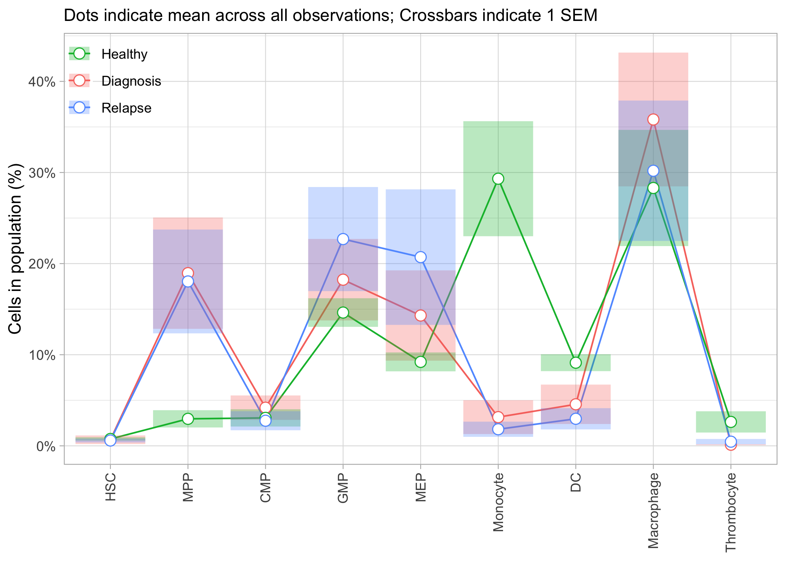
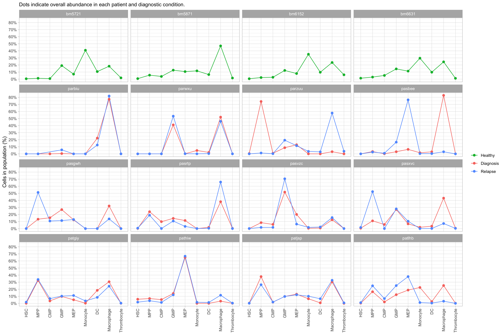
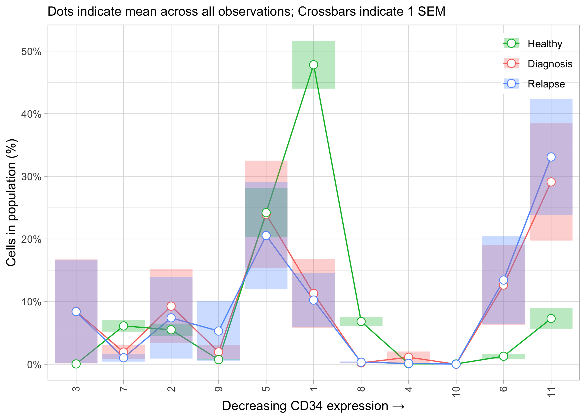

Diagnosis vs. Relapse Abundance Analysis
================
Timothy Keyes
2020-04-03

  - [Basic setup](#basic-setup)
  - [Differential abundance
    visualization](#differential-abundance-visualization)
      - [Classifier populations](#classifier-populations)
      - [Phenograph populations](#phenograph-populations)
      - [FlowSOM populations](#flowsom-populations)
      - [K-means populations](#k-means-populations)

``` r
# Libraries
library(tidyverse)

# Parameters
input_path <- here::here("data", "AML_matrix_clustered.rds")

CLASSIFIER_POPULATIONS <- 
  c(
    'HSC',
    'MPP',
    'CMP',
    'GMP',
    'MEP',                          
    'Monocyte', 
    'DC', 
    'Macrophage', 
    'Thrombocyte'
  )

#===============================================================================

#source necessary files
source('~/GitHub/aml-cells/scripts/setup/marker_setup.R')
source('~/GitHub/aml-cells/scripts/setup/patient_setup.R')
```

## Basic setup

Algorithm (in words):

  - Read in previously pre-processed data
      - arcsinh transform
      - compensation
      - filtered on `time` variable to remove weird CD34/CD38
        “debarcode-gate”
  - filter to only include paired samples (with both `Dx` and `Rx`
    present as well as healthy controls)

<!-- end list -->

``` r
#### set up global varibles
marker_setup()
patient_setup()

recode_vars <- 
  tibble(
    from = 1:length(CLASSIFIER_POPULATIONS), 
    to = CLASSIFIER_POPULATIONS
  ) %>% 
  deframe()

#read in paired data (and healthy data) 
aml_data <- 
  input_path %>% 
  read_rds() %>%
  mutate(
    patient = 
      patient %>% 
      as.character() %>% 
      str_to_lower() %>% 
      if_else(. == "pastrp", "pasrtp", .), 
    Mah.cluster = 
      recode(Mah.cluster, !!! recode_vars) %>% 
      factor(levels = CLASSIFIER_POPULATIONS)
  ) %>% 
  mutate_at(
    .vars = vars(phenograph.metacluster, FlowSOM.metacluster, kmeans.cluster),
    ~ (.) %>% 
      as.character() %>% 
      fct_reorder(., CD34, .fun = mean, .desc = FALSE)
  ) %>% 
  filter(patient %in% c(PAIRED_PATIENTS, HEALTHY_CONTROLS)) %>% 
  rename_at(
    vars(everything()), 
    ~ (.) %>% 
      str_to_lower() %>% 
      str_replace_all(pattern = "[:punct:]", replacement = "_")
  )
```

## Differential abundance visualization

### Classifier populations

**In aggregate:**

Algorithm (in words):

  - For each patient and diagnostic condition (i.e. “Healthy”,
    “Diagnosis”, and “Relapse”), find the abundance of each classifier
    population (calculated using these markers):

| marker |
| :----- |
| CD45   |
| CD34   |
| CD38   |
| CD61   |
| CD14   |
| CD135  |
| CD45RA |
| CD90   |
| HLA-DR |
| CD41   |
| CD13   |
| CD11b  |
| CD11c  |

  - Find the mean and standard error of the mean for each population in
    each condition (across all patients)
  - Plot

<!-- -->

From this plot, as discussed before, we can see that primitive
populations (including HSC, MPP, CMP GMP, and MEP) are expanded in the
cancer samples relative to healthy patients. However, there don’t seem
to be many populations that are very different between diagnostic and
relapse samples at least in aggregate. However, we can take a closer
look by doing a patient-specific analysis…

**Patient by patient:**

``` r
patient_plot("mah_cluster")
```

<!-- -->

### Phenograph populations

**In aggregate:**

Algorithm (in words):

  - For each patient and diagnostic condition (i.e. “Healthy”,
    “Diagnosis”, and “Relapse”), find the abundance of each phenograph
    population (calculated using all surface markers, as done in the
    original Phenograph paper).

  - Find the mean and standard error of the mean for each population in
    each condition (across all patients).

  - Order the populations by mean `CD34` expression (used as a marker of
    immaturity in the original Phenograph paper)

  - Plot

<!-- end list -->

``` r
cluster_plot("phenograph_metacluster") + 
    labs(x = "Decreasing CD34 expression →")
```

<!-- -->

From this plot, we can see that most phenograph clusters don’t have SEM
error bars, indicating that they are only present in 1 patient in a
given diagnostic condition. For that reason, PhenoGraph clustering may
need to be run with alternative parameters if patient-to-patient
comparisons are to be made.

**Patient-by-patient:**

``` r
patient_plot("phenograph_metacluster") + 
  labs(x = "Decreasing CD34 expression →")
```

<!-- -->

### FlowSOM populations

**In aggregate:**

Algorithm (in words):

  - For each patient and diagnostic condition (i.e. “Healthy”,
    “Diagnosis”, and “Relapse”), find the abundance of each FlowSOM
    population (calculated using all surface markers).

  - Find the mean and standard error of the mean for each population in
    each condition (across all patients).

  - Order the populations by mean `CD34` expression (used as a marker of
    immaturity in the original Phenograph paper)

  - Plot

<!-- end list -->

``` r
cluster_plot("flowsom_metacluster") + 
  theme(legend.position = c(0.92, 0.9)) + 
  labs(x = "Decreasing CD34 expression →")
```

<!-- -->

**Patient-by-patient:**

``` r
patient_plot("flowsom_metacluster") + 
  labs(x = "Decreasing CD34 expression →")
```

<!-- -->

### K-means populations

``` r
cluster_plot("kmeans_cluster") + 
  theme(legend.position = c(0.92, 0.9)) + 
  labs(x = "Decreasing CD34 expression →")
```

<!-- -->

**Patient-by-patient:**

``` r
patient_plot("kmeans_cluster") + 
  facet_wrap(facets = vars(patient), ncol = 1) + 
  labs(x = "Higher CD34 expression →")
```

<!-- -->
