Diagnosis vs. Relapse Expression Analysis
================
Timothy Keyes
2020-04-03

  - [Basic setup](#basic-setup)
  - [Cluster to cluster across
    patients](#cluster-to-cluster-across-patients)
      - [CD45](#cd45)
      - [CD34](#cd34)
      - [CD38](#cd38)
      - [CD90](#cd90)
      - [CD93](#cd93)
      - [CD99](#cd99)

``` r
# Libraries
library(tidyverse)

# Parameters
input_path <- here::here("data", "AML_matrix_clustered.rds")

CLASSIFIER_POPULATIONS <- 
  c(
    'HSC',
    'MPP',
    'CMP',
    'GMP',
    'MEP',                          
    'Monocyte', 
    'DC', 
    'Macrophage', 
    'Thrombocyte'
  )

#===============================================================================

#source necessary files
source('~/GitHub/aml-cells/scripts/setup/marker_setup.R')
source('~/GitHub/aml-cells/scripts/setup/patient_setup.R')
```

## Basic setup

Algorithm (in words):

  - Read in previously pre-processed data
      - arcsinh transform
      - compensation
      - filtered on `time` variable to remove weird CD34/CD38
        “debarcode-gate”
  - filter to only include paired samples (with both `Dx` and `Rx`
    present as well as healthy controls)

<!-- end list -->

``` r
#### set up global varibles
marker_setup()
patient_setup()

recode_vars <- 
  tibble(
    from = 1:length(CLASSIFIER_POPULATIONS), 
    to = CLASSIFIER_POPULATIONS
  ) %>% 
  deframe()

#read in paired data (and healthy data) 
aml_data <- 
  input_path %>% 
  read_rds() %>%
  mutate(
    patient = 
      patient %>% 
      as.character() %>% 
      str_to_lower() %>% 
      if_else(. == "pastrp", "pasrtp", .), 
    Mah.cluster = 
      recode(Mah.cluster, !!! recode_vars) %>% 
      factor(levels = CLASSIFIER_POPULATIONS)
  ) %>% 
  mutate_at(
    .vars = vars(phenograph.metacluster, FlowSOM.cluster, FlowSOM.metacluster),
    ~ (.) %>% 
      as.character() %>% 
      fct_reorder(., CD34, .fun = mean, .desc = TRUE)
  ) %>% 
  filter(patient %in% c(PAIRED_PATIENTS, HEALTHY_CONTROLS)) %>% 
  rename_at(
    vars(everything()), 
    ~ (.) %>% 
      str_to_lower() %>% 
      str_replace_all(pattern = "[:punct:]", replacement = "_")
  )
```

## Cluster to cluster across patients

``` r
cluster_column <- "mah_cluster"
marker <- "cd45"

clusters_across_patients <- function(cluster_column, marker) {
  
  map(
    levels(aml_data[[cluster_column]]), 
    function(cluster_type) {
      patient_levels <- 
        aml_data %>% 
        filter(!! sym(cluster_column) == cluster_type) %>% 
        group_by(
          metacondition = if_else(condition == "Healthy", "Healthy", "Cancer"),
          patient
        ) %>% 
        summarize(median = median(!! sym(marker))) %>% 
        ungroup() %>% 
        arrange(metacondition, median) %>% 
        pull(patient)
      
      aml_data %>% 
        filter(!! sym(cluster_column) %in% cluster_type) %>% 
        mutate(
          metacondition = 
            if_else(condition == "Healthy", "Healthy", "Cancer") %>% 
            as.factor(), 
          patient = factor(patient, levels = patient_levels)
        ) %>% 
        ggplot(aes(x = patient, y = !! sym(marker), fill = condition)) + 
        geom_violin(draw_quantiles = 0.5) + 
        labs(
          title = 
            str_c(
              str_to_upper(marker), 
              " expression in ", 
              cluster_type, 
              " cells across patients"
            ), 
          fill = NULL
        )
    }
  )
}
```

### CD45

``` r
cd45_mah_cluster_plots <- clusters_across_patients("mah_cluster", "cd45")

cd45_mah_cluster_plots %>% 
  walk(print)
```

<!-- -->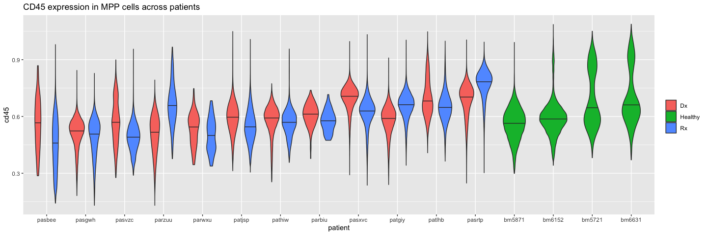<!-- -->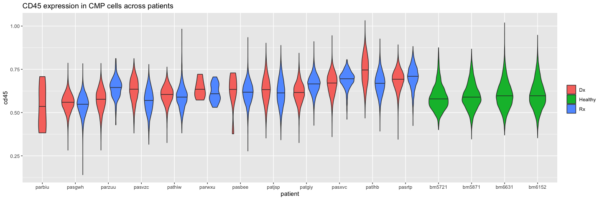<!-- -->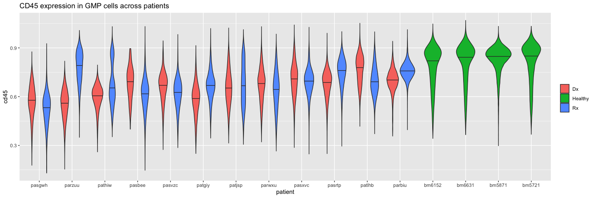<!-- -->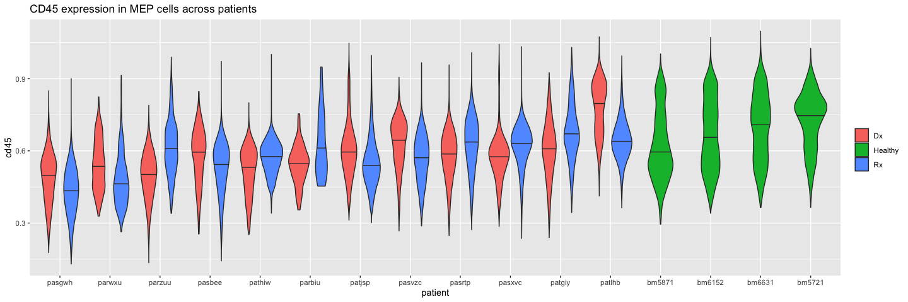<!-- -->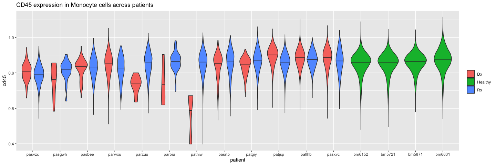<!-- -->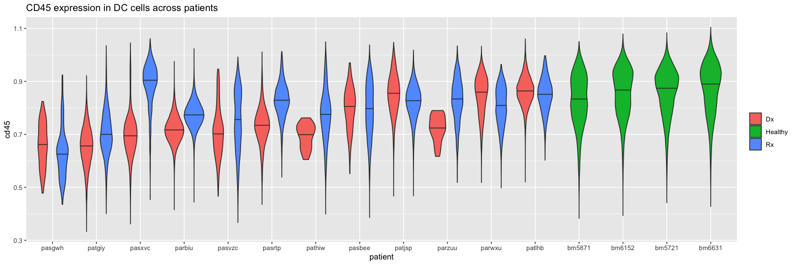<!-- -->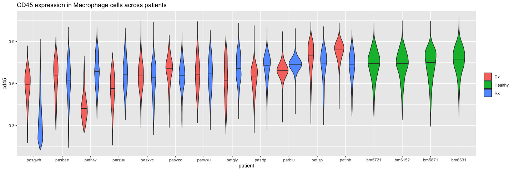<!-- -->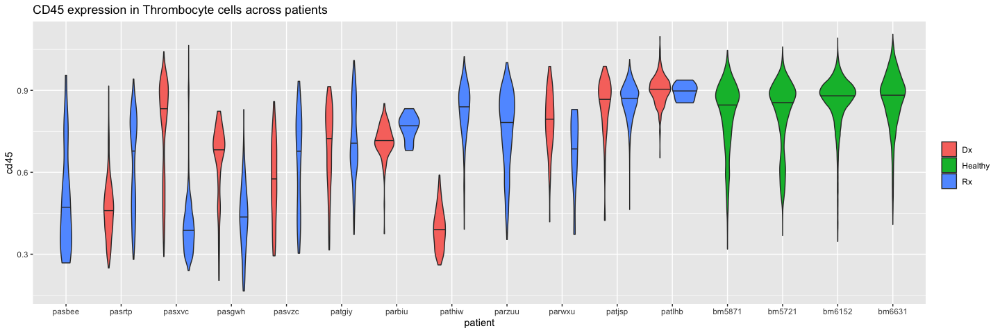<!-- -->

-----

### CD34

``` r
cd34_mah_cluster_plots <- clusters_across_patients("mah_cluster", "cd34")

cd34_mah_cluster_plots %>% 
  walk(print)
```

    ## Warning in regularize.values(x, y, ties, missing(ties)): collapsing to unique
    ## 'x' values
    
    ## Warning in regularize.values(x, y, ties, missing(ties)): collapsing to unique
    ## 'x' values
    
    ## Warning in regularize.values(x, y, ties, missing(ties)): collapsing to unique
    ## 'x' values

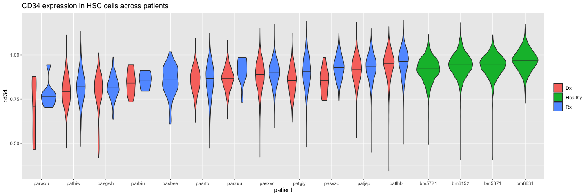<!-- -->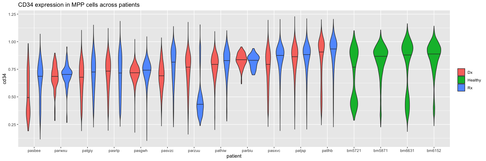<!-- -->

    ## Warning in regularize.values(x, y, ties, missing(ties)): collapsing to unique
    ## 'x' values

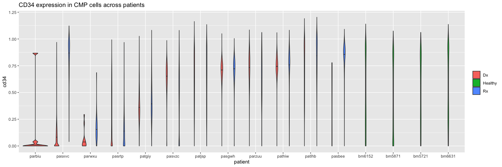<!-- -->

    ## Warning in regularize.values(x, y, ties, missing(ties)): collapsing to unique
    ## 'x' values

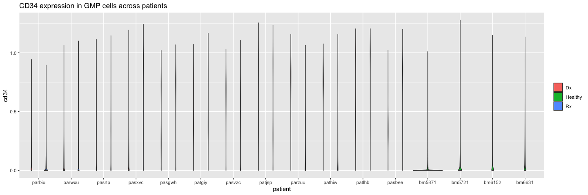<!-- -->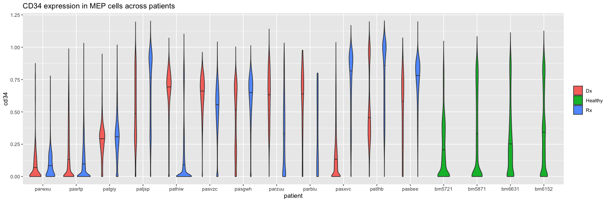<!-- -->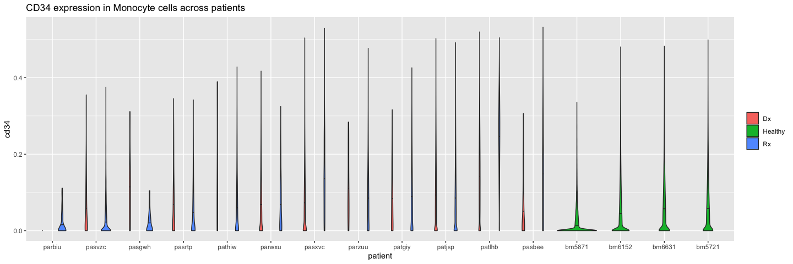<!-- -->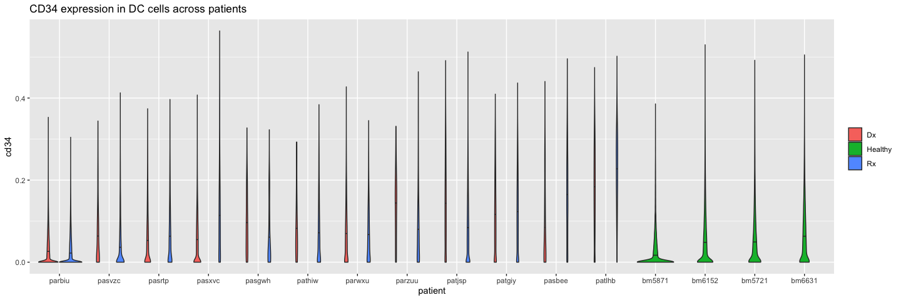<!-- -->

    ## Warning in regularize.values(x, y, ties, missing(ties)): collapsing to unique
    ## 'x' values
    
    ## Warning in regularize.values(x, y, ties, missing(ties)): collapsing to unique
    ## 'x' values

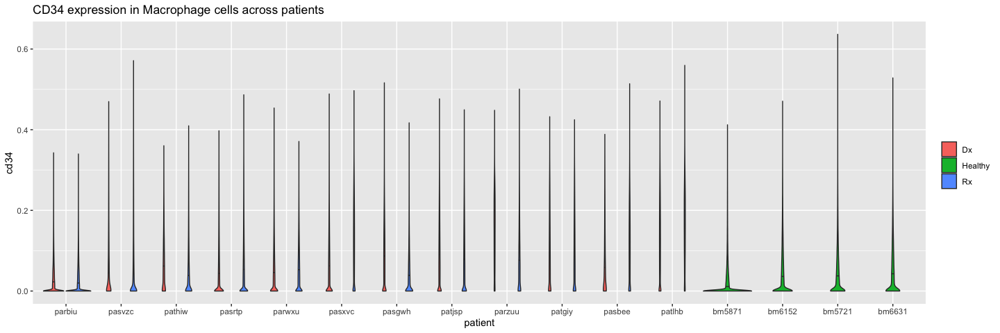<!-- -->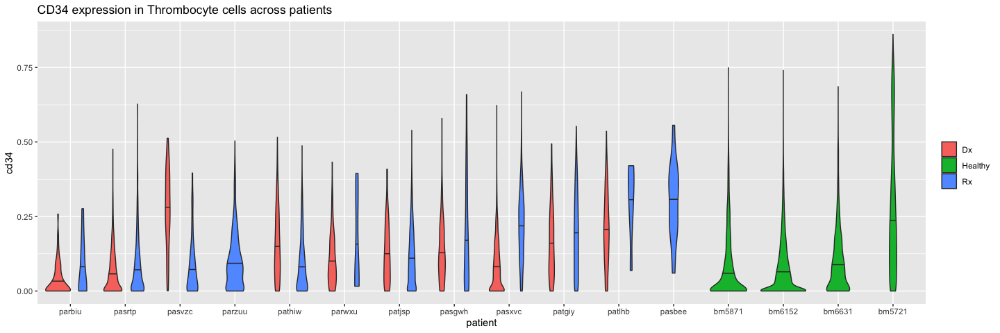<!-- -->

-----

### CD38

``` r
cd38_mah_cluster_plots <- clusters_across_patients("mah_cluster", "cd38")

cd38_mah_cluster_plots %>% 
  walk(print)
```

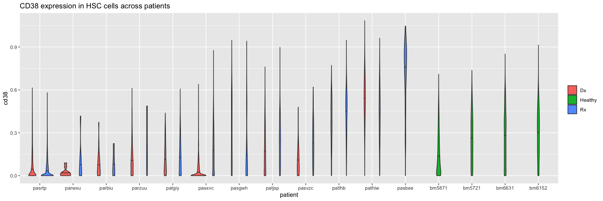<!-- -->

    ## Warning in regularize.values(x, y, ties, missing(ties)): collapsing to unique
    ## 'x' values

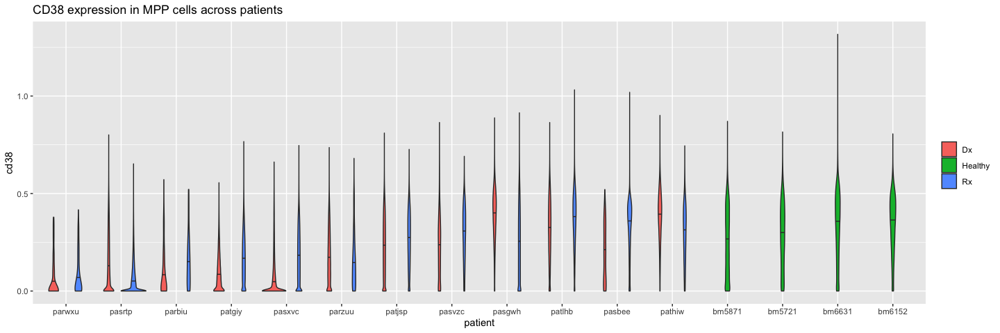<!-- -->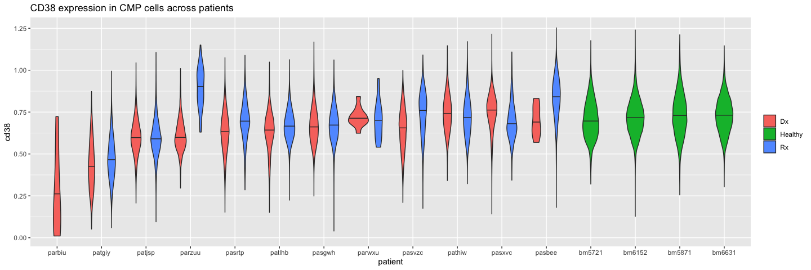<!-- -->

    ## Warning in regularize.values(x, y, ties, missing(ties)): collapsing to unique
    ## 'x' values

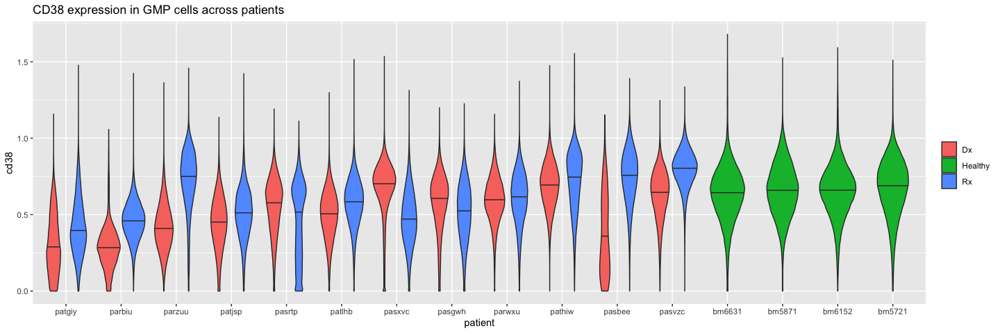<!-- -->

    ## Warning in regularize.values(x, y, ties, missing(ties)): collapsing to unique
    ## 'x' values
    
    ## Warning in regularize.values(x, y, ties, missing(ties)): collapsing to unique
    ## 'x' values

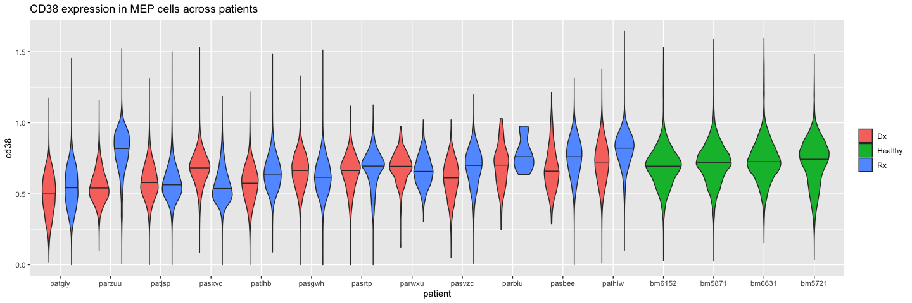<!-- --><!-- -->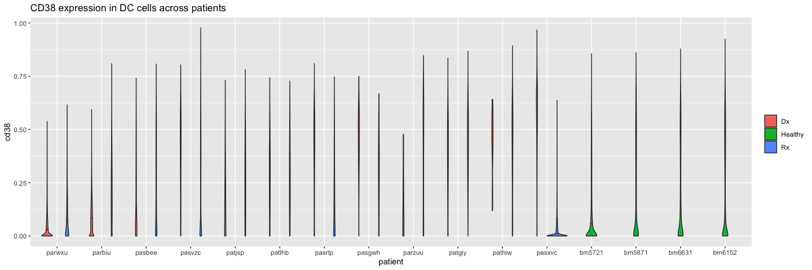<!-- -->

    ## Warning in regularize.values(x, y, ties, missing(ties)): collapsing to unique
    ## 'x' values

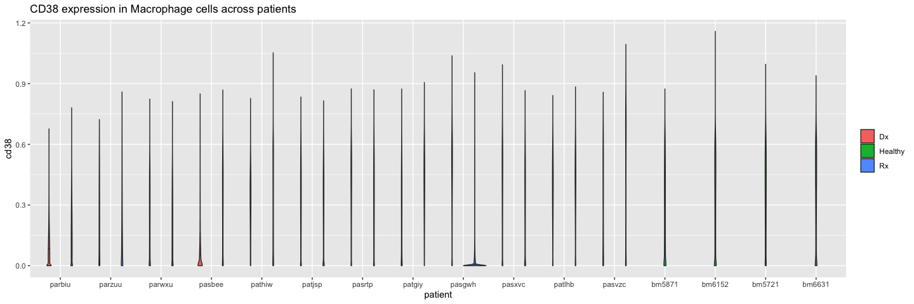<!-- -->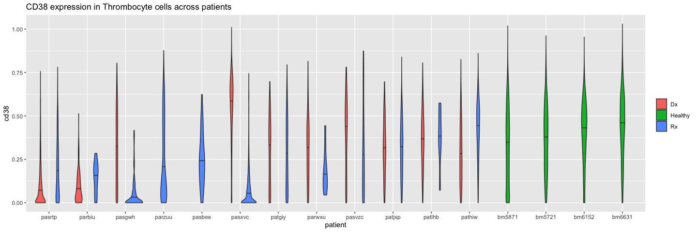<!-- -->

-----

### CD90

``` r
cd90_mah_cluster_plots <- clusters_across_patients("mah_cluster", "cd90")

cd90_mah_cluster_plots %>% 
  walk(print)
```

    ## Warning in regularize.values(x, y, ties, missing(ties)): collapsing to unique
    ## 'x' values
    
    ## Warning in regularize.values(x, y, ties, missing(ties)): collapsing to unique
    ## 'x' values
    
    ## Warning in regularize.values(x, y, ties, missing(ties)): collapsing to unique
    ## 'x' values
    
    ## Warning in regularize.values(x, y, ties, missing(ties)): collapsing to unique
    ## 'x' values
    
    ## Warning in regularize.values(x, y, ties, missing(ties)): collapsing to unique
    ## 'x' values

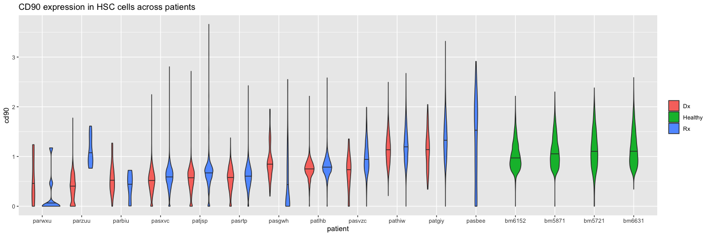<!-- -->

    ## Warning in regularize.values(x, y, ties, missing(ties)): collapsing to unique
    ## 'x' values
    
    ## Warning in regularize.values(x, y, ties, missing(ties)): collapsing to unique
    ## 'x' values
    
    ## Warning in regularize.values(x, y, ties, missing(ties)): collapsing to unique
    ## 'x' values
    
    ## Warning in regularize.values(x, y, ties, missing(ties)): collapsing to unique
    ## 'x' values
    
    ## Warning in regularize.values(x, y, ties, missing(ties)): collapsing to unique
    ## 'x' values

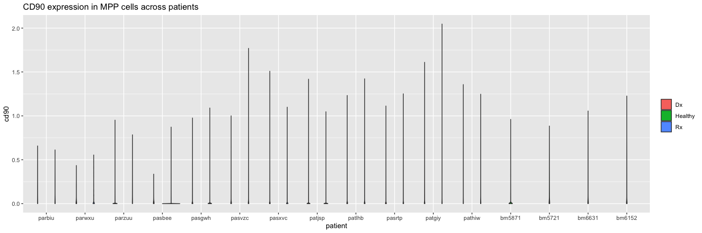<!-- -->

    ## Warning in regularize.values(x, y, ties, missing(ties)): collapsing to unique
    ## 'x' values
    
    ## Warning in regularize.values(x, y, ties, missing(ties)): collapsing to unique
    ## 'x' values
    
    ## Warning in regularize.values(x, y, ties, missing(ties)): collapsing to unique
    ## 'x' values
    
    ## Warning in regularize.values(x, y, ties, missing(ties)): collapsing to unique
    ## 'x' values
    
    ## Warning in regularize.values(x, y, ties, missing(ties)): collapsing to unique
    ## 'x' values
    
    ## Warning in regularize.values(x, y, ties, missing(ties)): collapsing to unique
    ## 'x' values
    
    ## Warning in regularize.values(x, y, ties, missing(ties)): collapsing to unique
    ## 'x' values
    
    ## Warning in regularize.values(x, y, ties, missing(ties)): collapsing to unique
    ## 'x' values
    
    ## Warning in regularize.values(x, y, ties, missing(ties)): collapsing to unique
    ## 'x' values
    
    ## Warning in regularize.values(x, y, ties, missing(ties)): collapsing to unique
    ## 'x' values
    
    ## Warning in regularize.values(x, y, ties, missing(ties)): collapsing to unique
    ## 'x' values
    
    ## Warning in regularize.values(x, y, ties, missing(ties)): collapsing to unique
    ## 'x' values
    
    ## Warning in regularize.values(x, y, ties, missing(ties)): collapsing to unique
    ## 'x' values

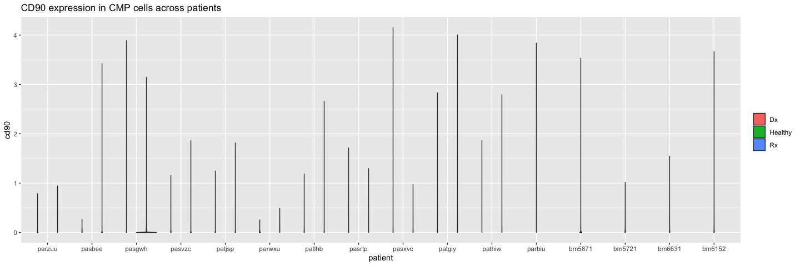<!-- -->

    ## Warning in regularize.values(x, y, ties, missing(ties)): collapsing to unique
    ## 'x' values
    
    ## Warning in regularize.values(x, y, ties, missing(ties)): collapsing to unique
    ## 'x' values
    
    ## Warning in regularize.values(x, y, ties, missing(ties)): collapsing to unique
    ## 'x' values
    
    ## Warning in regularize.values(x, y, ties, missing(ties)): collapsing to unique
    ## 'x' values
    
    ## Warning in regularize.values(x, y, ties, missing(ties)): collapsing to unique
    ## 'x' values
    
    ## Warning in regularize.values(x, y, ties, missing(ties)): collapsing to unique
    ## 'x' values
    
    ## Warning in regularize.values(x, y, ties, missing(ties)): collapsing to unique
    ## 'x' values
    
    ## Warning in regularize.values(x, y, ties, missing(ties)): collapsing to unique
    ## 'x' values
    
    ## Warning in regularize.values(x, y, ties, missing(ties)): collapsing to unique
    ## 'x' values
    
    ## Warning in regularize.values(x, y, ties, missing(ties)): collapsing to unique
    ## 'x' values
    
    ## Warning in regularize.values(x, y, ties, missing(ties)): collapsing to unique
    ## 'x' values
    
    ## Warning in regularize.values(x, y, ties, missing(ties)): collapsing to unique
    ## 'x' values
    
    ## Warning in regularize.values(x, y, ties, missing(ties)): collapsing to unique
    ## 'x' values
    
    ## Warning in regularize.values(x, y, ties, missing(ties)): collapsing to unique
    ## 'x' values
    
    ## Warning in regularize.values(x, y, ties, missing(ties)): collapsing to unique
    ## 'x' values
    
    ## Warning in regularize.values(x, y, ties, missing(ties)): collapsing to unique
    ## 'x' values
    
    ## Warning in regularize.values(x, y, ties, missing(ties)): collapsing to unique
    ## 'x' values
    
    ## Warning in regularize.values(x, y, ties, missing(ties)): collapsing to unique
    ## 'x' values
    
    ## Warning in regularize.values(x, y, ties, missing(ties)): collapsing to unique
    ## 'x' values
    
    ## Warning in regularize.values(x, y, ties, missing(ties)): collapsing to unique
    ## 'x' values

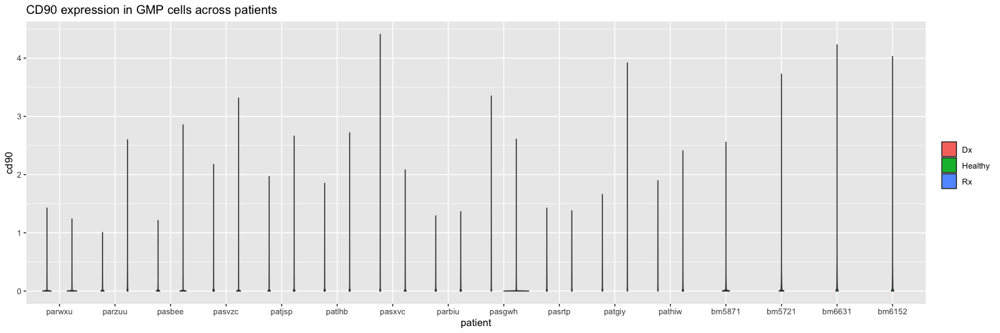<!-- -->

    ## Warning in regularize.values(x, y, ties, missing(ties)): collapsing to unique
    ## 'x' values
    
    ## Warning in regularize.values(x, y, ties, missing(ties)): collapsing to unique
    ## 'x' values
    
    ## Warning in regularize.values(x, y, ties, missing(ties)): collapsing to unique
    ## 'x' values
    
    ## Warning in regularize.values(x, y, ties, missing(ties)): collapsing to unique
    ## 'x' values
    
    ## Warning in regularize.values(x, y, ties, missing(ties)): collapsing to unique
    ## 'x' values
    
    ## Warning in regularize.values(x, y, ties, missing(ties)): collapsing to unique
    ## 'x' values
    
    ## Warning in regularize.values(x, y, ties, missing(ties)): collapsing to unique
    ## 'x' values
    
    ## Warning in regularize.values(x, y, ties, missing(ties)): collapsing to unique
    ## 'x' values
    
    ## Warning in regularize.values(x, y, ties, missing(ties)): collapsing to unique
    ## 'x' values
    
    ## Warning in regularize.values(x, y, ties, missing(ties)): collapsing to unique
    ## 'x' values
    
    ## Warning in regularize.values(x, y, ties, missing(ties)): collapsing to unique
    ## 'x' values
    
    ## Warning in regularize.values(x, y, ties, missing(ties)): collapsing to unique
    ## 'x' values
    
    ## Warning in regularize.values(x, y, ties, missing(ties)): collapsing to unique
    ## 'x' values

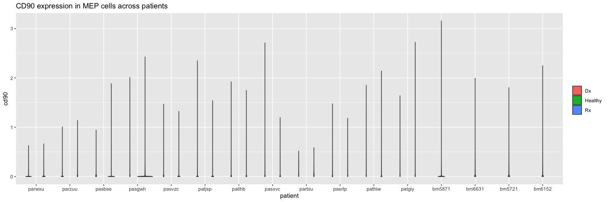<!-- -->

    ## Warning in regularize.values(x, y, ties, missing(ties)): collapsing to unique
    ## 'x' values
    
    ## Warning in regularize.values(x, y, ties, missing(ties)): collapsing to unique
    ## 'x' values
    
    ## Warning in regularize.values(x, y, ties, missing(ties)): collapsing to unique
    ## 'x' values
    
    ## Warning in regularize.values(x, y, ties, missing(ties)): collapsing to unique
    ## 'x' values
    
    ## Warning in regularize.values(x, y, ties, missing(ties)): collapsing to unique
    ## 'x' values
    
    ## Warning in regularize.values(x, y, ties, missing(ties)): collapsing to unique
    ## 'x' values
    
    ## Warning in regularize.values(x, y, ties, missing(ties)): collapsing to unique
    ## 'x' values

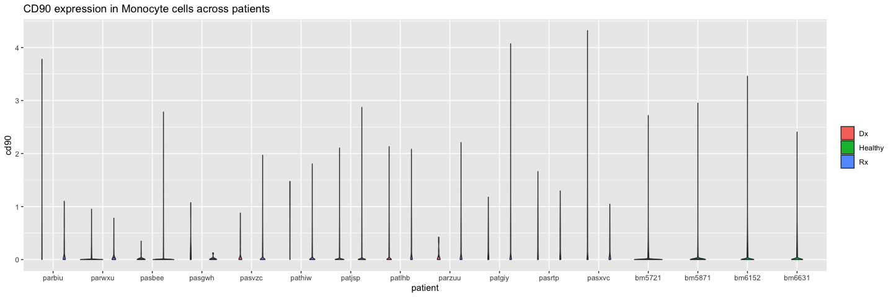<!-- -->

    ## Warning in regularize.values(x, y, ties, missing(ties)): collapsing to unique
    ## 'x' values
    
    ## Warning in regularize.values(x, y, ties, missing(ties)): collapsing to unique
    ## 'x' values
    
    ## Warning in regularize.values(x, y, ties, missing(ties)): collapsing to unique
    ## 'x' values
    
    ## Warning in regularize.values(x, y, ties, missing(ties)): collapsing to unique
    ## 'x' values
    
    ## Warning in regularize.values(x, y, ties, missing(ties)): collapsing to unique
    ## 'x' values
    
    ## Warning in regularize.values(x, y, ties, missing(ties)): collapsing to unique
    ## 'x' values
    
    ## Warning in regularize.values(x, y, ties, missing(ties)): collapsing to unique
    ## 'x' values
    
    ## Warning in regularize.values(x, y, ties, missing(ties)): collapsing to unique
    ## 'x' values
    
    ## Warning in regularize.values(x, y, ties, missing(ties)): collapsing to unique
    ## 'x' values

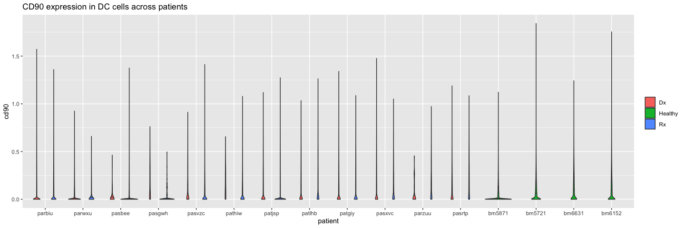<!-- -->

    ## Warning in regularize.values(x, y, ties, missing(ties)): collapsing to unique
    ## 'x' values
    
    ## Warning in regularize.values(x, y, ties, missing(ties)): collapsing to unique
    ## 'x' values
    
    ## Warning in regularize.values(x, y, ties, missing(ties)): collapsing to unique
    ## 'x' values
    
    ## Warning in regularize.values(x, y, ties, missing(ties)): collapsing to unique
    ## 'x' values
    
    ## Warning in regularize.values(x, y, ties, missing(ties)): collapsing to unique
    ## 'x' values
    
    ## Warning in regularize.values(x, y, ties, missing(ties)): collapsing to unique
    ## 'x' values
    
    ## Warning in regularize.values(x, y, ties, missing(ties)): collapsing to unique
    ## 'x' values
    
    ## Warning in regularize.values(x, y, ties, missing(ties)): collapsing to unique
    ## 'x' values
    
    ## Warning in regularize.values(x, y, ties, missing(ties)): collapsing to unique
    ## 'x' values
    
    ## Warning in regularize.values(x, y, ties, missing(ties)): collapsing to unique
    ## 'x' values
    
    ## Warning in regularize.values(x, y, ties, missing(ties)): collapsing to unique
    ## 'x' values
    
    ## Warning in regularize.values(x, y, ties, missing(ties)): collapsing to unique
    ## 'x' values
    
    ## Warning in regularize.values(x, y, ties, missing(ties)): collapsing to unique
    ## 'x' values
    
    ## Warning in regularize.values(x, y, ties, missing(ties)): collapsing to unique
    ## 'x' values
    
    ## Warning in regularize.values(x, y, ties, missing(ties)): collapsing to unique
    ## 'x' values
    
    ## Warning in regularize.values(x, y, ties, missing(ties)): collapsing to unique
    ## 'x' values
    
    ## Warning in regularize.values(x, y, ties, missing(ties)): collapsing to unique
    ## 'x' values
    
    ## Warning in regularize.values(x, y, ties, missing(ties)): collapsing to unique
    ## 'x' values
    
    ## Warning in regularize.values(x, y, ties, missing(ties)): collapsing to unique
    ## 'x' values
    
    ## Warning in regularize.values(x, y, ties, missing(ties)): collapsing to unique
    ## 'x' values
    
    ## Warning in regularize.values(x, y, ties, missing(ties)): collapsing to unique
    ## 'x' values

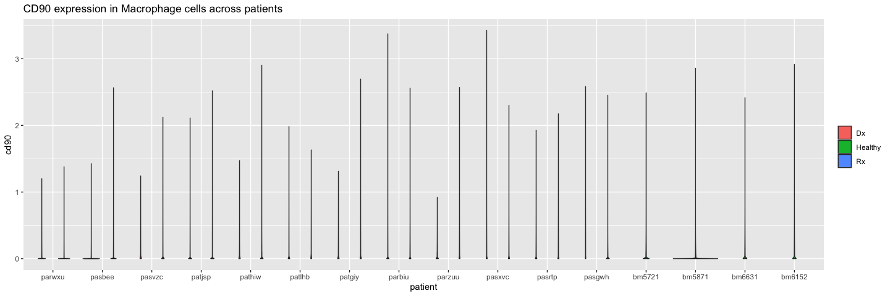<!-- -->

    ## Warning in regularize.values(x, y, ties, missing(ties)): collapsing to unique
    ## 'x' values
    
    ## Warning in regularize.values(x, y, ties, missing(ties)): collapsing to unique
    ## 'x' values
    
    ## Warning in regularize.values(x, y, ties, missing(ties)): collapsing to unique
    ## 'x' values
    
    ## Warning in regularize.values(x, y, ties, missing(ties)): collapsing to unique
    ## 'x' values
    
    ## Warning in regularize.values(x, y, ties, missing(ties)): collapsing to unique
    ## 'x' values
    
    ## Warning in regularize.values(x, y, ties, missing(ties)): collapsing to unique
    ## 'x' values

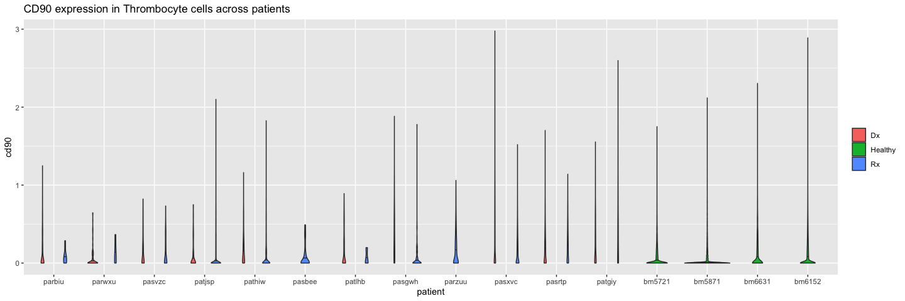<!-- -->

-----

### CD93

``` r
cd93_mah_cluster_plots <- clusters_across_patients("mah_cluster", "cd93")

cd93_mah_cluster_plots %>% 
  walk(print)
```

    ## Warning in regularize.values(x, y, ties, missing(ties)): collapsing to unique
    ## 'x' values
    
    ## Warning in regularize.values(x, y, ties, missing(ties)): collapsing to unique
    ## 'x' values
    
    ## Warning in regularize.values(x, y, ties, missing(ties)): collapsing to unique
    ## 'x' values
    
    ## Warning in regularize.values(x, y, ties, missing(ties)): collapsing to unique
    ## 'x' values
    
    ## Warning in regularize.values(x, y, ties, missing(ties)): collapsing to unique
    ## 'x' values
    
    ## Warning in regularize.values(x, y, ties, missing(ties)): collapsing to unique
    ## 'x' values

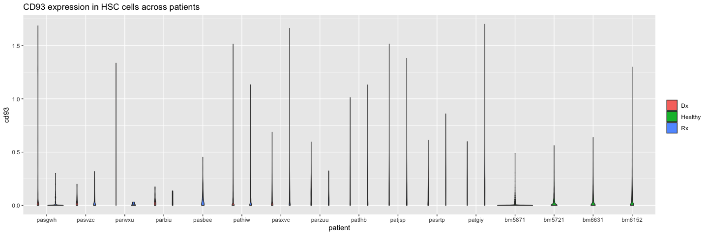<!-- -->

    ## Warning in regularize.values(x, y, ties, missing(ties)): collapsing to unique
    ## 'x' values
    
    ## Warning in regularize.values(x, y, ties, missing(ties)): collapsing to unique
    ## 'x' values
    
    ## Warning in regularize.values(x, y, ties, missing(ties)): collapsing to unique
    ## 'x' values
    
    ## Warning in regularize.values(x, y, ties, missing(ties)): collapsing to unique
    ## 'x' values
    
    ## Warning in regularize.values(x, y, ties, missing(ties)): collapsing to unique
    ## 'x' values
    
    ## Warning in regularize.values(x, y, ties, missing(ties)): collapsing to unique
    ## 'x' values
    
    ## Warning in regularize.values(x, y, ties, missing(ties)): collapsing to unique
    ## 'x' values
    
    ## Warning in regularize.values(x, y, ties, missing(ties)): collapsing to unique
    ## 'x' values
    
    ## Warning in regularize.values(x, y, ties, missing(ties)): collapsing to unique
    ## 'x' values
    
    ## Warning in regularize.values(x, y, ties, missing(ties)): collapsing to unique
    ## 'x' values
    
    ## Warning in regularize.values(x, y, ties, missing(ties)): collapsing to unique
    ## 'x' values
    
    ## Warning in regularize.values(x, y, ties, missing(ties)): collapsing to unique
    ## 'x' values
    
    ## Warning in regularize.values(x, y, ties, missing(ties)): collapsing to unique
    ## 'x' values
    
    ## Warning in regularize.values(x, y, ties, missing(ties)): collapsing to unique
    ## 'x' values

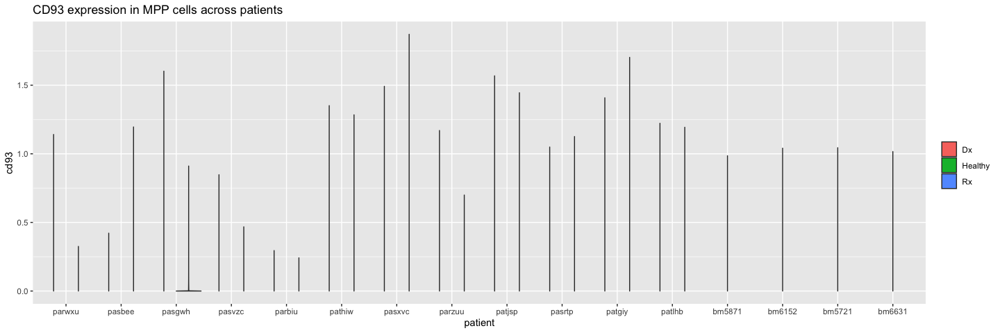<!-- -->

    ## Warning in regularize.values(x, y, ties, missing(ties)): collapsing to unique
    ## 'x' values
    
    ## Warning in regularize.values(x, y, ties, missing(ties)): collapsing to unique
    ## 'x' values
    
    ## Warning in regularize.values(x, y, ties, missing(ties)): collapsing to unique
    ## 'x' values

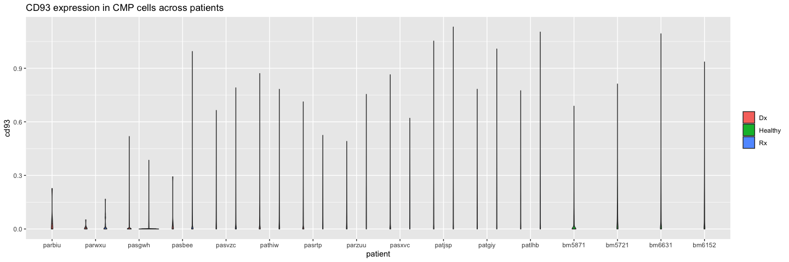<!-- -->

    ## Warning in regularize.values(x, y, ties, missing(ties)): collapsing to unique
    ## 'x' values
    
    ## Warning in regularize.values(x, y, ties, missing(ties)): collapsing to unique
    ## 'x' values
    
    ## Warning in regularize.values(x, y, ties, missing(ties)): collapsing to unique
    ## 'x' values
    
    ## Warning in regularize.values(x, y, ties, missing(ties)): collapsing to unique
    ## 'x' values
    
    ## Warning in regularize.values(x, y, ties, missing(ties)): collapsing to unique
    ## 'x' values
    
    ## Warning in regularize.values(x, y, ties, missing(ties)): collapsing to unique
    ## 'x' values
    
    ## Warning in regularize.values(x, y, ties, missing(ties)): collapsing to unique
    ## 'x' values
    
    ## Warning in regularize.values(x, y, ties, missing(ties)): collapsing to unique
    ## 'x' values
    
    ## Warning in regularize.values(x, y, ties, missing(ties)): collapsing to unique
    ## 'x' values

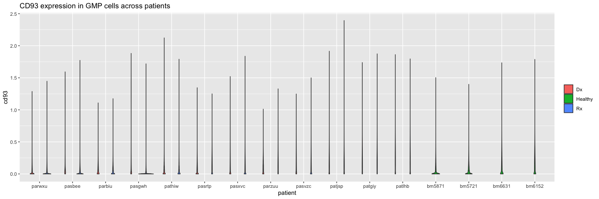<!-- -->

    ## Warning in regularize.values(x, y, ties, missing(ties)): collapsing to unique
    ## 'x' values
    
    ## Warning in regularize.values(x, y, ties, missing(ties)): collapsing to unique
    ## 'x' values
    
    ## Warning in regularize.values(x, y, ties, missing(ties)): collapsing to unique
    ## 'x' values
    
    ## Warning in regularize.values(x, y, ties, missing(ties)): collapsing to unique
    ## 'x' values
    
    ## Warning in regularize.values(x, y, ties, missing(ties)): collapsing to unique
    ## 'x' values
    
    ## Warning in regularize.values(x, y, ties, missing(ties)): collapsing to unique
    ## 'x' values
    
    ## Warning in regularize.values(x, y, ties, missing(ties)): collapsing to unique
    ## 'x' values
    
    ## Warning in regularize.values(x, y, ties, missing(ties)): collapsing to unique
    ## 'x' values
    
    ## Warning in regularize.values(x, y, ties, missing(ties)): collapsing to unique
    ## 'x' values

<!-- -->

    ## Warning in regularize.values(x, y, ties, missing(ties)): collapsing to unique
    ## 'x' values
    
    ## Warning in regularize.values(x, y, ties, missing(ties)): collapsing to unique
    ## 'x' values

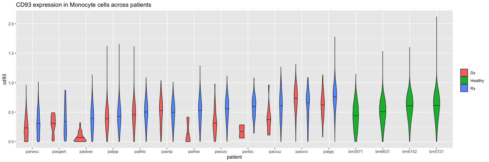<!-- -->

    ## Warning in regularize.values(x, y, ties, missing(ties)): collapsing to unique
    ## 'x' values
    
    ## Warning in regularize.values(x, y, ties, missing(ties)): collapsing to unique
    ## 'x' values
    
    ## Warning in regularize.values(x, y, ties, missing(ties)): collapsing to unique
    ## 'x' values
    
    ## Warning in regularize.values(x, y, ties, missing(ties)): collapsing to unique
    ## 'x' values
    
    ## Warning in regularize.values(x, y, ties, missing(ties)): collapsing to unique
    ## 'x' values

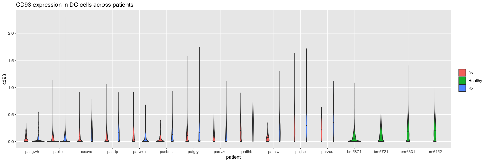<!-- -->

    ## Warning in regularize.values(x, y, ties, missing(ties)): collapsing to unique
    ## 'x' values
    
    ## Warning in regularize.values(x, y, ties, missing(ties)): collapsing to unique
    ## 'x' values
    
    ## Warning in regularize.values(x, y, ties, missing(ties)): collapsing to unique
    ## 'x' values
    
    ## Warning in regularize.values(x, y, ties, missing(ties)): collapsing to unique
    ## 'x' values
    
    ## Warning in regularize.values(x, y, ties, missing(ties)): collapsing to unique
    ## 'x' values
    
    ## Warning in regularize.values(x, y, ties, missing(ties)): collapsing to unique
    ## 'x' values
    
    ## Warning in regularize.values(x, y, ties, missing(ties)): collapsing to unique
    ## 'x' values
    
    ## Warning in regularize.values(x, y, ties, missing(ties)): collapsing to unique
    ## 'x' values
    
    ## Warning in regularize.values(x, y, ties, missing(ties)): collapsing to unique
    ## 'x' values
    
    ## Warning in regularize.values(x, y, ties, missing(ties)): collapsing to unique
    ## 'x' values
    
    ## Warning in regularize.values(x, y, ties, missing(ties)): collapsing to unique
    ## 'x' values
    
    ## Warning in regularize.values(x, y, ties, missing(ties)): collapsing to unique
    ## 'x' values

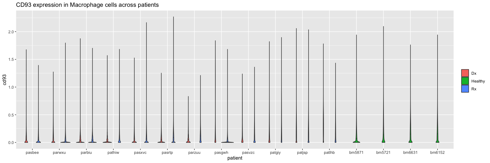<!-- -->

    ## Warning in regularize.values(x, y, ties, missing(ties)): collapsing to unique
    ## 'x' values
    
    ## Warning in regularize.values(x, y, ties, missing(ties)): collapsing to unique
    ## 'x' values
    
    ## Warning in regularize.values(x, y, ties, missing(ties)): collapsing to unique
    ## 'x' values
    
    ## Warning in regularize.values(x, y, ties, missing(ties)): collapsing to unique
    ## 'x' values

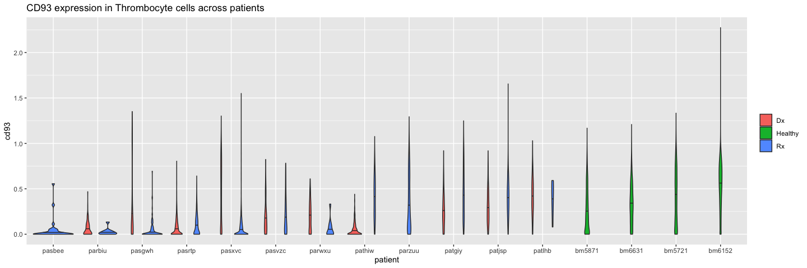<!-- -->

-----

### CD99

``` r
cd99_mah_cluster_plots <- clusters_across_patients("mah_cluster", "cd99")

cd99_mah_cluster_plots %>% 
  walk(print)
```

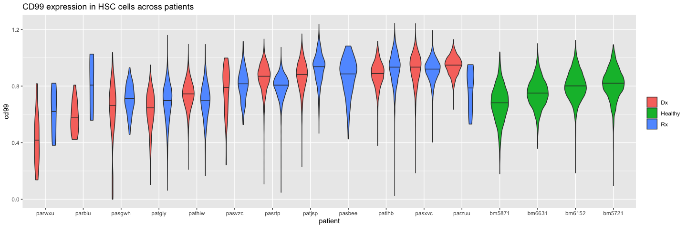<!-- -->

    ## Warning in regularize.values(x, y, ties, missing(ties)): collapsing to unique
    ## 'x' values

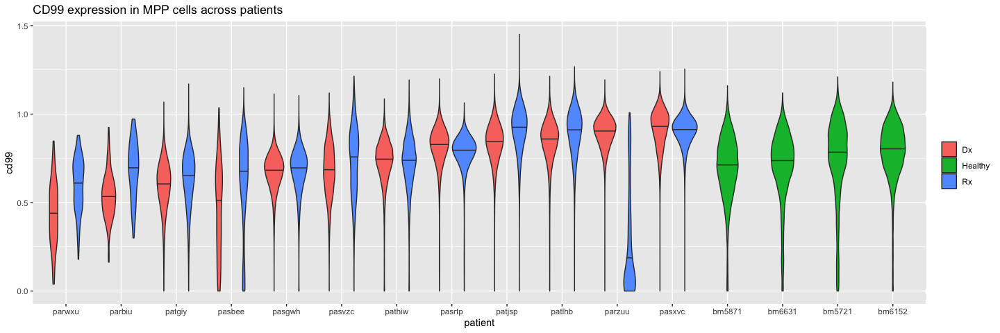<!-- -->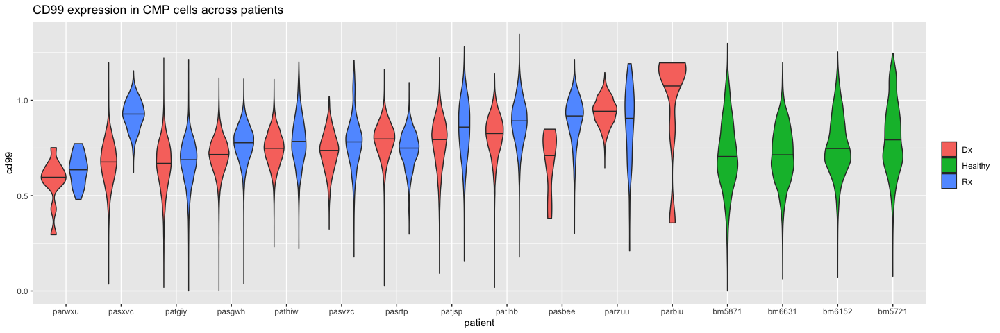<!-- -->

    ## Warning in regularize.values(x, y, ties, missing(ties)): collapsing to unique
    ## 'x' values
    
    ## Warning in regularize.values(x, y, ties, missing(ties)): collapsing to unique
    ## 'x' values

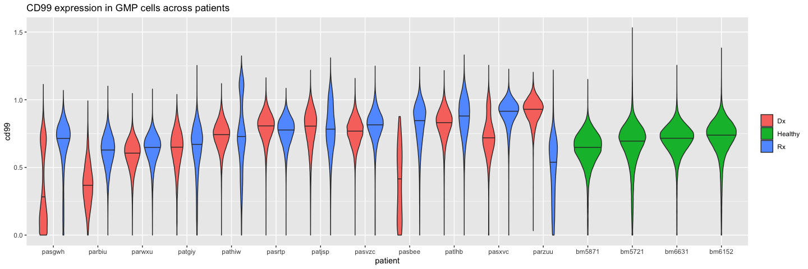<!-- -->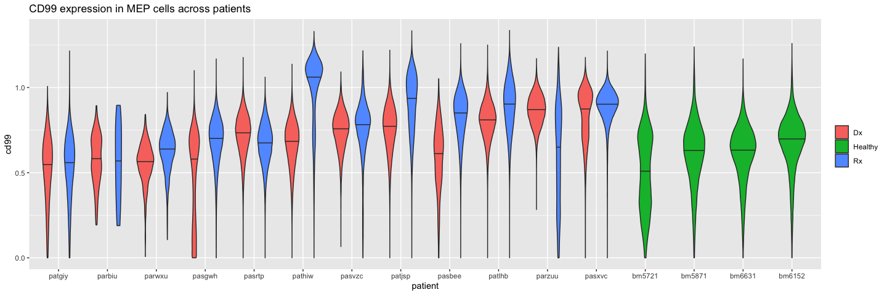<!-- -->

    ## Warning in regularize.values(x, y, ties, missing(ties)): collapsing to unique
    ## 'x' values

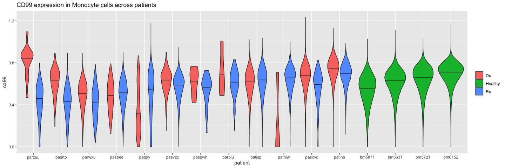<!-- -->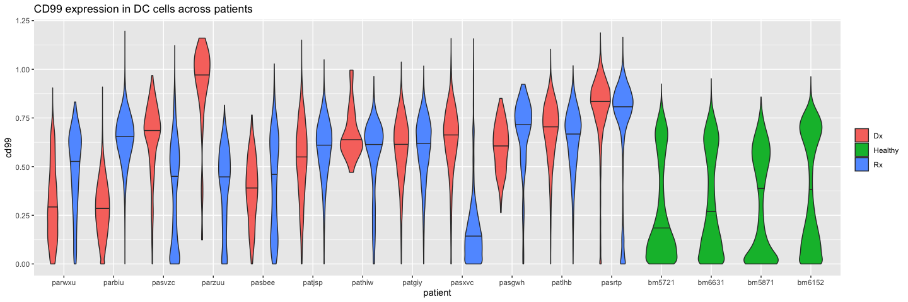<!-- -->

    ## Warning in regularize.values(x, y, ties, missing(ties)): collapsing to unique
    ## 'x' values

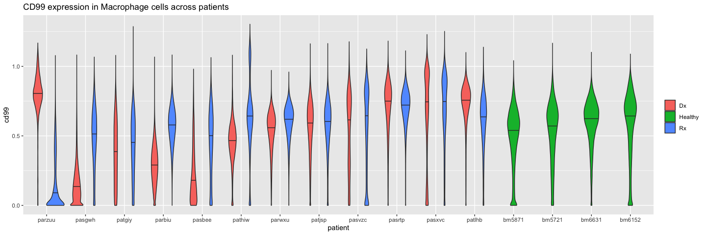<!-- -->

    ## Warning in regularize.values(x, y, ties, missing(ties)): collapsing to unique
    ## 'x' values

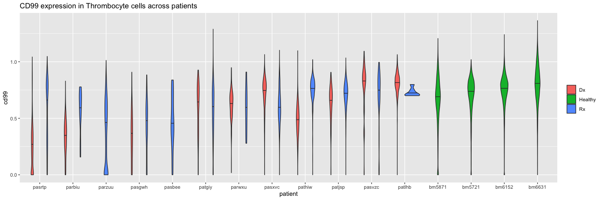<!-- -->
