Diagnosis vs. Relapse Signaling Analysis
================
tkeyes
2020-04-24

  - [Basic setup](#basic-setup)
  - [Testing our implementation of
    EMD](#testing-our-implementation-of-emd)
  - [Stimulation relative to basal in Dx and Rx
    pairs](#stimulation-relative-to-basal-in-dx-and-rx-pairs)
  - [Visualizing differences in signaling
    EMDs](#visualizing-differences-in-signaling-emds)
      - [Dimensionality Reduction:](#dimensionality-reduction)
      - [Heatmap:](#heatmap)
      - [Custom plots and histograms](#custom-plots-and-histograms)
  - [Weekly report (4/24/20)](#weekly-report-42420)
      - [Irons in the fire](#irons-in-the-fire)
      - [Burning questions:](#burning-questions)

``` r
# Libraries
library(magrittr)
library(tidyverse)
library(EMDomics)
library(Rtsne)
library(pheatmap)

# Parameters
input_path <- here::here("data", "AML_matrix_clustered.rds")

CLASSIFIER_POPULATIONS <- 
  c(
    'HSC',
    'MPP',
    'CMP',
    'GMP',
    'MEP',                          
    'Monocyte', 
    'DC', 
    'Macrophage', 
    'Thrombocyte'
  )

#===============================================================================

#source necessary files
source('~/GitHub/aml-cells/scripts/setup/marker_setup.R')
source('~/GitHub/aml-cells/scripts/setup/patient_setup.R')
```

In this analysis, we take a look at the difference in the Earth Mover’s
Distance (Wasserstein Distance) between signaling parameters in our mass
cytometry AML dataset.

\#\#Background

Broadly speaking, the Earth Mover’s Distance (EMD) computes the “work”
needed to transform one distribution into another. In molecular/systems
biology, EMD is often used to compare marker distributions between
various conditions (diagnosis and relapse, treatment and not treatment,
stimulation vs. not stimulation, etc.).

Unlike traditional methods of comparing measurements of central tendency
(such as mean or median) between marker distributions in 1 or more
conditions, EMD takes into account that distributions may shift in
subtle ways: even if their means/medians do not change much, the
distributions may change a great deal in terms of how they are shaped
*outside* the areas of central tendency. For this reason, EMD is
generally preferable to using the mean/median when the distributions
you’re working with are irregularly shaped (for instance, highly
skewed or multimodal, since mean and median are generally less
informative in these kinds of distributions).

\*\[Add some citations to this section\]

Here, we will perform some EMD calculations and then manually
investigate signaling distributions between relapse and diagnostic
samples in pediatric AML that has been stimulated in several conditions
relative to baseline (`basal`):

  - IL-3
  - IL-6
  - GM-CSF
  - HS5 (stromal cell line) conditioned media
  - Pervandate (positive control)

## Basic setup

Algorithm (in words):

  - Read in previously pre-processed data
      - arcsinh transformation
      - compensation
      - filtered on `time` variable to remove weird CD34/CD38
        “debarcode-gate”
  - filter to only include paired samples (with both `Dx` and `Rx`
    present as well as healthy controls)

<!-- end list -->

``` r
#### set up global varibles
marker_setup()
patient_setup()

recode_vars <- 
  tibble(
    from = 1:length(CLASSIFIER_POPULATIONS), 
    to = CLASSIFIER_POPULATIONS
  ) %>% 
  deframe()

#read in paired data (and healthy data) 
aml_data <- 
  input_path %>% 
  read_rds() %>%
  mutate(
    patient = 
      patient %>% 
      as.character() %>% 
      str_to_lower() %>% 
      if_else(. == "pastrp", "pasrtp", .), 
    Mah.cluster = 
      recode(Mah.cluster, !!! recode_vars) %>% 
      factor(levels = CLASSIFIER_POPULATIONS)
  ) %>% 
  mutate_at(
    .vars = vars(phenograph.metacluster, FlowSOM.cluster, FlowSOM.metacluster),
    ~ (.) %>% 
      as.character() %>% 
      fct_reorder(., CD34, .fun = mean, .desc = TRUE)
  ) %>% 
  filter(patient %in% c(PAIRED_PATIENTS, HEALTHY_CONTROLS)) %>% 
  rename_at(
    vars(everything()), 
    ~ (.) %>% 
      str_to_lower() %>% 
      str_replace_all(pattern = "[:punct:]", replacement = "_")
  )
```

## Testing our implementation of EMD

First, we simulate some data from two conditions (`A` and `B`) to make
sure that we find a difference \> 0.

Note that the distibutions are drawn from populations with the same mean
and sd, indicating that even with highly similar characteristics
overall, EMD can find subtle differences.

``` r
sim_data <- 
  tibble(
    data = rnorm(100), 
    sample_name = paste("sample", 1:100), 
    group = c(rep("A", 50), rep("B", 50))
  )

ggplot(sim_data, aes(data, fill = group)) + geom_density(alpha = 0.5)
```

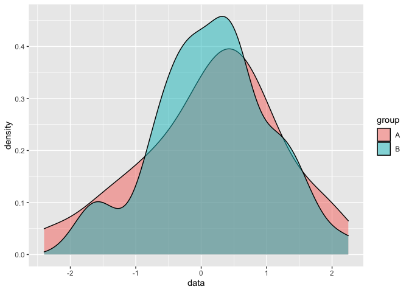<!-- -->

``` r
calculate_emd_gene(
  vec = setNames(sim_data$data, sim_data$sample_name), 
  outcomes = setNames(sim_data$group, sim_data$sample_name), 
  sample_names = sim_data$sample_name, 
  binSize = 0.1
) %>% 
  knitr::kable()
```

|    x |
| ---: |
| 1.78 |

We can also show that, if we translate population `B` gradually larger
distances from population A, we will return higher EMD values (as
expected).

``` r
tibble(
  added_value = 0:10, 
) %>% 
  mutate(
    emd = 
      map_dbl(
        added_value, 
        ~ sim_data %>% 
          mutate(data = if_else(group == "A", data + 0, data + .x)) %>% 
          summarize(
            emd = 
              calculate_emd_gene(
                vec = setNames(data, sample_name),
                outcomes = setNames(group, sample_name), 
                sample_names = sample_name, 
                binSize = 0.1
              )
          ) %>% 
          pull(emd)
      )
  ) %>% 
  knitr::kable()
```

| added\_value |    emd |
| -----------: | -----: |
|            0 |   1.78 |
|            1 |  10.34 |
|            2 |  20.34 |
|            3 |  30.34 |
|            4 |  40.34 |
|            5 |  50.34 |
|            6 |  60.34 |
|            7 |  70.34 |
|            8 |  80.34 |
|            9 |  90.34 |
|           10 | 100.34 |

And we can see that the more we add to the distribution for `B`, the
higher the EMD we get (as expected).

We can also illustrate that two distributions with the same mean and
median but with different shapes can give us a positive EMD (even when
other metrics will not show observable differences):

``` r
sim_data %>% 
  arrange(data) %>% 
  transmute(
    data = c(data[group == "A"] + 1.5, data[group == "A"] - 1.5), 
    sample_name = str_c("sample", 101:200),
    group = "B"
  ) %>% 
  bind_rows(
    sim_data[1:50,]
  ) %T>% 
  (function(.x) {
    my_plot <- 
      ggplot(data = .x, aes(x = data, fill = group)) + 
      geom_density(alpha = 0.5) 
      print(my_plot)
  }
  ) %>% 
  summarize(
    emd = 
      calculate_emd_gene(
                vec = setNames(data, sample_name),
                outcomes = setNames(group, sample_name), 
                sample_names = sample_name, 
                binSize = 0.1
      ), 
    mean_difference = 
      (.) %>% 
      filter(group == "A") %>% 
      pull(data) %>% 
      mean() - 
      (.) %>% 
      filter(group == "B") %>% 
      pull(data) %>% 
      mean(), 
    median_difference = 
      (.) %>% 
      filter(group == "A") %>% 
      pull(data) %>% 
      median() - 
      (.) %>% 
      filter(group == "B") %>% 
      pull(data) %>% 
      median()
  ) %>% 
  knitr::kable()
```

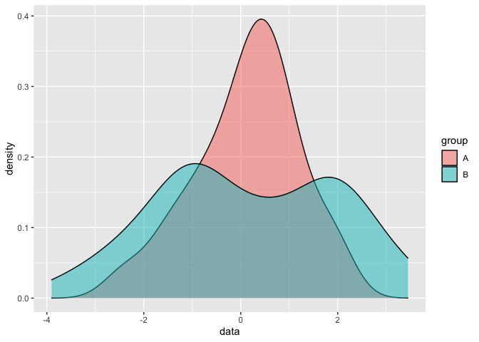<!-- -->

| emd | mean\_difference | median\_difference |
| --: | ---------------: | -----------------: |
| 7.6 |                0 |          0.2609222 |

Note that the emd value is **not** zero even though the differences in
means is 0 (and the median difference is very small), indicating that
emd is a better metric for detecting differences in population
distributions when distributions are irregular.

## Stimulation relative to basal in Dx and Rx pairs

Some text

``` r
stim_names <- 
  aml_data$stimulation %>% 
  unique() %>% 
  as.character()

# input: data frame of stimulation conditions representing a single sample 
# output: two-column tibble: 
#         - stimulation = names of stimulation conditions
#         - emd = EMD corresponding to that stimulation condition relative to basal
aml_emd <- function(data) {
  map_dfr(
    .x = 
      unique(data$stimulation) %>% 
      as.character(), 
    .f = 
      ~ if (.x == "Basal") {
        return(tibble(stimulation = "Basal", emd = 0))
      }
    else { 
      result <- 
        data %>% 
        filter(stimulation %in% c("Basal", .x)) %>% 
        summarize(
          emd = 
            calculate_emd_gene(
              vec = setNames(expression, cell_id), 
              outcomes = setNames(stimulation, cell_id), 
              sample_names = cell_id, 
              binSize = (max(expression) - min(expression)) / 200
            ), 
          stimulation = .x
        )
      return(result)
    }
  )
}


aml_emds <- 
  aml_data %>% 
  mutate(cell_id = 1:nrow(aml_data)) %>% 
  select(
    one_of(
      str_to_lower(SIGNALING_MARKERS), 
      "stimulation", 
      "cell_id", 
      "patient", 
      "condition"
    )
  ) %>% 
  pivot_longer(
    cols = one_of(str_to_lower(SIGNALING_MARKERS)), 
    names_to = "marker", 
    values_to = "expression"
  ) %>% 
  group_by(patient, condition, marker) %>% 
  nest() %>% 
  mutate(
    emds = map(data, aml_emd), 
    mean_difference = 
      map2(
        .x = data, 
        .y = emds,
        ~
        tibble(
          mean_difference = 
            (.) %>% 
            group_by(stimulation) %>% 
            summarize(expression = mean(expression)) %>% 
            pull(expression) - 
            (.) %>% 
            filter(stimulation == "Basal") %>% 
            pull(expression) %>% 
            mean(), 
          stimulation = .y %>% pull(stimulation)
        )
      )
  ) %>% 
  ungroup() %>% 
  transmute(
    patient, 
    condition,
    marker,
    data = 
      map(
        data, 
        ~ (.) %>% 
          group_by(stimulation = as.character(stimulation)) %>% 
          nest() %>% 
          ungroup()
      ), 
    data = 
      pmap(
        list(data, emds, mean_difference), 
        function(x, y, z) {
          x %>% 
            left_join(y, by = "stimulation") %>% 
            left_join(z, by = "stimulation")
        }
      )
  ) %>% 
  unnest(cols = data)
```

Thus, we have calculated all of the EMD scores for each stimulation
condition for each patient sample (diagnosis and relapse).

# Visualizing differences in signaling EMDs

## Dimensionality Reduction:

We can take the EMDs obtained for each sample and stick them together as
a vector - and these vectors can then be used for any dimensionality
reduction algorithms we choose for visualization. Let’s give a try to
PCA first…

``` r
emd_matrix <- 
  aml_emds %>% 
  pivot_wider(
    id_cols = c(patient, condition), 
    names_from = c(marker, stimulation), 
    values_from = emd
  ) %>% 
  select(-contains("Basal")) %>% 
  drop_na()

emd_matrix
```

    ## # A tibble: 27 x 32
    ##    patient condition pakt_GMCSF pakt_HS5 pakt_IL3 pakt_IL6 pakt_PVO4 pcreb_GMCSF
    ##    <chr>   <fct>          <dbl>    <dbl>    <dbl>    <dbl>     <dbl>       <dbl>
    ##  1 bm5721  Healthy        5.88     2.82     7.84     5.54       2.19       10.7 
    ##  2 bm5871  Healthy        2.64     0.419    4.51     2.30      10.1        24.0 
    ##  3 bm6152  Healthy        7.80     3.08     0.252   10.4        9.48        4.09
    ##  4 parbiu  Dx             4.57     2.71     6.97     1.35      13.4         9.43
    ##  5 parbiu  Rx             0.316    4.87     1.25     0.129     31.8         8.13
    ##  6 parwxu  Dx             0.601    1.67     2.23     0.792      3.46        3.93
    ##  7 parwxu  Rx             2.92     4.53     4.11     3.13      36.0         1.14
    ##  8 parzuu  Dx             0.632    2.31     2.07     0.471      9.84        6.45
    ##  9 parzuu  Rx             0.767    1.43     0.600    0.891      2.32        4.08
    ## 10 pasbee  Dx             1.63     1.12     1.34     0.753      1.26        3.06
    ## # … with 17 more rows, and 24 more variables: pcreb_HS5 <dbl>, pcreb_IL3 <dbl>,
    ## #   pcreb_IL6 <dbl>, pcreb_PVO4 <dbl>, perk_GMCSF <dbl>, perk_HS5 <dbl>,
    ## #   perk_IL3 <dbl>, perk_IL6 <dbl>, perk_PVO4 <dbl>, ps6_GMCSF <dbl>,
    ## #   ps6_HS5 <dbl>, ps6_IL3 <dbl>, ps6_IL6 <dbl>, ps6_PVO4 <dbl>,
    ## #   pstat3_GMCSF <dbl>, pstat3_HS5 <dbl>, pstat3_IL3 <dbl>, pstat3_IL6 <dbl>,
    ## #   pstat3_PVO4 <dbl>, pstat5_GMCSF <dbl>, pstat5_HS5 <dbl>, pstat5_IL3 <dbl>,
    ## #   pstat5_IL6 <dbl>, pstat5_PVO4 <dbl>

``` r
emd_pca <- 
  prcomp(
    x = emd_matrix %>% select(-patient, -condition), 
    scale = TRUE, 
    center = TRUE
  ) 

#calculate variance explained by first two principal components
var_explained <- 
  emd_pca$sdev^2 / sum(emd_pca$sdev^2)

emd_pca <- 
  emd_pca %>% 
  (function(.x) {.x$x}) %>% 
  as_tibble() %>% 
  select(PC1, PC2) %>% 
  bind_cols(emd_matrix)

emd_pca %>% 
  ggplot(aes(x = PC1, y = PC2, fill = condition)) + 
  geom_line(aes(group = patient), color = "gray60") + 
  geom_point(shape = 21, size = 2) + 
  scale_fill_discrete(
    breaks = c("Healthy", "Dx", "Rx"), 
    labels = c("Healthy", "Diagnosis", "Relapse")
  ) + 
  labs(
    x = str_glue("PC1 ({var}%)", var = (var_explained[[1]] * 100) %>% round(1)), 
    y = str_glue("PC2 ({var}%)", var = (var_explained[[2]] * 100) %>% round(1)), 
    fill = NULL
  )
```

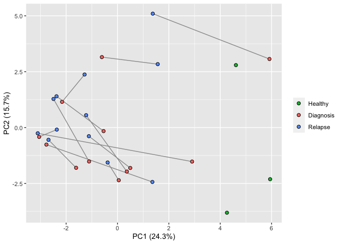<!-- -->

In general, it looks like the red (`Diagnosis`) dots are closer to the
healthy dots than the relapse ones, potentially indicating that relapse
samples have signaling pattern that is less similar to healthy signaling
than diagnostic samples.

However, we can also note that the variance explained by each principal
component is relatively low, indicating that our dataset is not super
well-represented in two linear dimensions. We can also give tSNE a shot
to see if it tells a different story…

``` r
set.seed(5)

emd_tsne <- 
  Rtsne(
    X = emd_matrix %>% select(-patient, -condition), 
    dims = 2, 
    perplexity = 7
  ) %>% 
  (function(.x) {.x$Y}) %>% 
  as_tibble() %>% 
  rename(tSNE1 = V1, tSNE2 = V2) %>% 
  bind_cols(emd_matrix)
```

    ## Warning: `as_tibble.matrix()` requires a matrix with column names or a `.name_repair` argument. Using compatibility `.name_repair`.
    ## This warning is displayed once per session.

``` r
emd_tsne %>% 
  ggplot(aes(x = tSNE1, y = tSNE2, fill = condition)) + 
  geom_line(aes(group = patient), color = "gray60") + 
  geom_point(shape = 21, size = 2) + 
  scale_fill_discrete(
    breaks = c("Healthy", "Dx", "Rx"), 
    labels = c("Healthy", "Diagnosis", "Relapse")
  ) + 
  labs(
    fill = NULL
  )
```

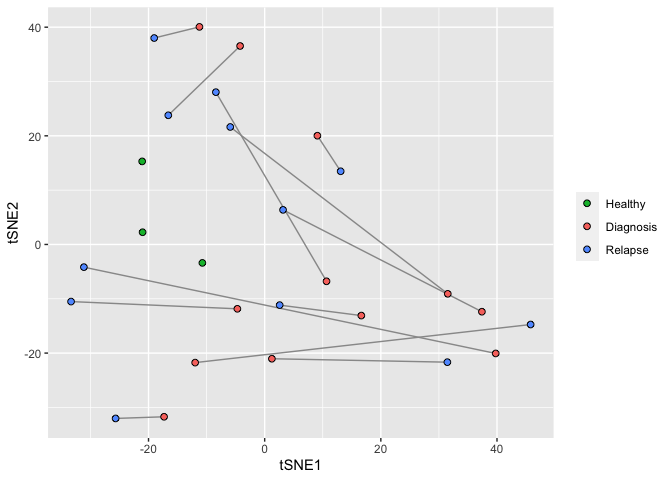<!-- -->

In general, the same result seems to hold, although I’ll note that this
plot is very sensitive to perplexity and seed (because the number of
observations is relatively small).

## Heatmap:

``` r
my_heatmap <- 
  pheatmap(
  mat = 
    emd_matrix %>% 
    select(-patient, -condition) %>% 
    as.matrix() %>% 
    set_rownames(str_c(emd_matrix$patient, emd_matrix$condition, sep = "_")), 
  annotation_row = 
    emd_matrix %>% 
    select(patient, condition) %>% 
    as.data.frame() %>% 
    set_rownames(str_c(emd_matrix$patient, emd_matrix$condition, sep = "_")), 
  annotation_col =
    emd_matrix %>% 
    select(-patient, -condition) %>% 
    colnames() %>% 
    str_split(pattern = "_", simplify = TRUE) %>% 
    as_tibble() %>% 
    rename(marker = V1, stimulation = V2) %>% 
    as.data.frame() %>% 
    set_rownames(emd_matrix %>% select(-patient, -condition) %>% colnames),
  scale = "column"
  
)

my_heatmap
```

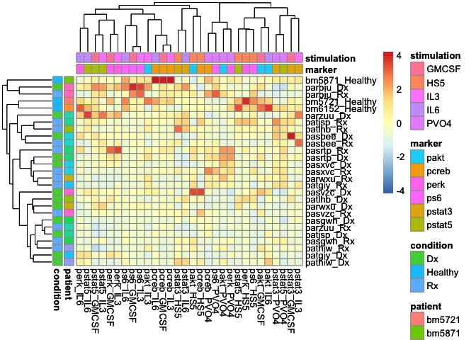<!-- -->

## Custom plots and histograms

The heatmap above is a little tricky to interpret, and I have to spend
some more time figuring out a color scheme and labeling scheme that
works the best.

``` r
all_patients <- 
  aml_emds %>% 
  pull(patient) %>% 
  unique()

my_patient <- all_patients[[8]]

patient_plot <- function(my_patient) { 
  aml_emds %>%
    filter(patient == my_patient) %>% 
    
    ggplot(aes(x = condition, y = emd, fill = stimulation)) + 
    geom_line(aes(group = stimulation)) + 
    geom_point(shape = 21, size = 3) + 
    facet_grid(cols = vars(marker)) + 
    labs(title = my_patient)
}

all_patients %>% 
  map(patient_plot) %>% 
  walk(print)
```

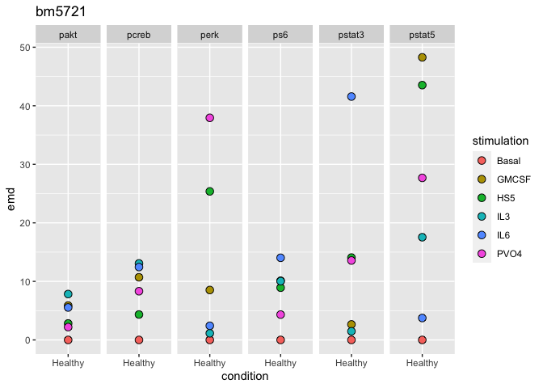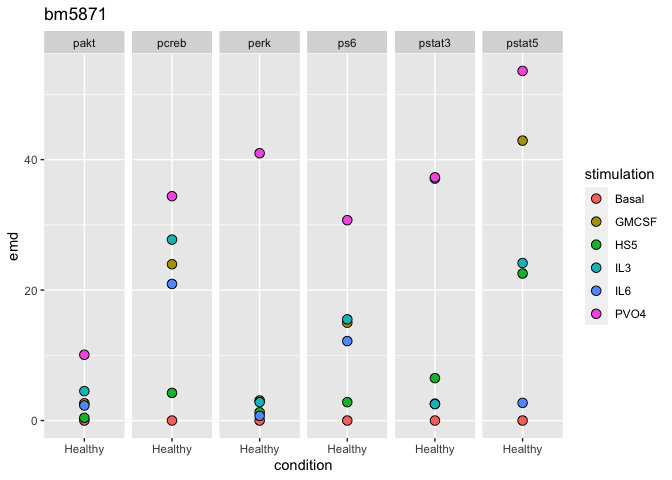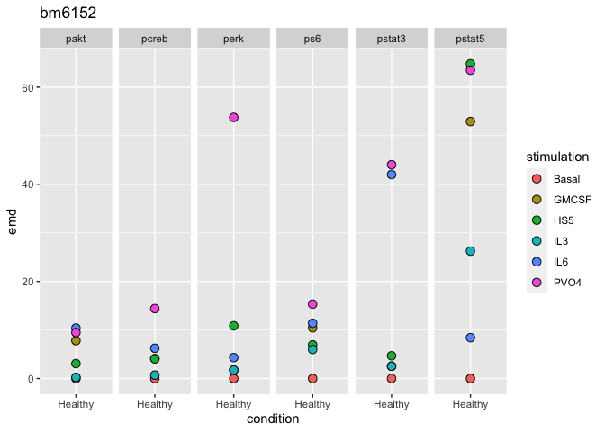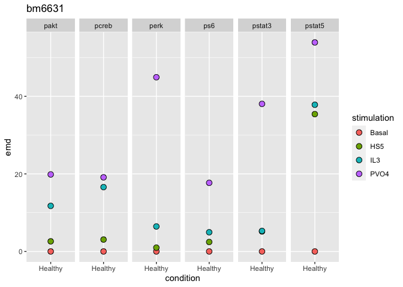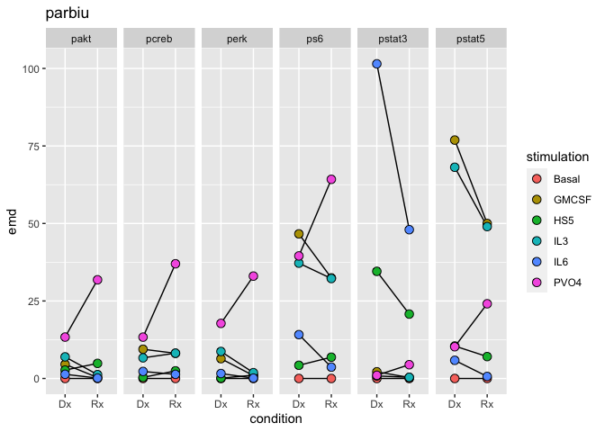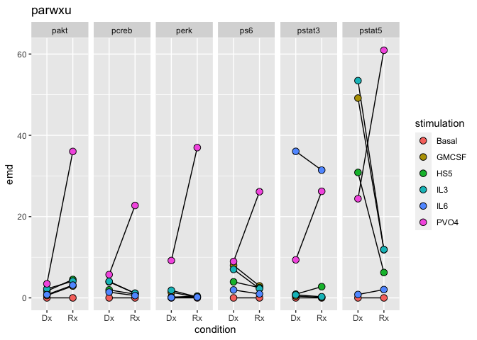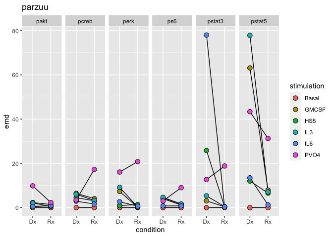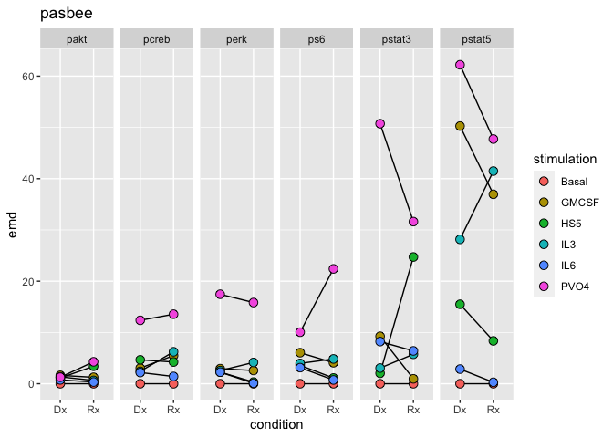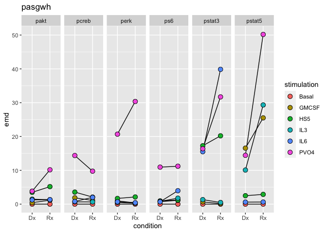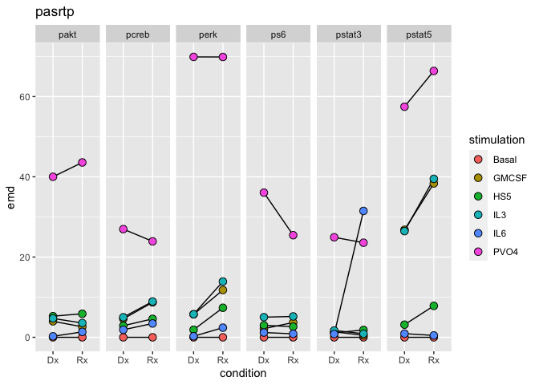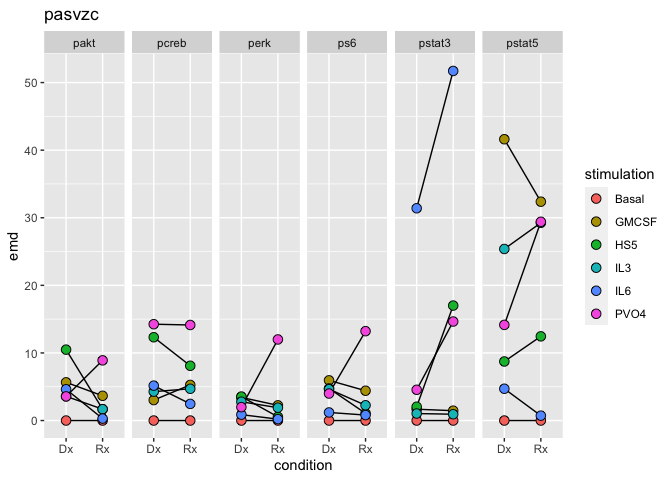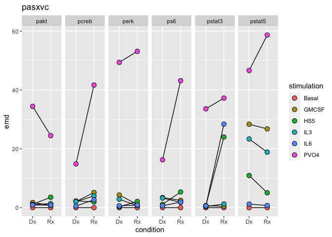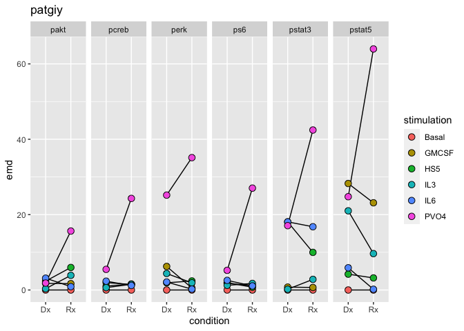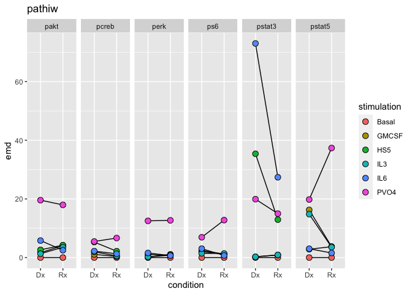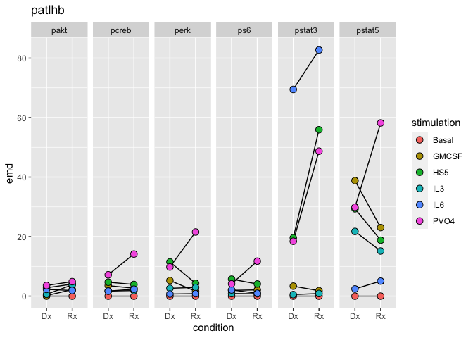

And the overall plot…

``` r
aml_emds %>%
  filter(condition != "Healthy") %>% 
  group_by(stimulation, condition, marker) %>% 
  summarize(emd = mean(emd)) %>% 
  ggplot(aes(x = condition, y = emd, fill = stimulation)) + 
  geom_hline(
    aes(yintercept = healthy_mean, color = stimulation), 
    data = 
      aml_emds %>% 
      filter(condition == "Healthy") %>% 
      group_by(stimulation) %>% 
      summarize(healthy_mean = mean(emd)), 
    linetype = "dashed"
  ) + 
  geom_line(aes(group = stimulation)) + 
  geom_point(shape = 21, size = 3) + 
  facet_grid(cols = vars(marker)) + 
  labs(
    title = "Mean EMD for phosphosignals across all patients", 
    subtitle = "Note: Dotted lines indicate average in the healthy samples"
  )
```

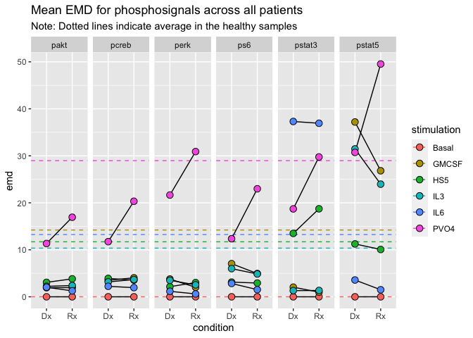<!-- -->

Future directions:

  - Look more closely at how Dana Pe’er’s lab has expressed EMD data
    visually and if there are any best practices re: handling the data
    that I may have missed.

  - Find a more intuitive way to plot the heatmap (I will use the
    `heatmaply` package, which I have [read good things
    about](https://cran.r-project.org/web/packages/heatmaply/vignettes/heatmaply.html))

  - Perform statistical tests to determine how the paired samples differ
    in a more quantitative way

# Weekly report (4/24/20)

## Irons in the fire

  - Things I read this week:
    
      - Fundamentals of Deep Learning ([Shallow and Deep Neural
        Networks](http://cs230.stanford.edu/syllabus/)) (Stanford CS230)
      - [SAUCIE](https://www.nature.com/articles/s41592-019-0576-7): A
        deep learning approach to batch correction, clustering, and
        normalization of single-cell data (and specifically CyTOF data)
      - Advanced R: Memory and the garbage collector
      - [EMDomics](https://rdrr.io/bioc/EMDomics/man/EMDomics.html)
        package vignette

  - Analyzing signaling differences between Diagnostic and Relapse
    paired samples using EMD.

  - Classifying ALL clusters obtained via CITRUS on newly optimized
    classifier (collaboration with Jolanda)

  - Visualizing marker distributions before and after mean-shift
    normalization (collaboration with Ben)

  - Deciding which predictive models to run on the AML dataset (and what
    features to engineer for the model)

  - Back-burner
    
      - Developing functions for the `tidytof` package as they become
        relevant (i.e. more optimal .fcs file reader)
      - Waiting for cytometry A review to be accepted or bounce back
      - Reading about statistical tests for EMD and marker distributions
        on CyTOF data (any reason not just to use `SAM` workflow?)
      - Set up google cloud for entire lab (lagging on this, blech)

## Burning questions:

  - How can I improve my visualizations on surface marker expression and
    signaling marker expression that I have made so far?

  - How can I communicate my analyses better to give the team a better
    sense of what I’m working on and what I have done?

  - Is there anything I am missing right now that I should prioritize?
