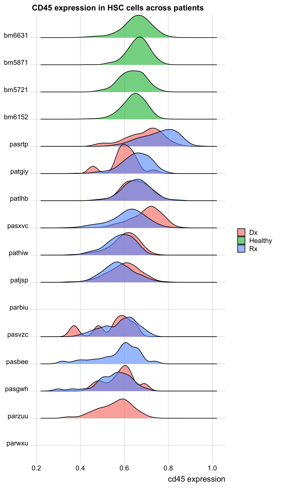
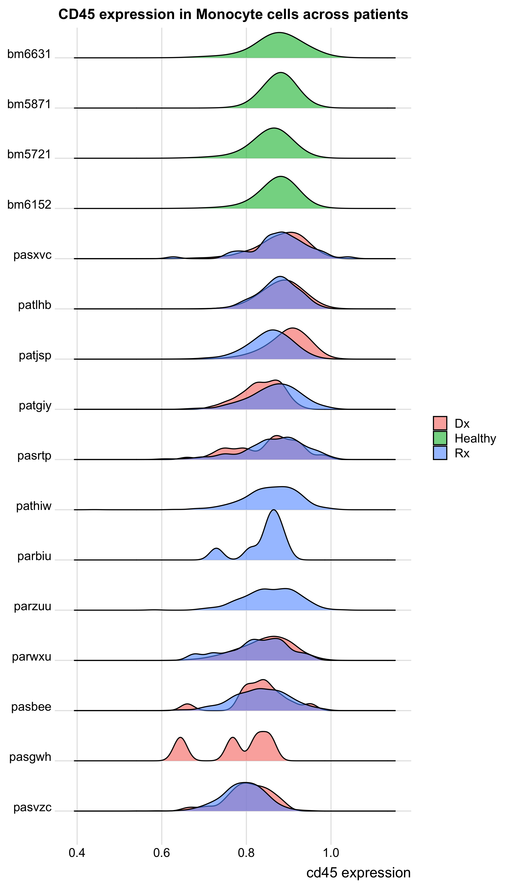
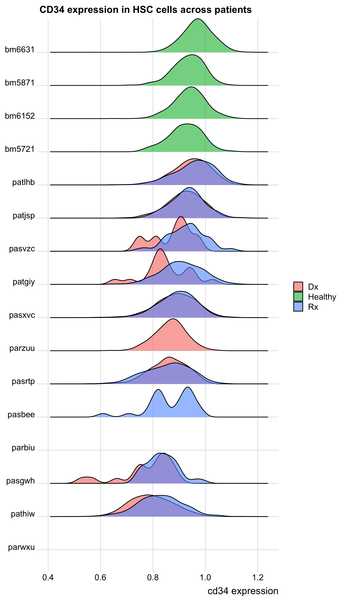
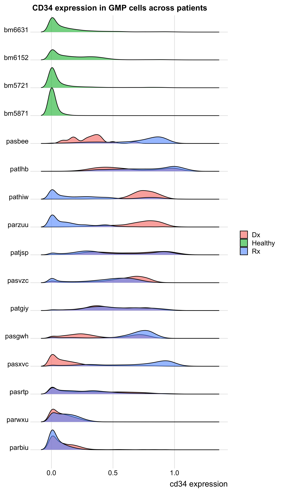
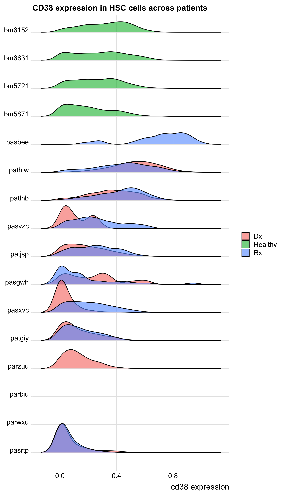
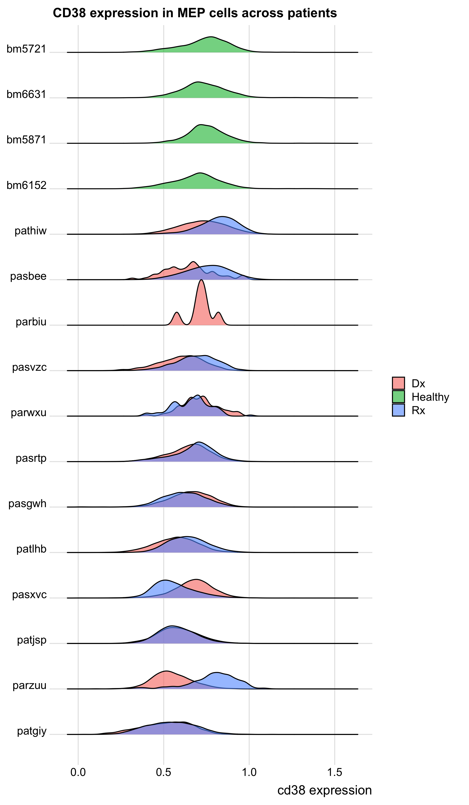
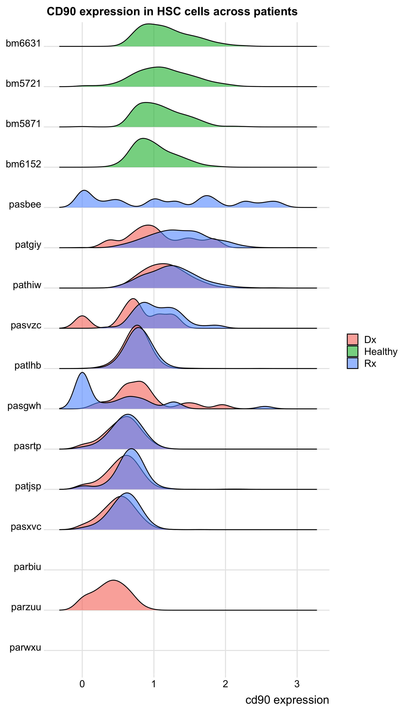
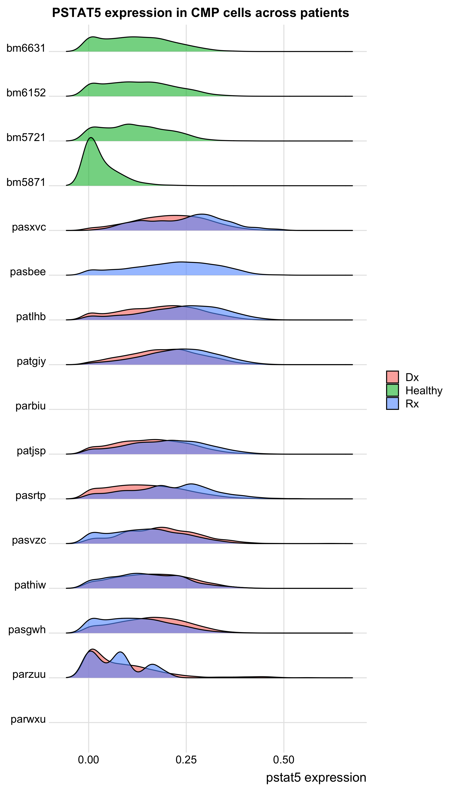

Diagnosis vs. Relapse Expression Analysis
================
Timothy Keyes
2020-09-08

  - [Executive Summary](#executive-summary)
  - [Analysis](#analysis)
      - [Basic setup](#basic-setup)
      - [Cluster to cluster across
        patients](#cluster-to-cluster-across-patients)
          - [CD45](#cd45)
          - [CD34](#cd34)
          - [CD38](#cd38)
          - [CD90](#cd90)
          - [CD93](#cd93)
          - [CD99](#cd99)
          - [pSTAT5](#pstat5)
          - [pSTAT3](#pstat3)

# Executive Summary

In this report, we analyze the expression of several markers in
clustered cell populations between paired diagnostic and relapse samples
from AML patients (as well as healthy controls).

# Analysis

``` r
# Libraries
library(tidyverse)
library(ggridges)

# Parameters
input_path <- here::here("data", "AML_matrix_clustered.rds")

CLASSIFIER_POPULATIONS <- 
  c(
    'HSC',
    'MPP',
    'CMP',
    'GMP',
    'MEP',                          
    'Monocyte', 
    'DC', 
    'Macrophage', 
    'Thrombocyte'
  )

#===============================================================================

#source necessary files
source('~/GitHub/aml-cells/scripts/setup/marker_setup.R')
source('~/GitHub/aml-cells/scripts/setup/patient_setup.R')
```

## Basic setup

Algorithm (in words):

  - Read in previously pre-processed data
      - arcsinh transform
      - compensation
      - filtered on `time` variable to remove weird CD34/CD38
        “debarcode-gate”
  - filter to only include paired samples (with both `Dx` and `Rx`
    present as well as healthy controls)

<!-- end list -->

``` r
#### set up global varibles
marker_setup()
patient_setup()

recode_vars <- 
  tibble(
    from = 1:length(CLASSIFIER_POPULATIONS), 
    to = CLASSIFIER_POPULATIONS
  ) %>% 
  deframe()

#read in paired data (and healthy data) 
aml_data <- 
  input_path %>% 
  read_rds() %>%
  mutate(
    patient = 
      patient %>% 
      as.character() %>% 
      str_to_lower() %>% 
      if_else(. == "pastrp", "pasrtp", .), 
    Mah.cluster = 
      recode(Mah.cluster, !!! recode_vars) %>% 
      factor(levels = CLASSIFIER_POPULATIONS)
  ) %>% 
  mutate_at(
    .vars = vars(phenograph.metacluster, FlowSOM.cluster, FlowSOM.metacluster),
    ~ (.) %>% 
      as.character() %>% 
      fct_reorder(., CD34, .fun = mean, .desc = TRUE)
  ) %>% 
  dplyr::filter(patient %in% c(PAIRED_PATIENTS, HEALTHY_CONTROLS)) %>% 
  rename_at(
    vars(everything()), 
    ~ (.) %>% 
      str_to_lower() %>% 
      str_replace_all(pattern = "[:punct:]", replacement = "_")
  )
```

## Cluster to cluster across patients

``` r
cluster_column <- "mah_cluster"
marker <- "cd45"

clusters_across_patients <- function(cluster_column, marker) {
  
  map(
    levels(aml_data[[cluster_column]]), 
    function(cluster_type) {
      patient_levels <- 
        aml_data %>% 
        dplyr::filter(!! sym(cluster_column) == cluster_type) %>% 
        group_by(
          metacondition = if_else(condition == "Healthy", "Healthy", "Cancer"),
          patient
        ) %>% 
        summarize(median = median(!! sym(marker))) %>% 
        ungroup() %>% 
        arrange(metacondition, median) %>% 
        pull(patient)
      
      aml_data %>% 
        dplyr::filter(!! sym(cluster_column) %in% cluster_type) %>% 
        dplyr::filter(stimulation == "Basal") %>% 
        mutate(
          metacondition = 
            if_else(condition == "Healthy", "Healthy", "Cancer") %>% 
            as.factor(), 
          patient = factor(patient, levels = patient_levels)
        ) %>% 
        ggplot(aes(x = !! sym(marker), y = patient, fill = condition)) + 
        geom_density_ridges(scale = 1, alpha = 0.6) + 
        coord_cartesian(clip = "off") + 
        theme_ridges() + 
        labs(
          title = str_c(
            str_to_upper(marker), 
            " expression in ", 
            cluster_type, 
            " cells across patients"
          ), 
          x = str_c(marker, " expression"), 
          y = NULL,
          fill = NULL
        )
    }
  )
}
```

### CD45

``` r
cd45_mah_cluster_plots <- clusters_across_patients("mah_cluster", "cd45")

cd45_mah_cluster_plots %>% 
  walk(print)
```

<!-- --><!-- --><!-- --><!-- --><!-- --><!-- --><!-- --><!-- --><!-- -->

-----

### CD34

``` r
cd34_mah_cluster_plots <- clusters_across_patients("mah_cluster", "cd34")

cd34_mah_cluster_plots %>% 
  walk(print)
```

<!-- --><!-- --><!-- --><!-- --><!-- --><!-- --><!-- --><!-- --><!-- -->

-----

### CD38

``` r
cd38_mah_cluster_plots <- clusters_across_patients("mah_cluster", "cd38")

cd38_mah_cluster_plots %>% 
  walk(print)
```

<!-- --><!-- --><!-- --><!-- --><!-- --><!-- --><!-- --><!-- --><!-- -->

-----

### CD90

``` r
cd90_mah_cluster_plots <- clusters_across_patients("mah_cluster", "cd90")

cd90_mah_cluster_plots[1:2] %>% 
  walk(print)
```

<!-- --><!-- -->

-----

### CD93

``` r
cd93_mah_cluster_plots <- clusters_across_patients("mah_cluster", "cd93")

cd93_mah_cluster_plots[1:2] %>% 
  walk(print)
```

<!-- --><!-- -->

-----

### CD99

``` r
cd99_mah_cluster_plots <- clusters_across_patients("mah_cluster", "cd99")

cd99_mah_cluster_plots[1:2] %>% 
  walk(print)
```

<!-- --><!-- -->

-----

### pSTAT5

``` r
pstat5_mah_cluster_plots <- clusters_across_patients("mah_cluster", "pstat5")

pstat5_mah_cluster_plots[1:3] %>% 
  walk(print)
```

<!-- --><!-- --><!-- -->

-----

### pSTAT3

``` r
pstat3_mah_cluster_plots <- clusters_across_patients("mah_cluster", "pstat3")

pstat3_mah_cluster_plots[1:3] %>% 
  walk(print)
```

<!-- --><!-- --><!-- -->

-----

#### Conclusions

  - Univariate analyses don’t indicate any particular marker as “leaping
    out” as particularly higher or lower in relapse samples relative to
    healthy samples (to be expected)

  - Often, magnitudes and even directions of up- or down-regulation are
    not consistent between diagnostic-relapse pairs.

  - Marker distributions within a patient and population seem to stay
    relatively constant for surface markers, but less so for functional
    markers (again, perhaps to be expected). So, our model should
    probably not extract the mean or median of the signaling
    distributions for fear of losing whatever differences are present.

  - Classifier population marker distributions can vary quite a bit from
    patient to patient.

  - Some markers are not very highly expresssed at all. This is evidence
    that the panel can still be optimized (FYI: Astraea and I have
    already worked on this quite a bit for AML panel 2.0)

  - Differences across the board are likely to be very nuanced. Perhaps
    patient-level features will not capture this: should the model
    operate on the single-cell level?
