Single-cell feature EDA
================
tkeyes
2020-10-16

  - [Setup](#setup)
      - [Read in data](#read-in-data)
      - [Read in feature names](#read-in-feature-names)
  - [Explore features](#explore-features)
      - [Patient-level features](#patient-level-features)
      - [Abundance features](#abundance-features)
      - [Surface markers](#surface-markers)
      - [Signaling features](#signaling-features)

``` r
# Libraries
library(tidyverse)

libraries <- 
  c(
    "tidyverse", 
    "tidymodels", 
    "rlang", 
    "ggthemes", 
    "doParallel", 
    "ggridges"
  )

source(here::here("scripts", "setup", "aml_utils.R")) 
call_libraries(libraries)

# Parameters
set_global_variables(locale = "galaxia")
md_path <- here::here("data-raw", "AML_metadata.xlsx")
tidyTOF_directory <- file.path("~", "GitHub", "tidyTOF")

single_cell_path <- here::here("data", "aml_data_clustered.rds")
patient_features_path <- here::here("data", "mahalanobis_dev_features_10.rds")
feature_path <- here::here("data", "modeling_logistic", "mah_dev_feature_names.rds")
md_path <- here::here("data", "md.rds")


# Sourcing tidyTOF functions
source_tidyTOF(tidyTOF_directory)

# set up aml marker and patient information
marker_setup()
patient_setup()
```

# Setup

## Read in data

``` r
metadata <- 
  md_path %>% 
  read_rds() %>% 
  transmute(
    patient, 
    age = age_at_diagnosis_in_days, 
    wbc = wbc_at_diagnosis, 
    outcome = first_event %>% str_replace("Censored", "Non-relapse")
  )

aml_data <- 
  single_cell_path %>% 
  read_rds()


patient_features <- 
  patient_features_path %>% 
  read_rds() %>% 
  left_join(metadata, by = "patient") %>% 
  filter(!is.na(outcome)) %>% 
  replace(list = is.na(.), values = 0)
```

## Read in feature names

``` r
feature_names <- 
  feature_path %>% 
  read_rds() %>% 
  tibble(original_names = .) %>% 
  mutate(
    cell_population = 
      if_else(
        str_detect(string = original_names, pattern = "_"),
        true = 
          str_extract(
            original_names,
            pattern = str_c(CLASSIFIER_POPULATIONS, collapse = "|")
          ), 
        false = NA_character_
      ), 
    marker = 
      if_else(
        str_detect(string = original_names, pattern = "_"), 
        true = 
          str_extract(
            original_names, 
            pattern = str_c(ALL_MARKERS, collapse = "|")
          ), 
        false = NA_character_
      ), 
    stimulation = 
      if_else(
        str_detect(string = original_names, pattern = "_"), 
        true = 
          str_extract(
            original_names, 
            pattern = str_c(unique(aml_data$stimulation), collapse = "|")
          ), 
        false = NA_character_
      ), 
    feature_type = 
      case_when(
        is.na(cell_population) ~ "patient-level",
        is.na(marker)          ~ "abundance",
        is.na(stimulation)     ~ "surface", 
        TRUE                   ~ "signaling"
      )
  )

glimpse(feature_names)
```

    ## Rows: 13
    ## Columns: 5
    ## $ original_names  <chr> "DC_CD90", "HSC_GMCSF_pS6", "Monocyte_CD117", "Monocy…
    ## $ cell_population <chr> "DC", "HSC", "Monocyte", "Monocyte", "Thrombocyte", "…
    ## $ marker          <chr> "CD90", "pS6", "CD117", "pS6", NA, "pS6", NA, "pS6", …
    ## $ stimulation     <chr> NA, "GMCSF", NA, "IL6", NA, "IL6", NA, "IL6", "IL6", …
    ## $ feature_type    <chr> "surface", "signaling", "surface", "signaling", "abun…

# Explore features

## Patient-level features

``` r
feature_names %>% 
  filter(feature_type == "patient-level") %>% 
  pull(original_names) %>% 
  select(.data = patient_features, all_of(.), patient, condition, outcome) %>% 
  filter(condition == "dx") %>% 
  ggplot(aes(x = outcome, y = wbc, fill = outcome)) + 
  geom_violin(draw_quantiles = 0.5) + 
  geom_point(alpha = 0.8)
```

    ## Note: Using an external vector in selections is ambiguous.
    ## ℹ Use `all_of(.)` instead of `.` to silence this message.
    ## ℹ See <https://tidyselect.r-lib.org/reference/faq-external-vector.html>.
    ## This message is displayed once per session.

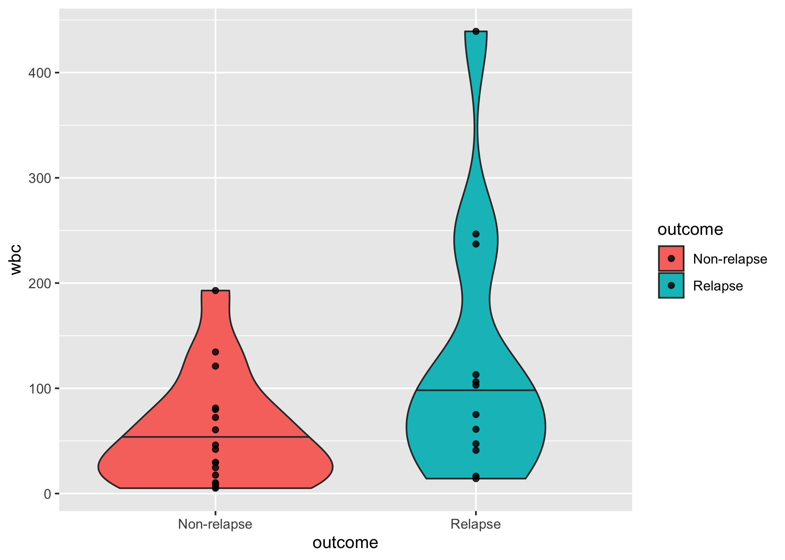<!-- -->

## Abundance features

``` r
feature_names %>% 
  filter(feature_type == "abundance") %>% 
  pull(original_names) %>% 
  select(.data = patient_features, all_of(.), patient, condition, outcome) %>% 
  filter(condition == "dx") %>% 
  mutate(outcome = fct_rev(outcome)) %>% 
  ggplot(aes(x = outcome, y = Thrombocyte_abundance, fill = outcome)) + 
  geom_violin(draw_quantiles = 0.5) + 
  geom_point(alpha = 0.8)
```

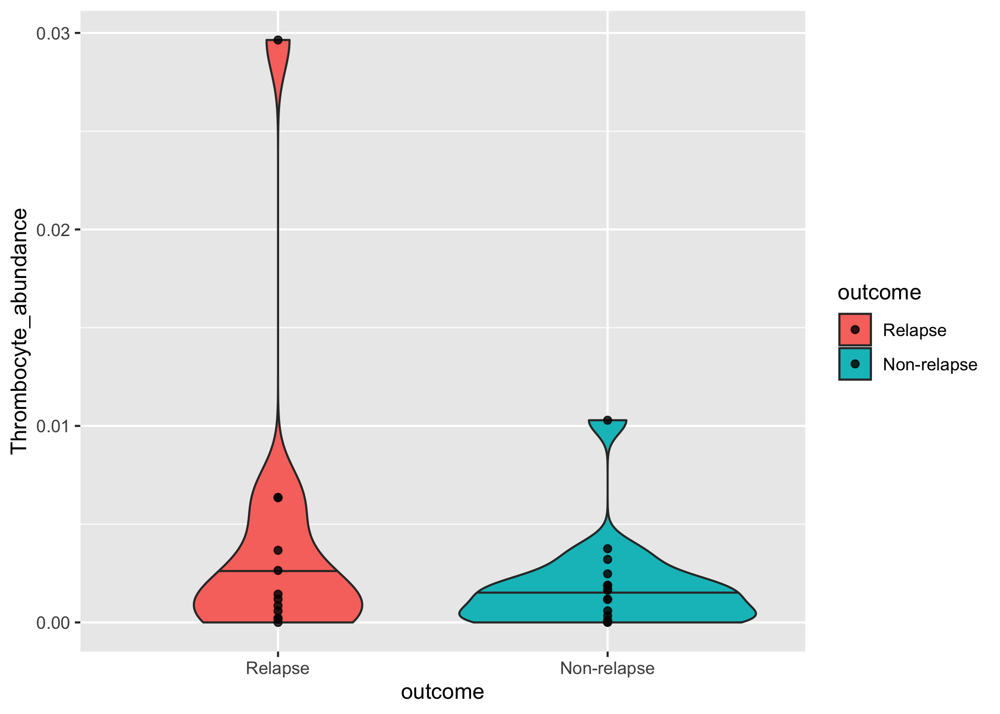<!-- -->

## Surface markers

``` r
aml_data <- 
  aml_data %>% 
  left_join(metadata %>% select(patient, outcome))
```

    ## Joining, by = "patient"

``` r
plot_surface <- function(cell_population, marker){
  
  patient_order <- 
    aml_data %>% 
    filter(condition == "dx", mahalanobis_cluster == cell_population) %>% 
    group_by(patient, outcome) %>% 
    summarize(marker := mean(!!sym(marker))) %>% 
    ungroup() %>% 
    arrange(outcome, desc(marker)) %>% 
    pull(patient)
  
  aml_data %>% 
    filter(condition == "dx", mahalanobis_cluster == cell_population) %>% 
    mutate(
      patient = factor(patient, levels = patient_order), 
      outcome = fct_rev(outcome)
    ) %>% 
    ggplot(aes_string(x = marker, y = "patient", fill = "outcome")) + 
    geom_density_ridges() + 
    labs(
      x = str_c(marker, " expression (arcsinh-counts)"), 
      y = "Density of cells", 
      subtitle = str_c(marker, " in ", cell_population, "-like cells at diagnosis")
    )
}

surface_plots <- 
  feature_names %>% 
  filter(feature_type == "surface") %>%
  transmute(
    plots = map2(.x = cell_population, .y = marker, .f = plot_surface)
  )
  
surface_plots %>% 
  pull(plots) %>% 
  walk(print)
```

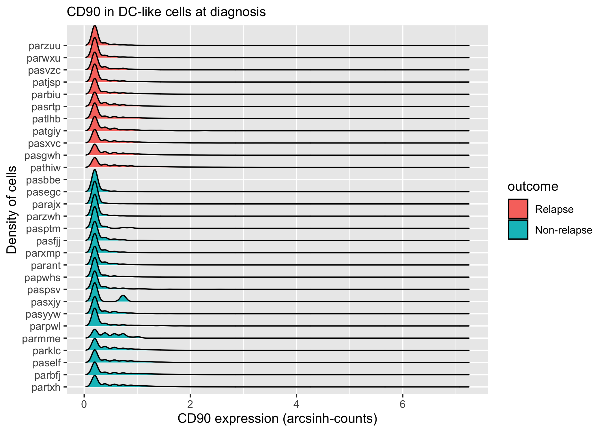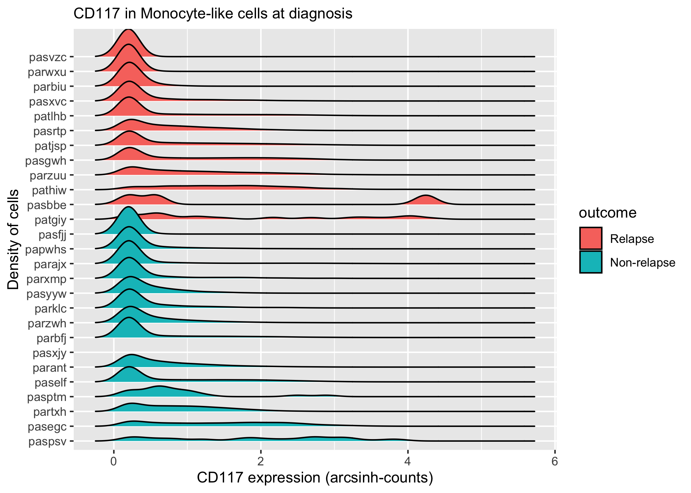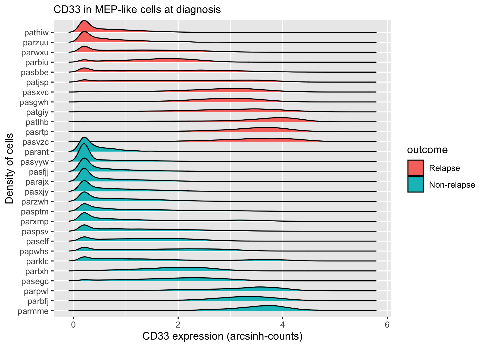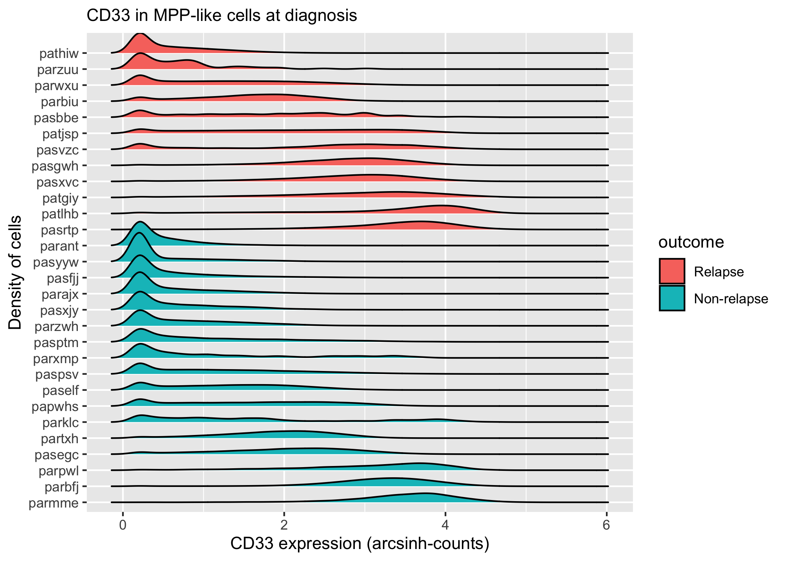

## Signaling features

``` r
plot_signaling <- function(cell_population, marker, stimulation){
  
  patient_order <- 
    aml_data %>% 
    filter(condition == "dx", mahalanobis_cluster == cell_population) %>% 
    group_by(patient, outcome) %>% 
    summarize(marker := mean(!!sym(marker))) %>% 
    ungroup() %>% 
    arrange(outcome, desc(marker)) %>% 
    pull(patient)
  
  aml_data %>% 
    filter(condition == "dx", mahalanobis_cluster == cell_population, stimulation == stimulation) %>% 
    mutate(
      patient = factor(patient, levels = patient_order), 
      outcome = fct_rev(outcome)
    ) %>% 
    ggplot(aes_string(x = marker, y = "patient", fill = "outcome")) + 
    geom_density_ridges() + 
    labs(
      x = str_c(marker, " expression (arcsinh-counts)"), 
      y = "Density of cells", 
      subtitle = str_c(marker, " in ", cell_population, "-like cells at diagnosis (Stimulation: ", stimulation, ")")
    )
}

signaling_plots <- 
  feature_names %>% 
  filter(feature_type == "signaling") %>%
  transmute(
    plots = pmap(.l = list(cell_population, marker, stimulation), .f = plot_signaling)
  )
  
signaling_plots %>% 
  pull(plots) %>% 
  walk(print)
```

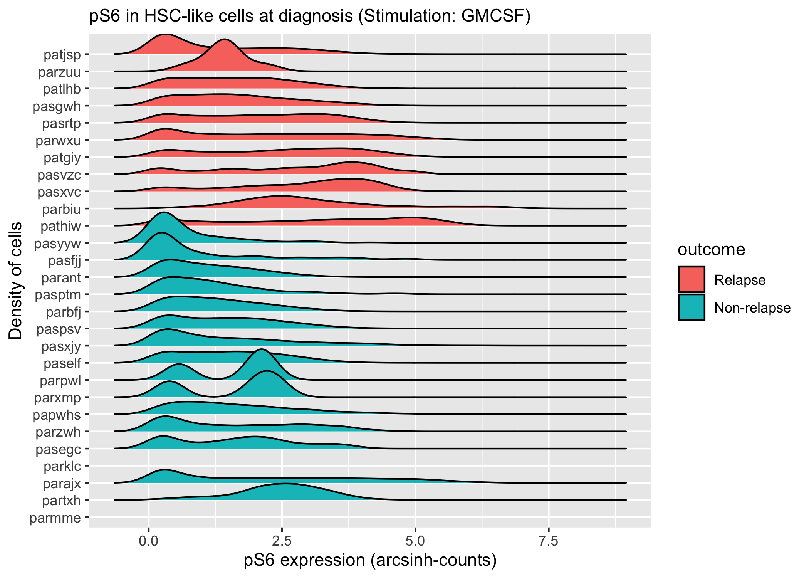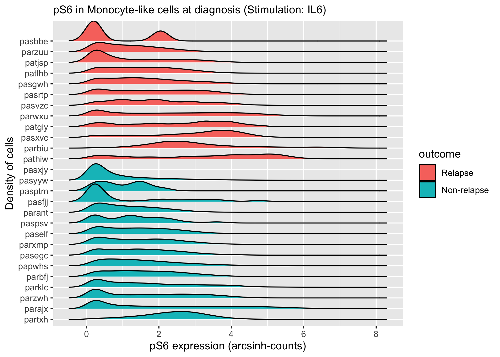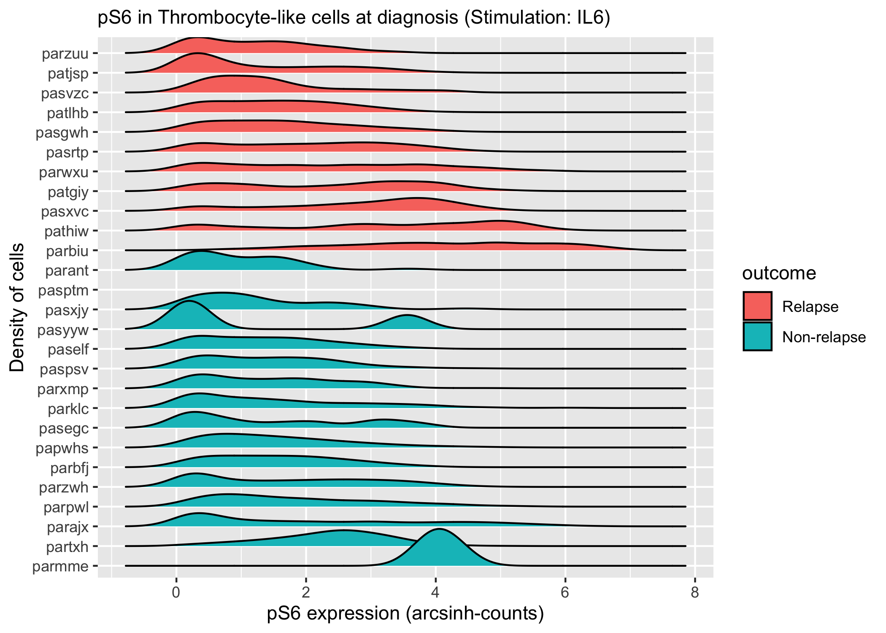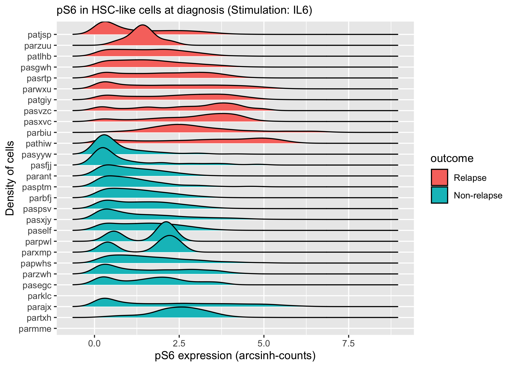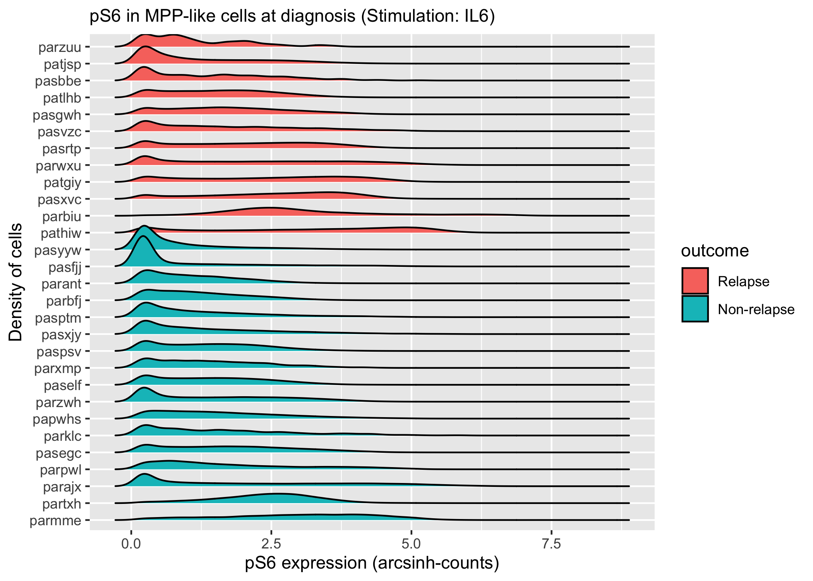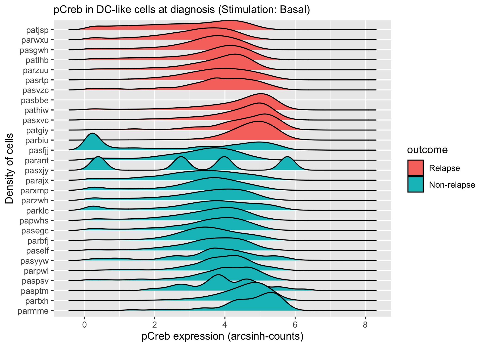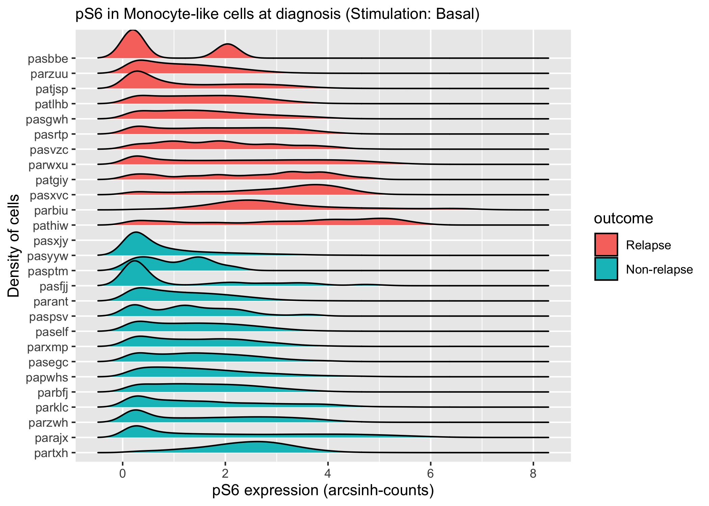
