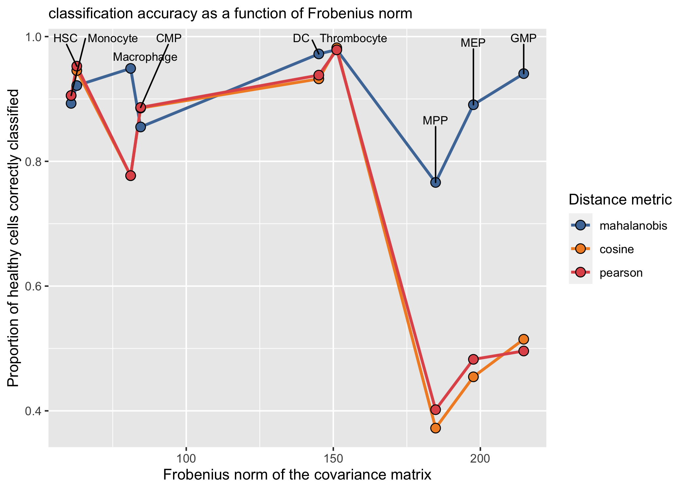
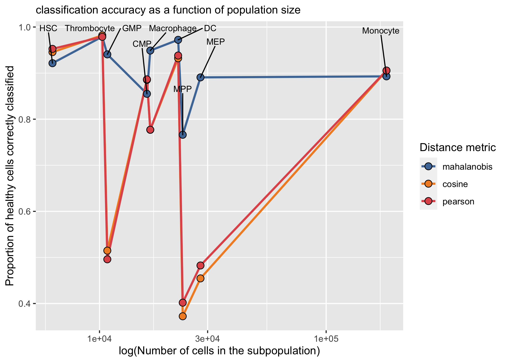
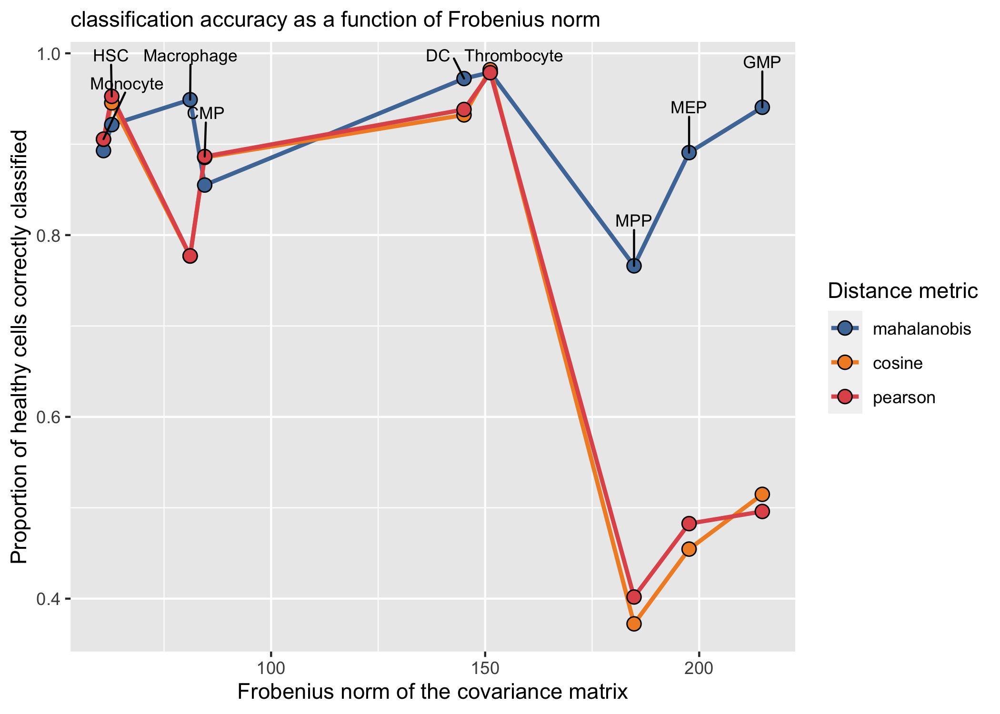
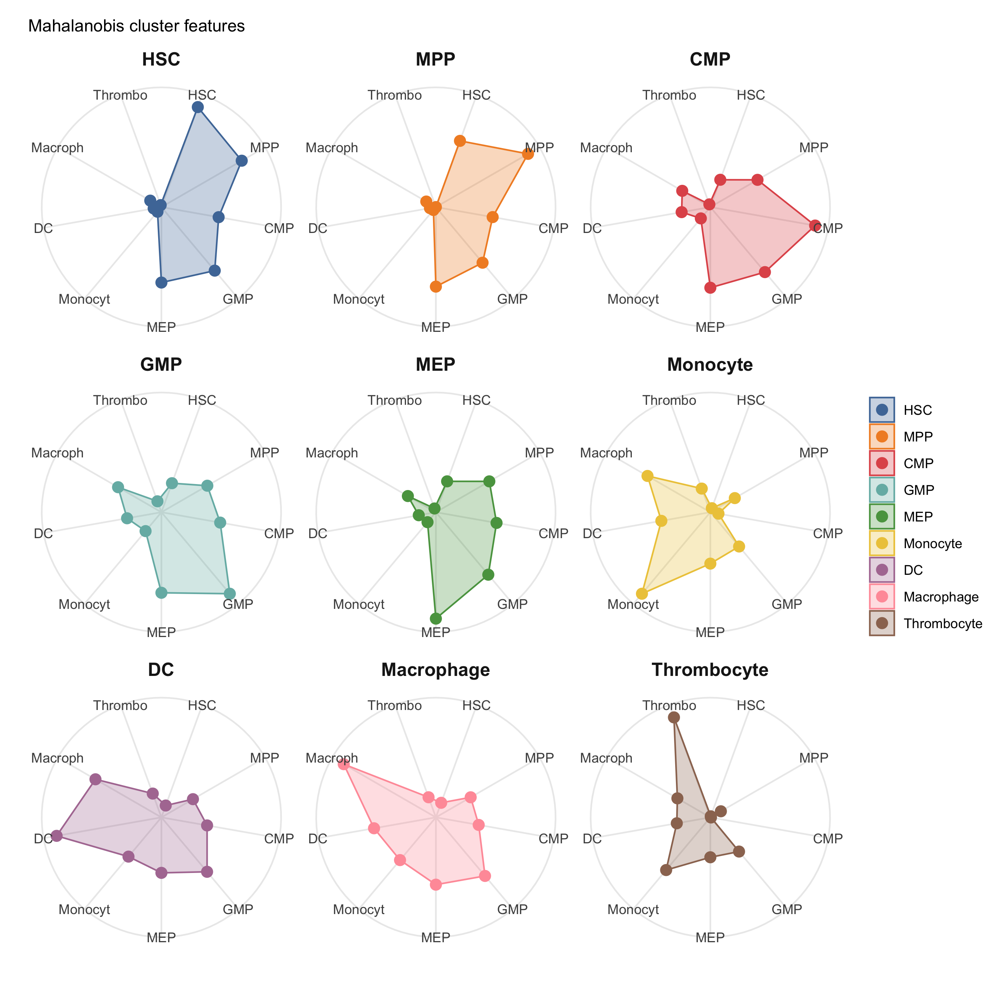
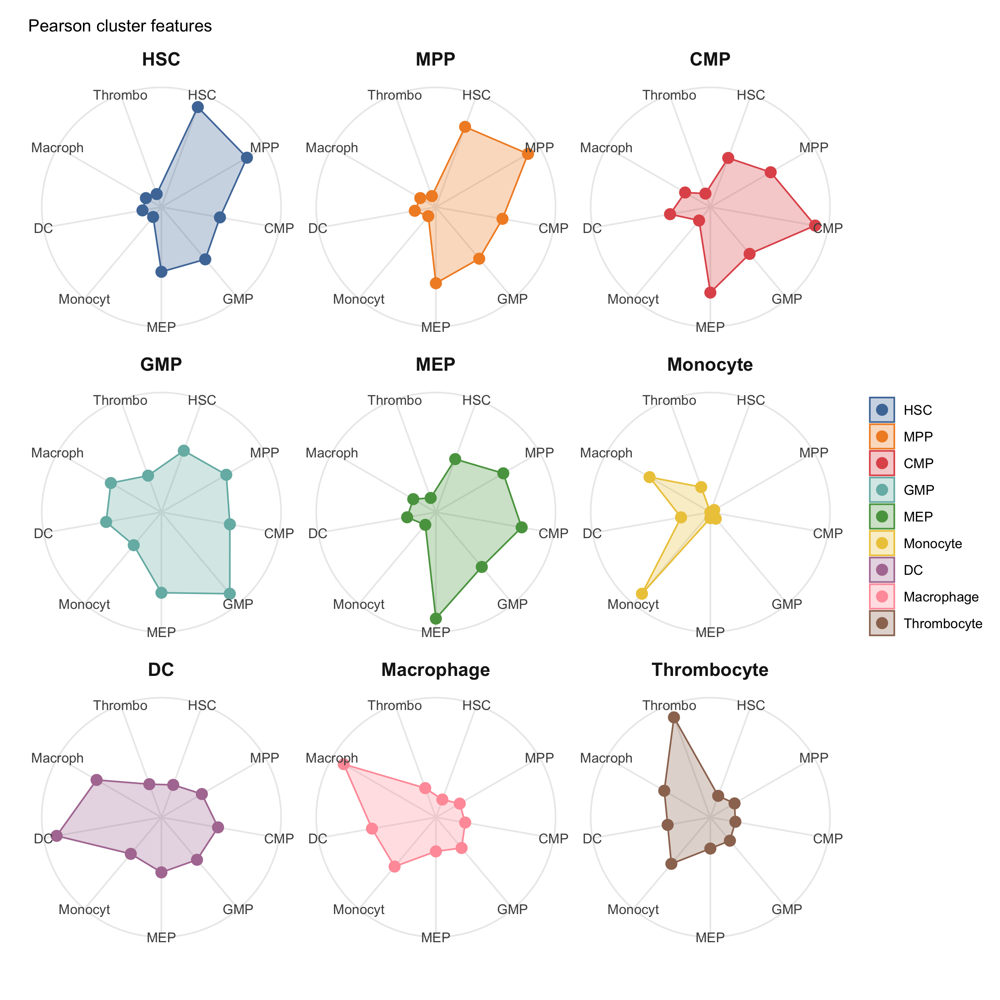
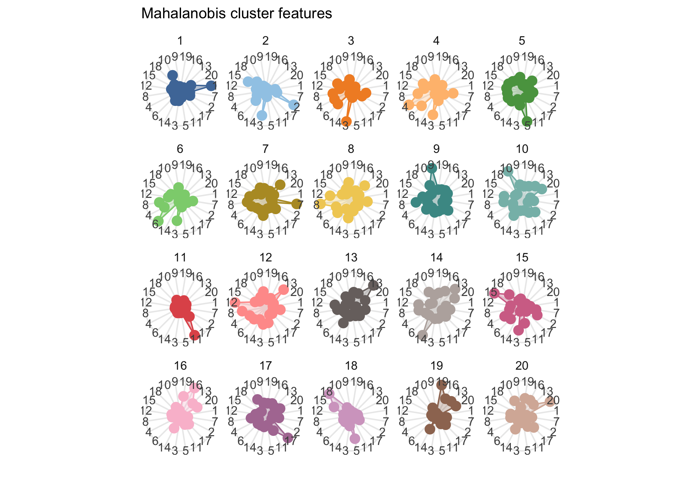
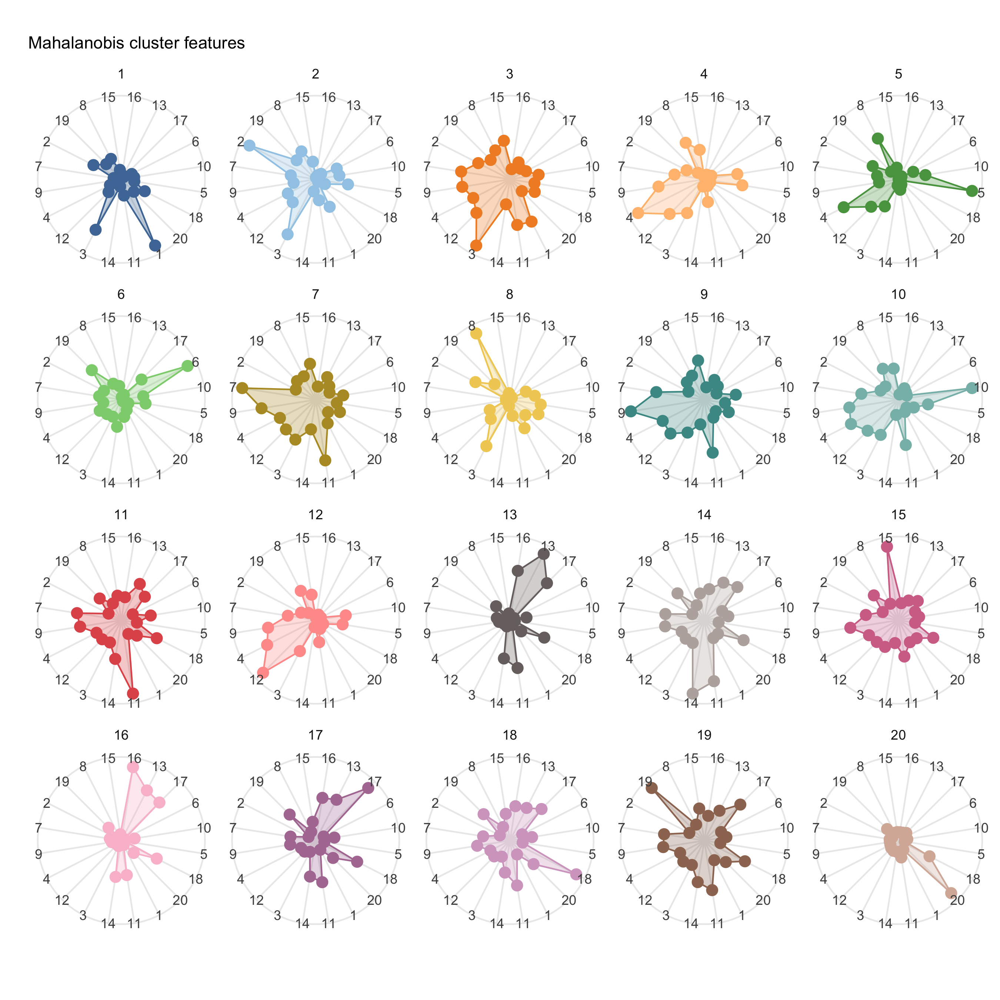

AML Classifier Vignette
================
tkeyes
2020-07-10

  - [Read in and preprocess AML/healthy
    data](#read-in-and-preprocess-amlhealthy-data)
  - [Build and apply the single-cell
    classifier](#build-and-apply-the-single-cell-classifier)
      - [Syntax for building the
        classifier](#syntax-for-building-the-classifier)
      - [Applying the classifier](#applying-the-classifier)
      - [Comparing classifier accuracy across distance
        metrics](#comparing-classifier-accuracy-across-distance-metrics)
      - [Marker expression among different
        subpopulations](#marker-expression-among-different-subpopulations)
      - [Using different clustering
        methods](#using-different-clustering-methods)

``` r
# Libraries
library(flowCore)
library(tidyverse)
library(readxl)
library(ggridges)
library(rlang)
library(ggthemes)
library(DataExplorer)
library(ComplexHeatmap)
library(foreach)
library(doParallel)
library(ggrepel)
library(ggiraphExtra)
library(ggiraph)
library(FlowSOM)

# Parameters
source(here::here("scripts", "setup", "aml_utils.R")) #may need to change on scg machines
set_global_variables(locale = "galaxia")

tidyTOF_directory <- file.path("~", "GitHub", "tidyTOF")
is_sampled <- TRUE
md_path <- here::here("data-raw", "AML_metadata.xlsx")

# Sourcing tidyTOF functions
source_tidyTOF(tidyTOF_directory)

marker_setup()
patient_setup()
```

## Read in and preprocess AML/healthy data

``` r
# we read in some data that was previously processed 
aml_data <- 
  file.path(DATA_DIRECTORY, "sampled_aml_data_p.rds") %>% 
  read_rds()

# and we also read the gated data from raw .fcs files...
gated_data <- 
  here::here("data-raw", "healthy_data") %>% #the file path for the gated data
  tof_read_fcs(folder_path = .) %>%  #read in everything in the folder
  tof_preprocess() #preprocess with default settings
```

Here, we use two utility functions, `tof_read_fcs()` and
`tof_proprocess()`.

*`tof_read_fcs()`* painlessly reads in a single .fcs file or a folder of
.fcs files into a single table, with each protein measurement
represented by a column and each cell represented by a row. It also adds
an additional column to each dataset representing the file name of the
file that each cell comes from.

*`tof_preprocess()`* transforms each protein measurement in the dataset
according to a transformation function that you give it (any function
that you’d like). It is very customizable, but I call it here with no
arguments because the default behavior is simply to remove the noise
added during .fcs file generation and perform the standard cytof arcsinh
transformation for each numeric column.

I’ll do some additional magic here to make the names a bit nicer, since
`tof_read_fcs()` uses the names stored in a specific keyword in the .fcs
files (and you might want an altered version of these names)

``` r
gated_data <- 
  gated_data %>% 
  rename_with( #and then do some renaming to make the names a little nicer
    .fn = 
      function(x) str_extract(x, pattern = "_.+") %>% 
      str_sub(start = 2L), 
    .cols = contains("_")
  ) %>% 
  select(
    -Time, 
    -length, 
    -contains("Pd"), 
    -Center, 
    -Offset, 
    -beadDist, 
    -`127I`, 
    -Residual, 
    -Width, 
    -cisplatin
  ) %>%
  rename(gated_population = names) %>% 
  mutate(
    gated_population = 
      str_extract(gated_population, "_[:alpha:]+") %>% 
      str_sub(start = 2L)
  )
```

We can now `glimpse()` at the data:

``` r
glimpse(gated_data)
```

    ## Observations: 318,284
    ## Variables: 44
    ## $ CD45             <dbl> 3.966870, 3.920385, 4.025670, 2.978123, 4.309637, 3.…
    ## $ CD61             <dbl> 0.1986901, 0.1986901, 0.1986901, 0.1986901, 0.198690…
    ## $ CD99             <dbl> 3.904397, 4.101263, 3.846339, 3.974412, 3.959271, 3.…
    ## $ CD45RA           <dbl> 0.5688249, 0.7326683, 1.8798636, 1.2489833, 1.137982…
    ## $ CD93             <dbl> 0.1986901, 0.1986901, 0.5688249, 0.3900353, 0.198690…
    ## $ CD3_CD19         <dbl> 0.7326683, 0.8813736, 0.5688249, 1.0159731, 0.198690…
    ## $ CCR2             <dbl> 0.5688249, 0.7326683, 0.5688249, 0.3900353, 0.198690…
    ## $ CD117            <dbl> 0.3900353, 1.8184465, 2.6441208, 0.7326683, 1.350440…
    ## $ CD123            <dbl> 0.5688249, 0.7326683, 0.8813736, 1.4436355, 0.732668…
    ## $ CD64             <dbl> 0.1986901, 0.8813736, 0.5688249, 0.1986901, 0.198690…
    ## $ CD90             <dbl> 1.992836, 1.879864, 1.753229, 1.683743, 2.848273, 1.…
    ## $ CD38             <dbl> 1.9928358, 2.0450282, 1.5296605, 1.8798636, 0.881373…
    ## $ CD34             <dbl> 4.848962, 5.312245, 5.613141, 4.938832, 5.378997, 4.…
    ## $ CEBPa            <dbl> 0.8813736, 1.6837431, 1.6094379, 1.0159731, 0.732668…
    ## $ pSTAT5           <dbl> 1.1379820, 1.0159731, 1.9928358, 2.4237920, 1.683743…
    ## $ CD11c            <dbl> 0.1986901, 0.1986901, 0.1986901, 0.1986901, 0.198690…
    ## $ CD13             <dbl> 1.2489833, 1.1379820, 1.2489833, 1.1379820, 1.683743…
    ## $ pAkt             <dbl> 2.2724413, 1.7532289, 2.1421119, 0.3900353, 0.198690…
    ## $ `TIM-3`          <dbl> 0.8813736, 0.1986901, 1.1379820, 0.1986901, 0.568824…
    ## $ CD56             <dbl> 1.992836, 1.529660, 3.179785, 1.683743, 2.848273, 2.…
    ## $ CD10             <dbl> 0.1986901, 0.1986901, 0.1986901, 0.1986901, 0.568824…
    ## $ PU.1             <dbl> 2.1421119, 2.5241376, 2.6720162, 1.7532289, 0.732668…
    ## $ CD33             <dbl> 0.7326683, 1.4436355, 0.7326683, 0.1986901, 1.609437…
    ## $ CD14             <dbl> 0.1986901, 0.1986901, 0.3900353, 0.1986901, 0.198690…
    ## $ `caspase-3`      <dbl> 0.1986901, 0.1986901, 0.3900353, 0.1986901, 0.198690…
    ## $ `GATA-1`         <dbl> 0.1986901, 0.1986901, 0.3900353, 0.1986901, 0.390035…
    ## $ pSTAT3           <dbl> 1.9378793, 0.1986901, 1.0159731, 0.1986901, 0.568824…
    ## $ CD41             <dbl> 0.5688249, 0.7326683, 0.1986901, 0.5688249, 0.390035…
    ## $ CD16             <dbl> 0.1986901, 0.1986901, 0.1986901, 0.1986901, 0.198690…
    ## $ CD68             <dbl> 0.7326683, 0.1986901, 0.7326683, 0.1986901, 1.529660…
    ## $ MPO              <dbl> 1.3504407, 2.0947125, 1.8798636, 0.5688249, 0.732668…
    ## $ pErk             <dbl> 2.8482726, 1.1379820, 2.4917799, 0.1986901, 0.198690…
    ## $ CD47             <dbl> 4.074431, 4.165355, 4.372136, 2.978123, 4.314997, 3.…
    ## $ CD135            <dbl> 1.0159731, 1.0159731, 2.0450282, 0.3900353, 2.045028…
    ## $ CD109            <dbl> 1.992836, 3.056219, 2.491780, 1.683743, 3.212466, 2.…
    ## $ pS6              <dbl> 2.1874218, 0.3900353, 3.1460050, 2.1874218, 2.312438…
    ## $ CD49f            <dbl> 0.7326683, 0.1986901, 0.8813736, 0.7326683, 0.198690…
    ## $ `HLA-DR`         <dbl> 2.848273, 3.037256, 3.415523, 3.074830, 3.441444, 3.…
    ## $ CD71             <dbl> 1.443635, 3.289791, 3.196259, 1.529660, 2.045028, 3.…
    ## $ pCreb            <dbl> 4.750211, 4.146555, 4.969862, 4.644483, 4.556090, 5.…
    ## $ `191Ir`          <dbl> 5.261680, 5.436358, 5.300340, 5.429365, 5.425850, 5.…
    ## $ `193Ir`          <dbl> 5.885000, 5.977372, 5.878304, 5.957914, 5.916748, 5.…
    ## $ CD11b            <dbl> 0.1986901, 0.1986901, 0.3900353, 0.1986901, 0.198690…
    ## $ gated_population <chr> "HSC", "HSC", "HSC", "HSC", "HSC", "HSC", "HSC", "HS…

As a final step from reading in the data, we can also check that gated
data and aml data have the same columns…

``` r
setdiff(colnames(gated_data), colnames(aml_data))
```

    ## [1] "gated_population"

Great\! The only difference is that the `gated_data` has a column
indicating which gate each cell was obtained from, which is exactly what
we want.

## Build and apply the single-cell classifier

### Syntax for building the classifier

The new version of the single-cell classifier has 2 steps once the data
are pre-processed.

First, we build the classifier using the `tof_build_classifier()`
command:

``` r
classifier_fit <- 
  gated_data %>% 
  tof_classifier_build(
    population_vector = gated_data$gated_population, 
    classifier_markers = SURFACE_MARKERS
  )
```

This gives us a `classifier_fit` object - which is essentially a table
that contains the information we need to do any computations with
mahalanobis distance (or other distances that are often used with cytof
data).

``` r
glimpse(classifier_fit)
```

    ## Observations: 9
    ## Variables: 3
    ## Groups: population [9]
    ## $ population        <chr> "HSC", "MPP", "CMP", "GMP", "MEP", "Monocyte", "DC"…
    ## $ centroid          <list> [<0.5483766, 0.3733834, 0.4134908, 0.4262563, 2.03…
    ## $ covariance_matrix <list> [<matrix[30 x 30]>, <matrix[30 x 30]>, <matrix[30 …

As you can see above, each classifier\_fit object has 3 columns: the
first one describes what the manually-gated population name is, the
second one contains the centroid information for each population, and
the third column contains the covariance matrix for each column.

(A note: One of the ideas here is that, by building the classifier
first, you can save time later by not needing to retrain your classifier
every time you want to run it. You only need a few pieces of information
from the healthy dataset to run the classifier, so we can extract those
in a preliminary step and then use them as much as we’d like later).

### Applying the classifier

The next step of the classifier will call the `tof_classifier_apply()`
function. It requires you to give it a tibble containing all of the
cells you want to classify and the `classifier_fit` object you just
made.

It takes a few arguments: \* *classifier\_fit* - the table we just made
from `tof_classifier_build()` \* *num\_cores* - the number of cores you
want to use on your computer to speed up the calculations \*
*parallel\_var* - the discrete variable in your dataset you want to
parallelize the computation over (i.e. how you want to split up the data
to run on different cores of your machine) \* *dist\_fun* - the distance
function you want to use the perform the classification. The default is
“mahalanobis”, but “cosine” and “pearson” distances are also
implemented.

``` r
classifier_data <- 
  aml_data %>% 
  tof_classifier_apply(
    classifier_fit = classifier_fit, 
    num_cores = 1, 
    parallel_var = plate, 
    dist_fun = "mahalanobis"
  )
```

The output of `tof_apply_classifier()` is a tibble that has one row for
each cell in your dataset and one column for each population in the
`classifier_fit` object (encoding each cell’s distance to the centroid
of that population). It also has an additional column with the name of
the population that each cell was “sorted” into based on which distance
is the smallest for each cell.

``` r
glimpse(classifier_data)
```

    ## Observations: 2,252,598
    ## Variables: 10
    ## $ mahalanobis_HSC         <dbl> 450.9419, 298.8318, 300.0541, 376.3950, 377.6…
    ## $ mahalanobis_MPP         <dbl> 273.8502, 125.8461, 132.2530, 193.6514, 152.8…
    ## $ mahalanobis_CMP         <dbl> 362.29493, 356.76320, 128.81054, 83.35499, 37…
    ## $ mahalanobis_GMP         <dbl> 47.11502, 119.33766, 62.21495, 51.94987, 97.1…
    ## $ mahalanobis_MEP         <dbl> 121.45746, 128.59908, 62.87550, 79.32173, 89.…
    ## $ mahalanobis_Monocyte    <dbl> 361.31895, 55.99990, 37.79790, 104.26411, 14.…
    ## $ mahalanobis_DC          <dbl> 223.02864, 62.23552, 59.62036, 119.55800, 66.…
    ## $ mahalanobis_Macrophage  <dbl> 459.49194, 47.56408, 20.85991, 40.70717, 49.0…
    ## $ mahalanobis_Thrombocyte <dbl> 566.82756, 101.28018, 210.01882, 252.16199, 8…
    ## $ mahalanobis_cluster     <chr> "GMP", "Macrophage", "Macrophage", "Macrophag…

From there, you can easily take the output of `tof_apply_classifier()`
and bind it to the original dataset to start making some plots and
comparisons.

``` r
aml_data <-
  bind_cols(aml_data, classifier_data)
```

You can also use distance metrics other than the mahalanobis distance…

``` r
classifier_data_cosine <- 
  aml_data %>% 
  tof_classifier_apply(
    classifier_fit = classifier_fit, 
    num_cores = 1, 
    parallel_var = plate, 
    dist_fun = "cosine"
  )

classifier_data_pearson <- 
  aml_data %>% 
  tof_classifier_apply(
    classifier_fit = classifier_fit, 
    num_cores = 1, 
    parallel_var = plate, 
    dist_fun = "pearson"
  )

aml_data <- 
  bind_cols(aml_data, classifier_data_cosine, classifier_data_pearson)
```

So now our dataset has all of these variables:

``` r
aml_data %>%
  colnames()
```

    ##  [1] "CD45"                    "CD61"                   
    ##  [3] "CD99"                    "127I"                   
    ##  [5] "CD45RA"                  "CD93"                   
    ##  [7] "CD3_CD19"                "CCR2"                   
    ##  [9] "CD117"                   "CD123"                  
    ## [11] "CD64"                    "CD90"                   
    ## [13] "CD38"                    "CD34"                   
    ## [15] "CEBPa"                   "pSTAT5"                 
    ## [17] "CD11c"                   "CD13"                   
    ## [19] "pAkt"                    "TIM-3"                  
    ## [21] "CD56"                    "CD10"                   
    ## [23] "PU.1"                    "CD33"                   
    ## [25] "CD14"                    "caspase-3"              
    ## [27] "GATA-1"                  "pSTAT3"                 
    ## [29] "CD41"                    "CD16"                   
    ## [31] "CD68"                    "MPO"                    
    ## [33] "pErk"                    "CD47"                   
    ## [35] "CD135"                   "CD109"                  
    ## [37] "pS6"                     "CD49f"                  
    ## [39] "HLA-DR"                  "CD71"                   
    ## [41] "pCreb"                   "191Ir"                  
    ## [43] "193Ir"                   "cisplatin"              
    ## [45] "CD11b"                   "file_names"             
    ## [47] "plate"                   "patient"                
    ## [49] "stimulation"             "condition"              
    ## [51] "cell_id"                 "mahalanobis_HSC"        
    ## [53] "mahalanobis_MPP"         "mahalanobis_CMP"        
    ## [55] "mahalanobis_GMP"         "mahalanobis_MEP"        
    ## [57] "mahalanobis_Monocyte"    "mahalanobis_DC"         
    ## [59] "mahalanobis_Macrophage"  "mahalanobis_Thrombocyte"
    ## [61] "mahalanobis_cluster"     "cosine_HSC"             
    ## [63] "cosine_MPP"              "cosine_CMP"             
    ## [65] "cosine_GMP"              "cosine_MEP"             
    ## [67] "cosine_Monocyte"         "cosine_DC"              
    ## [69] "cosine_Macrophage"       "cosine_Thrombocyte"     
    ## [71] "cosine_cluster"          "pearson_HSC"            
    ## [73] "pearson_MPP"             "pearson_CMP"            
    ## [75] "pearson_GMP"             "pearson_MEP"            
    ## [77] "pearson_Monocyte"        "pearson_DC"             
    ## [79] "pearson_Macrophage"      "pearson_Thrombocyte"    
    ## [81] "pearson_cluster"

### Comparing classifier accuracy across distance metrics

We can compare each of these distance metrics’ accuracy in terms of
classifying the original healthy cells:

``` r
healthy_classification <- 
  function(dist_fun = NULL) { 
    gated_data %>% 
      tof_classifier_build(
        population_vector = gated_data$gated_population, 
        classifier_markers = SURFACE_MARKERS
      ) %>% 
      tof_classifier_apply(
        tof_tibble = gated_data, 
        classifier_fit = ., 
        parallel_var = gated_population, 
        dist_fun = dist_fun
      )
  }

classified_gates <- 
  gated_data %>% 
  bind_cols(
    healthy_classification("mahalanobis"), 
    healthy_classification("pearson"), 
    healthy_classification("cosine")
  )
```

``` r
correct_mahalanobis <- 
  classified_gates %>% 
  group_by(gated_population) %>% 
  summarize(prop_mahalanobis = sum(mahalanobis_cluster == gated_population) / n()) 

correct_cosine <- 
  classified_gates %>% 
  group_by(gated_population) %>% 
  summarize(prop_cosine = sum(cosine_cluster == gated_population) / n())

correct_pearson <- 
  classified_gates %>% 
  group_by(gated_population) %>% 
  summarize(prop_pearson = sum(pearson_cluster == gated_population) / n()) 

correct <- 
  left_join(correct_mahalanobis, correct_cosine, by = "gated_population") %>% 
  left_join(correct_pearson, by = "gated_population")

correct %>% 
  arrange(desc(prop_mahalanobis)) %>% 
  knitr::kable()
```

| gated\_population | prop\_mahalanobis | prop\_cosine | prop\_pearson |
| :---------------- | ----------------: | -----------: | ------------: |
| Thrombocyte       |         0.9789965 |    0.9820109 |     0.9787048 |
| DC                |         0.9722022 |    0.9322148 |     0.9381972 |
| Macrophage        |         0.9489644 |    0.7769355 |     0.7771145 |
| GMP               |         0.9406169 |    0.5147765 |     0.4959365 |
| HSC               |         0.9214896 |    0.9455102 |     0.9526036 |
| Monocyte          |         0.8929318 |    0.9053315 |     0.9055752 |
| MEP               |         0.8907409 |    0.4545292 |     0.4825608 |
| CMP               |         0.8550519 |    0.8854373 |     0.8864254 |
| MPP               |         0.7661529 |    0.3723007 |     0.4018375 |

Overall, we can see (as expected) that the Mahalanobis distance metric
tends to perform the best at recapitulating manual gating. But looking
at the pattern of correct vs. incorrect choices using the other two
distances also tells us a few things.

  - Cosine distance and pearson distance perform essentially identically
    to one another; this makes sense, as they are computed in almost the
    exact same way (with slighly different scaling)

  - Cosine and pearson distance tend to perform comparably to
    Mahalanobis distance in some of the subpopulations, but in other of
    the subpopulations they perform significantly worse. This suggests
    that the source of error may not be inherent to the metrics
    themselves (which do not perform uniformly poorly), but may be a
    function of how we define the subpopulations they are classifying
    into. We look into two of these characteristics below:

<!-- end list -->

``` r
#frobenius norm of covariance matrix 
f_norms <- 
  classifier_fit %>%
  mutate(f_norm = map_dbl(covariance_matrix, ~ sum(abs(.x)))) %>% 
  select(population, f_norm)


#size of each subpopulation in the cancer dataset

pop_sizes <- 
  gated_data %>% 
  count(gated_population, name = "num_cells") %>% 
  select(population = gated_population, num_cells)

pop_features_data <-
  f_norms %>% 
  left_join(pop_sizes, by = "population") %>% 
  left_join(correct, by = c("population" = "gated_population")) %>% 
  pivot_longer(
    cols = starts_with("prop_"), 
    names_to = "distance_metric", 
    values_to = "value", 
    names_prefix = "prop_"
  )

pop_features_data %>% 
  mutate(
    distance_metric = 
      factor(
        distance_metric, 
        levels = c("mahalanobis", "cosine", "pearson")
      )
  ) %>% 
  ggplot(
    aes(x = f_norm, y = value, color = distance_metric, fill = distance_metric)
  ) + 
  geom_line(size = 1) + 
  geom_point(shape = 21, size = 3, color = "black") + 
  geom_text_repel(
    aes(label = population), 
    data = 
      pop_features_data %>% 
      slice_max(order_by = value, n = 1), 
    size = 3, 
    color = "black", 
    nudge_y = 0.1
  ) + 
  scale_color_tableau() + 
  scale_fill_tableau() + 
  labs(
    subtitle = "classification accuracy as a function of Frobenius norm", 
    x = "Frobenius norm of the covariance matrix", 
    y = "Proportion of healthy cells correctly classified", 
    fill = "Distance metric", 
    color = "Distance metric"
  )
```

<!-- -->

``` r
pop_features_data %>% 
  mutate(
    distance_metric = 
      factor(
        distance_metric, 
        levels = c("mahalanobis", "cosine", "pearson")
      )
  ) %>% 
  ggplot(
    aes(x = num_cells, y = value, color = distance_metric, fill = distance_metric)
  ) + 
  geom_line(size = 1) + 
  geom_point(shape = 21, size = 3, color = "black") + 
  geom_text_repel(
    aes(label = population), 
    data = 
      pop_features_data %>% 
      slice_max(order_by = num_cells, n = 1, with_ties = FALSE), 
    size = 3, 
    color = "black", 
    nudge_y = 0.1
  ) + 
  scale_x_log10() + 
  scale_color_tableau() + 
  scale_fill_tableau() + 
  labs(
    subtitle = "classification accuracy as a function of population size", 
    x = "log(Number of cells in the subpopulation)", 
    y = "Proportion of healthy cells correctly classified", 
    fill = "Distance metric", 
    color = "Distance metric"
  )
```

<!-- -->

From the first plot above, we can see that 3 of the 4 worst-performing
populations are the ones whose covariance matrix has the largest
Frobenius norm (which gives a rough estimate of the overall dispersion
of a multi-dimensional distribution for the chosen markers). If the
markers were chosen differently or the subpopulations were defined
differently, its possible that these populations would be more
differentiable by alternative metrics as well.

From the second plot, we can see that the performance of classifier is
not necessarily related to the subpopulation size of the cells in the
healthy dataset.

### Marker expression among different subpopulations

We can also start interrogating what the expression of different markers
looks like in each developmental subpopulation with a few plots.

We can start by making some “radar plots” that represent the identities
of each developmental subpopulation in our dataset. These plots
represent the degree to which each population “identifies” as itself
versus other developmental subtypes (by taking the inverse of the
distance metric, then normalizing each cell so that its largest value is
1).

<!-- -->

<!-- -->

<!-- -->

From these plots, we can see that \_\_\_\_\_.

We can also make similar plots with the marker measurements themselves
rather than the distance metrics:

<!-- -->

### Using different clustering methods

So, what happens if we don’t want to (or can’t) manually-gate our
populations of interest? Luckily, `tidyTOF` is built with “modular
code,” which means that it is very flexible. Suppose we are interested
in classifying our cancer cells into FlowSOM clusters instead of
manually-gated clusters. For this, we simply use the function \_\_\_ and
then apply the classifier from there.

``` r
tof_cluster_flowSOM <- 
  function(
    tof_tibble = NULL, 
    clustering_markers = NULL, 
    num_clusters = 20
  ) {
    my_FSO <- 
      list(
        data = 
          tof_tibble %>% 
          select(all_of(clustering_markers)) %>% 
          data.matrix(), 
        compensate = FALSE, 
        spillover = NULL, 
        transform = FALSE, 
        scale = NULL, 
        prettyColnames = clustering_markers
      )
    
    my_SOM <- 
      BuildSOM(
        fsom = my_FSO, 
        colsToUse = clustering_markers
      )
    
    #my_clusters <- my_SOM$map$mapping[,1]
    
    my_MST <- BuildMST(my_SOM, tSNE = FALSE)
    
    flowSOM_metacluster_object <- 
      MetaClustering(
        data = my_MST$map$codes, 
        method = "metaClustering_consensus", 
        nClus = num_clusters
      )
    
    flowSOM_metaclusters <- 
      flowSOM_metacluster_object[my_MST$map$mapping[,1]] %>% 
      as.character()
    
    return(flowSOM_metaclusters)
  }
```

``` r
flowSOM_clusters <- 
  gated_data %>% 
  tof_cluster_flowSOM(clustering_markers = SURFACE_MARKERS)

gated_data <- 
  gated_data %>% 
  mutate(flowSOM_clusters = flowSOM_clusters)
```

``` r
flowSOM_mahal_classifications <- 
  gated_data %>% 
  tof_classifier_build(
    population_vector = flowSOM_clusters, 
    classifier_markers = SURFACE_MARKERS
  ) %>% 
  tof_classifier_apply(
    tof_tibble = aml_data, 
    classifier_fit = ., 
    num_cores = 10, 
    parallel_var = plate
  )

flowSOM_cosine_classifications <- 
  gated_data %>% 
  tof_classifier_build(
    population_vector = flowSOM_clusters, 
    classifier_markers = SURFACE_MARKERS
  ) %>% 
  tof_classifier_apply(
    tof_tibble = aml_data, 
    classifier_fit = ., 
    num_cores = 10, 
    parallel_var = plate, 
    dist_fun = "cosine"
  )
```

``` r
radar_distance_mahalanobis <- 
  flowSOM_mahal_classifications %>% 
  rename_with(
    ~ str_remove(.x, "mahalanobis_")
  ) %>% 
  rowwise() %>% 
  mutate(row_sum = sum(c_across(-cluster))) %>% 
  ungroup() %>% 
  mutate(cluster = factor(cluster, levels = as.character(1:20))) %>% 
  mutate(across(c(-cluster, -row_sum), function(x) (row_sum/x))) %>% 
  select(-row_sum) %>% 
  mutate(row_max = pmax(!!!syms(str_sub(as.character(1:20), end = 7L)))) %>% 
  mutate(across(c(-cluster, -row_max), function(x) x/row_max)) %>% 
  select(-row_max)
         

radar_distance_mahalanobis %>% 
  ggRadar(
    mapping = aes(group = cluster), 
    legend.position = "none", 
    rescale = FALSE
    #scales = "free"
    ) + 
  facet_wrap(facets = vars(cluster)) + 
  scale_y_discrete(breaks = NULL) + 
  scale_fill_tableau(palette = "Tableau 20") + 
  scale_color_tableau("Tableau 20") + 
  theme_minimal() + 
  theme(legend.position = "none") + 
  labs(
    subtitle = "Mahalanobis cluster features",
    fill = NULL, 
    color = NULL
  )
```

<!-- -->

``` r
radar_distance_cosine <- 
  flowSOM_cosine_classifications %>% 
  rename_with(
    ~ str_remove(.x, "cosine_")
  ) %>% 
  rowwise() %>% 
  mutate(row_sum = sum(c_across(-cluster))) %>% 
  ungroup() %>% 
  mutate(cluster = factor(cluster, levels = as.character(1:20))) %>% 
  mutate(across(c(-cluster, -row_sum), function(x) (row_sum/x))) %>% 
  select(-row_sum) %>% 
  mutate(row_max = pmax(!!!syms(str_sub(as.character(1:20), end = 7L)))) %>% 
  mutate(across(c(-cluster, -row_max), function(x) x/row_max)) %>% 
  select(-row_max)
         

radar_distance_cosine %>% 
  ggRadar(
    mapping = aes(group = cluster), 
    legend.position = "none", 
    rescale = FALSE
    #scales = "free"
    ) + 
  facet_wrap(facets = vars(cluster)) + 
  scale_y_discrete(breaks = NULL) + 
  scale_fill_tableau(palette = "Tableau 20") + 
  scale_color_tableau("Tableau 20") + 
  theme_minimal() + 
  theme(legend.position = "none") + 
  labs(
    subtitle = "Cosine cluster features",
    fill = NULL, 
    color = NULL
  )
```

<!-- -->
