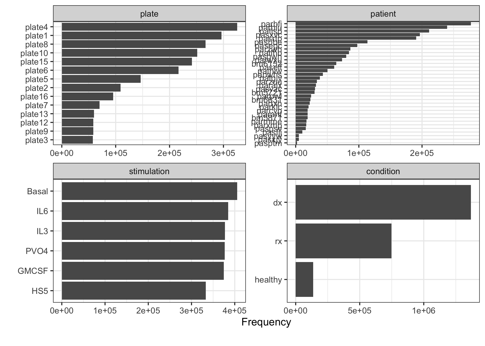
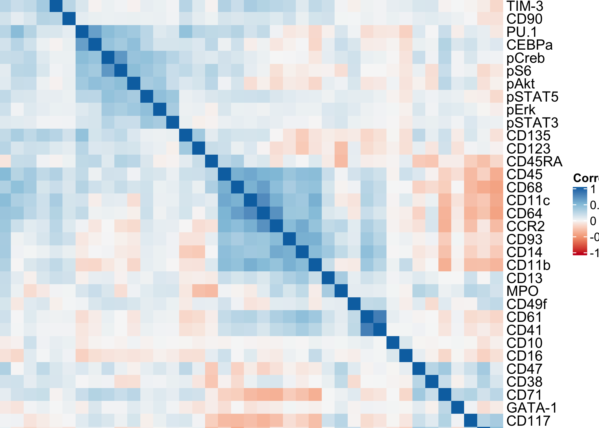
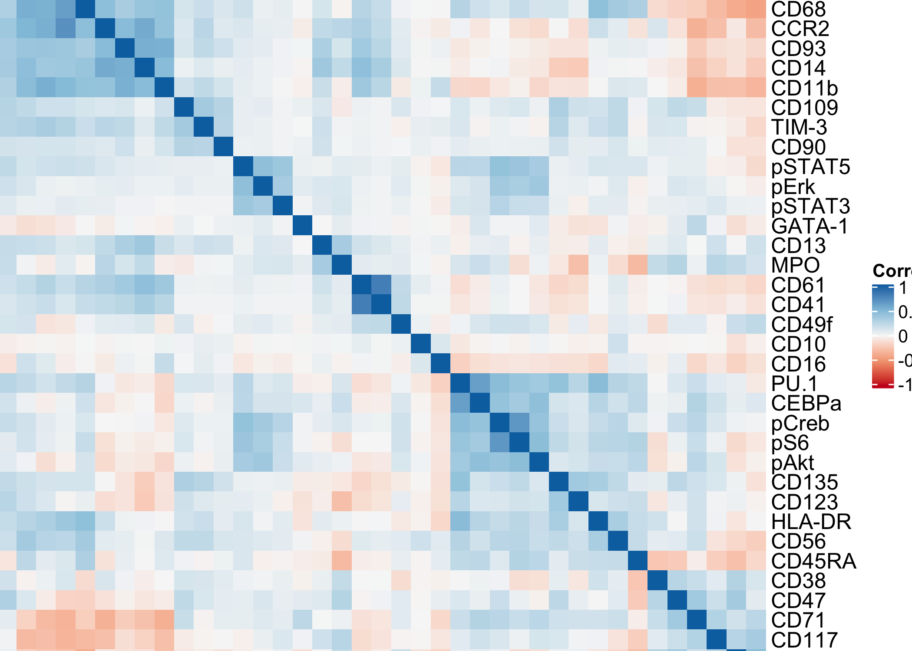
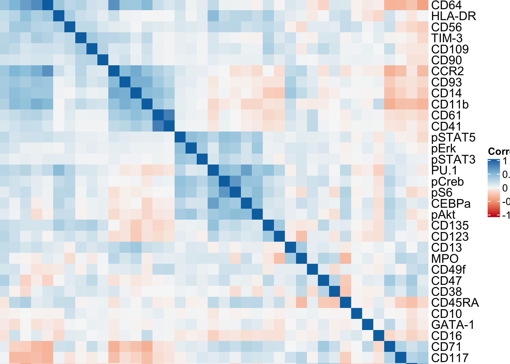
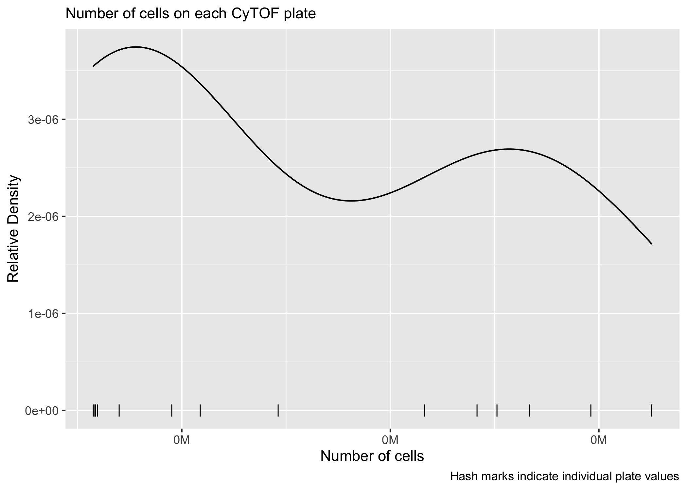
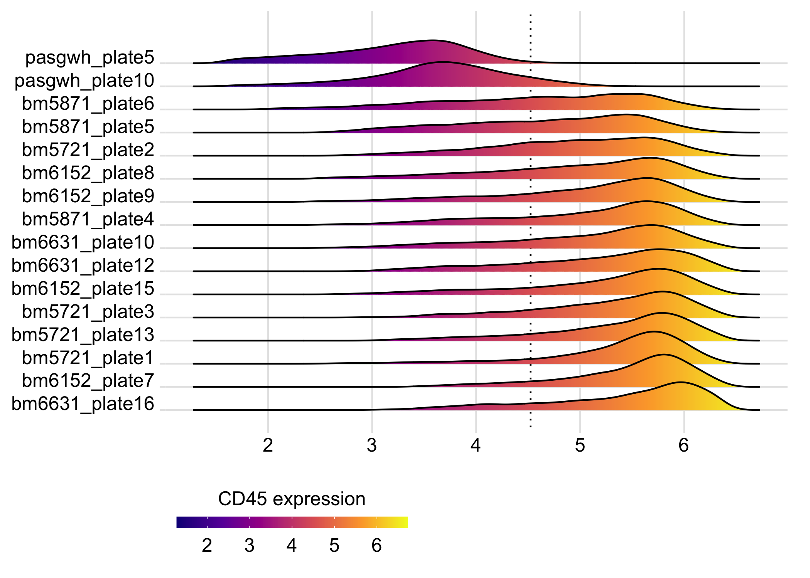
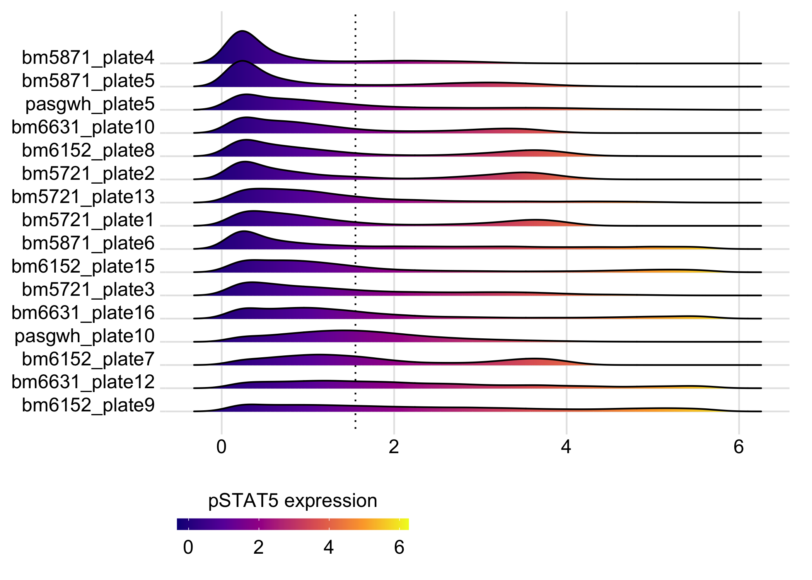
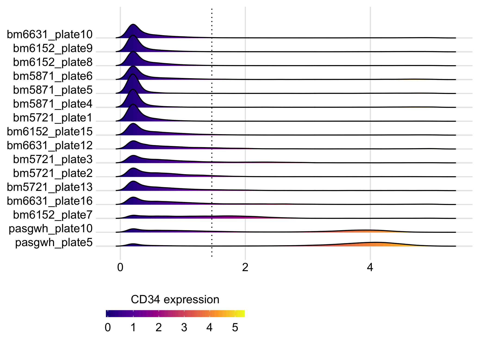
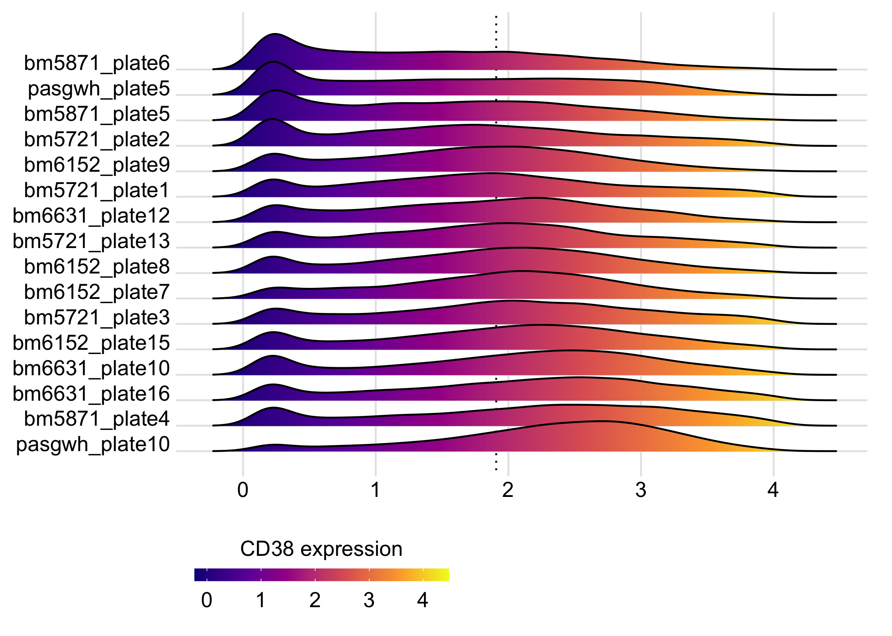
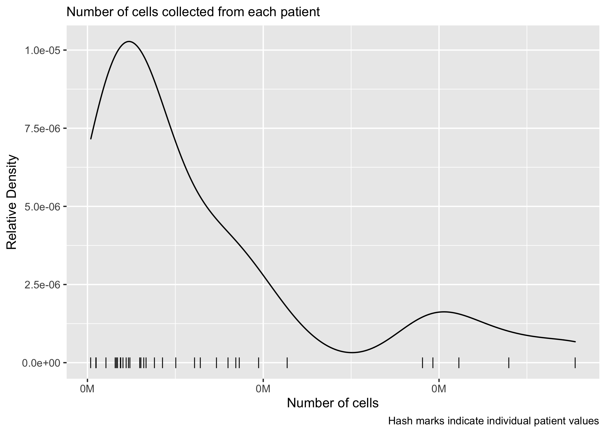

Intro AML Vignette
================
tkeyes
2020-10-05

  - [Executive Summary](#executive-summary)
      - [Read in metadata](#read-in-metadata)
      - [Read in single-cell data](#read-in-single-cell-data)
          - [From scratch](#from-scratch)
          - [From .rds file](#from-.rds-file)
          - [Compare metadata and single-cell
            data](#compare-metadata-and-single-cell-data)
          - [Pre-process](#pre-process)
      - [Data quality and univariate
        distributions](#data-quality-and-univariate-distributions)
          - [Introduction to the data](#introduction-to-the-data)
          - [By plate](#by-plate)
          - [By patient](#by-patient)
          - [By patient (comparing patients with both Dx and
            Rx)](#by-patient-comparing-patients-with-both-dx-and-rx)
          - [By stimulation (surface)](#by-stimulation-surface)
      - [Classifier](#classifier)
      - [Clustering](#clustering)
      - [Feature extraction](#feature-extraction)
      - [Modeling](#modeling)
      - [Dimensionality reduction](#dimensionality-reduction)

# Executive Summary

In this vignette, we read in and preprocess AML data from .fcs files. We
also provide the option to make histograms representing the number of
cells from each sample and their marker expression values.

``` r
# Libraries
library(flowCore)
library(tidyverse)
library(readxl)
library(ggridges)
library(rlang)
library(ggthemes)
library(DataExplorer)
library(ComplexHeatmap)
library(foreach)
library(parallel)

# Parameters
source(here::here("scripts", "setup", "aml_utils.R")) #may need to change on scg machines
set_global_variables(locale = "galaxia")

tidyTOF_directory <- file.path("~", "GitHub", "tidyTOF")
md_path <- here::here("data-raw", "AML_metadata.xlsx")

# Sourcing tidyTOF functions
source_tidyTOF(tidyTOF_directory)

# set up aml marker and patient information
marker_setup()
patient_setup()

# globals for running different parts of this vignette
is_sampled <- TRUE
generate_histograms <- FALSE #if yes, will generate many histograms for each marker
```

## Read in metadata

``` r
md <- 
  md_path %>% 
  read_excel() %>% 
  mutate(
    Patient = Patient %>% str_to_lower()
  ) %>% 
  janitor::clean_names(case = "snake")

md %>% 
  write_rds(path = here::here("data", "md.rds"))
```

## Read in single-cell data

### From scratch

``` r
source(file.path(CODE_DIRECTORY, "io", "aml_read_data.R"))
```

### From .rds file

``` r
data_path <- 
  file.path(
    DATA_DIRECTORY, 
    if_else(!is_sampled, "aml_data_raw.rds", "aml_data_raw_sampled.rds")
  )

aml_data <- 
  data_path %>% 
  read_rds() %>% 
  ungroup() %>% 
  mutate(cell_id = as.character(1:n()))
```

### Compare metadata and single-cell data

``` r
print(
  str_glue(
    "Patients in MD but not in single-cell data: \n {my_patients} \n",
    my_patients = str_c(setdiff(md$patient,str_to_lower(aml_data$patient)), collapse = " ")
  )
)
```

    ## Patients in MD but not in single-cell data: 
    ##  pasbbe pasltf pasvpj patast patiak

``` r
print(
  str_glue(
    "Patients in single-cell data but not in MD: \n {my_patients} \n",
    my_patients = str_c(setdiff(str_to_lower(aml_data$patient), md$patient), collapse = " "), 
  )
)
```

    ## Patients in single-cell data but not in MD: 
    ##  bm5721 bm6631 bm6152 bm5871 pasbee pastrp

Thus, we can see that several patients in the single-cell data set have
to be renamed in order to match the metadata.

``` r
aml_data <- 
  aml_data %>% 
  mutate(
    patient = 
      recode(patient, PASBEE = "pasbbe", PASTRP = "pasrtp") %>% 
      str_to_lower(), 
    plate = factor(plate, levels = str_c("plate", 1:16))
  )
```

And now we check the names again…

``` r
print(
  str_glue(
    "Patients in MD but not in single-cell data: \n {my_patients} \n",
    my_patients = str_c(setdiff(md$patient,str_to_lower(aml_data$patient)), collapse = " ")
  )
)
```

    ## Patients in MD but not in single-cell data: 
    ##  pasltf pasvpj patast patiak

``` r
print(
  str_glue(
    "Patients in single-cell data but not in MD: \n {my_patients} \n",
    my_patients = str_c(setdiff(str_to_lower(aml_data$patient), md$patient), collapse = " "), 
  )
)
```

    ## Patients in single-cell data but not in MD: 
    ##  bm5721 bm6631 bm6152 bm5871

And we can see that there are some patients that included in the
metadata that we have no single-cell data for. We also see that we have
no metadata for the 4 healthy samples (the names that take the form
`bm####`), which is expected.

### Pre-process

Using `tof_preprocess()`, we can easily preprocess the data using
several different procedures.

With arcsinh transformation and removal of added noise:

``` r
aml_data_p <- 
  aml_data %>% 
  tof_preprocess()
```

With arcsinh transformation and removal of added noise, plus
scaling/centering:

``` r
ps_fun <- function(x) { 
  x %>% 
    {asinh(x = ./5)} %>% 
    scale() %>% 
    as.numeric()
}

aml_data_ps <- 
  aml_data %>% 
  tof_preprocess(transform_fun = ps_fun)
```

With removal of added noise and rank transformation (similar to
“cytoDx”):

``` r
aml_data_r <-
  aml_data %>%
  tof_preprocess(transform_fun = rank)
```

We can then save our pre-processed data. In the saved files, ‘p’
indicates standard preprocessing with the arcsinh transformation, ‘s’
indicates scaling, and ‘r’ indicates the rank transformation.

``` r
ls() %>% 
  str_subset(pattern = "aml_data_.") %>% 
  walk(
    .f = ~ get(.x) %>% 
      write_rds(
        path = 
          file.path(
            DATA_DIRECTORY, 
            str_c(if_else(is_sampled, "sampled_", ""), .x, ".rds")
          )
      )
  )
```

## Data quality and univariate distributions

### Introduction to the data

First, we use the `{{DataExplorer}}` package to get to know the data a
bit.

``` r
plot_str(aml_data)
```

``` r
introduce(aml_data) %>% 
  pivot_longer(
    cols = everything(), 
    names_to = "dataset_feature", 
    values_to = "value"
  ) %>% 
  knitr::kable()
```

| dataset\_feature       |      value |
| :--------------------- | ---------: |
| rows                   |    2252598 |
| columns                |         51 |
| discrete\_columns      |          6 |
| continuous\_columns    |         45 |
| all\_missing\_columns  |          0 |
| total\_missing\_values |          0 |
| complete\_rows         |    2252598 |
| total\_observations    |  114882498 |
| memory\_usage          | 1036262920 |

Number of cells across all discrete features:

``` r
discrete_bars <- 
  plot_bar(aml_data, ggtheme = theme_bw(), nrow = 2L, ncol = 2L, parallel = TRUE) %>% 
  `$`(page_1) + 
  labs(y = "Number of cells")
```

    ## 2 columns ignored with more than 50 categories.
    ## file_names: 280 categories
    ## cell_id: 2252598 categories

<!-- -->

Correlation matrix for all protein measurements:

``` r
plot_channels <- 
  aml_data_p %>%
  summarize(across(one_of(ALL_MARKERS), mean)) %>% 
  pivot_longer(cols = everything(), names_to = "channel", values_to = "mean") %>% 
  arrange(desc(mean)) %>% 
  pull(channel)

aml_data_p %>% 
  select(one_of(plot_channels), -CD3_CD19, -`caspase-3`) %>% 
  cor() %>% 
  Heatmap(
    col = 
      circlize::colorRamp2(
        breaks = seq(-1, 1, 0.5), 
        RColorBrewer::brewer.pal(n = 5, name = "RdBu")
      ),
    heatmap_legend_param = list(title = "Correlation"), 
    width = unit(15, "cm"), 
    height = unit(15, "cm")
  )
```

<!-- -->

``` r
aml_data_p %>% 
  select(one_of(plot_channels), -CD3_CD19, -`caspase-3`) %>% 
  cor() %>% 
  Heatmap(
    col = 
      circlize::colorRamp2(
        breaks = seq(-1, 1, 0.5), 
        RColorBrewer::brewer.pal(n = 5, name = "RdBu")
      ),    
    clustering_distance_rows = "pearson", 
    clustering_distance_columns = "pearson",
    heatmap_legend_param = list(title = "Correlation"), 
    width = unit(15, "cm"), 
    height = unit(15, "cm")
  )
```

<!-- -->

``` r
aml_data_p %>% 
  select(one_of(plot_channels), -CD3_CD19, -`caspase-3`) %>% 
  cor() %>% 
  Heatmap(
    col = 
      circlize::colorRamp2(
        breaks = seq(-1, 1, 0.5), 
        RColorBrewer::brewer.pal(n = 5, name = "RdBu")
      ),
    clustering_distance_rows = "manhattan", 
    clustering_distance_columns = "manhattan",
    heatmap_legend_param = list(title = "Correlation"), 
    width = unit(15, "cm"), 
    height = unit(15, "cm")
  )
```

<!-- -->

### By plate

#### Number of cells

``` r
aml_data %>% 
  count(plate) %>% 
  arrange(desc(n)) %>% 
  knitr::kable()
```

| plate   |      n |
| :------ | -----: |
| plate4  | 325311 |
| plate1  | 296185 |
| plate8  | 266811 |
| plate10 | 251265 |
| plate15 | 241653 |
| plate6  | 216484 |
| plate5  | 146190 |
| plate2  | 108977 |
| plate16 |  95298 |
| plate7  |  70029 |
| plate13 |  59715 |
| plate12 |  58654 |
| plate9  |  58412 |
| plate3  |  57614 |

``` r
aml_data %>% 
  count(plate) %>% 
  ggplot(aes(x = n)) + 
  geom_density() + 
  geom_point(aes(x = n, y = 0), size = 3, shape = "|") + 
  scale_x_continuous(
    labels = scales::label_number(accuracy = 1, scale = 1e-6, suffix = "M")
  ) +
  scale_y_continuous() + 
  labs(
    subtitle = "Number of cells on each CyTOF plate", 
    caption = "Hash marks indicate individual plate values", 
    x = "Number of cells", 
    y = "Relative Density"
  )
```

<!-- -->

#### Univariate histograms

``` r
if (generate_histograms) {
  aml_data_p %>% 
    tof_plot_all_histograms(
      group_var = plate, 
      out_path = file.path(HISTOGRAM_OUTPUT, "p"), 
      label_prefix = str_c(if_else(is_sampled, "sampled_", ""), "aml_data_p"),  
      label_suffix = "hist_by_plate.pdf", 
      width = 6,
      height = 10,
      device = "pdf"
    )
  
  aml_data_p %>% 
    filter(condition == "healthy") %>% 
    tof_plot_all_histograms(
      group_var = plate, 
      out_path = file.path(HISTOGRAM_OUTPUT, "p"), 
      label_prefix = str_c(if_else(is_sampled, "sampled_", ""), "aml_data_p_healthy"), 
      label_suffix = "hist_by_plate.pdf", 
      width = 6, 
      height = 10,
      device = "pdf"
    )
  
  aml_data_ps %>% 
    tof_plot_all_histograms(
      group_var = plate, 
      out_path = file.path(HISTOGRAM_OUTPUT, "ps"), 
      label_prefix = str_c(if_else(is_sampled, "sampled_", ""), "aml_data_ps"), 
      label_suffix = "hist_by_plate.pdf", 
      width = 6, 
      height = 10,
      device = "pdf"
    )
  
  aml_data_ps %>% 
    filter(condition == "healthy") %>% 
    tof_plot_all_histograms(
      group_var = plate, 
      out_path = file.path(HISTOGRAM_OUTPUT, "ps"), 
      label_prefix = str_c(if_else(is_sampled, "sampled_", ""), "aml_data_ps_healthy"), 
      label_suffix = "hist_by_plate.pdf", 
      width = 6, 
      height = 10,
      device = "pdf"
    )
}
```

#### By plate (comparing patients on more than one plate)

``` r
my_patients <- 
  aml_data %>% 
  count(patient, plate) %>% 
  select(-n) %>% 
  count(patient) %>% 
  filter(n > 1) %>% 
  pull(patient)

aml_data_p %>% 
  filter(patient %in% my_patients) %>% 
  mutate(patient_plate = str_c(patient, plate, sep = "_")) %>% 
  tof_histogram(channel_var = CD45, group_var = patient_plate, ordered = TRUE) + 
  labs(y = NULL)
```

<!-- -->

``` r
aml_data_p %>% 
  filter(patient %in% my_patients) %>% 
  mutate(patient_plate = str_c(patient, plate, sep = "_")) %>% 
  tof_histogram(channel_var = pSTAT5, group_var = patient_plate, ordered = TRUE) + 
  labs(y = NULL)
```

<!-- -->

``` r
aml_data_p %>% 
  filter(patient %in% my_patients) %>% 
  mutate(patient_plate = str_c(patient, plate, sep = "_")) %>% 
  tof_histogram(channel_var = CD34, group_var = patient_plate, ordered = TRUE) + 
  labs(y = NULL)
```

<!-- -->

``` r
aml_data_p %>% 
  filter(patient %in% my_patients) %>% 
  mutate(patient_plate = str_c(patient, plate, sep = "_")) %>% 
  tof_histogram(channel_var = CD38, group_var = patient_plate, ordered = TRUE) + 
  labs(y = NULL)
```

<!-- -->

### By patient

#### Cell counts

``` r
aml_data %>% 
  count(patient) %>% 
  knitr::kable()
```

| patient |      n |
| :------ | -----: |
| bm5721  |  29805 |
| bm5871  |  18832 |
| bm6152  |  64276 |
| bm6631  |  23359 |
| papwhs  |  42856 |
| parajx  |  32045 |
| parant  |  18942 |
| parbfj  | 277461 |
| parbiu  | 239711 |
| parcvp  |  18992 |
| parklc  |  20298 |
| parmme  |  17141 |
| parpwl  |  24291 |
| partxh  |  22165 |
| parwxu  |  73500 |
| parxmp  |  16586 |
| parzuu  |  33452 |
| parzwh  |  86506 |
| pasbbe  | 113623 |
| pasegc  |  97379 |
| paself  |  61071 |
| pasfjj  |  10570 |
| pasgwh  |  80036 |
| paspsv  |  15857 |
| pasptm  |   1920 |
| pasrtp  | 190647 |
| pasvzc  |  30490 |
| pasxjy  |   4885 |
| pasxvc  | 196573 |
| pasyyw  |   5013 |
| patgiy  |  38255 |
| pathiw  |  50260 |
| patjsp  | 211369 |
| patlhb  |  84432 |

``` r
aml_data %>% 
  count(patient) %>%
  ggplot(aes(x = n)) + 
  geom_density() + 
  geom_point(aes(x = n, y = 0), size = 3, shape = "|") + 
  scale_x_continuous(
    labels = scales::label_number(accuracy = 1, scale = 1e-6, suffix = "M")
  ) +
  scale_y_continuous() + 
  labs(
    subtitle = "Number of cells collected from each patient", 
    caption = "Hash marks indicate individual patient values", 
    x = "Number of cells", 
    y = "Relative Density"
  )
```

<!-- -->

#### Univariate histograms

``` r
if (generate_histograms) { 
  aml_data_p %>% 
    tof_plot_all_histograms(
      group_var = patient, 
      out_path = file.path(HISTOGRAM_OUTPUT, "p"), 
      label_prefix = str_c(if_else(is_sampled, "sampled_", ""), "aml_data_p"), 
      label_suffix = "hist_by_patient.pdf", 
      width = 6, 
      height = 10,
      device = "pdf",
      ordered = TRUE
    )
  
  
  aml_data_ps %>% 
    tof_plot_all_histograms(
      group_var = patient, 
      out_path = file.path(HISTOGRAM_OUTPUT, "ps"), 
      label_prefix = str_c(if_else(is_sampled, "sampled_", ""), "aml_data_ps"), 
      label_suffix = "hist_by_patient.pdf", 
      width = 6, 
      height = 10,
      device = "pdf", 
      ordered = TRUE
    )
}
```

### By patient (comparing patients with both Dx and Rx)

#### Cell counts

``` r
aml_data %>% 
  filter(patient %in% PAIRED_PATIENTS) %>% 
  count(patient, condition)
```

    ## # A tibble: 22 x 3
    ##    patient condition      n
    ##    <chr>   <chr>      <int>
    ##  1 parbiu  dx        109172
    ##  2 parbiu  rx        130539
    ##  3 parwxu  dx         33747
    ##  4 parwxu  rx         39753
    ##  5 parzuu  dx         29213
    ##  6 parzuu  rx          4239
    ##  7 pasgwh  dx         41728
    ##  8 pasgwh  rx         38308
    ##  9 pasrtp  dx         83931
    ## 10 pasrtp  rx        106716
    ## # … with 12 more rows

#### Univariate histograms

``` r
SIGNALING_MARKERS %>% 
  syms() %>% 
  map(
    ~ 
      tof_histogram_2(
        filter(aml_data_p, patient %in% PAIRED_PATIENTS), 
        channel_var = !!., 
        group_var = patient, 
        split_var = condition, 
        alpha = 0.5, 
        panel_scaling = FALSE
      ) + 
      facet_grid(cols = vars(stimulation))
  ) %>% 
  walk(print)
```

### By stimulation (surface)

``` r
if (generate_histograms) { 
  surface_plots <- 
    SURFACE_MARKERS %>% 
    syms() %>% 
    map(
      ~ 
        tof_histogram_2(
          aml_data_p, 
          channel_var = !!., 
          group_var = patient, 
          split_var = stimulation, 
          alpha = 0.5,
          ordered = TRUE,
          panel_scaling = FALSE
        ) 
    )
  
  surface_plots %>% 
    walk(print)
  
}
# legend <- surface_plots[[1]] %>% get_legend()
# 
# surface_plots[1:9] %>% 
#   map(~ . + theme(legend.position = "none")) %>% 
#   plot_grid(plotlist = ., align = "vh", ncol = 3) %>% 
#   plot_grid(., legend, nrow = 1, rel_widths = c(3, 0.3))
```

#### Cell counts

``` r
aml_data %>% 
  count(stimulation) %>% 
  knitr::kable()
```

| stimulation |      n |
| :---------- | -----: |
| Basal       | 405402 |
| GMCSF       | 374932 |
| HS5         | 332753 |
| IL3         | 377493 |
| IL6         | 385041 |
| PVO4        | 376977 |

#### Univariate histograms

``` r
if (generate_histograms) {
  
  aml_data_p %>% 
    tof_histogram(channel_var = CD45, group_var = stimulation, ordered = TRUE)
  
  aml_data_p %>% 
    tof_plot_all_histograms(
      group_var = stimulation, 
      out_path = file.path(HISTOGRAM_OUTPUT, "p"), 
      label_prefix = str_c(if_else(is_sampled, "sampled_", ""), "aml_data_p"), 
      label_suffix = "hist_by_stim.pdf", 
      width = 6, 
      height = 10,
      device = "pdf",
      ordered = TRUE
    )
  
  aml_data_p %>% 
    filter(condition == "healthy") %>% 
    tof_plot_all_histograms(
      group_var = stimulation, 
      out_path = file.path(HISTOGRAM_OUTPUT, "p"), 
      label_prefix = str_c(if_else(is_sampled, "sampled_", ""), "aml_data_p_healthy"), 
      label_suffix = "hist_by_stim.pdf", 
      width = 6, 
      height = 10,
      device = "pdf"
    )
  
  aml_data_ps %>% 
    tof_plot_all_histograms(
      group_var = stimulation, 
      out_path = file.path(HISTOGRAM_OUTPUT, "ps"), 
      label_prefix =  str_c(if_else(is_sampled, "sampled_", ""), "aml_data_ps"), 
      label_suffix = "hist_by_stim.pdf", 
      width = 6, 
      height = 10,
      device = "pdf", 
      ordered = TRUE
    )
  
  aml_data_ps %>% 
    filter(condition == "healthy") %>% 
    tof_plot_all_histograms(
      group_var = stimulation, 
      out_path = file.path(HISTOGRAM_OUTPUT, "ps"), 
      label_prefix =  str_c(if_else(is_sampled, "sampled_", ""), "aml_data_ps_healthy"), 
      label_suffix = "hist_by_stim.pdf", 
      width = 6, 
      height = 10,
      device = "pdf"
    )
}
```

## Classifier

## Clustering

## Feature extraction

## Modeling

## Dimensionality reduction

``` r
pca_recipe <- 
  recipe(~., data = aml_data_p) %>% 
  step_zv(all_numeric()) %>% 
  step_normalize(all_numeric()) %>% 
  step_pca(all_numeric(), num_comp = 5) 

pca_prep <- prep(pca_recipe)

pca_result <- juice(pca_prep)
```
