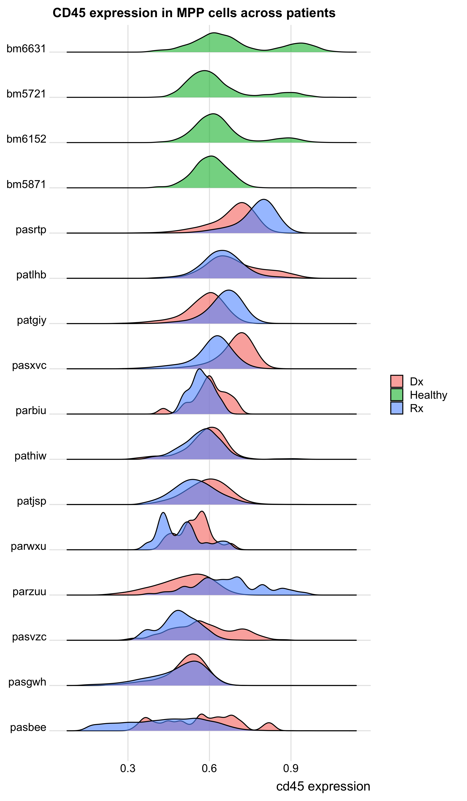
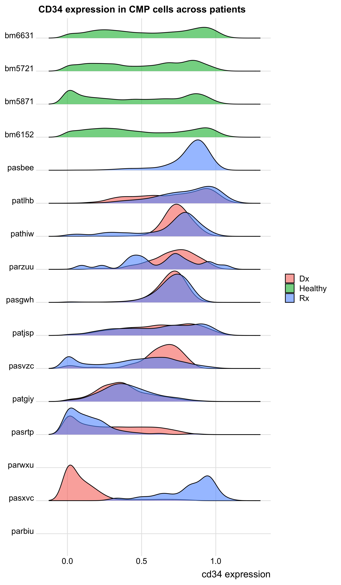
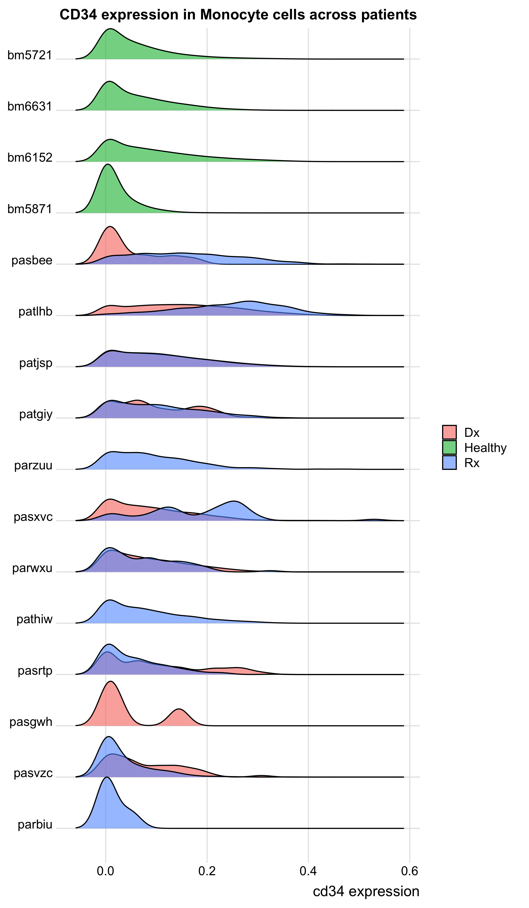
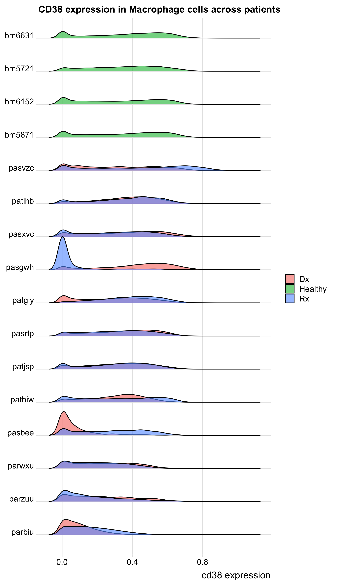
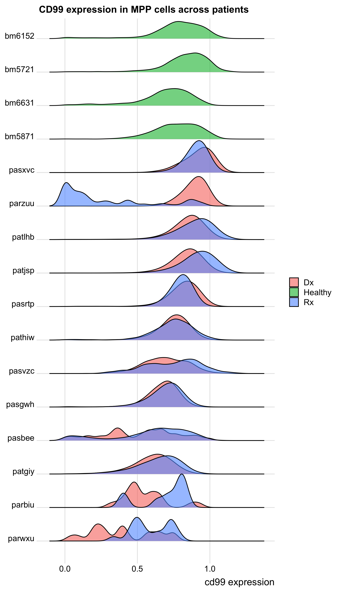
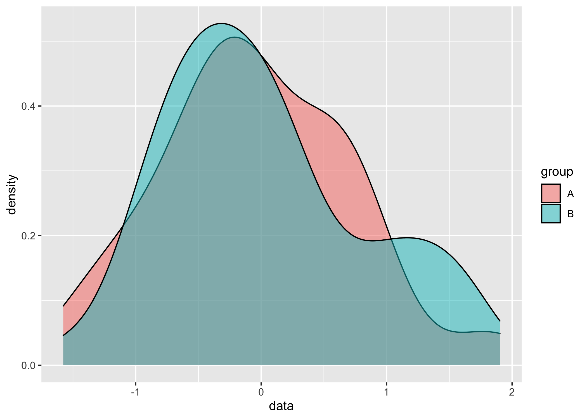
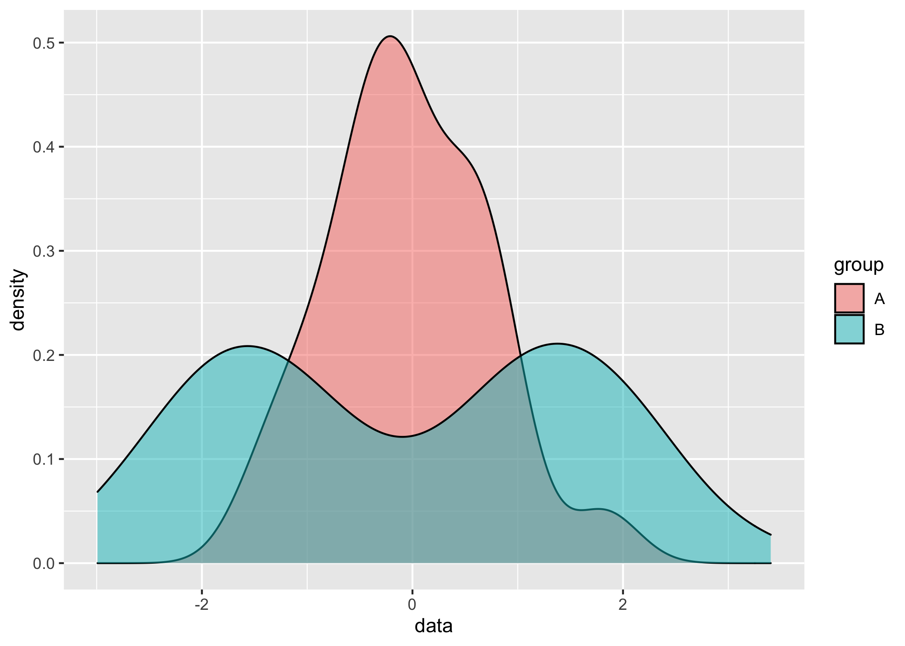

5/1/2020 Davis Lab Meeting
================

# Introduction

Today, I will be presenting several analyses that are a part of the AML
project’s ramping up to create a predictive model of relapse.

## Background

So far, I have focused my analyses on visualization and clustering,
mainly to “try out” many existing analysis methods that have come out of
the Davis and Nolan labs and applied to similar data to mine. These
include the following:

  - Visualization
      - PCA
      - tSNE
      - UMAP
  - Clustering
      - FlowSOM
      - PhenoGraph
      - Developmental Classifier

## Framework

At this stage, it is clear that none of these methods alone tell a
complete story re: my data, so I have moved on to the explicit `Feature
Engineering and Selection` stages of building a predictive model. Here
is a figure that summarizes some theory about exploratory data analysis
and its relationship to building good, reliable models:

<div class="figure">


<p class="caption">

From Feature Engineering & Selection by Max Kuhn and Kjell Johnson

</p>

</div>

## Outline

At this stage, I am somewhere between `b` and `c` and trying to figure
out how I’d like to engineer the features that I include in my model. So
far, I have focused on 3 kinds of features present in my data and am
trying to understand their general structure:

  - Population abundances
  - Cell surface marker expression
  - Signaling perturbation response

I will present some EDA about each of these feature types today.

# Data and Interpretation

## Population Abundances

``` r
# Libraries
library(tidyverse)
#library(CATALYST)

# Parameters
input_path <- here::here("data", "AML_matrix_clustered.rds")

CLASSIFIER_POPULATIONS <- 
  c(
    'HSC',
    'MPP',
    'CMP',
    'GMP',
    'MEP',                          
    'Monocyte', 
    'DC', 
    'Macrophage', 
    'Thrombocyte'
  )

#===============================================================================

#source necessary files
source('~/GitHub/aml-cells/scripts/setup/marker_setup.R')
source('~/GitHub/aml-cells/scripts/setup/patient_setup.R')
```

### Basic setup

Algorithm (in words):

  - Read in previously pre-processed data
      - arcsinh transform
      - compensation
      - filtered on `time` variable to remove weird CD34/CD38
        “debarcode-gate”
  - filter to only include paired samples (with both `Dx` and `Rx`
    present as well as healthy controls)

<!-- end list -->

``` r
#### set up global varibles
marker_setup()
patient_setup()

recode_vars <- 
  tibble(
    from = 1:length(CLASSIFIER_POPULATIONS), 
    to = CLASSIFIER_POPULATIONS
  ) %>% 
  deframe()

#read in paired data (and healthy data) 
aml_data <- 
  input_path %>% 
  read_rds() %>%
  mutate(
    patient = 
      patient %>% 
      as.character() %>% 
      str_to_lower() %>% 
      if_else(. == "pastrp", "pasrtp", .), 
    Mah.cluster = 
      recode(Mah.cluster, !!! recode_vars) %>% 
      factor(levels = CLASSIFIER_POPULATIONS)
  ) %>% 
  mutate_at(
    .vars = vars(phenograph.metacluster, FlowSOM.metacluster, kmeans.cluster),
    ~ (.) %>% 
      as.character() %>% 
      fct_reorder(., CD34, .fun = mean, .desc = FALSE)
  ) %>% 
  filter(patient %in% c(PAIRED_PATIENTS, HEALTHY_CONTROLS)) %>% 
  rename_at(
    vars(everything()), 
    ~ (.) %>% 
      str_to_lower() %>% 
      str_replace_all(pattern = "[:punct:]", replacement = "_")
  )
```

### Differential abundance visualization

#### Classifier populations

**In aggregate:**

Algorithm (in words):

  - For each patient and diagnostic condition (i.e. “Healthy”,
    “Diagnosis”, and “Relapse”), find the abundance of each classifier
    population (calculated using these markers):

| marker |
| :----- |
| CD45   |
| CD34   |
| CD38   |
| CD61   |
| CD14   |
| CD135  |
| CD45RA |
| CD90   |
| HLA-DR |
| CD41   |
| CD13   |
| CD11b  |
| CD11c  |

  - Find the mean and standard error of the mean for each population in
    each condition (across all patients)
  - Plot

<!-- -->

From this plot, as discussed before, we can see that primitive
populations (including HSC, MPP, CMP GMP, and MEP) are expanded in the
cancer samples relative to healthy patients. However, there don’t seem
to be many populations that are very different between diagnostic and
relapse samples at least in aggregate. However, we can take a closer
look by doing a patient-specific analysis…

**Patient by patient:**

``` r
patient_plot("mah_cluster")
```

<!-- -->

From these plots, a qualitative analysis might suggest that there are 3
main “types” of relationship between `diagnosis` and `relapse`
timepoints:

1)  **Patients who don’t seem to change much:** PARBIU, PATGIY, PATJSP,
    PARWXU, PATHIW
2)  **Patients who shift from 1 main population to another:** PARZUU,
    PASXVC, PASBEE
3)  **Patients with minor shifts (across multiple populations):**
    PASGWH, PASVZC, PASRTP, PATLHB

#### Phenograph populations

**In aggregate:**

Algorithm (in words):

  - For each patient and diagnostic condition (i.e. “Healthy”,
    “Diagnosis”, and “Relapse”), find the abundance of each phenograph
    population (calculated using all surface markers, as done in the
    original Phenograph paper).

  - Find the mean and standard error of the mean for each population in
    each condition (across all patients).

  - Order the populations by mean `CD34` expression (used as a marker of
    immaturity in the original Phenograph paper)

  - Plot

<!-- end list -->

``` r
cluster_plot("phenograph_metacluster") + 
    labs(x = "Decreasing CD34 expression →")
```

<!-- -->

From this plot, we can see that most phenograph clusters don’t have SEM
error bars, indicating that they are only present in 1 patient in a
given diagnostic condition. For that reason, PhenoGraph clustering may
need to be run with alternative parameters if patient-to-patient
comparisons are to be made.

In addition, we can see that there isn’t quite as much specificity for
expansion in the “immature” compartment (i.e. the CD34-high compartment)
compared to the classifier’s immature populations. This is likely
because CD34 expression is really a “poor man’s” way to indicate
immaturity, and a more rigorous way of expressing this idea would be to
explicitly compute a pseudo-time axis of some kind.

#### FlowSOM populations

**In aggregate:**

Algorithm (in words):

  - For each patient and diagnostic condition (i.e. “Healthy”,
    “Diagnosis”, and “Relapse”), find the abundance of each FlowSOM
    population (calculated using all surface markers).

  - Find the mean and standard error of the mean for each population in
    each condition (across all patients).

  - Order the populations by mean `CD34` expression (used as a marker of
    immaturity in the original Phenograph paper)

  - Plot

<!-- end list -->

``` r
cluster_plot("flowsom_metacluster") + 
  theme(legend.position = c(0.92, 0.9)) + 
  labs(x = "Decreasing CD34 expression →")
```

<!-- -->

Here, we can see similar results to that found in the classifier:
several populations are expanded in the cancer samples relative to the
healthy samples, with 2 of them (8 and 1) reduced in the cancer samples
relative to the healthy samples overall.

Note that a simliar issue w.r.t. using `CD34` expression as a maturity
marker is seen as above.

**Patient-by-patient:**

When we look at similar plots on a patient-by-patient basis, we can see
that the same kinds of patterns between `diagnosis` and `relapse` time
points within a single patients are observed using FlowSOM clustering as
were observed using the classifier populations.

``` r
patient_plot("flowsom_metacluster") + 
  labs(x = "Decreasing CD34 expression →")
```

<!-- -->

Once again, our qualitative analysis might suggest that there are 3 main
“types” of relationship between `diagnosis` and `relapse` timepoints:

2)  **Patients who don’t seem to change much:** PARBIU, PATGIY, PATJSP,
    PARWXU, PATHIW
3)  **Patients who shift from 1 main population to another:** PARZUU,
    PASXVC, PASBEE
4)  **Patients with minor shifts (across multiple populations):**
    PASGWH, PASVZC, PASRTP, PATLHB

### Conclusions

  - Abundances of different cell populations are likely to be
    informative features in a predictive model of relapse, as difference
    between patients (and between time points) suggest a role in relapse
    biology

  - There is variability between patients (i.e. 3 types of patient) re:
    shifts in population abundance from diagnosis to relapse. This may
    indicate that a model that can take into account the relationships
    between populations may capture more relevant information than one
    that only considers them independently (the current gold standard).

  - Pseudo-time calculations among healthy and cancer cell populations
    may yield a relevant feature for modeling (interaction term, see
    point above) or may simply help with visualization.

  - Statistics to evaluate the descriptive differences above would be
    nice. Currently, I am evaluating between the two main approaches
    that people use for single-cell data:
    
      - SAM-like permutation tests.
      - Linear mixed models (i.e. `diffcyt` and `limma` packages).

## Cell surface marker expression

``` r
# Libraries
library(tidyverse)
library(ggridges)

# Parameters
input_path <- here::here("data", "AML_matrix_clustered.rds")

CLASSIFIER_POPULATIONS <- 
  c(
    'HSC',
    'MPP',
    'CMP',
    'GMP',
    'MEP',                          
    'Monocyte', 
    'DC', 
    'Macrophage', 
    'Thrombocyte'
  )

#===============================================================================

#source necessary files
source('~/GitHub/aml-cells/scripts/setup/marker_setup.R')
source('~/GitHub/aml-cells/scripts/setup/patient_setup.R')
```

## Basic setup

Algorithm (in words):

  - Read in previously pre-processed data
      - arcsinh transform
      - compensation
      - filtered on `time` variable to remove weird CD34/CD38
        “debarcode-gate”
  - filter to only include paired samples (with both `Dx` and `Rx`
    present as well as healthy controls)

<!-- end list -->

``` r
#### set up global varibles
marker_setup()
patient_setup()

recode_vars <- 
  tibble(
    from = 1:length(CLASSIFIER_POPULATIONS), 
    to = CLASSIFIER_POPULATIONS
  ) %>% 
  deframe()

#read in paired data (and healthy data) 
aml_data <- 
  input_path %>% 
  read_rds() %>%
  mutate(
    patient = 
      patient %>% 
      as.character() %>% 
      str_to_lower() %>% 
      if_else(. == "pastrp", "pasrtp", .), 
    Mah.cluster = 
      recode(Mah.cluster, !!! recode_vars) %>% 
      factor(levels = CLASSIFIER_POPULATIONS)
  ) %>% 
  mutate_at(
    .vars = vars(phenograph.metacluster, FlowSOM.cluster, FlowSOM.metacluster),
    ~ (.) %>% 
      as.character() %>% 
      fct_reorder(., CD34, .fun = mean, .desc = TRUE)
  ) %>% 
  dplyr::filter(patient %in% c(PAIRED_PATIENTS, HEALTHY_CONTROLS)) %>% 
  rename_at(
    vars(everything()), 
    ~ (.) %>% 
      str_to_lower() %>% 
      str_replace_all(pattern = "[:punct:]", replacement = "_")
  )
```

## Cluster to cluster across patients

``` r
cluster_column <- "mah_cluster"
marker <- "cd45"

clusters_across_patients <- function(cluster_column, marker) {
  
  map(
    levels(aml_data[[cluster_column]]), 
    function(cluster_type) {
      patient_levels <- 
        aml_data %>% 
        dplyr::filter(!! sym(cluster_column) == cluster_type) %>% 
        group_by(
          metacondition = if_else(condition == "Healthy", "Healthy", "Cancer"),
          patient
        ) %>% 
        summarize(median = median(!! sym(marker))) %>% 
        ungroup() %>% 
        arrange(metacondition, median) %>% 
        pull(patient)
      
      aml_data %>% 
        dplyr::filter(!! sym(cluster_column) %in% cluster_type) %>% 
        dplyr::filter(stimulation == "Basal") %>% 
        mutate(
          metacondition = 
            if_else(condition == "Healthy", "Healthy", "Cancer") %>% 
            as.factor(), 
          patient = factor(patient, levels = patient_levels)
        ) %>% 
        ggplot(aes(x = !! sym(marker), y = patient, fill = condition)) + 
        geom_density_ridges(scale = 1, alpha = 0.6) + 
        coord_cartesian(clip = "off") + 
        theme_ridges() + 
        labs(
          title = str_c(
            str_to_upper(marker), 
            " expression in ", 
            cluster_type, 
            " cells across patients"
          ), 
          x = str_c(marker, " expression"), 
          y = NULL,
          fill = NULL
        )
    }
  )
}
```

### CD45

``` r
cd45_mah_cluster_plots <- clusters_across_patients("mah_cluster", "cd45")

cd45_mah_cluster_plots %>% 
  walk(print)
```

    ## Picking joint bandwidth of 0.0211

<!-- -->

    ## Picking joint bandwidth of 0.0181

<!-- -->

    ## Picking joint bandwidth of 0.0133

<!-- -->

    ## Picking joint bandwidth of 0.0142

<!-- -->

    ## Picking joint bandwidth of 0.0185

<!-- -->

    ## Picking joint bandwidth of 0.0159

<!-- -->

    ## Picking joint bandwidth of 0.0177

<!-- -->

    ## Picking joint bandwidth of 0.0151

<!-- -->

    ## Picking joint bandwidth of 0.0377

<!-- -->

-----

### CD34

``` r
cd34_mah_cluster_plots <- clusters_across_patients("mah_cluster", "cd34")

cd34_mah_cluster_plots %>% 
  walk(print)
```

    ## Picking joint bandwidth of 0.0213

<!-- -->

    ## Picking joint bandwidth of 0.0256

<!-- -->

    ## Picking joint bandwidth of 0.0414

<!-- -->

    ## Picking joint bandwidth of 0.0277

<!-- -->

    ## Picking joint bandwidth of 0.0423

<!-- -->

    ## Picking joint bandwidth of 0.0195

<!-- -->

    ## Picking joint bandwidth of 0.0202

<!-- -->

    ## Picking joint bandwidth of 0.0101

<!-- -->

    ## Picking joint bandwidth of 0.0716

<!-- -->

-----

### CD38

``` r
cd38_mah_cluster_plots <- clusters_across_patients("mah_cluster", "cd38")

cd38_mah_cluster_plots %>% 
  walk(print)
```

    ## Picking joint bandwidth of 0.0436

<!-- -->

    ## Picking joint bandwidth of 0.0263

<!-- -->

    ## Picking joint bandwidth of 0.0225

<!-- -->

    ## Picking joint bandwidth of 0.0262

<!-- -->

    ## Picking joint bandwidth of 0.021

<!-- -->

    ## Picking joint bandwidth of 0.0437

<!-- -->

    ## Picking joint bandwidth of 0.0376

<!-- -->

    ## Picking joint bandwidth of 0.0248

<!-- -->

    ## Picking joint bandwidth of 0.0578

<!-- -->

-----

### CD90

``` r
cd90_mah_cluster_plots <- clusters_across_patients("mah_cluster", "cd90")

cd90_mah_cluster_plots[1:2] %>% 
  walk(print)
```

    ## Picking joint bandwidth of 0.105

<!-- -->

    ## Picking joint bandwidth of 0.0272

<!-- -->

-----

### CD93

``` r
cd93_mah_cluster_plots <- clusters_across_patients("mah_cluster", "cd93")

cd93_mah_cluster_plots[1:2] %>% 
  walk(print)
```

    ## Picking joint bandwidth of 0.0272

<!-- -->

    ## Picking joint bandwidth of 0.0144

<!-- -->

-----

### CD99

``` r
cd99_mah_cluster_plots <- clusters_across_patients("mah_cluster", "cd99")

cd99_mah_cluster_plots[1:2] %>% 
  walk(print)
```

    ## Picking joint bandwidth of 0.033

<!-- -->

    ## Picking joint bandwidth of 0.035

<!-- -->

-----

### pSTAT5

``` r
pstat5_mah_cluster_plots <- clusters_across_patients("mah_cluster", "pstat5")

pstat5_mah_cluster_plots[1:3] %>% 
  walk(print)
```

    ## Picking joint bandwidth of 0.0278

<!-- -->

    ## Picking joint bandwidth of 0.0185

<!-- -->

    ## Picking joint bandwidth of 0.019

<!-- -->

-----

### pSTAT3

``` r
pstat3_mah_cluster_plots <- clusters_across_patients("mah_cluster", "pstat3")

pstat3_mah_cluster_plots[1:3] %>% 
  walk(print)
```

    ## Picking joint bandwidth of 0.0174

<!-- -->

    ## Picking joint bandwidth of 0.00936

<!-- -->

    ## Picking joint bandwidth of 0.048

<!-- -->

-----

#### Conclusions

  - Univariate analyses don’t indicate any particular marker as “leaping
    out” as particularly higher or lower in relapse samples relative to
    healthy samples (to be expected)

  - Often, magnitudes and even directions of up- or down-regulation are
    not consistent between diagnostic-relapse pairs.

  - Marker distributions within a patient and population seem to stay
    relatively constant for surface markers, but less so for functional
    markers (again, perhaps to be expected). So, our model should
    probably not extract the mean or median of the signaling
    distributions for fear of losing whatever differences are present.

  - Classifier population marker distributions can vary quite a bit from
    patient to patient.

  - Some markers are not very highly expresssed at all. This is evidence
    that the panel can still be optimized (FYI: Astraea and I have
    already worked on this quite a bit for AML panel 2.0)

  - Differences across the board are likely to be very nuanced. Perhaps
    patient-level features will not capture this: should the model
    operate on the single-cell level?

## Signaling perturbation response

``` r
# Libraries
library(magrittr)
library(tidyverse)
library(EMDomics)
library(Rtsne)
library(pheatmap)

# Parameters
input_path <- here::here("data", "AML_matrix_clustered.rds")

CLASSIFIER_POPULATIONS <- 
  c(
    'HSC',
    'MPP',
    'CMP',
    'GMP',
    'MEP',                          
    'Monocyte', 
    'DC', 
    'Macrophage', 
    'Thrombocyte'
  )

#===============================================================================

#source necessary files
source('~/GitHub/aml-cells/scripts/setup/marker_setup.R')
source('~/GitHub/aml-cells/scripts/setup/patient_setup.R')
```

In this analysis, we take a look at the difference in the Earth Mover’s
Distance (Wasserstein Distance) between signaling parameters in our mass
cytometry AML dataset.

\#\#Background

Broadly speaking, the Earth Mover’s Distance (EMD) computes the “work”
needed to transform one distribution into another. In molecular/systems
biology, EMD is often used to compare marker distributions between
various conditions (diagnosis and relapse, treatment and not treatment,
stimulation vs. not stimulation, etc.).

Unlike traditional methods of comparing measurements of central tendency
(such as mean or median) between marker distributions in 1 or more
conditions, EMD takes into account that distributions may shift in
subtle ways: even if their means/medians do not change much, the
distributions may change a great deal in terms of how they are shaped
*outside* the areas of central tendency. For this reason, EMD is
generally preferable to using the mean/median when the distributions
you’re working with are irregularly shaped (for instance, highly
skewed or multimodal, since mean and median are generally less
informative in these kinds of distributions).

\*\[Add some citations to this section\]

Here, we will perform some EMD calculations and then manually
investigate signaling distributions between relapse and diagnostic
samples in pediatric AML that has been stimulated in several conditions
relative to baseline (`basal`):

  - IL-3
  - IL-6
  - GM-CSF
  - HS5 (stromal cell line) conditioned media
  - Pervandate (positive control)

## Basic setup

Algorithm (in words):

  - Read in previously pre-processed data
      - arcsinh transformation
      - compensation
      - filtered on `time` variable to remove weird CD34/CD38
        “debarcode-gate”
  - filter to only include paired samples (with both `Dx` and `Rx`
    present as well as healthy controls)

<!-- end list -->

``` r
#### set up global varibles
marker_setup()
patient_setup()

recode_vars <- 
  tibble(
    from = 1:length(CLASSIFIER_POPULATIONS), 
    to = CLASSIFIER_POPULATIONS
  ) %>% 
  deframe()

#read in paired data (and healthy data) 
aml_data <- 
  input_path %>% 
  read_rds() %>%
  mutate(
    patient = 
      patient %>% 
      as.character() %>% 
      str_to_lower() %>% 
      if_else(. == "pastrp", "pasrtp", .), 
    Mah.cluster = 
      recode(Mah.cluster, !!! recode_vars) %>% 
      factor(levels = CLASSIFIER_POPULATIONS)
  ) %>% 
  mutate_at(
    .vars = vars(phenograph.metacluster, FlowSOM.cluster, FlowSOM.metacluster),
    ~ (.) %>% 
      as.character() %>% 
      fct_reorder(., CD34, .fun = mean, .desc = TRUE)
  ) %>% 
  filter(patient %in% c(PAIRED_PATIENTS, HEALTHY_CONTROLS)) %>% 
  rename_at(
    vars(everything()), 
    ~ (.) %>% 
      str_to_lower() %>% 
      str_replace_all(pattern = "[:punct:]", replacement = "_")
  )
```

## Testing our implementation of EMD

First, we simulate some data from two conditions (`A` and `B`) to make
sure that we find a difference \> 0.

Note that the distibutions are drawn from populations with the same mean
and sd, indicating that even with highly similar characteristics
overall, EMD can find subtle differences.

``` r
sim_data <- 
  tibble(
    data = rnorm(100), 
    sample_name = paste("sample", 1:100), 
    group = c(rep("A", 50), rep("B", 50))
  )

ggplot(sim_data, aes(data, fill = group)) + geom_density(alpha = 0.5)
```

<!-- -->

``` r
calculate_emd_gene(
  vec = setNames(sim_data$data, sim_data$sample_name), 
  outcomes = setNames(sim_data$group, sim_data$sample_name), 
  sample_names = sim_data$sample_name, 
  binSize = 0.1
) %>% 
  knitr::kable()
```

|    x |
| ---: |
| 1.46 |

We can also show that, if we translate population `B` gradually larger
distances from population A, we will return higher EMD values (as
expected).

``` r
tibble(
  added_value = 0:10, 
) %>% 
  mutate(
    emd = 
      map_dbl(
        added_value, 
        ~ sim_data %>% 
          mutate(data = if_else(group == "A", data + 0, data + .x)) %>% 
          summarize(
            emd = 
              calculate_emd_gene(
                vec = setNames(data, sample_name),
                outcomes = setNames(group, sample_name), 
                sample_names = sample_name, 
                binSize = 0.1
              )
          ) %>% 
          pull(emd)
      )
  ) %>% 
  knitr::kable()
```

| added\_value |   emd |
| -----------: | ----: |
|            0 |  1.46 |
|            1 |  9.98 |
|            2 | 19.98 |
|            3 | 29.98 |
|            4 | 39.98 |
|            5 | 49.98 |
|            6 | 59.98 |
|            7 | 69.98 |
|            8 | 79.98 |
|            9 | 89.98 |
|           10 | 99.98 |

And we can see that the more we add to the distribution for `B`, the
higher the EMD we get (as expected).

We can also illustrate that two distributions with the same mean and
median but with different shapes can give us a positive EMD (even when
other metrics will not show observable differences):

``` r
sim_data %>% 
  arrange(data) %>% 
  transmute(
    data = c(data[group == "A"] + 1.5, data[group == "A"] - 1.5), 
    sample_name = str_c("sample", 101:200),
    group = "B"
  ) %>% 
  bind_rows(
    sim_data[1:50,]
  ) %T>% 
  (function(.x) {
    my_plot <- 
      ggplot(data = .x, aes(x = data, fill = group)) + 
      geom_density(alpha = 0.5) 
      print(my_plot)
  }
  ) %>% 
  summarize(
    emd = 
      calculate_emd_gene(
                vec = setNames(data, sample_name),
                outcomes = setNames(group, sample_name), 
                sample_names = sample_name, 
                binSize = 0.1
      ), 
    mean_difference = 
      (.) %>% 
      filter(group == "A") %>% 
      pull(data) %>% 
      mean() - 
      (.) %>% 
      filter(group == "B") %>% 
      pull(data) %>% 
      mean(), 
    median_difference = 
      (.) %>% 
      filter(group == "A") %>% 
      pull(data) %>% 
      median() - 
      (.) %>% 
      filter(group == "B") %>% 
      pull(data) %>% 
      median()
  ) %>% 
  knitr::kable()
```

<!-- -->

| emd | mean\_difference | median\_difference |
| --: | ---------------: | -----------------: |
| 7.3 |                0 |        \-0.0633103 |

Note that the emd value is **not** zero even though the differences in
means is 0 (and the median difference is very small), indicating that
emd is a better metric for detecting differences in population
distributions when distributions are irregular.

## Stimulation relative to basal in Dx and Rx pairs

Our simulated data indicate that the implementation of EMD that we’re
using passes some basic sanity checks. Now, we apply it to the AML
dataset.

``` r
stim_names <- 
  aml_data$stimulation %>% 
  unique() %>% 
  as.character()

# input: data frame of stimulation conditions representing a single sample 
# output: two-column tibble: 
#         - stimulation = names of stimulation conditions
#         - emd = EMD corresponding to that stimulation condition relative to basal
aml_emd <- function(data) {
  map_dfr(
    .x = 
      unique(data$stimulation) %>% 
      as.character(), 
    .f = 
      ~ if (.x == "Basal") {
        return(tibble(stimulation = "Basal", emd = 0))
      }
    else { 
      result <- 
        data %>% 
        filter(stimulation %in% c("Basal", .x)) %>% 
        summarize(
          emd = 
            calculate_emd_gene(
              vec = setNames(expression, cell_id), 
              outcomes = setNames(stimulation, cell_id), 
              sample_names = cell_id, 
              binSize = (max(expression) - min(expression)) / 200
            ), 
          stimulation = .x
        )
      return(result)
    }
  )
}


aml_emds <- 
  aml_data %>% 
  mutate(cell_id = 1:nrow(aml_data)) %>% 
  select(
    one_of(
      str_to_lower(SIGNALING_MARKERS), 
      "stimulation", 
      "cell_id", 
      "patient", 
      "condition"
    )
  ) %>% 
  pivot_longer(
    cols = one_of(str_to_lower(SIGNALING_MARKERS)), 
    names_to = "marker", 
    values_to = "expression"
  ) %>% 
  group_by(patient, condition, marker) %>% 
  nest() %>% 
  mutate(
    emds = map(data, aml_emd), 
    mean_difference = 
      map2(
        .x = data, 
        .y = emds,
        ~
        tibble(
          mean_difference = 
            (.) %>% 
            group_by(stimulation) %>% 
            summarize(expression = mean(expression)) %>% 
            pull(expression) - 
            (.) %>% 
            filter(stimulation == "Basal") %>% 
            pull(expression) %>% 
            mean(), 
          stimulation = .y %>% pull(stimulation)
        )
      )
  ) %>% 
  ungroup() %>% 
  transmute(
    patient, 
    condition,
    marker,
    data = 
      map(
        data, 
        ~ (.) %>% 
          group_by(stimulation = as.character(stimulation)) %>% 
          nest() %>% 
          ungroup()
      ), 
    data = 
      pmap(
        list(data, emds, mean_difference), 
        function(x, y, z) {
          x %>% 
            left_join(y, by = "stimulation") %>% 
            left_join(z, by = "stimulation")
        }
      )
  ) %>% 
  unnest(cols = data)
```

Thus, we have calculated all of the EMD scores for each stimulation
condition for each patient sample (diagnosis and relapse).

# Visualizing differences in signaling EMDs

## Dimensionality Reduction:

We can take the EMDs obtained for each sample and stick them together as
a vector - and these vectors can then be used for any dimensionality
reduction algorithms we choose for visualization. Let’s give a try to
PCA first…

``` r
emd_matrix <- 
  aml_emds %>% 
  pivot_wider(
    id_cols = c(patient, condition), 
    names_from = c(marker, stimulation), 
    values_from = emd
  ) %>% 
  select(-contains("Basal")) %>% 
  drop_na()

emd_matrix
```

    ## # A tibble: 27 x 32
    ##    patient condition pakt_GMCSF pakt_HS5 pakt_IL3 pakt_IL6 pakt_PVO4 pcreb_GMCSF
    ##    <chr>   <fct>          <dbl>    <dbl>    <dbl>    <dbl>     <dbl>       <dbl>
    ##  1 bm5721  Healthy        5.88     2.82     7.84     5.54       2.19       10.7 
    ##  2 bm5871  Healthy        2.64     0.419    4.51     2.30      10.1        24.0 
    ##  3 bm6152  Healthy        7.80     3.08     0.252   10.4        9.48        4.09
    ##  4 parbiu  Dx             4.57     2.71     6.97     1.35      13.4         9.43
    ##  5 parbiu  Rx             0.316    4.87     1.25     0.129     31.8         8.13
    ##  6 parwxu  Dx             0.601    1.67     2.23     0.792      3.46        3.93
    ##  7 parwxu  Rx             2.92     4.53     4.11     3.13      36.0         1.14
    ##  8 parzuu  Dx             0.632    2.31     2.07     0.471      9.84        6.45
    ##  9 parzuu  Rx             0.767    1.43     0.600    0.891      2.32        4.08
    ## 10 pasbee  Dx             1.63     1.12     1.34     0.753      1.26        3.06
    ## # … with 17 more rows, and 24 more variables: pcreb_HS5 <dbl>, pcreb_IL3 <dbl>,
    ## #   pcreb_IL6 <dbl>, pcreb_PVO4 <dbl>, perk_GMCSF <dbl>, perk_HS5 <dbl>,
    ## #   perk_IL3 <dbl>, perk_IL6 <dbl>, perk_PVO4 <dbl>, ps6_GMCSF <dbl>,
    ## #   ps6_HS5 <dbl>, ps6_IL3 <dbl>, ps6_IL6 <dbl>, ps6_PVO4 <dbl>,
    ## #   pstat3_GMCSF <dbl>, pstat3_HS5 <dbl>, pstat3_IL3 <dbl>, pstat3_IL6 <dbl>,
    ## #   pstat3_PVO4 <dbl>, pstat5_GMCSF <dbl>, pstat5_HS5 <dbl>, pstat5_IL3 <dbl>,
    ## #   pstat5_IL6 <dbl>, pstat5_PVO4 <dbl>

``` r
emd_pca <- 
  prcomp(
    x = emd_matrix %>% select(-patient, -condition), 
    scale = TRUE, 
    center = TRUE
  ) 

#calculate variance explained by first two principal components
var_explained <- 
  emd_pca$sdev^2 / sum(emd_pca$sdev^2)

emd_pca <- 
  emd_pca %>% 
  (function(.x) {.x$x}) %>% 
  as_tibble() %>% 
  select(PC1, PC2) %>% 
  bind_cols(emd_matrix)

emd_pca %>% 
  ggplot(aes(x = PC1, y = PC2, fill = condition)) + 
  geom_line(aes(group = patient), color = "gray60") + 
  geom_point(shape = 21, size = 2) + 
  scale_fill_discrete(
    breaks = c("Healthy", "Dx", "Rx"), 
    labels = c("Healthy", "Diagnosis", "Relapse")
  ) + 
  labs(
    x = str_glue("PC1 ({var}%)", var = (var_explained[[1]] * 100) %>% round(1)), 
    y = str_glue("PC2 ({var}%)", var = (var_explained[[2]] * 100) %>% round(1)), 
    fill = NULL
  )
```

<!-- -->

In general, it looks like the red (`Diagnosis`) dots are closer to the
healthy dots than the relapse ones, potentially indicating that relapse
samples have signaling pattern that is less similar to healthy signaling
than diagnostic samples.

However, we can also note that the variance explained by each principal
component is relatively low, indicating that our dataset is not super
well-represented in two linear dimensions. We can also give tSNE a shot
to see if it tells a different story…

``` r
set.seed(5)

emd_tsne <- 
  Rtsne(
    X = emd_matrix %>% select(-patient, -condition), 
    dims = 2, 
    perplexity = 7
  ) %>% 
  (function(.x) {.x$Y}) %>% 
  as_tibble() %>% 
  rename(tSNE1 = V1, tSNE2 = V2) %>% 
  bind_cols(emd_matrix)
```

    ## Warning: `as_tibble.matrix()` requires a matrix with column names or a `.name_repair` argument. Using compatibility `.name_repair`.
    ## This warning is displayed once per session.

``` r
emd_tsne %>% 
  ggplot(aes(x = tSNE1, y = tSNE2, fill = condition)) + 
  geom_line(aes(group = patient), color = "gray60") + 
  geom_point(shape = 21, size = 2) + 
  scale_fill_discrete(
    breaks = c("Healthy", "Dx", "Rx"), 
    labels = c("Healthy", "Diagnosis", "Relapse")
  ) + 
  labs(
    fill = NULL
  )
```

<!-- -->

In general, the same result seems to hold, although I’ll note that this
plot is very sensitive to perplexity and seed (because the number of
observations is relatively small).

## Custom plots and histograms

``` r
all_patients <- 
  aml_emds %>% 
  pull(patient) %>% 
  unique()

my_patient <- all_patients[[8]]

patient_plot <- function(my_patient) { 
  aml_emds %>%
    filter(patient == my_patient) %>% 
    
    ggplot(aes(x = condition, y = emd, fill = stimulation)) + 
    geom_line(aes(group = stimulation)) + 
    geom_point(shape = 21, size = 3) + 
    facet_grid(cols = vars(marker)) + 
    labs(title = my_patient)
}

all_patients %>% 
  map(patient_plot) %>% 
  walk(print)
```


And the overall plot…

``` r
aml_emds %>%
  filter(condition != "Healthy") %>% 
  group_by(stimulation, condition, marker) %>% 
  summarize(emd = mean(emd)) %>% 
  ggplot(aes(x = condition, y = emd, fill = stimulation)) + 
  geom_hline(
    aes(yintercept = healthy_mean, color = stimulation), 
    data = 
      aml_emds %>% 
      filter(condition == "Healthy") %>% 
      group_by(stimulation) %>% 
      summarize(healthy_mean = mean(emd)), 
    linetype = "dashed"
  ) + 
  geom_line(aes(group = stimulation)) + 
  geom_point(shape = 21, size = 3) + 
  facet_grid(cols = vars(marker)) + 
  labs(
    title = "Mean EMD for phosphosignals across all patients", 
    subtitle = "Note: Dotted lines indicate average in the healthy samples"
  )
```

<!-- -->

Future directions:

  - Look more closely at how Dana Pe’er’s lab has expressed EMD data
    visually and if there are any best practices re: handling the data
    that I may have missed.

  - Find a more intuitive way to plot the heatmap (I will use the
    `heatmaply` package, which I have [read good things
    about](https://cran.r-project.org/web/packages/heatmaply/vignettes/heatmaply.html))

  - Perform statistical tests to determine how the paired samples differ
    in a more quantitative way

# Recap / Take-home messages

  - Preliminary feature investigation supports the development of a
    model that operated on the single-cell level. 2 papers have done
    this so far for CyTOF data:
    
      - [This
        one](https://academic.oup.com/bioinformatics/article/35/7/1197/5088319)
        from Atul Butte’s lab uses two linear models in a row: one on
        the single-cell level and then one on the patient-level (using
        the results of the single-cell model).
      - {This one\](<https://www.nature.com/articles/ncomms14825>) from
        Manfred Claassen’s lab (Zurich) that uses a convolutional neural
        network. Very cool.

  - Signaling information can be effectively represented on the
    patient-level (either in modeling or for visualization) as
    earth-movers distances. What exactly this information is best used
    for is something I’m trying to figure out.

  - Biggest next-steps involve more EDA (across multiple categorical
    variables, i.e. patient/condition/cluster/stimulation) and
    development of a robust statistical testing pipeline for any
    differences that are observed (i.e. Tim has to develop a favorite
    methodolody for doing this).

  - For now, I am planning to build 2 kinds of models. 1 will operate at
    the patient level and will use engineered features. The other will
    be a neural network that automates the feature extraction process.
