Jazz differential discovery analysis
================

# Setup

``` r
# load utility functions
source(here::here("scripts", "setup", "aml_utils.R")) #may need to change on scg machines

# Libraries
libraries <- 
  c(
    "flowCore",
    "diffcyt",
    "SummarizedExperiment",
    "tidyverse", 
    "readxl", 
    "ggridges", 
    "rlang", 
    "ggthemes", 
    "DataExplorer",
    "ComplexHeatmap", 
    "foreach", 
    "doParallel", 
    "ggrepel", 
    "ggiraph", 
    "ggiraphExtra", 
    "FlowSOM", 
    "tidytof",
    "tidymodels", 
    "ggforce", 
    "lme4", 
    "Rtsne", 
    "umap", 
    "broomExtra", 
    "patchwork"
  )

call_libraries(libraries)


# Parameters
set_global_variables(locale = "galaxia")
is_sampled <- TRUE

# Paths
jazz_path <- file.path("~", "Box", "Tim", "Lab", "Data", "jazz_data")
healthy_path <- here::here("data-raw", "healthy_myeloid")
out_path <- here::here("reports", "jazz", "figures")

source('~/GitHub/aml-cells/scripts/feature_extraction/feature_extraction_utils.R')

# Misc. setup
marker_setup()
patient_setup()

CLASSIFIER_MARKERS <- 
  CLASSIFIER_MARKERS %>% 
  str_to_lower() %>% 
  str_remove(pattern = "-")

correction_factor <- 0.6
```

<div style="page-break-before: always;" />

# Reading in data

First, we read in the data - for this experiment, we have CyTOF data
collected from several primary patient AML samples that have been
treated for 0, 24, or 72 hours with [Jazz
Pharmaceutical](https://www.jazzpharma.com/)’s new FDA-approved drug
Vyxeos (daunorubicin and cytarabine).

We also read in some healthy reference data from a different set of
experiments in the Davis Lab (with a slightly different myeloid panel).
There are a variety of analyses that these healthy data can help us
with, like using the developmental classifier published
[here](https://pubmed.ncbi.nlm.nih.gov/29505032/).

To help with reading in the data, I’ll write a simple function that can
rename the columns in both data sets into something more human-readable
(because the names right off of the machine are sometimes a bit messy).

``` r
tof_names <- function(my_names) {
  my_names %>%
    str_remove(pattern = "-") %>% 
    str_to_lower() %>% 
    str_c("_", .) %>% 
    str_extract(pattern = "_[:alnum:]*$") %>% 
    str_remove(pattern = "_")
}
```

## Jazz data

First we read in the data collected from cancer samples treated with
Vyxeos.

``` r
jazz_data <- 
  jazz_path %>% 
  tof_read_fcs() %>% 
  # This is the line that I've added based on the panel analysis below! 
  mutate(`162Dy_CD38` = correction_factor * `162Dy_CD38`) %>% 
  tof_preprocess()

# store information about the panel used for the jazz data
jazz_panel <- 
  tibble(
    raw_names = colnames(jazz_data), 
    metal = 
      str_extract(raw_names, "[:alnum:]+_?") %>% 
      str_extract("[:digit:]+"), 
    jazz_marker = 
      str_extract(raw_names, "_[:alnum:]+") %>% 
      str_remove("_")
  ) %>% 
  select(-raw_names) %>% 
  drop_na(metal)

# read in jazz data
jazz_data <- 
  jazz_data %>% 
  rename_with(.fn = tof_names) %>% 
  select(-contains("bc")) %>% 
  mutate(
    patient = 
      str_extract(string = name, pattern = "_[:digit:]+") %>% 
      str_remove("_") %>% 
      replace_na("healthy"), 
    timepoint = 
      str_extract(string = name, pattern = "[:digit:]+hr") %>% 
      replace_na("healthy")
  )
```

## Healthy data

Next, we read in the data from healthy myeloid samples.

``` r
healthy_data <- 
  healthy_path %>% 
  tof_read_fcs() %>% 
  tof_preprocess() 

# store information about the panel used for the jazz data
healthy_panel <- 
  tibble(
    raw_names = colnames(healthy_data), 
    metal = 
      str_extract(raw_names, "[:alnum:]+_?") %>% 
      str_extract("[:digit:]+"), 
    healthy_marker = 
      str_extract(raw_names, "_[:alnum:]+") %>% 
      str_remove("_")
  ) %>% 
  select(-raw_names) %>% 
  drop_na(metal)

# finish preprocessing healthy data
healthy_data <- 
  healthy_data %>% 
  select(-contains("Pd"), -contains("157gd")) %>% 
  rename_with(.fn = tof_names) %>% 
  mutate(
    name = 
      name %>% 
      str_extract("[:alpha:]+.fcs$") %>% 
      str_remove(".fcs")
  ) %>% 
  rename(cell_type = name)
```

## What channels to the healthy data and the jazz data have in common?

When analyzing data collected from more than one CyTOF run, it’s
important to compare the panels used to collect both data sets.
Specifically, you should check the following:

1.  If the same markers are present in both/all panels
2.  If the same metals were paired with the same markers in both/all
    panels.

We look into the first issue here:

``` r
healthy_data %>% 
  colnames() %>% 
  setdiff(colnames(jazz_data))
```

    ##  [1] "127i"      "ccr2"      "cd64"      "cebpa"     "cd10"      "gata1"    
    ##  [7] "cd41"      "perk"      "cd109"     "191ir"     "193ir"     "cisplatin"
    ## [13] "cell_type"

``` r
jazz_data %>% 
  colnames() %>% 
  setdiff(colnames(healthy_data))
```

    ##  [1] "idu"        "cll1"       "prb"        "cyclinb1"   "cd32"      
    ##  [6] "pu1"        "pdl1"       "ph2ax"      "phh3"       "dna1"      
    ## [11] "dna2"       "viability"  "omiqfilter" "name"       "patient"   
    ## [16] "timepoint"

And we can see that there are a few markers that are present in the
healthy data panel that aren’t present in the jazz panel and vice-versa.

## Do both data sets contain the columns we need to perform the classification?

In this analysis specifically, we’re interested using the developmental
classifier, which uses the markers that I’ve saved in the global
variable `CLASSIFIER_MARKERS`. We can check that both the healthy and
Jazz data panels have all of these markers:

``` r
all(CLASSIFIER_MARKERS %in% colnames(healthy_data))
```

    ## [1] TRUE

``` r
all(CLASSIFIER_MARKERS %in% colnames(jazz_data))
```

    ## [1] FALSE

``` r
CLASSIFIER_MARKERS[!(CLASSIFIER_MARKERS %in% colnames(jazz_data))]
```

    ## [1] "cd41"

It looks like most of the markers are present in both panels, except the
Jazz data doesn’t have `CD41`. We can simply omit this marker from the
classification and proceed as normal.

``` r
CLASSIFIER_MARKERS <- CLASSIFIER_MARKERS[CLASSIFIER_MARKERS != "cd41"]
```

We should also check that the classifier markers in both panels are
paired with the same metal. If they aren’t, we will have to correct for
the differential sensitivity of the different metals in the CyTOF’s
detector..

``` r
panel_tibble <- 
  healthy_panel %>%
  full_join(jazz_panel) %>% 
  mutate(across(everything(), str_to_lower)) %>% 
  filter(
    (healthy_marker %in% CLASSIFIER_MARKERS) | 
      (jazz_marker %in% CLASSIFIER_MARKERS)
  )

panel_tibble %>% 
  knitr::kable()
```

| metal | healthy\_marker | jazz\_marker |
|:------|:----------------|:-------------|
| 89    | cd45            | cd45         |
| 113   | cd61            | cd61         |
| 139   | cd45ra          | cd45ra       |
| 146   | cd90            | cd90         |
| 147   | cd38            | cyclinb1     |
| 148   | cd34            | cd34         |
| 151   | cd11c           | cd11c        |
| 152   | cd13            | cd13         |
| 160   | cd14            | cd14         |
| 162   | gata            | cd38         |
| 170   | cd135           | cd135        |
| 174   | hla             | hladr        |
| 209   | cd11b           | cd11b        |

We can see that `CD38` is on different metals in the healthy data
compared to the jazz data. This means that we can try two approaches:
omitting it (and seeing what our accuracy on the healthy data is) or
trying a correction factor (see [this
paper](https://www.ncbi.nlm.nih.gov/pmc/articles/PMC6687300/)).

What I’ve done in this case is gone back to my code above and added a
correction factor to the pre-processing of the Jazz data (so nothing
else is needed here - see the comment in the preprocessing pipeline
above).

<div style="page-break-before: always;" />

# Clustering

After reading in and pre-processing the data, we want to cluster the
Jazz cells to perform differential discovery later in our analysis
pipeline. Here, we will explore two clustering methods:

-   [Developmental
    classification](https://pubmed.ncbi.nlm.nih.gov/29505032/) (using
    mahalanobis distance)

-   [FlowSOM](https://pubmed.ncbi.nlm.nih.gov/25573116/) clustering

We can then interrogate both of the clustering results manually to
decide which we will use throughout the remainder of our analysis.

## Developmental Classification

We start by using the developmental classifier described in Good et al.

### Build classifier

Because `CD38` was measured on different channels in the Jazz and
healthy reference data sets, an easy way to not worry about this problem
is simply to perform the classification without using `CD38` at all. So,
we can fit the classifier with and without `CD38` to see if its accuracy
is comparable (and if there isn’t a big change in accuracy when `CD38`
is removed, we can remove it without worrying).

First, we fit the developmental classifier without `CD38`.

``` r
classifier_markers <- 
  CLASSIFIER_MARKERS[CLASSIFIER_MARKERS != "cd38"]

classifier_markers
```

    ##  [1] "cd45"   "cd34"   "cd61"   "cd14"   "cd135"  "cd45ra" "cd90"   "hladr" 
    ##  [9] "cd13"   "cd11b"  "cd11c"

``` r
classifier_fit_no_cd38 <- 
  tidytof:::tof_classifier_build(
  tof_tibble = healthy_data, 
  population_vector = healthy_data$cell_type, 
  classifier_markers = classifier_markers
)
```

Then we fit it with `CD38`.

``` r
classifier_fit <- 
  tidytof:::tof_classifier_build(
    tof_tibble = healthy_data, 
    population_vector = healthy_data$cell_type, 
    classifier_markers = CLASSIFIER_MARKERS
  )
```

### Apply classifier

After fitting these two classifiers, we can then apply them to the
healthy data and compare their accuracies (relative to the gold standard
of manual gating).

First, we apply the classifier fit without `CD38`.

``` r
classifier_healthy_results_no_cd38 <- 
  tidytof:::tof_classifier_apply(
    tof_tibble = healthy_data, 
    classifier_fit = classifier_fit_no_cd38, 
    num_cores = 6, 
    parallel_var = cell_type
  )
```

Then, we apply the classifier fit without `CD38`.

``` r
classifier_healthy_results <- 
  tidytof:::tof_classifier_apply(
    tof_tibble = healthy_data, 
    classifier_fit = classifier_fit, 
    num_cores = 6, 
    parallel_var = cell_type
  )
```

Then, we can compare accuracies on the healthy data for the classifiers
that include and exclude CD38.

``` r
healthy_data <- 
  healthy_data %>% 
  mutate(
    cluster_no_cd38 = classifier_healthy_results_no_cd38$mahalanobis_cluster, 
    cluster = classifier_healthy_results$mahalanobis_cluster
  ) %>% 
  mutate(
    cell_type = factor(cell_type, levels = CLASSIFIER_POPULATIONS), 
    cluster_no_cd38 = factor(cluster_no_cd38, levels = CLASSIFIER_POPULATIONS), 
    cluster = factor(cluster, levels = CLASSIFIER_POPULATIONS)
  )

accuracy_no_cd38 <- 
  healthy_data %>% 
  group_by(cell_type) %>% 
  accuracy(truth = cell_type, estimate = cluster_no_cd38)

accuracy_with_cd38 <- 
  healthy_data %>% 
  group_by(cell_type) %>% 
  accuracy(truth = cell_type, estimate = cluster)
```

``` r
accuracy_no_cd38 %>% 
  knitr::kable()
```

| cell\_type  | .metric  | .estimator | .estimate |
|:------------|:---------|:-----------|----------:|
| HSC         | accuracy | multiclass | 0.9393842 |
| MPP         | accuracy | multiclass | 0.5215730 |
| CMP         | accuracy | multiclass | 0.8239872 |
| GMP         | accuracy | multiclass | 0.9705393 |
| MEP         | accuracy | multiclass | 0.8005520 |
| Monocyte    | accuracy | multiclass | 0.8577643 |
| DC          | accuracy | multiclass | 0.9453490 |
| Macrophage  | accuracy | multiclass | 0.8882588 |
| Thrombocyte | accuracy | multiclass | 0.9834695 |

``` r
accuracy_with_cd38 %>% 
  knitr::kable()
```

| cell\_type  | .metric  | .estimator | .estimate |
|:------------|:---------|:-----------|----------:|
| HSC         | accuracy | multiclass | 0.9571175 |
| MPP         | accuracy | multiclass | 0.8666981 |
| CMP         | accuracy | multiclass | 0.8943305 |
| GMP         | accuracy | multiclass | 0.9774658 |
| MEP         | accuracy | multiclass | 0.9160125 |
| Monocyte    | accuracy | multiclass | 0.8577318 |
| DC          | accuracy | multiclass | 0.9566391 |
| Macrophage  | accuracy | multiclass | 0.9178655 |
| Thrombocyte | accuracy | multiclass | 0.9835667 |

We can see that including CD38 is actually pretty important for the
accuracy of the MPP cell type in particular. So we should move forward
with the version that includes `CD38`.

``` r
jazz_classifier_results <- 
  tidytof:::tof_classifier_apply(
    tof_tibble = jazz_data, 
    classifier_fit = classifier_fit, 
    num_cores = 5, 
    parallel_var = patient
  )

jazz_data <- 
  jazz_data %>% 
  mutate(
    cluster = 
      jazz_classifier_results$mahalanobis_cluster %>% 
      factor(levels = CLASSIFIER_POPULATIONS)
  )
```

After applying this classifier to the full Jazz dataset, we can see that
we have the following breakdown of cells in each cluster:

``` r
jazz_data %>% 
  count(cluster) %>% 
  knitr::kable()
```

| cluster     |      n |
|:------------|-------:|
| HSC         |    755 |
| MPP         |  17343 |
| CMP         |  28659 |
| GMP         | 818255 |
| MEP         | 178127 |
| Monocyte    |  21051 |
| DC          |  10661 |
| Macrophage  | 395106 |
| Thrombocyte |      1 |

## FlowSOM clustering

An alternative to using the developmental clustering at all is simply to
use unsupervised (flowSOM) clustering directly on the Jazz dataset and
use those cluster labels to identify which cells are significantly
different (in cell abundance or cell state) across treatment timepoints.

``` r
# remove healthy cells that were collected with the jazz data
jazz_healthy <- 
  jazz_data %>% 
  filter(timepoint == "healthy")

jazz_data <- 
  jazz_data %>% 
  filter(timepoint != "healthy")

# perform the flowsom clustering on the jazz samples
set.seed(2021)
flowsom_results <- 
  jazz_data %>% 
  flowSOM_cluster(cluster_markers = CLASSIFIER_MARKERS)

jazz_data <- 
  jazz_data %>% 
  mutate(
    flowsom_clusters = as.factor(flowsom_results$my_clusters), 
    flowsom_metaclusters = as.factor(flowsom_results$my_metaclusters)
  )
```

And after the flowSOM cluster, we can see the following breakdown
between the metaclusters:

``` r
jazz_data %>% 
  count(flowsom_metaclusters) %>% 
  knitr::kable()
```

| flowsom\_metaclusters |      n |
|:----------------------|-------:|
| 1                     | 232995 |
| 2                     | 381862 |
| 3                     |  43348 |
| 4                     | 326170 |
| 5                     |  37855 |
| 6                     | 125923 |
| 7                     |  77211 |
| 8                     |  70417 |
| 9                     |  98946 |
| 10                    |   5942 |

One nice thing about the flowSOM metaclustering is that, while the
number of clusters is similar to the developmental clustering, the cells
are spread more evenly across them (which makes comparing between
clusters, patients, and samples a bit easier).

<div style="page-break-before: always;" />

# Exploratory Data Analysis

Now that we have some clustering results, we can do some exploratory
data analysis and visualization about what the clusters look like.
Specifically, we can answer the following questions:

1.  Did cells die over the course of Vyxeos treatment?
2.  Which cell types look like they died the most over the course of
    Vyxeos treatment?
3.  What markers seem to be associated with cell types that expanded (as
    opposed to contracted) over the course of Vyxeos treatment?

We explore each of these questions one at a time below.

## 1. Did cells die over the course of Vyxeos treatment?

``` r
all_props <- 
  jazz_data %>% 
  filter(timepoint != "healthy", cluster != "Thrombocyte") %>% 
  count(patient, timepoint)

all_first_timepoint <- 
  all_props %>% 
  filter(timepoint == "0hr") %>% 
  select(
    baseline_count = n, 
    patient
  )

all_props %>% 
  left_join(all_first_timepoint) %>% 
  mutate(
    raw_num = n, 
    n = n / baseline_count
  ) %>% 
  ggplot(aes(x = timepoint, y = n)) + 
  geom_hline(yintercept = 1, color = "red", linetype = "dashed") + 
  geom_line(aes(group = patient)) + 
  geom_point(aes(size = raw_num)) +
  scale_size_area(
    breaks = seq(0, 300000, 50000), 
    labels = scales::label_number(scale = 1/1000, suffix = "K")
  ) + 
  labs(
    subtitle = "Cell number per patient per timepoint", 
    x = "time point", 
    y = "Total cells (fold change of 0hr)",
    size = "Number of cells",
    caption = "Each line represents an individual patient"
  )
```

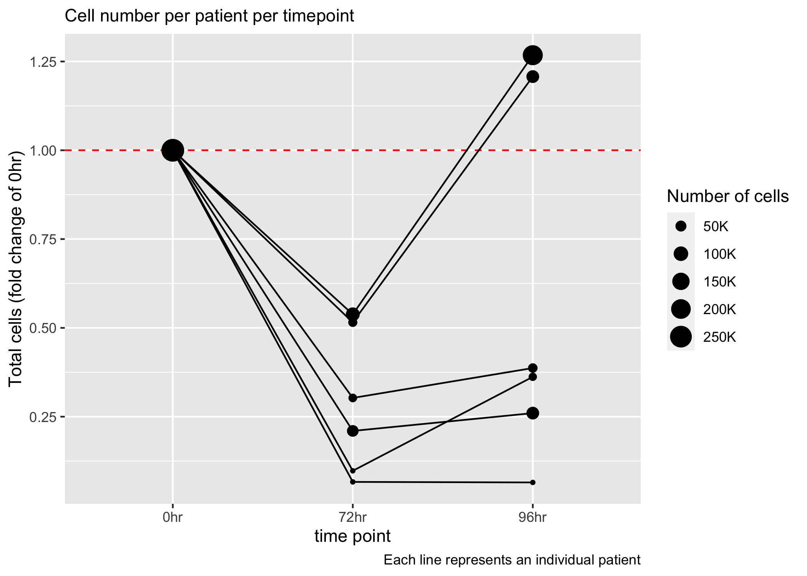<!-- -->

From this plot, we can see that in most patients, there is a 50%
reduction or more in acquired cell number in the first 72 hours after
treatment begins. This isn’t necessarily reflective of the exact
proportion of cells that died over the course of treatment (because the
vials were treated in parallel, not in series) but it should give a
broad sense of if the treatment worked (there should be fewer cells in
vials that were exposed to the treatment than cells that weren’t).

It doesn’t appear that there are further decreases from the 72hr to 96hr
timepoints, and in 2 patients there was actually a much larger number of
cells present at 96hr relative to either of the previous time points.

I’m not that sure what to make of the increases in cells overall in some
patients at the 96h timepoint, and I think there might be something
going on experimentally that I don’t have a lot of insight about. For
the rest of this analysis, I will compare the 0hr timepoint and the 72
hour timepoint, since that seems to be when most of the cell death
happens. From there, I can then compare the 72hr and 96hr timepoints to
see which cells persist (or expand), since that seems to be what’s
happening in the final day of treatment.

(Note: Jolanda mentioned that this rebound might be due to a need to
redose the drug at some point during the treatment period - and that the
cells rebounding at the later timepoint could simply be because the drug
is no longer present at an active concentration.)

## 2. Which cell types die over the course of treatment?

From here, we can start to ask ourselves not only if cells died over the
course of treatment, but which cell types died (or expanded)
preferentially.

First, a useful function to automate plotting.

``` r
# a function that plots the raw counts of cells in each cluster (collected across all patients)
# under a specific clustering approach (cluster_col)

# Input: cluster_col - an unquoted name of the column in jazz_data containing 
#                      the cluster IDs you want to visualize 
#
# Output: A line plot 

jazz_raw_cluster_plot <- function(cluster_col) {
  
  # save names of clusters that decrease over the treatment timeline
  clusters_that_decrease <- 
    jazz_data %>% 
    count(timepoint, {{cluster_col}}) %>% 
    pivot_wider(
      names_from = timepoint, 
      values_from = n 
    ) %>% 
    filter(`0hr` > `96hr`) %>% 
    pull({{cluster_col}})
  
  clusters_that_decrease
  
  # raw counts 
  raw_count_plot <- 
    jazz_data %>% 
    filter(timepoint != "healthy") %>% 
    count(timepoint, {{cluster_col}}) %>% 
    mutate(
      decrease = if_else({{cluster_col}} %in% clusters_that_decrease, "Decrease", "Increase")
    ) %>% 
    ggplot(aes(x = timepoint, y = n, color = {{cluster_col}}, fill = {{cluster_col}})) + 
    geom_line(aes(group = {{cluster_col}})) + 
    geom_point() + 
    labs(
      x = NULL, 
      y = "Number of cells", 
      caption = "Each line represents a cell subtype"
    )
  
  return(raw_count_plot)
}
```

### Developmental classifier

Using this function, we can look at how developmental subpopulations
changed over the course of treatment

``` r
raw_count_plot <- jazz_raw_cluster_plot(cluster_col = cluster)

raw_count_plot + 
  facet_wrap(facets = vars(cluster), scales = "free")
```

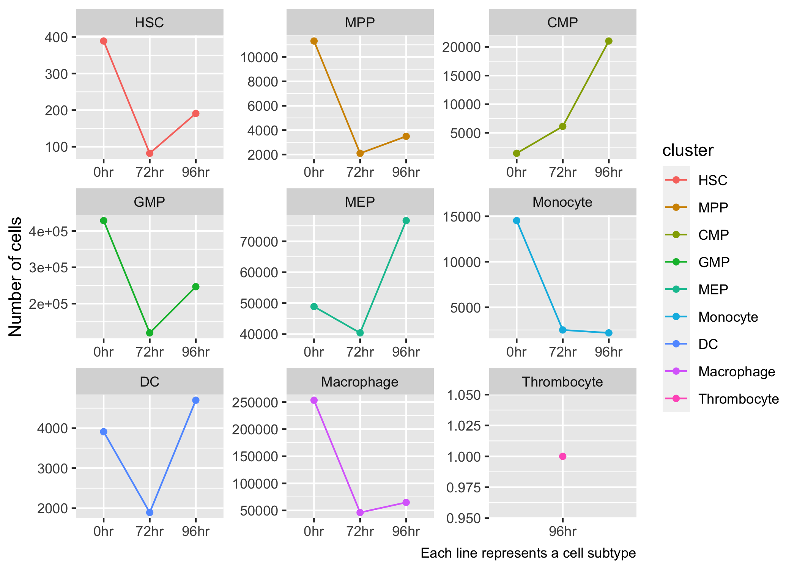<!-- -->

Using just these plots, it’s hard to draw any definitive conclusions
about which cell subtypes are most affected by treatment. That being
said, this eye-in-the-sky visualization (pooled across all patients) can
show us broad trends. Note that the axes for each plot are different
because certain subpopulations are much larger than others.

In general, there are a lot of cells in our dataset that end up getting
classified into the GMP-like subtype, which makes sense based on what we
know about AML blasts (and what their broad phenotype often looks like).
We can also see that most of the larger cell types seem to respond to
the treatment, but not necessarily equally. The most pronounced
decreases in cell presence are in Monocyte-like cells and
Macrophage-like cells, with HSC-like cells and MPP-like cells a close
second. The most pronounced increases in cell abundance seem to be in
CMP-like and MEP-like cells, with potentially DC-like and GMP-like cells
also expanding at later time points. We can also see that there aren’t
very many Thrombocyte-like cells in the dataset in general.

We can also look at this same pattern on a patient-specific basis.

``` r
# a function that plots the raw counts of cells in each cluster (collected across all patients) # under a specific clustering approach (cluster_col)

# Input: cluster_col - an unquoted name of the column in jazz_data containing 
#                      the cluster IDs you want to visualize 
#
# Output: A line plot 

jazz_patient_cluster_plot <- function(cluster_col, ncol, nrow) {
  props <- 
    jazz_data %>% 
    filter(timepoint != "healthy", {{cluster_col}} != "Thrombocyte") %>% 
    count(patient, timepoint, {{cluster_col}}) %>%
    group_by(patient, timepoint) %>%
    mutate(total = sum(n)) %>%
    mutate(across(where(is.numeric), ~ 100 * .x / total)) %>%
    select(-total) %>% 
    ungroup()
  
  first_timepoint <- 
    props %>% 
    filter(timepoint == "0hr") %>% 
    rename(baseline_count = n) %>% 
    ungroup() %>% 
    select(-timepoint)
  
  mean_first_timepoints <- 
    first_timepoint %>% 
    group_by({{cluster_col}}) %>% 
    summarize(mean_baseline = mean(baseline_count))
  
  my_plot <- 
    props %>% 
    left_join(first_timepoint) %>% 
    mutate(
      cluster = factor({{cluster_col}}, levels = CLASSIFIER_POPULATIONS), 
      #baseline_count = replace_na(baseline_count, replace = 5), 
      #n = n / baseline_count, 
      n = n - baseline_count
    ) %>% 
    ggplot(aes(x = timepoint, y = n, color = patient, fill = patient)) +
    geom_hline(
      yintercept = 0,
      linetype = "dashed"
    ) + 
    geom_line(aes(group = str_c(patient, {{cluster_col}}))) + 
    geom_point() + 
    labs(
      x = NULL,
      y = "Change in % of cells in the sample from 0hr"
    ) + 
    theme(legend.position = "none")
  
  num_pages <- 
    jazz_data %>% 
    pull({{cluster_col}}) %>% 
    unique() %>% 
    length()
  
  num_pages <- ceiling(num_pages / (ncol * nrow))
  
  props_plot <- 
    map(
      .x = 1:num_pages, 
      .f = ~ my_plot + 
        facet_wrap_paginate(
          facets = vars({{cluster_col}}), 
          scales = "free", 
          ncol = ncol, 
          nrow = nrow,
          page = .x
        )
    )
  
  return(props_plot)
  
}
```

``` r
jazz_patient_cluster_plot(cluster, ncol = 3, nrow = 3) %>% 
  walk(print)
```

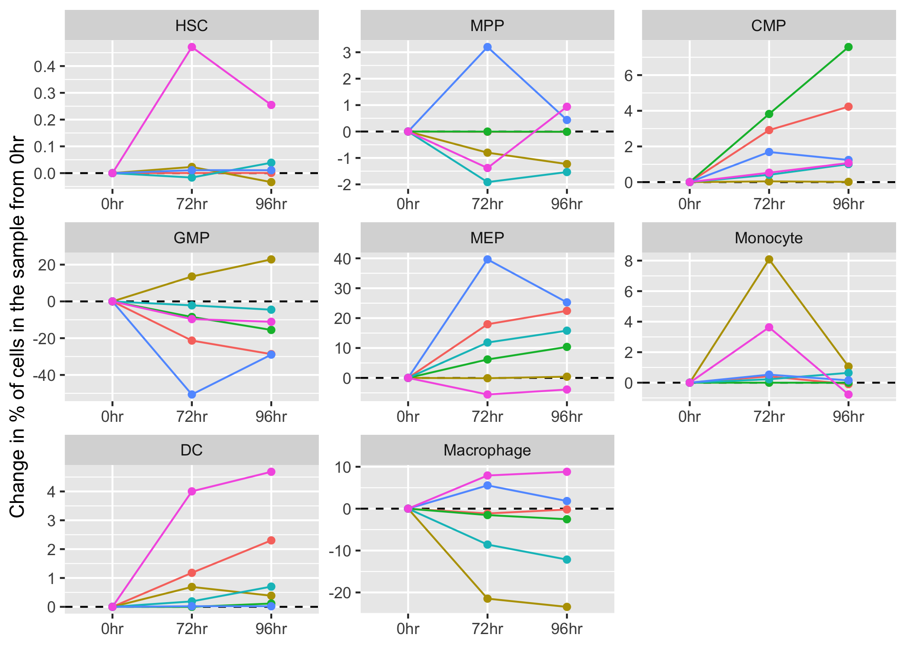<!-- -->

In general, we can see the same trends as observed above, with a high
degree of variability between patients (especially in HSC-like cells, a
very small cluster, and macrophage-like cells, a very heterogeneous
cluster).

### FlowSOM clustering

We can make the same plots as above, but using FlowSOM to identify
clusters instead of developmental classification/clustering.

``` r
flowsom_raw_cluster_plot <- 
  jazz_raw_cluster_plot(flowsom_clusters) + 
  theme(legend.position = "none")

flowsom_raw_cluster_plot
```

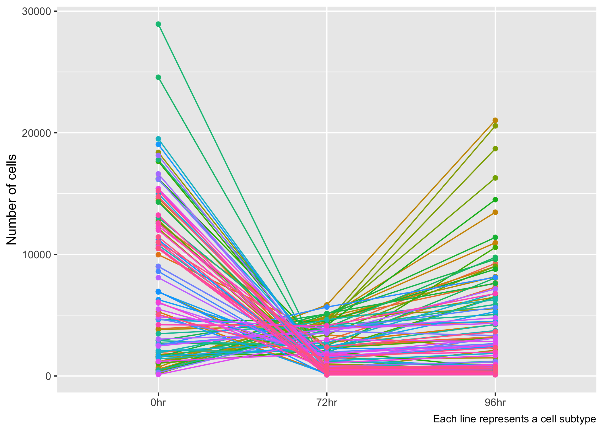<!-- -->

Using flowSOM clustering, we can see that there are clearly some
populations that are more present before treatment that then mostly die
over the course of treatment, whereas some populations are relatively
small before treatment but expand over the course of treatment. We can
get a slightly better look like this:

``` r
flowsom_raw_cluster_plot + 
  facet_grid(cols = vars(decrease)) +
  labs(y = "Number of cells")
```

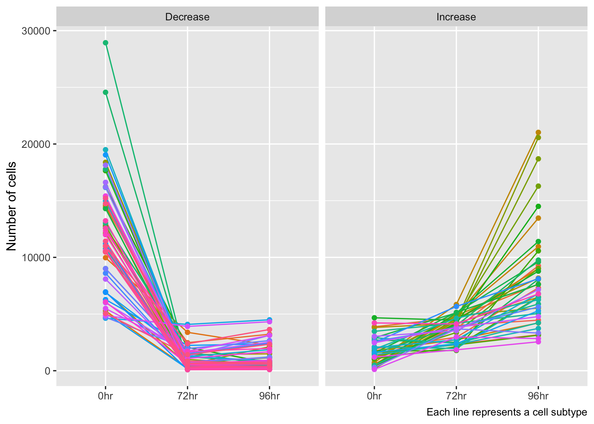<!-- -->

We can also look at the metaclusters that flowsom gives us to see if
there’s a simplified version of this story…

``` r
flowsom_metacluster_raw_cluster_plot <- 
  jazz_raw_cluster_plot(flowsom_metaclusters) + 
  theme(legend.position = "none")

flowsom_metacluster_raw_cluster_plot
```

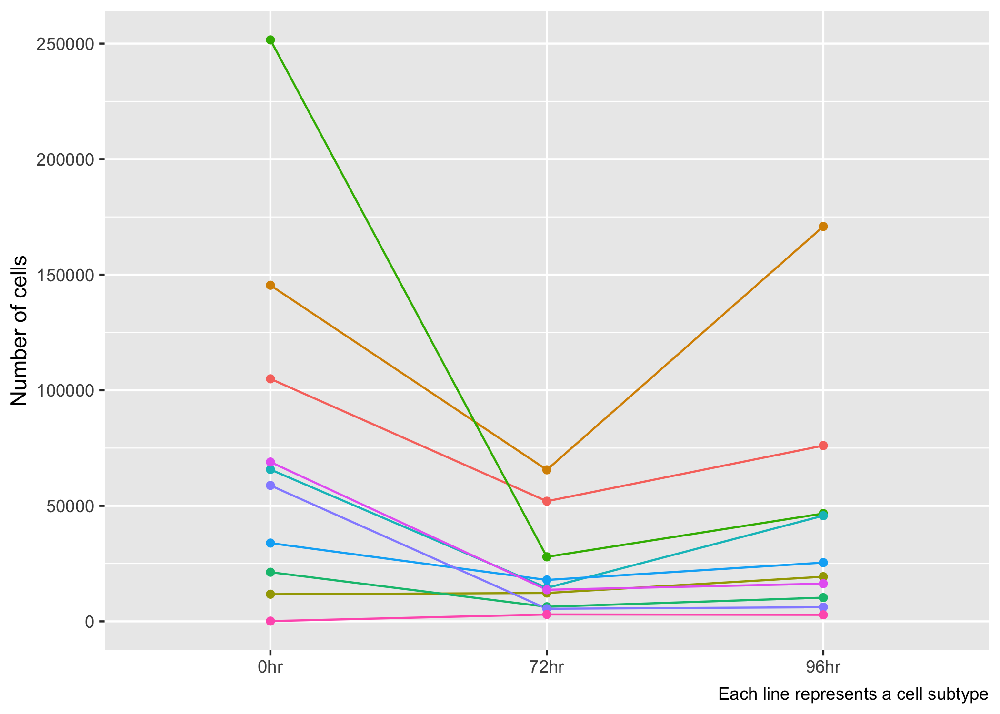<!-- -->

``` r
flowsom_metacluster_raw_cluster_plot + 
  facet_grid(cols = vars(decrease)) +
  labs(y = "Number of cells")
```

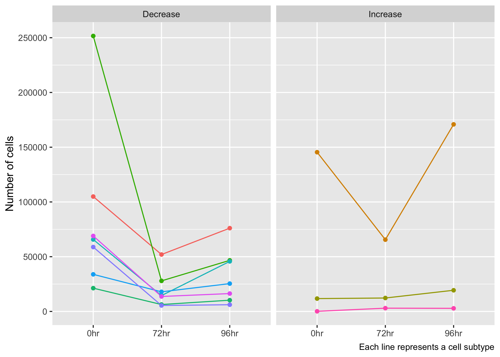<!-- -->

And it doesn’t really seem like there’s anything too interesting going
on here that wasn’t apparent from the individual clusters defined above
(in particular, it looks like the metaclustering may give us a **worse**
separation between which cells respond and don’t respond to the
treatment).

For a closer look, we can look at the patient-wise trends in each of
these clusters as well…

``` r
jazz_patient_cluster_plot(flowsom_clusters, nrow = 4, ncol = 4) %>% 
  walk(print)
```

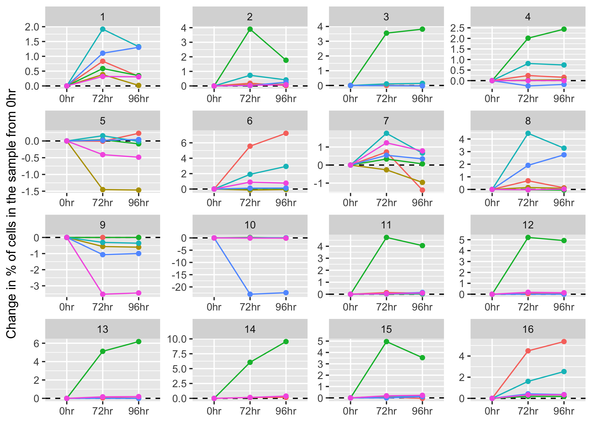<!-- -->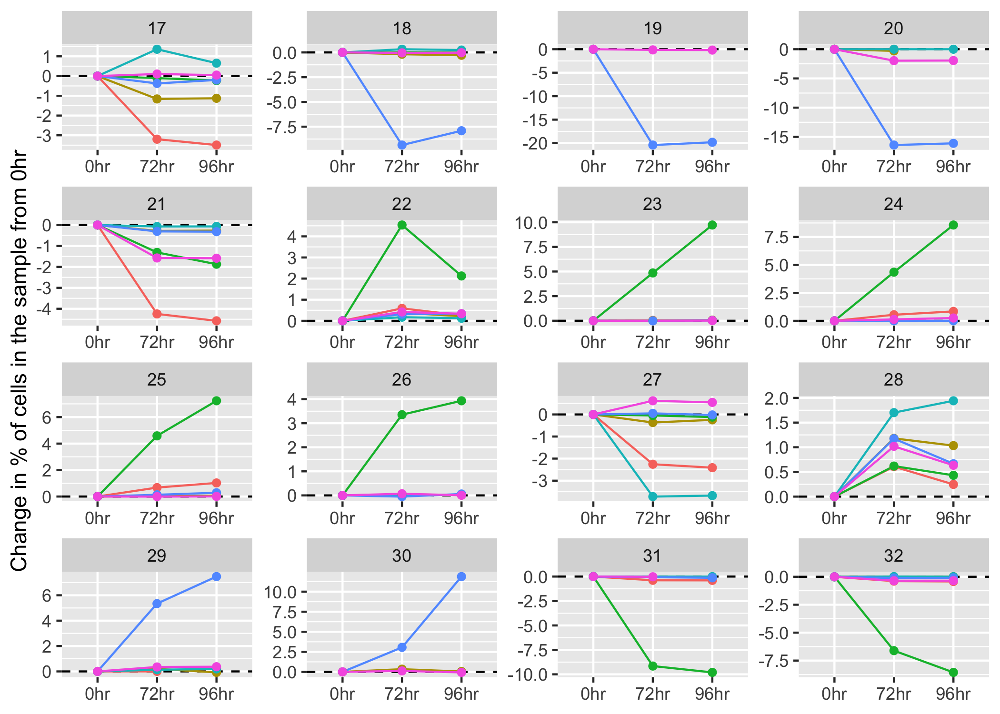<!-- -->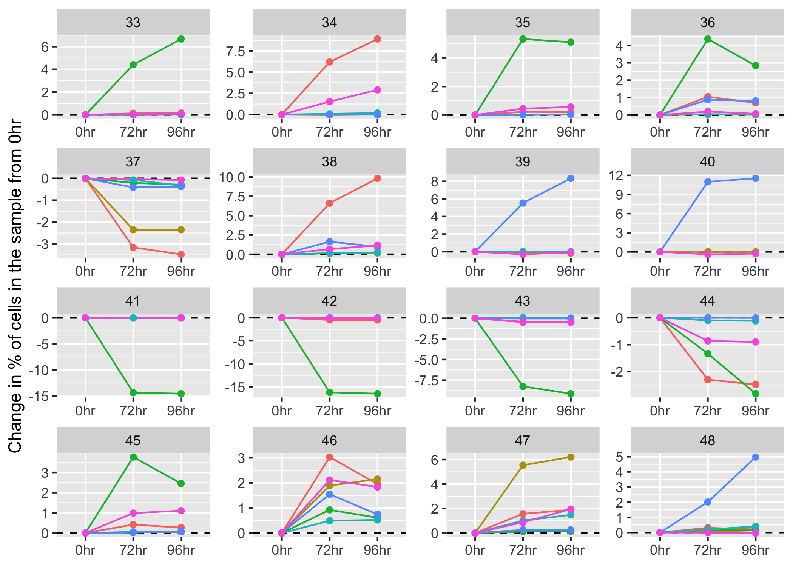<!-- -->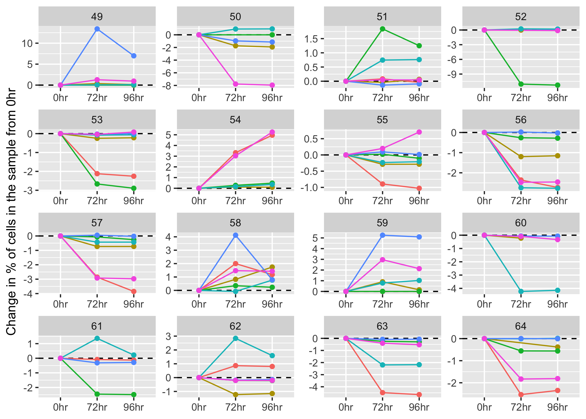<!-- -->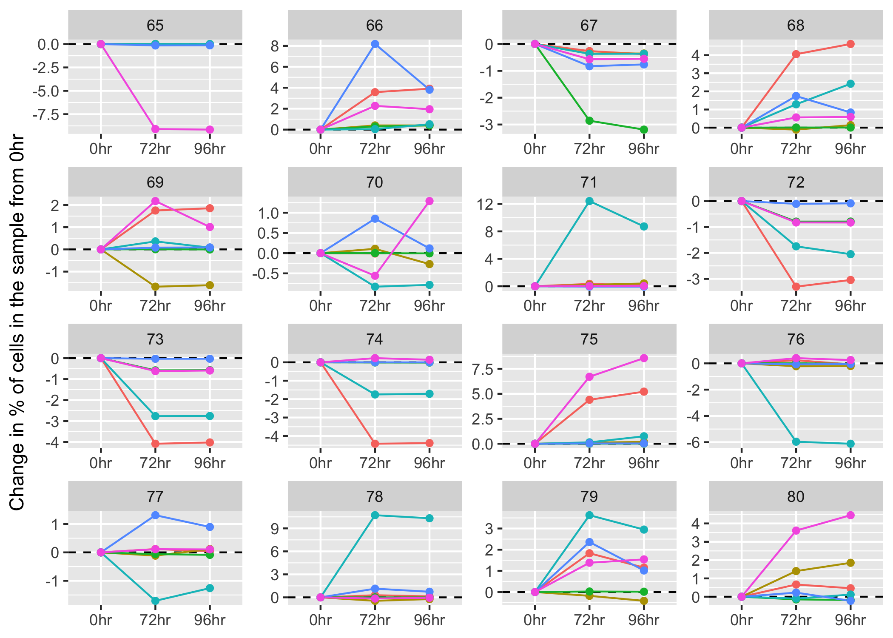<!-- -->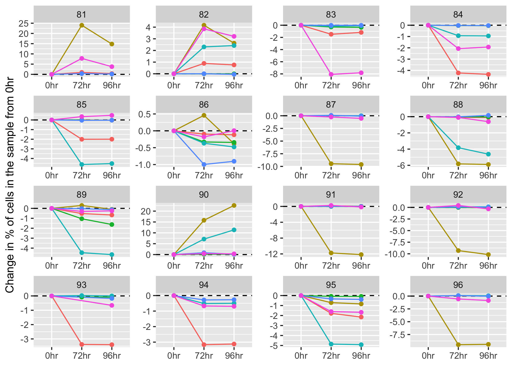<!-- -->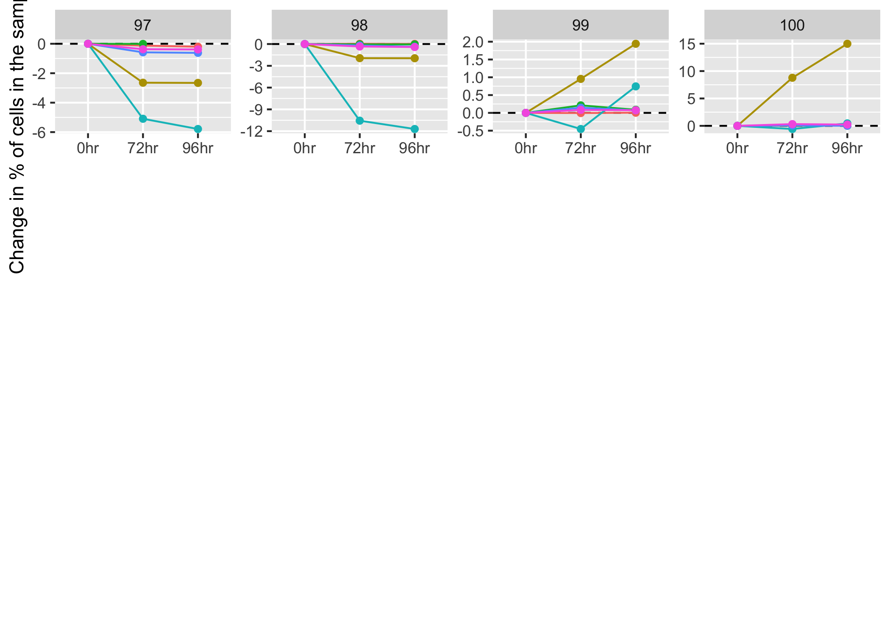<!-- -->

From these plots, we can see the the raw flowSOM clustering is probably
overclustering our data: we can see this in that many clusters (such as
clusters 2, 18-20, 90-92) mostly change in only 1 or 2 patients, but not
present in others. While having such a large number of clusters could
allow us to identify very specific cell subtypes, we’ll have problems
with generalizability of those subtypes to other samples if the clusters
we identify are too sample-specific.

One way to address this issue is to metacluster the flowSOM clusters,
which will yield a smaller number of clusters that are more equally
shared between samples.

``` r
jazz_patient_cluster_plot(flowsom_metaclusters, nrow = 3, ncol = 5) %>% 
  walk(print)
```

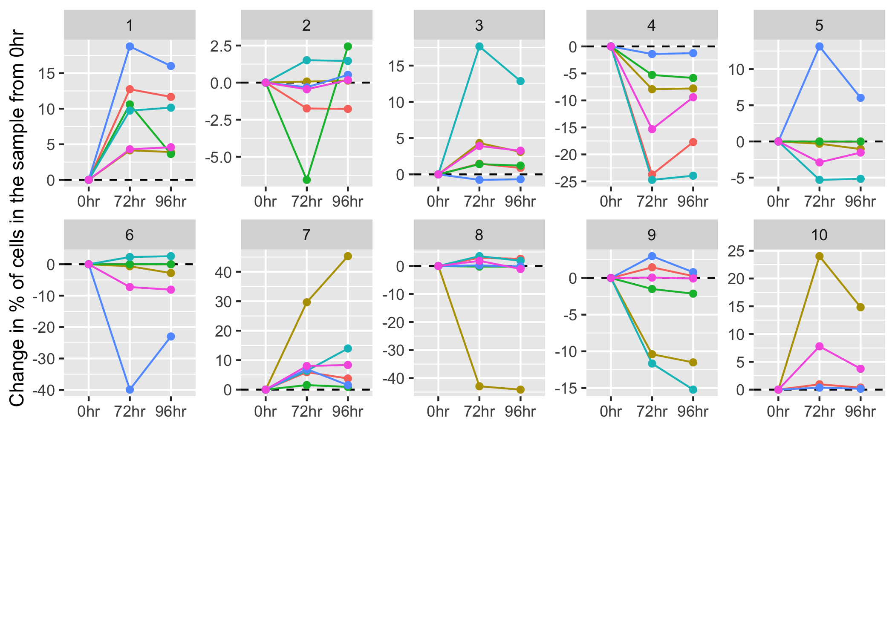<!-- -->

In either case, we can see that there are certainly clusters that tend
to respond to the treatment more than others.

## 3. What markers are associated with cell types that expanded?

As a quick way of visualizing marker expression between clusters that
expanded or contracted during Vyxeos treatment, we can summarize the
data as follows:

1.  Identify the cells in each type of cluster (we did this during our
    clustering step above).

2.  If a cluster expanded at the 96hr timepoint relative to the 0hr
    timepoint, label all cells in that clusters as “Vyxeos-resistant”
    (because they did not die during treatment). Otherwise, label them
    as “Vyxeos-sensitive.”

3.  Average the expression of all Vyxeos-resistant and Vyxeos-sensitive
    cells at each of the timepoints included in the study.

4.  Calculate the difference between these averages for all markers and
    visualize.

``` r
# find proportion of each cluster at the 0hr timepoint 
flowsom_baseline_proportions <-
  jazz_data %>% 
  filter(timepoint == "0hr") %>% 
  count(patient, flowsom_clusters) %>% 
  group_by(patient) %>% 
  mutate(total = sum(n)) %>% 
  ungroup() %>% 
  mutate(
    baseline_prop = n / total,
    baseline_perc = baseline_prop * 100
  ) %>% 
  select(-total, -n)

# pull a character vector indicating which clusters decreased
# at the 96hr timepoint relative to the 0hr timepoint.
clusters_that_decrease <- 
  jazz_data %>% 
  filter(timepoint == "96hr") %>% 
  count(patient, flowsom_clusters) %>% 
  group_by(patient) %>% 
  mutate(
    total = sum(n), 
    final_prop = n / total, 
    final_perc = final_prop * 100
  ) %>% 
  select(-total, -n) %>% 
  left_join(flowsom_baseline_proportions) %>% 
  group_by(flowsom_clusters) %>% 
  summarize(across(where(is.numeric), mean, na.rm = TRUE)) %>% 
  filter(final_perc < baseline_perc) %>% 
  pull(flowsom_clusters) %>% 
  as.character()

# find a tibble of cluster names and whether or not they decreased or increased
# at the 96hr timepoint relative to the 0hr timepoint
flowsom_cluster_pre_post_status <- 
  jazz_data %>% 
  filter(timepoint != "healthy") %>% 
  count(timepoint, flowsom_clusters) %>% 
  mutate(
    decrease = if_else(flowsom_clusters %in% clusters_that_decrease, "Not resistant", "Resistant")
  ) %>% 
  count(flowsom_clusters, decrease) %>% 
  select(-n)

# flowsom_cluster_pre_post_status <- 
#   jazz_data %>% 
#   filter(timepoint != "healthy") %>% 
#   count(timepoint, flowsom_clusters) %>% 
#   mutate(
#     decrease = if_else(flowsom_clusters %in% sig_clusters, "Not resistant", "Resistant")
#   ) %>% 
#   count(flowsom_clusters, decrease) %>% 
#   select(-n)

# find a tibble summarizing the central tendencies of each cluster
jazz_central_tendencies <- 
  jazz_data %>% 
  left_join(flowsom_cluster_pre_post_status) %>% 
  #group_by(patient) %>% 
  select(
    -time, -length, -offset, 
    -width, -center, -beaddist, 
    -omiqfilter, -viability, -residual, 
    -dna1, -dna2
  ) %>% 
  # scale all markers to mean 0 and variance 1
  mutate(across(where(is.numeric), scale)) %>% 
  # take the mean of the treatment-resistant and 
  # sensitive clusters for each marker in each patient
  extract_feature_ct(
    cluster_col = decrease
  ) %>% 
  pivot_longer(
    #cols = c(-patient),
    cols = everything(),
    names_to = c("marker", "cell_type"), 
    values_to = "measurement", 
    names_sep = "@"
  ) %>% 
  # group_by(marker) %>% 
  # # Scale the cluster means across all patients to get all markers on the same scale
  # mutate(measurement = scale(measurement)) %>%
  # group_by(cell_type, marker) %>%
  # # Find the mean of means across all patients
  # summarize(measurement = mean(measurement)) %>% 
  ungroup()
```

``` r
marker_order <- 
  jazz_central_tendencies %>% 
  pivot_wider(
    names_from = cell_type, 
    values_from = measurement
  ) %>% 
  mutate(difference = `Not resistant` - Resistant) %>% 
  arrange(-difference) %>% 
  pull(marker)

jazz_central_tendencies %>% 
  mutate(marker = factor(marker, levels = marker_order)) %>% 
  ggplot(aes(x = marker, y = measurement, fill = cell_type)) + 
  geom_point(shape = 21, size = 2) + 
  coord_flip() + 
  labs(
    x = "Markers enriched in treatment-resistant cells --->", 
    y = "normalized mean marker expression", 
    fill = "Cluster type"
  )
```

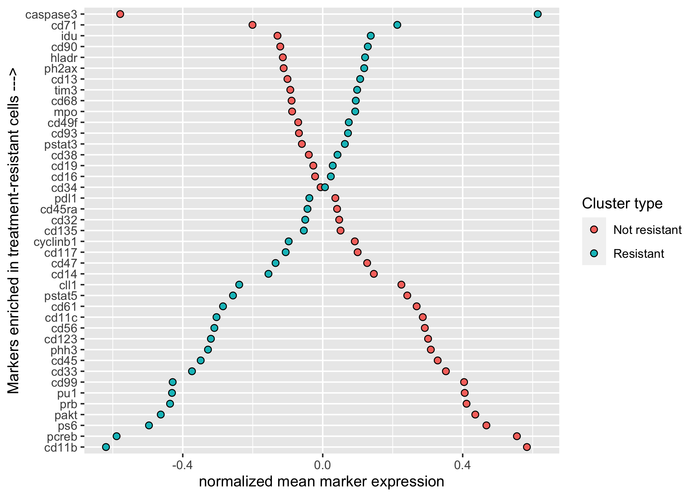<!-- -->

From the plot above, we can see that there are certain markers that are
relatively higher on “treatment-resistant cells” (aka cells that
increased in proportion during the course of treatment) relative to
Non-resistant cells (aka cells that decreased in proportion over the
course of treatment). Some interesting markers among resistant cells are
`CD90`, `HLA-DR`, `MPO`, and the most different marker (`Caspase-3`),
which could indicate that trx-resistant cells express cellular stress
signals without dying moreso than cells that do end up dying from the
treatment.

We can also see that several signaling markers (including `pCreb`,
`pS6`, and `pSTAT5` seem to be **lower** in treatment-resistant cells
than in non-resistant cells (at least in the basal state), suggesting
that there might be some underlying signaling program differences
between these two categories of cells.

<div style="page-break-before: always;" />

# Differential discovery analysis

While the above exploratory visualizations are useful to get a sense of
what is present in the data, significance testing would meaningfully
pare down which clusters (and cluster-marker pairs) we focus the rest of
our analysis on. For this, we can use the
[diffcyt](https://www.nature.com/articles/s42003-019-0415-5) framework
for differential discovery analysis.

Specifically, we use generalized linear mixed models (GLMMs) to test for
differences in cluster abundance and cluster marker expression. The
benefit of using mixed-models in this context is that, unlike more
traditional differential abundance/expression testing tools commonly
applied to CyTOF data like
[CITRUS](https://www.ncbi.nlm.nih.gov/pmc/articles/PMC4084463/), GLMMs
can account for complex experimental designs such as paired or block
designs with known covariates representing batch effects or
individual-to-individual variation. In the case of the present study,
using random effects to model the variance in cluster abundance and
marker expression that arises from random variation between individual
patients and between wells in the treatment setup (i.e. sample-to-sample
variation), we can more reliably detect differences attributable solely
to the effect of Vyxeos treatment.

To do this, we can use the `{diffcyt}` package (or manual fitting of a
similar procedure) to test for differential abundance of clusters across
timepoints using binomial regression. For each cluster, we can fit a
binomial regression model in which we model the log-odds (and thus
indirectly the proportion of cells in a given cluster) of each cluster
in a given sample *i* and a given sample *j* *p*<sub>*i**j*</sub>
according to the following equation:

$$
logit(p\_{ij}) = log(\\frac{p\_{ij}}{1 - p\_{ij}}) = \\beta\_0 + \\alpha\_i^{(p)} + \\alpha\_j^{(s)} + \\beta\_1 X\_{72hr\_j} + \\beta\_{2} X\_{96hr\_j}
$$

In the equation above, we use the following definitions:

-   *p*<sub>*i**j*</sub>: The proportion of cells in a given cluster in
    patient *i* and sample *j*
-   *α*<sub>*i*</sub><sup>(*p*)</sup>: A random intercept for each
    patient *i* in which *α*<sub>*i*</sub><sup>(*p*)</sup> \~
    *N*(0, *σ*<sub>*p*</sub>), where *σ*<sub>*p*</sub> is estimated
    during model fitting.
-   *α*<sub>*j*</sub><sup>(*s*)</sup>: A random intercept for each
    sample *j* in which *α*<sub>*j*</sub><sup>(*s*)</sup> \~
    *N*(0, *σ*<sub>*s*</sub>), where *σ*<sub>*s*</sub> is estimated
    during model fitting. Note that the inclusion of this term allows us
    to model [observation-level random
    effects](https://www.ncbi.nlm.nih.gov/pmc/articles/PMC4194460/),
    which can be useful for modeling the overdispersion in count data
    commonly present in biology.
-   *X*<sub>72*h**r*</sub>: an indicator variable representing whether
    or not a sample was taken from the 72hr timepoint (1 if yes, 0
    otherwise).
-   *X*<sub>96*h**r*</sub>:an indicator variable representing whether or
    not a sample was taken from the 96hr timepoint (1 if yes, 0
    otherwise).
-   All *β*’s are linear model parameters optimized during model
    fitting.

Using the above setup, we can apply null-hypothesis significance testing
to *β*<sub>1</sub> and *β*<sub>2</sub> (under the null hypothesis that
*β*<sub>1</sub> = *β*<sub>2</sub> = 0): if either *β* value is
significantly different from 0 in the model, we can state that the
proportion of cells in our cluster differs significantly between the 0hr
timepoint and the 72hr or 96hr timepoints, respectively, while
controlling for individual-to-individual and sample-to-sample variation.

We can use a similar procedure to test for differences in mean marker
expression across clusters by fitting a linear regression model (thus,
an LMM, not a GLMM) for each cluster/marker pair. For this, we
implicitly assume the that mean marker expression values in each cluster
are distributed normally among patients (which is a large assumption
even though this method is state-of-the-art in the CyTOF community).
Thus, for differential marker expression, we use the following equation
to predict the mean expression value *y*<sub>*i**j*</sub> for a given
cluster/marker pair in patient **i** and sample **j**:

*y*<sub>*i**j*</sub> = *β*<sub>0</sub> + *α*<sub>*i*</sub><sup>(*p*)</sup> + *β*<sub>1</sub>*X*<sub>72*h**r*<sub>*j*</sub></sub> + *β*<sub>2</sub>*X*<sub>96*h**r*<sub>*j*</sub></sub>

in which the values in this expression are defined as above and the
null-hypothesis significance testing is carried out identically.
Importantly, we can correct for multiple comparisons (due to the number
of models being fit) by using the `p.adjust` function in base r (which
has a variety of methods already implemented).

With this framework in hand, we can then move on to the actual
computations.

## Set up data structures

First, we must put our data into the kinds of data structures that
`diffcyt` uses (eventually I will develop a framework that is a bit
easier to work with).

``` r
# set up experiment information
experiment_info <- 
  jazz_data %>%
  filter(timepoint != "healthy") %>% 
  distinct(name, patient, timepoint) %>% 
  dplyr::rename(sample_id = name)

# set up marker information 
my_markers <- 
  c(
    "cd45", "cd61", "cd99", "idu", "cd45ra",
    "cll1", "cd19", "prb", "cd117", "cd123",
    "cd93", "cd90", "cyclinb1", "cd34", "cd32", 
    "pstat5", "cd11c", "cd13", "pakt", "tim3", 
    "cd56", "pu1", "cd33", "pdl1", "cd14", 
    "caspase3", "cd38", "pstat3", "cd16", "cd68",
    "mpo", "ph2ax", "cd47", "cd135", "phh3",
    "ps6", "cd49f", "hladr", "cd71", "pcreb",
    "cd11b"   
  )

marker_info <- 
  tibble(
    marker_name = colnames(jazz_data)
  ) %>% 
  filter(marker_name %in% my_markers) %>% 
  mutate(
    marker_class = 
      if_else(marker_name %in% CLASSIFIER_MARKERS, "type", "state") %>% 
      as.factor()
  )

# create formula
my_formula <- 
  createFormula(
    experiment_info = experiment_info, 
    cols_fixed = c("timepoint"), 
    cols_random = c("sample_id", "patient")
  )

#create design matrix 
my_design <- 
  createDesignMatrix(
    experiment_info = experiment_info, 
    cols_design = c("timepoint")
  )

# create contrast matrix 
my_contrast <- 
  createContrast(attr(my_design, "assign"))
```

Because the flowSOM metaclusters look nice above, we will use them for
the differential discovery analysis (although code is available to use
the other form of clustering as well, and it is arbitrary which
clustering method we choose for the analysis).

``` r
# configure jazz data into the format diffcyt likes
jazz_data_nested <- 
  jazz_data %>% 
  filter(timepoint != "healthy") %>% 
  group_by(name) %>% 
  nest() %>% 
  pull(data)

jazz_data_diff <- 
  prepareData(
    d_input = jazz_data_nested, 
    experiment_info = as.data.frame(experiment_info), 
    marker_info = as.data.frame(marker_info), 
    cols_to_include = 
      (colnames(select(jazz_data, -name)) %in% marker_info$marker_name)
  )

# add flowSOM metaclusters to diffcyt object 
temp <- 
  jazz_data_diff %>% 
  rowData()

temp[,"cluster_id"] <- 
  jazz_data %>% 
  pull(flowsom_metaclusters) %>% 
  as.factor()

rowData(jazz_data_diff) <- temp

# fix some typing issues in the exprs component of the SummarizedExperiment
jazz_exprs <- 
  jazz_data_diff %>% 
  assays() %>% 
  `[[`("exprs")

jazz_colnames <- colnames(jazz_exprs)

jazz_exprs <- 
  jazz_exprs %>% 
  apply(MARGIN = 2, FUN = as.numeric)

colnames(jazz_exprs) <- jazz_colnames

assays(jazz_data_diff)[["exprs"]] <- jazz_exprs
```

This is the code that we did **not** run, but which can be used to use
either the developmental clusters or the raw (not metaclustered) flowSOM
clusters instead.

``` r
# add flowSOM clusters to diffcyt object 
temp <- 
  jazz_data_diff %>% 
  rowData()

temp[,"cluster_id"] <- 
  jazz_data %>% 
  pull(flowsom_clusters) %>% 
  as.factor()

rowData(jazz_data_diff) <- temp

# add developmental clusters to diffcyt object 
temp <- 
  jazz_data_diff %>% 
  rowData()

temp[,"cluster_id"] <- 
  jazz_data %>% 
  pull(cluster) %>% 
  as.factor()

rowData(jazz_data_diff) <- temp
```

## Differential abundance analysis

Now that the right data structures have been created, we can move
forward with the actual differential discovery analysis. We start by
detecting which flowSOM metaclusters are differentially abundant at
different timepoints in the study. Remember that using a GLMM framework
allows us to control for the random effects that arise from individual
variation between patients and the overdispersion between samples.

For this analysis, we throw away any clusters that don’t have at least
100 cells in at least 5 samples because in that case the proportions
we’re comparing are just not stable enough to be meaningful.

### Statistical Testing

``` r
# only test the null hypothesis that B_1 is different from 0
contrast_1 <- createContrast(c(0, 1, 0))
# only test the null hypothesis that B_2 is different from 0
contrast_2 <- createContrast(c(0, 0, 1))
# test the null hypothesis that either B_1 or B_2 is different from 0
contrast_3 <- createContrast(c(0, 1, 1))

# we choose the third option
my_contrast <- contrast_3

# clusters that don't have at least 100 cells in 5 patients will be ignored
# in the analysis
min_cells <- 100
min_samples <- 5

# test differential abundance
jazz_counts <- calcCounts(jazz_data_diff)

# use the GLMM model
da_results <- 
  testDA_GLMM(
    d_counts = jazz_counts, 
    formula = my_formula, 
    contrast = my_contrast, 
    min_cells = min_cells, 
    min_samples = min_samples
  )

# use an edgeR-based model, which uses a negative binomial distribution 
# instead of a binomial distribution
da_results_2 <- 
  testDA_edgeR(
    d_counts = jazz_counts, 
    design = my_design, 
    contrast = my_contrast, 
    min_cells = min_cells, 
    min_samples = min_samples
  )

# use a voom/limma-based model, which I don't really understand. 
da_results_3 <- 
  testDA_voom(
    d_counts = jazz_counts, 
    design = my_design, 
    contrast = my_contrast,
    block_id = as.factor(experiment_info$patient),
    min_cells = min_cells, 
    min_samples = min_samples
  )

num_sig_1 <- 
  da_results %>% 
  topTable(all = TRUE) %>% 
  as_tibble() %>% 
  mutate(significant = if_else(p_adj < 0.05, "*", "")) %>% 
  dplyr::count(significant) %>% 
  filter(significant == "*") %>% 
  pull(n)

num_sig_2 <- 
  da_results_2 %>% 
  topTable(all = TRUE) %>% 
  as_tibble() %>% 
  mutate(significant = if_else(p_adj < 0.05, "*", "")) %>% 
  dplyr::count(significant) %>% 
  filter(significant == "*") %>% 
  pull(n)

num_sig_3 <- 
  da_results_3 %>% 
  topTable(all = TRUE) %>% 
  as_tibble() %>% 
  mutate(significant = if_else(p_adj < 0.05, "*", "")) %>% 
  dplyr::count(significant) %>% 
  filter(significant == "*") %>% 
  pull(n)

tibble(
  method = c("GLMM", "edgeR", "limma/voom"), 
  num_significant_clusters = c(num_sig_1, num_sig_2, num_sig_3)
) %>% 
  knitr::kable()
```

| method     | num\_significant\_clusters |
|:-----------|---------------------------:|
| GLMM       |                          5 |
| edgeR      |                          1 |
| limma/voom |                          5 |

We can see that each of these testing procedures identify a similar
number of significantly changed clusters, so we can move forward
analyzing the GLMM approach (because it is the most intuitive to me, at
least until I read more about the negative binomial distribution…maybe
starting with [this highly-rated blog
post](https://www.johndcook.com/blog/2009/11/03/negative-binomial-poisson-gamma/)).

So, I’ll just pull out the IDs of the significant clusters from the GLMM
approach above.

``` r
sig_clusters_diffcyt <- 
  da_results %>% 
  topTable(all = TRUE) %>% 
  as_tibble() %>% 
  mutate(significant = if_else(p_adj < 0.05, "*", "")) %>% 
  filter(significant == "*") %>% 
  pull(cluster_id) %>% 
  as.character()
```

### Tim models GLMMs directly

To see if the `diffcyt` GLMM implementation does anything differently
than I would do it if I implemented the testing procedure from scratch,
I provide a *de novo* implementation here. Note that I have to rely on
the `{broomExtra}` package to do the null-hypothesis significance
testing of the *β* values for me.

``` r
# count the number of cells in each cluster in each patient at each timepoint
fit_data <- 
  jazz_data %>% 
  dplyr::count(name, patient, timepoint, flowsom_metaclusters, .drop = FALSE) %>% 
  group_by(patient, timepoint) %>% 
  mutate(
    total_cells = sum(n), 
    prop = n / total_cells
  ) %>% 
  ungroup()

# remove clusters from analysis that don't have at least 100 cells in 5 samples
clusters_to_remove <- 
  fit_data %>% 
  dplyr::count(name, flowsom_metaclusters, wt = n) %>% 
  mutate(over_min_cells = n > min_cells) %>% 
  dplyr::count(flowsom_metaclusters, over_min_cells) %>% 
  filter(over_min_cells) %>% 
  filter(n < min_samples) %>% 
  pull(flowsom_metaclusters)

fit_data <- 
  fit_data %>% 
  # remove clusters that have no cells in the jazz patients (were only)
  # present in healthies
  group_by(flowsom_metaclusters) %>% 
  filter(sum(n) != 0) %>% 
  ungroup() %>% 
  filter(!(flowsom_metaclusters %in% clusters_to_remove))

# nest the data so that we can map() over each cluster, fitting a unique 
# GLMM for each one
cluster_fit_data <- 
  fit_data %>% 
  group_by(flowsom_metaclusters) %>% 
  nest() %>% 
  ungroup()
```

Then I can write some functions to do the actual model fitting (binomial
and poisson for comparison - they turn out to be essentially identical,
which makes sense).

``` r
# a function to fit binomial models on our count data
fit_model <- function(data, formula) { 
  model_fit <- 
    glmer(formula, data, family = "binomial", weights = total_cells) 
}

# a function to fit poisson models on our count data
fit_model_poisson <- function(data, formula) { 
  model_fit <- 
    glmer(formula, data, family = "poisson", offset = log(total_cells))
}
```

Then I can apply the fitting functions to the data

``` r
cluster_fit_data <- 
  cluster_fit_data %>% 
  mutate(
    results = 
      map(
        .x = data, 
        .f = fit_model, 
        formula = prop ~ timepoint + (1 | patient) + (1 | name)
      ),
    results = map(.x = results, .f = tidy)
  )

glmm_manual_result <- 
  cluster_fit_data %>% 
  select(-data) %>% 
  unnest(cols = results) %>% 
  filter(term != "(Intercept)", !is.na(p.value)) %>% 
  mutate(p_adj = p.adjust(p.value, method = "fdr")) %>% 
  arrange(p_adj) %>% 
  mutate(significant = if_else(p_adj < 0.05, "*", ""))

# glmm_manual_result %>% 
#   dplyr::count(term, significant)

sig_clusters_tim <- 
  glmm_manual_result %>% 
  dplyr::count(flowsom_metaclusters, significant) %>% 
  filter(significant == "*", n == 2) %>% 
  pull(flowsom_metaclusters) %>% 
  as.character()

sig_clusters_tim
```

    ## [1] "1"  "3"  "4"  "7"  "10"

And we can see that the significant clusters that we’ve identified are
identical (the set difference between the list of significant clusters
in either case is empty):

``` r
setdiff(sig_clusters_diffcyt, sig_clusters_tim)
```

    ## character(0)

``` r
setdiff(sig_clusters_tim, sig_clusters_diffcyt)
```

    ## character(0)

### Visualization of differentially abundant clusters

``` r
sig_clusters <- sig_clusters_tim

glmm_manual_result %>% 
  filter(flowsom_metaclusters %in% sig_clusters) %>% 
  select(flowsom_metaclusters, term, estimate) %>% 
  arrange(flowsom_metaclusters)
```

    ## # A tibble: 10 x 3
    ##    flowsom_metaclusters term          estimate
    ##    <fct>                <chr>            <dbl>
    ##  1 1                    timepoint72hr    0.838
    ##  2 1                    timepoint96hr    0.714
    ##  3 3                    timepoint72hr    1.49 
    ##  4 3                    timepoint96hr    1.35 
    ##  5 4                    timepoint72hr   -1.26 
    ##  6 4                    timepoint96hr   -1.17 
    ##  7 7                    timepoint72hr    1.36 
    ##  8 7                    timepoint96hr    1.23 
    ##  9 10                   timepoint72hr    5.55 
    ## 10 10                   timepoint96hr    5.36

From the results of our GLMM, we can see several flowSOM metaclusters
decreased in proportion at both the 72- and 96-hour timepoints relative
to pre-treatment and that several metaclusters increased in proportion
relative to pre-treatment. We can visualize these changes below:

``` r
sig_cluster_data <- 
  jazz_data %>% 
  dplyr::count(
    patient, 
    timepoint, 
    flowsom_metaclusters,  
    name = "cluster_cells", 
    .drop = FALSE
  ) %>% 
  group_by(patient, timepoint) %>% 
  mutate(
    total_cells = sum(cluster_cells), 
    cluster_prop = cluster_cells / total_cells
  ) %>% 
  mutate(
    is_sig = flowsom_metaclusters %in% sig_clusters, 
    is_sig = if_else(is_sig, "Yes", "No")
  ) %>% 
  ungroup()

sig_cluster_data_0hr <- 
  sig_cluster_data %>% 
  filter(timepoint == "0hr") %>% 
  select(-timepoint, -total_cells, -is_sig) %>% 
  dplyr::rename(
    baseline_cluster_cells = cluster_cells, 
    baseline_cluster_prop = cluster_prop
  )

sig_cluster_data <- 
  sig_cluster_data %>% 
  left_join(sig_cluster_data_0hr) %>% 
  mutate(cluster_prop_diff = cluster_prop - baseline_cluster_prop)
```

``` r
sig_cluster_plot <- 
  sig_cluster_data %>% 
  group_by(timepoint, flowsom_metaclusters, is_sig) %>% 
  summarize(
    sem = sd(cluster_prop_diff) / sqrt(n()), 
    cluster_prop = mean(cluster_prop),
    cluster_prop_diff = mean(cluster_prop_diff)
  ) %>% 
  ggplot(aes(x = timepoint, y = cluster_prop_diff, fill = is_sig)) + 
  geom_hline(yintercept = 0, linetype = "dashed", size = 0.3, color = "gray30") + 
  geom_line(
    aes(color = is_sig, group = flowsom_metaclusters), 
    size = 0.7
  ) + 
  geom_errorbar(
    aes(ymin = cluster_prop_diff - sem, ymax = cluster_prop_diff + sem),
    width = 0.4
  ) +
  geom_point(shape = 21, size = 2) + 
  scale_y_continuous(labels = scales::label_percent(1)) + 
  facet_wrap(facets = vars(flowsom_metaclusters)) + 
  labs(
    x = "Time point", 
    y = "Change in cluster % since 0 hr", 
    color = "Significantly\ndifferent?", 
    fill = "Significantly\ndifferent?", 
    subtitle = "Error bars indicate standard error"
  )

sig_cluster_plot
```

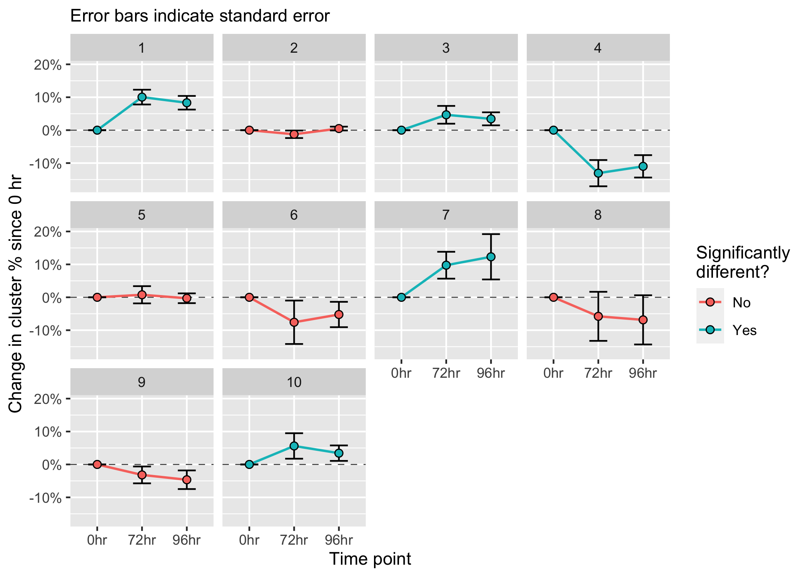<!-- -->

We can also get a sense of where the significantly different clusters
organize in phenotypic space relative to other clusters using tSNE:

``` r
sampled_data <- 
  jazz_data %>% 
  mutate(is_sig = flowsom_metaclusters %in% sig_clusters) %>% 
  group_by(flowsom_metaclusters) %>% 
  slice_sample(n = 3000) %>% 
  ungroup()

tsne_coordinates <- 
  sampled_data %>% 
  select(one_of(my_markers)) %>% 
  Rtsne(X = .) %>% 
  pluck("Y") %>% 
  as_tibble() %>% 
  dplyr::rename(tsne1 = V1, tsne2 = V2)

sampled_data <- 
  sampled_data %>% 
  bind_cols(tsne_coordinates)
```

``` r
sig_cluster_tsne <- 
  sampled_data %>% 
  arrange(-is_sig) %>% 
  filter(!(flowsom_metaclusters %in% sig_clusters)) %>% 
  ggplot(aes(x = tsne1, y = tsne2)) + 
  geom_point(shape = 21, fill = "gray80", color = "gray50") + 
  geom_point(
    aes(x = tsne1, y = tsne2, fill = flowsom_metaclusters), 
    data = filter(sampled_data, flowsom_metaclusters %in% sig_clusters), 
    shape = 21
  ) + 
  labs(fill = "cluster")

sig_cluster_tsne
```

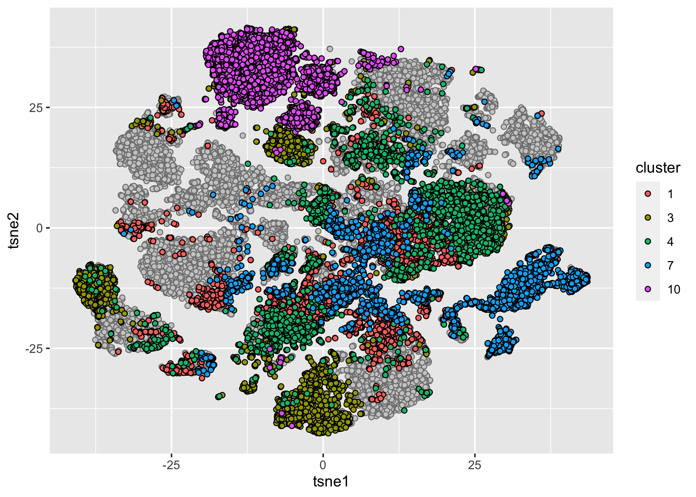<!-- -->

From this tSNE plot, we can see that the clusters that change
significantly in proportion (in either the positive or negative
direction) preferentially aggregate in certain parts of the phenotypic
space (i.e. are not distributed randomly across the phenotypical space).
This is what we’re hoping to see, as this suggests that there are
specific phenotypic features (marker expression levels) among our
clusters-of-interest that could be used to distinguish between them.

``` r
inc_or_dec_tibble <- 
  sig_cluster_data %>% 
  group_by(timepoint, flowsom_metaclusters, is_sig) %>% 
  summarize(
    sem = sd(cluster_prop_diff) / sqrt(n()), 
    cluster_prop = mean(cluster_prop),
    cluster_prop_diff = mean(cluster_prop_diff)
  ) %>% 
  ungroup() %>% 
  filter(is_sig == "Yes") %>% 
  filter(timepoint != "0hr") %>% 
  mutate(inc_or_dec = if_else(cluster_prop_diff > 0, "increase", "decrease")) %>%
  count(flowsom_metaclusters, inc_or_dec) %>% 
  select(-n)

inc_cluster_tsne <- 
  sampled_data %>% 
  arrange(-is_sig) %>% 
  filter(!(flowsom_metaclusters %in% sig_clusters)) %>% 
  ggplot(aes(x = tsne1, y = tsne2)) + 
  geom_point(shape = 21, fill = "gray80", color = "gray50") + 
  geom_point(
    aes(x = tsne1, y = tsne2, fill = inc_or_dec), 
    data = 
      sampled_data %>% 
      filter(flowsom_metaclusters %in% sig_clusters) %>% 
      left_join(inc_or_dec_tibble), 
    shape = 21
  ) + 
  labs(fill = NULL)

inc_cluster_tsne
```

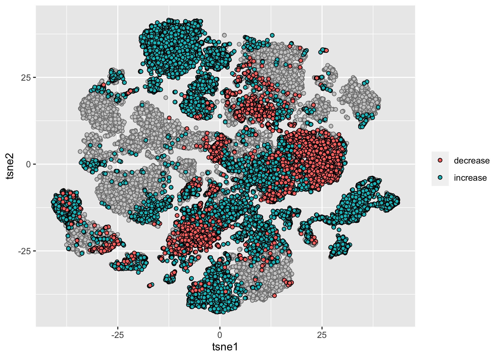<!-- -->

From this plot, we can see that the metaclusters that decrease or
increase over the course of Vyxeos treatment tend to associate with one
another in phenotypic space.

``` r
sig_cluster_tsne + 
  inc_cluster_tsne + 
  plot_layout(guides = "collect", nrow = 2)
```

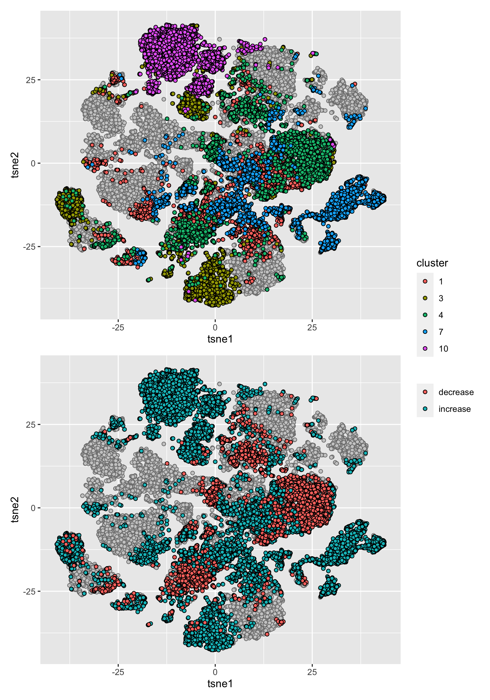<!-- -->

## Differential Expression Analysis

Now that the differential abundance analysis has been done, we can also
do differential expression analysis across timepoints in the study to
see how marker expression changes among clusters at the different
timepoints at which we collected them.

### Statistical Testing

``` r
# test differential abundance
jazz_medians <- calcMedians(jazz_data_diff)

# fix formula
my_formula$formula <- y ~ timepoint + (1 | patient)

ds_results <- 
  testDS_LMM(
    d_counts = jazz_counts, 
    d_medians = jazz_medians, 
    formula = my_formula, 
    contrast = my_contrast, 
    min_cells = min_cells, 
    min_samples = min_samples, 
    markers_to_test = rep(TRUE, nrow(marker_info)), 
    weights = FALSE
  )

ds_results_2 <- 
  testDS_limma(
    d_counts = jazz_counts, 
    d_medians = jazz_medians,
    design = my_design, 
    contrast = my_contrast, 
    block_id = as.factor(experiment_info$patient),
    min_cells = min_cells, 
    min_samples = min_samples, 
    markers_to_test = rep(TRUE, nrow(marker_info))
  )
```

``` r
my_markers <- 
  ds_results %>% 
  topTable(all = TRUE) %>% 
  as_tibble() %>% 
  pull(marker_id) %>% 
  unique() %>% 
  as.character()

# find cluster-marker expression differences between 92 and 0hr timepoints 
diff_tibble <- 
  jazz_data %>% 
  group_by(patient, timepoint, flowsom_metaclusters) %>% 
  select(any_of(my_markers)) %>% 
  summarize(across(everything(), mean, na.rm = TRUE)) %>%
  pivot_longer(
    cols = any_of(my_markers), 
    names_to = "marker", 
    values_to = "value"
  ) %>% 
  pivot_wider(
    names_from = timepoint, 
    values_from = value
  ) %>% 
  mutate(
    diff = `96hr` - `0hr`, 
    fc = `96hr` / `0hr`, 
    log2_fc = log(fc, base = 2)
  ) %>% 
  group_by(marker, flowsom_metaclusters) %>% 
  summarize(across(everything(), mean, na.rm = TRUE)) %>% 
  select(-patient, cluster_id = flowsom_metaclusters) %>% 
  ungroup() %>% 
  rename(marker_id = marker)
```

``` r
volcano_tibble <- 
  ds_results %>% 
  topTable(all = TRUE) %>% 
  as_tibble() %>% 
  left_join(diff_tibble) %>% 
  mutate(
    p_adj = pmax(p_adj, 1e-16), 
    neg_log10_pval = -log(p_adj), 
    marker_id = fct_reorder(marker_id, neg_log10_pval), 
    marker_type = 
      case_when(
        p_adj >= 0.05   ~   "Not significant", 
        log2_fc > 0     ~   "Increased", 
        TRUE            ~   "Decreased"
      )
  ) 

volcano_tibble %>% 
  mutate(
    marker_type = 
      factor(marker_type, levels = c("Increased", "Decreased", "Not significant"))
  ) %>% 
  ggplot(aes(y = neg_log10_pval, x = log2_fc, fill = marker_type)) + 
  geom_vline(xintercept = 0, linetype = "dashed", color = "black") + 
  geom_hline(yintercept = -log(0.05), linetype = "dashed", color = "black") + 
  geom_point(shape = 21) + 
  #scale_fill_discrete(labels = c("Up", "Down", "Not significant")) + 
  facet_wrap(facets = vars(cluster_id)) + 
  labs(
    subtitle = "How many markers increased/decreased during Vyxeos treatment?",
    x = "log2 fold-change in marker expression", 
    y = "-log10 p-value", 
    fill = NULL, 
    caption = "Dashed lines indicate the p = 0.05 threshold and FC = 1"
  )
```

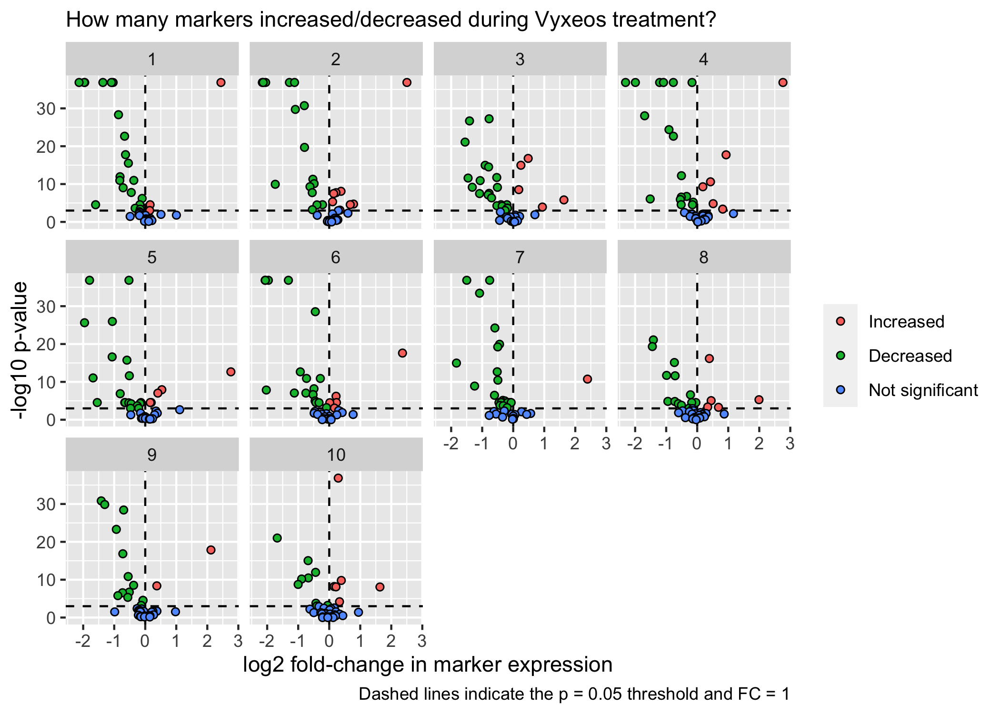<!-- -->

From these volcano plots, we can see that there are several markers that
significantly increased and decreased in each cluster during Vyxeos
treatment. In general, we see that there are more markers that
significantly decreased within clusters than that increased (which is an
interesting finding and might suggest that many of the markers in our
panel, which is focused on myeloid markers, are downregulated as
resistant cells lose their lineage-specific traits).

We can explicitly identify the markers that increased or decreased in
expression for each cluster ranked by significance below:

#### Markers that increased during Vyxeos treatment

Note that markers are arranged from most significant to least
significant within each cluster.

``` r
increased_markers <- 
  volcano_tibble %>% 
  filter(marker_type == "Increased") %>% 
  pull(marker_id) %>% 
  unique() %>% 
  as.character()

volcano_tibble %>% 
  filter(marker_type == "Increased") %>% 
  select(cluster_id, marker_id, p_adj, fold_change = fc) %>% 
  arrange(as.numeric(cluster_id), p_adj) %>% 
  knitr::kable()
```

| cluster\_id | marker\_id |    p\_adj | fold\_change |
|:------------|:-----------|----------:|-------------:|
| 1           | caspase3   | 0.0000000 |     5.540775 |
| 1           | cd16       | 0.0106548 |     1.123269 |
| 1           | ph2ax      | 0.0488969 |     1.134245 |
| 2           | caspase3   | 0.0000000 |     5.850634 |
| 2           | cd90       | 0.0003087 |     1.317233 |
| 2           | mpo        | 0.0004415 |     1.171808 |
| 2           | hladr      | 0.0005585 |     1.108036 |
| 2           | cd47       | 0.0048794 |     1.081521 |
| 2           | cd71       | 0.0089788 |     1.888326 |
| 2           | cd13       | 0.0103909 |     1.632801 |
| 2           | ph2ax      | 0.0445767 |     1.326090 |
| 3           | cd13       | 0.0000001 |     1.424618 |
| 3           | cd68       | 0.0000003 |     1.191845 |
| 3           | hladr      | 0.0001979 |     1.135793 |
| 3           | caspase3   | 0.0029872 |     3.492987 |
| 3           | cd71       | 0.0196064 |     2.387867 |
| 4           | caspase3   | 0.0000000 |     6.927222 |
| 4           | ph2ax      | 0.0000000 |     1.991717 |
| 4           | mpo        | 0.0000250 |     1.371115 |
| 4           | cd47       | 0.0000922 |     1.138091 |
| 4           | cd13       | 0.0080631 |     1.450354 |
| 4           | cd71       | 0.0339931 |     1.944061 |
| 5           | caspase3   | 0.0000032 |     7.030624 |
| 5           | mpo        | 0.0003592 |     1.473218 |
| 5           | ph2ax      | 0.0008830 |     1.451766 |
| 5           | cd16       | 0.0106548 |     1.157008 |
| 5           | cd49f      | 0.0106548 |     1.187075 |
| 6           | caspase3   | 0.0000000 |     5.442385 |
| 6           | mpo        | 0.0020184 |     1.180057 |
| 6           | cd16       | 0.0106548 |     1.186352 |
| 6           | ph2ax      | 0.0111419 |     1.068745 |
| 6           | cd13       | 0.0454356 |     1.159367 |
| 7           | caspase3   | 0.0000218 |     5.714551 |
| 8           | cd13       | 0.0000001 |     1.322778 |
| 8           | caspase3   | 0.0050534 |     4.641595 |
| 8           | ph2ax      | 0.0064399 |     1.416707 |
| 8           | cd68       | 0.0342899 |     1.322444 |
| 8           | cd71       | 0.0377007 |     1.841226 |
| 9           | caspase3   | 0.0000000 |     4.512990 |
| 9           | ph2ax      | 0.0002324 |     1.330399 |
| 10          | cd14       | 0.0000000 |     1.223351 |
| 10          | cd13       | 0.0000554 |     1.331328 |
| 10          | cd99       | 0.0002777 |     1.120139 |
| 10          | hladr      | 0.0003025 |     1.169791 |
| 10          | cd71       | 0.0003110 |     3.319221 |
| 10          | cd32       | 0.0152977 |     1.299243 |

#### Markers that decreased during Vyxeos treatment

``` r
decreased_markers <- 
  volcano_tibble %>% 
  filter(marker_type == "Decreased") %>% 
  pull(marker_id) %>% 
  unique() %>% 
  as.character()

volcano_tibble %>% 
  filter(marker_type == "Decreased") %>% 
  select(cluster_id, marker_id, p_adj, fold_change = fc) %>% 
  arrange(as.numeric(cluster_id), p_adj) %>% 
  knitr::kable()
```

| cluster\_id | marker\_id |    p\_adj | fold\_change |
|:------------|:-----------|----------:|-------------:|
| 1           | prb        | 0.0000000 |    0.2694541 |
| 1           | pakt       | 0.0000000 |    0.3991233 |
| 1           | pu1        | 0.0000000 |    0.5119551 |
| 1           | ps6        | 0.0000000 |    0.2667041 |
| 1           | pcreb      | 0.0000000 |    0.2368061 |
| 1           | cd11b      | 0.0000000 |    0.4800383 |
| 1           | cd99       | 0.0000000 |    0.5680674 |
| 1           | cd61       | 0.0000000 |    0.6358708 |
| 1           | cd56       | 0.0000000 |    0.6607853 |
| 1           | pstat5     | 0.0000002 |    0.6977363 |
| 1           | cd33       | 0.0000065 |    0.6121728 |
| 1           | cd38       | 0.0000172 |    0.7905225 |
| 1           | cd123      | 0.0000174 |    0.6095842 |
| 1           | cll1       | 0.0001209 |    0.6397181 |
| 1           | pstat3     | 0.0004216 |    0.7450391 |
| 1           | cd135      | 0.0020150 |    0.9601592 |
| 1           | cyclinb1   | 0.0106548 |    0.8876437 |
| 1           | phh3       | 0.0106548 |    0.3691349 |
| 1           | cd14       | 0.0270349 |    0.8239631 |
| 1           | cd45       | 0.0344340 |    0.9031399 |
| 2           | prb        | 0.0000000 |    0.2384975 |
| 2           | pakt       | 0.0000000 |    0.4237259 |
| 2           | ps6        | 0.0000000 |    0.2666458 |
| 2           | pcreb      | 0.0000000 |    0.2376357 |
| 2           | cd11b      | 0.0000000 |    0.4666976 |
| 2           | cd99       | 0.0000000 |    0.5881939 |
| 2           | pu1        | 0.0000000 |    0.4923374 |
| 2           | cd61       | 0.0000000 |    0.5838670 |
| 2           | cd56       | 0.0000127 |    0.7091946 |
| 2           | pstat5     | 0.0000409 |    0.7271911 |
| 2           | phh3       | 0.0000481 |    0.3423716 |
| 2           | cll1       | 0.0000901 |    0.6889491 |
| 2           | cd33       | 0.0004363 |    0.7366373 |
| 2           | cyclinb1   | 0.0106548 |    0.8651462 |
| 2           | cd11c      | 0.0111037 |    0.7734460 |
| 2           | cd123      | 0.0395355 |    0.7311919 |
| 3           | cd61       | 0.0000000 |    0.5886513 |
| 3           | ps6        | 0.0000000 |    0.4381292 |
| 3           | pcreb      | 0.0000000 |    0.3844369 |
| 3           | cd33       | 0.0000003 |    0.5810032 |
| 3           | pakt       | 0.0000005 |    0.6053144 |
| 3           | cd135      | 0.0000080 |    0.7214379 |
| 3           | prb        | 0.0000093 |    0.3784032 |
| 3           | cd123      | 0.0000182 |    0.5225039 |
| 3           | phh3       | 0.0001049 |    0.4124486 |
| 3           | cd56       | 0.0001084 |    0.7220663 |
| 3           | cd38       | 0.0005254 |    0.6591449 |
| 3           | pu1        | 0.0005585 |    0.5406118 |
| 3           | cll1       | 0.0007849 |    0.6319209 |
| 3           | pstat3     | 0.0017469 |    0.6447730 |
| 3           | cd117      | 0.0106548 |    0.7994912 |
| 3           | cyclinb1   | 0.0106548 |    0.8702823 |
| 3           | cd99       | 0.0138290 |    0.7381520 |
| 3           | pstat5     | 0.0155066 |    0.7927047 |
| 3           | cd45ra     | 0.0254123 |    0.8798214 |
| 3           | pdl1       | 0.0270349 |    0.8983427 |
| 3           | cd49f      | 0.0485626 |    0.8996732 |
| 4           | cd11c      | 0.0000000 |    0.8910378 |
| 4           | pakt       | 0.0000000 |    0.4373998 |
| 4           | pu1        | 0.0000000 |    0.4870312 |
| 4           | ps6        | 0.0000000 |    0.2722777 |
| 4           | pcreb      | 0.0000000 |    0.2113792 |
| 4           | cd11b      | 0.0000000 |    0.5928194 |
| 4           | prb        | 0.0000000 |    0.3173710 |
| 4           | cd99       | 0.0000000 |    0.5503466 |
| 4           | cd61       | 0.0000000 |    0.5892559 |
| 4           | pstat5     | 0.0000050 |    0.7089667 |
| 4           | cd56       | 0.0011913 |    0.7982395 |
| 4           | cd123      | 0.0014127 |    0.7420138 |
| 4           | phh3       | 0.0023264 |    0.3866897 |
| 4           | cll1       | 0.0026625 |    0.7085506 |
| 4           | cd135      | 0.0054851 |    0.9447000 |
| 4           | cd33       | 0.0104241 |    0.7345219 |
| 4           | cyclinb1   | 0.0106548 |    0.9004128 |
| 5           | cd61       | 0.0000000 |    0.7106583 |
| 5           | ps6        | 0.0000000 |    0.3296668 |
| 5           | cd11b      | 0.0000000 |    0.4941531 |
| 5           | pcreb      | 0.0000000 |    0.3014197 |
| 5           | pakt       | 0.0000001 |    0.5276484 |
| 5           | cd99       | 0.0000001 |    0.6714899 |
| 5           | cd123      | 0.0000090 |    0.7344305 |
| 5           | prb        | 0.0000160 |    0.3617324 |
| 5           | cd11c      | 0.0010302 |    0.7693461 |
| 5           | cyclinb1   | 0.0106548 |    0.9097348 |
| 5           | pu1        | 0.0106548 |    0.6818497 |
| 5           | phh3       | 0.0106548 |    0.3765789 |
| 5           | cd56       | 0.0107358 |    0.6516113 |
| 5           | cd135      | 0.0114553 |    0.7216943 |
| 5           | cd34       | 0.0133264 |    0.8942118 |
| 5           | cll1       | 0.0145839 |    0.8400193 |
| 5           | pstat5     | 0.0252302 |    0.8702565 |
| 5           | cd33       | 0.0483276 |    0.7732513 |
| 5           | cd45       | 0.0485953 |    0.8846962 |
| 6           | prb        | 0.0000000 |    0.2895562 |
| 6           | pakt       | 0.0000000 |    0.4080606 |
| 6           | ps6        | 0.0000000 |    0.2778649 |
| 6           | pcreb      | 0.0000000 |    0.2701361 |
| 6           | cd99       | 0.0000000 |    0.7366727 |
| 6           | cd11b      | 0.0000032 |    0.5503988 |
| 6           | cd61       | 0.0000182 |    0.6113503 |
| 6           | cd34       | 0.0000185 |    0.8283668 |
| 6           | pstat5     | 0.0002785 |    0.7232623 |
| 6           | phh3       | 0.0003909 |    0.2657546 |
| 6           | cd117      | 0.0008637 |    0.5025676 |
| 6           | pu1        | 0.0008766 |    0.6329128 |
| 6           | cd123      | 0.0013122 |    0.7230328 |
| 6           | cd33       | 0.0069593 |    0.7429179 |
| 6           | cyclinb1   | 0.0106548 |    0.7543849 |
| 6           | cd135      | 0.0110189 |    0.8503255 |
| 6           | cd47       | 0.0406084 |    0.9429810 |
| 7           | pcreb      | 0.0000000 |    0.3732726 |
| 7           | cd11b      | 0.0000000 |    0.5987491 |
| 7           | pakt       | 0.0000000 |    0.4799255 |
| 7           | cd99       | 0.0000000 |    0.6732822 |
| 7           | pstat5     | 0.0000000 |    0.7408221 |
| 7           | cd33       | 0.0000000 |    0.7143903 |
| 7           | prb        | 0.0000003 |    0.3066100 |
| 7           | pu1        | 0.0000031 |    0.7269198 |
| 7           | cll1       | 0.0000289 |    0.7208549 |
| 7           | ps6        | 0.0001371 |    0.4394030 |
| 7           | cd56       | 0.0015732 |    0.6807722 |
| 7           | cd45       | 0.0060225 |    0.8126916 |
| 7           | cd47       | 0.0069160 |    0.8468594 |
| 7           | cd61       | 0.0106548 |    0.7318952 |
| 7           | cd117      | 0.0106548 |    0.8088542 |
| 7           | cyclinb1   | 0.0106548 |    0.8961938 |
| 7           | tim3       | 0.0106548 |    0.9165834 |
| 7           | cd14       | 0.0106548 |    0.7685169 |
| 7           | pstat3     | 0.0106548 |    0.9299429 |
| 7           | cd16       | 0.0106548 |    0.9107319 |
| 7           | cd135      | 0.0106548 |    0.9052560 |
| 7           | cd49f      | 0.0106548 |    0.9587505 |
| 7           | cd71       | 0.0227156 |    0.7606501 |
| 7           | cd68       | 0.0247829 |    0.8227371 |
| 7           | pdl1       | 0.0410842 |    0.9174811 |
| 8           | ps6        | 0.0000000 |    0.4304668 |
| 8           | pcreb      | 0.0000000 |    0.4346285 |
| 8           | cd61       | 0.0000003 |    0.6181592 |
| 8           | prb        | 0.0000082 |    0.5309926 |
| 8           | pakt       | 0.0000090 |    0.6517267 |
| 8           | cd56       | 0.0013735 |    0.8720576 |
| 8           | phh3       | 0.0078581 |    0.5444770 |
| 8           | cd123      | 0.0080631 |    0.6312904 |
| 8           | cyclinb1   | 0.0106548 |    0.9726681 |
| 8           | cd49f      | 0.0106548 |    0.9028813 |
| 8           | cll1       | 0.0145011 |    0.7117253 |
| 8           | cd33       | 0.0216964 |    0.7458049 |
| 8           | cd11b      | 0.0485953 |    0.8480035 |
| 9           | ps6        | 0.0000000 |    0.3854171 |
| 9           | pcreb      | 0.0000000 |    0.4365773 |
| 9           | cd11b      | 0.0000000 |    0.6228893 |
| 9           | pakt       | 0.0000000 |    0.5582877 |
| 9           | cd32       | 0.0000000 |    0.6260562 |
| 9           | cd11c      | 0.0000197 |    0.6970029 |
| 9           | pstat5     | 0.0001985 |    0.7877558 |
| 9           | cd61       | 0.0012067 |    0.7112256 |
| 9           | prb        | 0.0014295 |    0.6512278 |
| 9           | phh3       | 0.0030766 |    0.5655515 |
| 9           | cll1       | 0.0048419 |    0.7331483 |
| 9           | cyclinb1   | 0.0106548 |    0.9493048 |
| 9           | cd49f      | 0.0106548 |    0.9599650 |
| 9           | tim3       | 0.0403808 |    0.9386191 |
| 10          | cll1       | 0.0000000 |    0.3385044 |
| 10          | cd19       | 0.0000003 |    0.6297724 |
| 10          | pcreb      | 0.0000065 |    0.7415198 |
| 10          | cd33       | 0.0000285 |    0.6518667 |
| 10          | ps6        | 0.0000382 |    0.5649400 |
| 10          | cd123      | 0.0001586 |    0.5012616 |
| 10          | cd93       | 0.0227156 |    0.8907733 |
| 10          | cd45       | 0.0403808 |    0.9664275 |
| 10          | phh3       | 0.0466883 |    0.8415771 |

### Visualization

We can visualize some of these marker differences on tSNE plots as well
(though there might be better ways to do so…)

``` r
sampled_data_2 <- 
  jazz_data %>% 
  group_by(flowsom_metaclusters, timepoint) %>% 
  slice_sample(n = 500) %>% 
  ungroup() %>% 
  mutate(across(all_of(c(my_markers, "hladr")), scale))

sampled_tsne <- 
  sampled_data_2 %>% 
  select(one_of(str_to_lower(ALL_MARKERS))) %>% 
  Rtsne(X = .) %>% 
  pluck("Y") %>% 
  as_tibble() %>% 
  dplyr::rename(tsne1 = V1, tsne2 = V2)

sampled_data_2 <- 
  sampled_data_2 %>% 
  bind_cols(sampled_tsne)
```

``` r
max_min_values <- 
  sampled_data_2 %>% 
  select(all_of(c(my_markers, "hladr"))) %>% 
  pivot_longer(
    cols = everything(), 
    names_to = "marker", 
    values_to = "value"
  ) %>% 
  summarize(marker_max = quantile(value, 0.99), marker_min = quantile(value, 0.01))

marker_max <- max_min_values$marker_max
marker_min <- max_min_values$marker_min
```

``` r
metacluster_tsne_plot <- 
  sampled_data_2 %>% 
  ggplot(aes(x = tsne1, y = tsne2, fill = flowsom_metaclusters)) + 
  geom_point(size = 0.1) + 
  labs(fill = NULL)

timepoint_tsne_plot <- 
  sampled_data_2 %>% 
  ggplot(aes(x = tsne1, y = tsne2, color = timepoint)) + 
  geom_point(size = 0.1) + 
  labs(subtitle = "Timepoint", color = NULL) + 
  theme(
    axis.title = element_text(size = 8), 
    axis.text = element_blank(), 
    plot.subtitle = element_text(size = 10)
  ) + 
  guides(color = guide_legend(override.aes = list(size = 2)))
```

``` r
plot_sig_cluster_markers <- function(marker) {

  sampled_data_2 %>% 
    ggplot(aes_string(x = "tsne1", y = "tsne2", color = marker)) + 
    geom_point(size = 0.1) + 
    scale_color_viridis_c(
      limits = c(marker_min, marker_max), 
      oob = scales::oob_squish#, 
      #guide = 
        #guide_colorbar(direction = "horizontal", title.position = "top", barheight = 0.7)
    ) + 
    labs(
      subtitle = marker, 
      #fill = "Expression\nZ-score", 
      color = "Expression\nZ-score"
      ) + 
    theme(
      axis.title = element_text(size = 8), 
      axis.text = element_blank(), 
      plot.subtitle = element_text(size = 10), 
      legend.title = element_text(size = 10)
    )
}

increased_plot_list <- 
  map(
    .x = increased_markers,
    .f = plot_sig_cluster_markers
  )

decreased_plot_list <- 
  map(
    .x = decreased_markers,
    .f = plot_sig_cluster_markers
  )
```

We can start by visualizing the markers that **increased** over the
course of Vyxeos treatment.

``` r
increased_marker_plot <-   
  reduce(c(list(timepoint_tsne_plot), increased_plot_list), `+`) + 
  #timepoint_tsne_plot + 
  #guide_area() + 
  plot_layout(ncol = 4, guides = "collect")

increased_marker_plot
```

<!-- -->

``` r
increased_marker_plot %>% 
  ggsave(
    filename = "increased_marker_plot.pdf", 
    plot = ., 
    device = "pdf", 
    path = out_path, 
    width = 7, 
    height = 7
  )
```

And then we can visualize the markers that **decreased** over the course
of Vyxeos treatment.

``` r
decreased_marker_plot <-   
  reduce(c(list(timepoint_tsne_plot), decreased_plot_list), `+`) + 
  plot_layout(ncol = 5, guides = "collect")

decreased_marker_plot
```

<!-- -->

``` r
decreased_marker_plot %>% 
  ggsave(
    filename = "decreased_marker_plot.pdf", 
    plot = ., 
    device = "pdf", 
    path = out_path, 
    width = 18, 
    height = 15
  )
```
