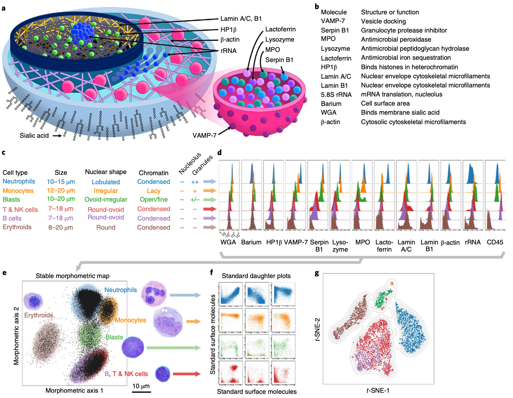

```{r setup, include=FALSE}
knitr::opts_chunk$set(echo = FALSE)
```

## Agenda

- Mini-JC: Scatterbody (Tsai et al., 2020, *Nature Medicine*)
- New Classifier (aka Classifier 1.5)
- New Classifier + AML

## Scatterbody paper - Motivations

- Cytometry analysis (clinical or research) identifies populations of cells based on their protein expression patterns (i.e. immunophenotypes)

- However, tumor cells are often very similar to their native lineage in marker expression; they can also abnormally express (or lack) virtually any surface molecule. 

- Thus, classification schemes used on normal cell types alone may not be reliable for the identification or characterization of cancer cells. 

- Often, cytometric analysis and microscopic inspection of cells' subcellular features by a pathologist must be integrated in order to get a sense of the underlying biology
  
## Scatterbody paper - Main point 

- "Scatterbodies" are antibodies that measure cellular antigens that serve as quantitaive surrogates for cells' shape, size, and other morphological features. These include the following: 
  - granularity
  - granular color
  - chromatin quality 
  - nuclear shape 
  - nucleolar size 
  - cytoplasmic color
  - cell size
  
- Idea is to perform quantitative **morphometry** (the study of cell shape and size) using CyTOF. 


## Figure 1



## Slide with Plot

```{r pressure}
plot(pressure)
```

