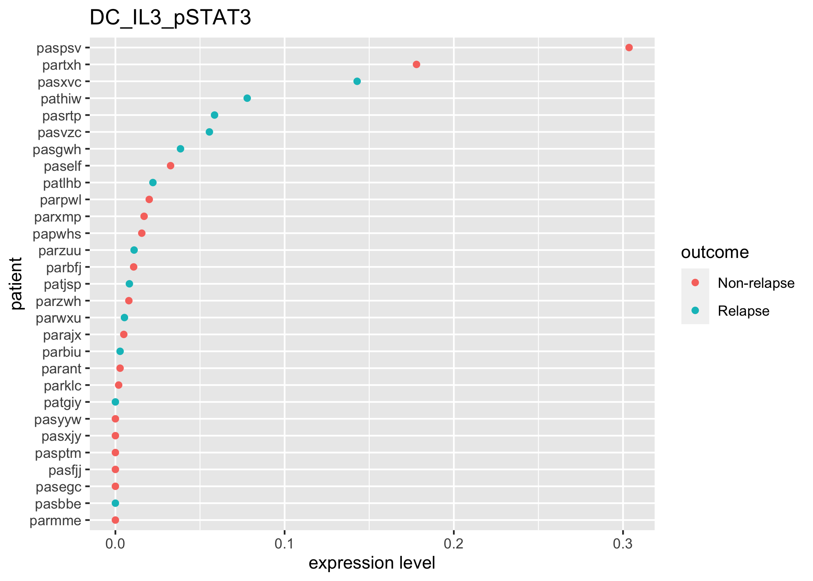
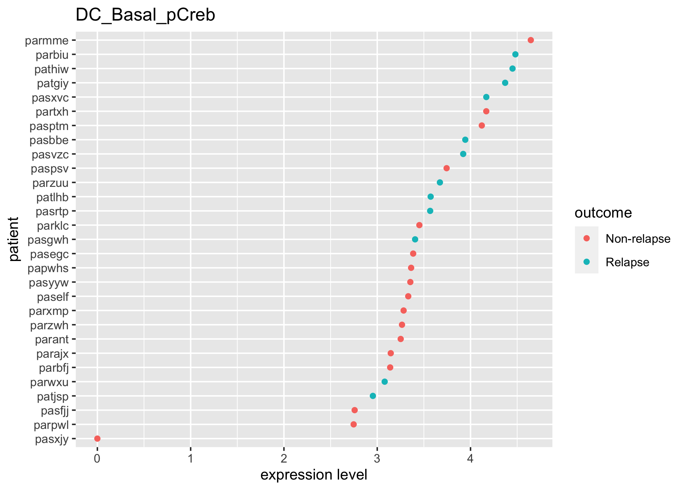

AML Predictive Modeling Vignette
================
tkeyes
2020-10-16

  - [Reading in data](#reading-in-data)
  - [Very quick EDA](#very-quick-eda)
      - [What samples do we have?](#what-samples-do-we-have)
      - [Mahalanobis developmental classifier
        features](#mahalanobis-developmental-classifier-features)
      - [Cosine developmental classifier
        features](#cosine-developmental-classifier-features)
  - [Split data](#split-data)
  - [Set up the modeling objects](#set-up-the-modeling-objects)
  - [Tune the model](#tune-the-model)
  - [Fitting the whole model(s)](#fitting-the-whole-models)
  - [Future Directions](#future-directions)
  - [Session Info](#session-info)

``` r
# Libraries
libraries <- 
  c(
    "tidyverse", 
    "tidymodels", 
    "rlang", 
    "ggthemes", 
    "doParallel", 
    "vip"
  )

source(here::here("scripts", "setup", "aml_utils.R")) 
call_libraries(libraries)

# Parameters
set_global_variables(locale = "galaxia")
md_path <- here::here("data-raw", "AML_metadata.xlsx")
tidyTOF_directory <- file.path("~", "GitHub", "tidyTOF")

CLUSTER_OUTPUT <- here::here("data", "cancer_data_clustered.rds")

# Sourcing tidyTOF functions
source_tidyTOF(tidyTOF_directory)

# set up aml marker and patient information
marker_setup()
patient_setup()

# Misc globals for running different parts of this vignette
mah_dev_path <- here::here("data", "mahalanobis_dev_features_10.rds")
cos_dev_path <- here::here("data", "cosine_dev_features_10.rds")
mah_citrus_path <- here::here("data", "mahalanobis_citrus_features.rds")
cos_citrus_path <- here::here("data", "cosine_citrus_features.rds")
md_path <- here::here("data", "md.rds")

DDPR_PROP <- 0.8

# set a randomness seed to make everything reproducible 

set.seed(2020)
```

# Reading in data

First, I read in the data that I’ve extracted from the AML dataset. (I
also load some other datasets here that I’ve played with, but I don’t
use them in the current analysis…yet.)

The data have already been pre-processed according to the procedure
described
[here](https://github.com/keyes-timothy/aml-cells/blob/master/reports/aml_intro_vignette.md),
and patient-level features have been extracted from the single-cell data
according to the procedure described
[here](https://github.com/keyes-timothy/aml-cells/blob/master/reports/aml_feature_extraction_vignette.md).

``` r
# read in metadata
metadata <- 
  md_path %>% 
  read_rds() %>% 
  transmute(
    patient, 
    age = age_at_diagnosis_in_days, 
    wbc = wbc_at_diagnosis, 
    outcome = first_event %>% str_replace("Censored", "Non-relapse")
  )

# reading in mahalanobis distance-classified AML data
mah_dev_data <- 
  mah_dev_path %>% 
  read_rds() %>% 
  filter(condition == "dx") %>% 
  left_join(metadata, by = "patient") %>% 
  replace(list = is.na(.), values = 0)

# reading in cosine distance-classified AML data
cos_dev_data <- 
  cos_dev_path %>% 
  read_rds() %>% 
  filter(condition == "dx") %>% 
  left_join(metadata, by = "patient") %>% 
  replace(list = is.na(.), values = 0)

# reading in mahalanobis distance-classified citrus data
mah_citrus_data <- 
  mah_citrus_path %>% 
  read_rds() %>% 
  filter(condition == "dx") %>% 
  left_join(metadata, by = "patient") %>% 
  replace(list = is.na(.), values = 0)

# reading in cosine distance-classified citrus data
cos_citrus_data <- 
  cos_citrus_path %>% 
  read_rds() %>% 
  filter(condition == "dx") %>% 
  left_join(metadata, by = "patient") %>% 
  replace(list = is.na(.), values = 0)
```

# Very quick EDA

Before any predictive modeling, it’s good practice to do a little bit of
exploratory data analysis (EDA) just to make sure you know what you’re
looking at and what you should expect from your model. I give what
amounts to essentially the bare minimum of EDA here just to illustrate a
few points that are on my mind about the AML dataset…

## What samples do we have?

``` r
mah_dev_data %>% 
  count(condition, outcome) %>% 
  knitr::kable() 
```

| condition | outcome     |  n |
| :-------- | :---------- | -: |
| dx        | Non-relapse | 17 |
| dx        | Relapse     | 12 |

Okay, so we have 29 samples in total, and 12 of them relapse (17 of them
don’t). So, this cohort is relatively small and should mostly be used
for **discovery**, or hypothesis-generation. This will inform some of
our modeling choices later, since we don’t really have enough samples to
do a true train/test validation in the most rigorous sense.

## Mahalanobis developmental classifier features

Here are some PCA plots showing how well our samples can be separated in
two dimensions based on their extracted DDPR features.

``` r
# needs to show the percentage variance for each PC in the plot

pca_recipe <- 
  recipe(
    ~., 
    data = 
      mah_dev_data %>% 
      replace(list = is.na(.), values = 0)
  ) %>% 
  step_zv(all_numeric()) %>% 
  step_normalize(all_numeric()) %>% 
  step_pca(all_numeric(), num_comp = 5) 

pca_prep <- prep(pca_recipe)

pca_result <- juice(pca_prep)

pca_result %>% 
  ggplot(aes(x = PC1, y = PC2, color = outcome)) + 
  geom_point(size = 3, alpha = 0.7) + 
  labs(title = "Developmental Classifier Features using Mahalanobis Distance")
```

<!-- -->

And here is some code that plots features in a way that we can try to
interpret later (we will return to this after the modeling steps).

``` r
mah_dev_data %>% 
  pivot_longer(
    cols = c(-patient, -condition, -outcome), 
    names_to = "feature", 
    values_to = "value"
  ) %>% 
  group_by(feature) %>% 
  nest() %>%
  mutate(
    plots = 
      map2(
        .x = data, 
        .y = feature,
        .f = 
          ~ ggplot(
            aes(x = fct_reorder(patient, value), y = value, color = outcome), 
            data = .x
          ) + 
          geom_point() + 
          coord_flip() + 
          labs(title = feature, x = "patient", y = "expression level")
      )
  ) %>% 
  pull(plots) %>% 
  `[`(seq(1, length(colnames(mah_dev_data)), 100))
```

    ## [[1]]

<!-- -->

    ## 
    ## [[2]]

<!-- -->

    ## 
    ## [[3]]

<!-- -->

    ## 
    ## [[4]]

<!-- -->

    ## 
    ## [[5]]

<!-- -->

    ## 
    ## [[6]]

<!-- -->

    ## 
    ## [[7]]

<!-- -->

From these more or less randomly sampled plots, I hope to illustrate a
trend for many of our features - that most of them are right-skewed (aka
most patients have relatively low values within the same(ish) range, but
several patients will be quite a bit higher than the others on each
feature).

Here is a bit more evidence of this:

``` r
density_data <- 
  mah_dev_data %>% 
  mutate(across(.cols = where(is.numeric), scale)) %>%
  select(-patient, -condition, -outcome) %>% 
  pivot_longer(
    cols = everything(), 
    names_to = "channel", 
    values_to = "expression"
  ) 

density_data %>% 
  ggplot(aes(x = expression, group = channel)) + 
  geom_density(size = 0.1) + 
  geom_density(data = density_data, mapping = aes(x = expression, group = NULL), color = "red")
```

<!-- -->

## Cosine developmental classifier features

We can make the same PCA plot as above for the classifier data that was
classified using the cosine distance between cells and each
manually-gated healthy population rather than the Mahalanobis distance.

``` r
# needs to show the percentage variance for each PC in the plot

pca_recipe <- 
  recipe(
    ~., 
    data = 
      cos_dev_data %>% 
      replace(list = is.na(.), values = 0)
  ) %>% 
  step_zv(all_numeric()) %>% 
  step_normalize(all_numeric()) %>% 
  step_pca(all_numeric(), num_comp = 5) 

pca_prep <- prep(pca_recipe)

pca_result <- juice(pca_prep)

pca_result %>% 
  ggplot(aes(x = PC1, y = PC2, color = outcome)) + 
  geom_point(size = 3, alpha = 0.7)  + 
  labs(title = "Developmental Classifier Features using Cosine Distance")
```

<!-- -->

``` r
density_data <- 
  cos_dev_data %>% 
  mutate(across(.cols = where(is.numeric), scale)) %>%
  select(-patient, -condition, -outcome) %>% 
  pivot_longer(
    cols = everything(), 
    names_to = "channel", 
    values_to = "expression"
  ) 

density_data %>% 
  ggplot(aes(x = expression, group = channel)) + 
  geom_density(size = 0.1) + 
  geom_density(data = density_data, mapping = aes(x = expression, group = NULL), color = "red")
```

<!-- -->

My point in showing these plots for the cosine data (even though we’re
really not going to look at it again in this presentation) is to
illustrate that it doesn’t seem to just be the Mahalanobis distance that
introduces these properties to our feature matrices - they seem to be a
property of the data (as represented by these feature extractions).

With this small amount of EDA behind us, we can move on to the modeling
steps.

# Split data

Because this dataset has been earmarked for discovery, we are not going
to divide the data into a traditional “training” and “test” set for this
specific task. Instead, we are going to break up the data into 5
cross-validation folds, wherein each fold will treat 80% of the data as
an **analysis set** that will be used to fit the model and 20% of the
data as an **assessment set** that will be used to evaluate the model.
(5 is an arbitrary number of cv folds, by the way. You can choose more
or less if you want.)

If we repeat this cross-validation strategy multiple times (**repeated
cross-validation**), we can try to get around our small sample size by
simulating access to multiple datasets. This overall procedure is
sometimes referred to as “resampling” in the statistics world. The
package {rsample} makes this process really painless in R.

``` r
mah_dev_cv <- 
  mah_dev_data %>% 
  vfold_cv(v = 5, repeats = 10, strata = outcome) 

cos_dev_cv <- 
  cos_dev_data %>% 
  vfold_cv(v = 5, repeats = 10, strata = outcome)

mah_dev_cv
```

    ## #  5-fold cross-validation repeated 10 times using stratification 
    ## # A tibble: 50 x 3
    ##    splits         id       id2  
    ##    <list>         <chr>    <chr>
    ##  1 <split [22/7]> Repeat01 Fold1
    ##  2 <split [22/7]> Repeat01 Fold2
    ##  3 <split [24/5]> Repeat01 Fold3
    ##  4 <split [24/5]> Repeat01 Fold4
    ##  5 <split [24/5]> Repeat01 Fold5
    ##  6 <split [22/7]> Repeat02 Fold1
    ##  7 <split [22/7]> Repeat02 Fold2
    ##  8 <split [24/5]> Repeat02 Fold3
    ##  9 <split [24/5]> Repeat02 Fold4
    ## 10 <split [24/5]> Repeat02 Fold5
    ## # … with 40 more rows

This data structure will come in handy later.

# Set up the modeling objects

I’ve built my modeling framework in the
[{tidymodels}](https://www.tidymodels.org/) ecosystem, which is a
powerful suite of R packages for preprocessing, modeling,
post-processing, and interpreting machine learning models in R. There
are a lot of great design principles here, which is why I’m using it for
the modelings tasks here.

There’s a [new free book](https://www.tmwr.org/) out about tidymodels,
which you should check out if you’re interested. Or I can just do all of
the modeling for your project ;)

First, I use the tidymodels package {recipes} to build a reproducible
preprocessing framework for the data. Then, I use {dials} to create a
grid (using maximum entropy) over which to search for the optimal
elastic net parameters. Then, I use the modeling package {parsnip} to
make the model specification (a logistic regression model with elastic
net regularization). Finally, I incorporate each of these steps into a
single workflow using the package {workflows}.

``` r
# preprocessing
ddpr_dev_recipe <- 
  mah_dev_data %>% 
  mutate(outcome = as.factor(outcome)) %>% 
  recipe(formula = outcome ~ .) %>% 
  step_rm(patient, condition) %>% 
  step_normalize(-outcome)

# model turning
en_param_grid <-
  parameters(penalty(), mixture()) %>% 
  grid_max_entropy(size = 100)
  # an alternative would be a regular grid, but this is slower
  # grid_regular(levels = c(5, 5))

# model specification
ddpr_en_model_spec <- 
  logistic_reg(penalty = tune(), mixture = tune()) %>%
  set_engine("glmnet") %>% 
  set_mode("classification")

# overall workflow
ddpr_en_workflow <- 
  workflow() %>% 
  add_recipe(ddpr_dev_recipe) %>% 
  add_model(ddpr_en_model_spec)
```

# Tune the model

With these initial pieces, I can use the {tune} package to fit thousands
of models over both my cross validation folds and my candidate values
for both of my elastic net parameters to find the optimal
hyperparameters. By running this step in parallel on multiple cores on
my laptop, I can save some time.

``` r
# Note that tidymodels runs on a {foreach} backend, 
# which means that we can register a parallel worker to 
# speed up our processing speed quite a bit 

my_cluster <- makeCluster(14)
registerDoParallel(my_cluster)

ddpr_en_tune <- 
  tune_grid(
    ddpr_en_workflow, 
    resamples = mah_dev_cv, 
    grid = en_param_grid
  )

stopCluster(my_cluster)
```

This gives us a massive nested tibble that will have accuracy metrics
for each fold and each repetition of the resampling procedure. Together,
these should give us a good estimate of which hyperparameters work best
for the model.

Our strategy here will be to take each repetition and consider it
separately. Specifically, we will

1)  For each repetition, find the hyperparameter values associated with
    the highest accuracy across all folds. That is, calculate the model
    accuracy across all folds for each hyperparameter set and pick the
    one that has the highest average performance as “optimal.”
2)  If there are any ties, pick the model with the highest penalty (the
    **maximum parsimony** principle). If there is still a tie, pick the
    model with the highest L1 regularization (Lasso penalty). Both of
    these tie-breakers will result in simpler, sparser models (models
    with fewer predictors).
3)  Refit the original dataset using the “optimal” hyperparameters from
    each repetition and interrogate those models.

<!-- end list -->

``` r
optimal_metrics <- 
  ddpr_en_tune %>% 
  unnest(cols = .metrics) %>% 
  filter(.metric == "accuracy") %>% 
  rename(repetition = id, fold = id2) %>% 
  group_by(repetition, penalty, mixture) %>% 
  summarize(mean_accuracy = mean(.estimate)) %>% 
  group_by(repetition, .add = FALSE) %>% 
  slice_max(order_by = mean_accuracy, n = 1) %>% 
  slice_max(order_by = penalty, n = 1) %>% 
  slice_max(order_by = mixture, n = 1) %>% 
  ungroup()
```

    ## `summarise()` regrouping output by 'repetition', 'penalty' (override with `.groups` argument)

``` r
optimal_metrics
```

    ## # A tibble: 10 x 4
    ##    repetition    penalty mixture mean_accuracy
    ##    <chr>           <dbl>   <dbl>         <dbl>
    ##  1 Repeat01   0.0854       0.277         0.709
    ##  2 Repeat02   0.0777       0.461         0.646
    ##  3 Repeat03   0.00000382   0.966         0.709
    ##  4 Repeat04   0.0777       0.461         0.743
    ##  5 Repeat05   0.221        0.872         0.64 
    ##  6 Repeat06   0.587        0.673         0.589
    ##  7 Repeat07   0.0777       0.461         0.697
    ##  8 Repeat08   0.0819       0.796         0.663
    ##  9 Repeat09   0.356        0.126         0.657
    ## 10 Repeat10   0.373        0.469         0.617

From this, we can see that the estimates are a bit all-over-the-place,
which makes sense, because our N is small, our samples comes from a very
diverse underlying population (all AML patients).

A visualization:

``` r
optimal_metrics %>% 
  mutate(
    repetition = fct_reorder(repetition, mean_accuracy, .desc = TRUE)
  ) %>% 
  ggplot(aes(x = repetition, y = mean_accuracy)) + 
  geom_hline(
    yintercept = mean(optimal_metrics$mean_accuracy), 
    color = "red", 
    linetype = "dashed", 
    size = 1
  ) + 
  geom_pointrange(aes(ymax = mean_accuracy, ymin = 0), size = 1) +
  annotate(
    geom = "text",
    x = 
      fct_reorder(
        optimal_metrics$repetition, 
        optimal_metrics$mean_accuracy, 
        .desc = TRUE
      ) %>% 
      levels() %>% 
      last(),
    y = mean(optimal_metrics$mean_accuracy) + 0.02,
    label = str_c((mean(optimal_metrics$mean_accuracy) * 100) %>% round(1), "%"),
    color = "red", 
    size = 4
  ) +
  scale_y_continuous(labels = scales::label_percent(accuracy = 1)) + 
  labs(x = NULL, y = "Mean accuracy across CV folds") + 
  theme_light()
```

<!-- -->

This can help us understand the accuracy of our model across the 10
different resamplings.

# Fitting the whole model(s)

So, now we have 10 resamplings’ worth of models, each of which has
identified some optimal parameters for fitting the model. So, what do we
do now?

We have to go back to the original dataset and fit each of these models
on the entire dataset. From there, we can start asking questions about
which of the features are most important across all of our folds and
resamplings - the idea is that features that come up multiple times
represent the most interesting candidates for us to interrogate further.

``` r
optimal_metrics <- 
  optimal_metrics %>% 
  mutate(
    models = 
      map2(
        .x = penalty, 
        .y = mixture, 
        .f = ~
          finalize_workflow(
            x = ddpr_en_workflow, 
            parameters = tibble(penalty = .x, mixture = .y)
          ) %>% 
          fit(object = ., data = mah_dev_data)
      ),
    importance_scores =
      map(
        .x = models, 
        .f = ~ 
          .x %>%
          pluck("fit") %>%
          pluck("fit") %>%
          vi()
      )
  )


coefficient_counts <- 
  optimal_metrics %>% 
  pull(importance_scores) %>% 
  map(
    .x = ., 
    .f = ~
      .x %>% 
      slice_max(order_by = Importance, n = 10) %>% 
      pull(Variable)
  ) %>% 
  flatten_chr() %>% 
  tibble(variable = .) %>% 
  count(variable) %>% 
  arrange(desc(n))

coefficient_counts
```

    ## # A tibble: 13 x 2
    ##    variable                  n
    ##    <chr>                 <int>
    ##  1 DC_CD90                  10
    ##  2 HSC_GMCSF_pS6            10
    ##  3 Monocyte_CD117           10
    ##  4 Monocyte_IL6_pS6         10
    ##  5 Thrombocyte_abundance    10
    ##  6 Thrombocyte_IL6_pS6      10
    ##  7 wbc                      10
    ##  8 HSC_IL6_pS6               9
    ##  9 MPP_IL6_pS6               8
    ## 10 DC_Basal_pCreb            4
    ## 11 MEP_CD33                  4
    ## 12 Monocyte_Basal_pS6        4
    ## 13 MPP_CD33                  1

We can see that some features come up in most of the 10 resamplings and
others don’t…

``` r
coefficient_names <- 
  coefficient_counts %>% 
  pull("variable")

coefficient_names
```

    ##  [1] "DC_CD90"               "HSC_GMCSF_pS6"         "Monocyte_CD117"       
    ##  [4] "Monocyte_IL6_pS6"      "Thrombocyte_abundance" "Thrombocyte_IL6_pS6"  
    ##  [7] "wbc"                   "HSC_IL6_pS6"           "MPP_IL6_pS6"          
    ## [10] "DC_Basal_pCreb"        "MEP_CD33"              "Monocyte_Basal_pS6"   
    ## [13] "MPP_CD33"

And a visualization of the most predictive features:

``` r
mah_dev_data %>% 
  pivot_longer(
    cols = c(-patient, -condition, -outcome), 
    names_to = "feature", 
    values_to = "value"
  ) %>% 
  group_by(feature) %>% 
  nest() %>%
  mutate(
    plots = 
      map2(
        .x = data, 
        .y = feature,
        .f = 
          ~ ggplot(
            aes(x = fct_reorder(patient, value), y = value, color = outcome), 
            data = .x
          ) + 
          geom_point() + 
          coord_flip() + 
          labs(title = feature, x = "patient", y = "expression level")
      )
  ) %>% 
  filter(feature %in% coefficient_names) %>% 
  pull(plots) %>% 
  walk(print)
```

<!-- --><!-- --><!-- --><!-- --><!-- --><!-- --><!-- --><!-- --><!-- --><!-- --><!-- --><!-- --><!-- -->

From there, we can use our models that were fit on the entire dataset
and see where they performed best.

``` r
perf_metrics <- metric_set(accuracy, sens, spec, f_meas)

performance_metrics <- 
  optimal_metrics %>% 
  mutate(
    predictions = 
      map(
        .x = models, 
        .f = ~
          predict(object = .x, new_data = mah_dev_data)
      ), 
    performance_metrics =
      map(
        .x = predictions,
        .f = ~
          .x %>%
          mutate(truth = as.factor(mah_dev_data$outcome)) %>%
          perf_metrics(
            truth = truth,
            estimate = .pred_class
          )
      )
  )

performance_metrics %>% 
  pull(performance_metrics) %>% 
  bind_rows() %>% 
  select(-.estimator) %>% 
  group_by(.metric) %>% 
  summarize(.estimate = mean(.estimate))
```

    ## `summarise()` ungrouping output (override with `.groups` argument)

    ## # A tibble: 4 x 2
    ##   .metric  .estimate
    ##   <chr>        <dbl>
    ## 1 accuracy     0.9  
    ## 2 f_meas       0.933
    ## 3 sens         1    
    ## 4 spec         0.758

In general, we can see that, on average, each of the resampled models
(when rerun on all the data) give us good sensitivity and *decent*
specificity. Recall that

  - Sensitivity refers to the number of **True Positives** that are
    captured by the model (i.e. proportion of True Positives that the
    model labels as positive)
  - Specificity refers to the number of **True Negatives** that are
    captured by the model (i.e. proportion of True Negatives that the
    model labels as negative).

Thus, our model has a bias for labeling kids as having a risk of relapse
even if they don’t.

Using our favorite features, we can now rerun our PCA and see if the
patients segregate better using just our favorite features:

``` r
pca_recipe <- 
  recipe(
    ~., 
    data = 
      mah_dev_data %>% 
      select(all_of(c("outcome", coefficient_names))),
  ) %>% 
  step_zv(all_numeric()) %>% 
  step_normalize(all_numeric()) %>% 
  step_pca(all_numeric(), num_comp = 5)

pca_prep <- prep(pca_recipe)

pca_result <- juice(pca_prep)

pca_result %>% 
  mutate(outcome = fct_rev(outcome)) %>% 
  ggplot(aes(x = PC1, y = PC2, color = outcome)) + 
  geom_point(size = 3, alpha = 0.7) + 
  labs(title = "Developmental Classifier Features using Mahalanobis Distance")
```

<!-- -->

Finally, we store the vector containing the name of the most-predictive
features in its own file so that we can reference it later.

``` r
coefficient_names %>% 
  write_rds(
    x = ., 
    file = here::here("data", "modeling_logistic", "mah_dev_feature_names.rds")
  ) 
```

# Future Directions

The frustrating thing about being a bioinformatician-in-training (at
least according to me) is that my “taste” in data science has matured
much faster than my technical ability. So, what I’ve presented here
represents only a very, very small degree of what I’m actually
interested in looking at even for this tiny corner of my project\!

Here are the other things on my mind:

  - Looking at other feature matrices
      - Compare feature matrices extracted using the DDPR methodology to
        those extracted using CITRUS/Scaffold methodolody
      - Compare the performance of feature matrices extracted using the
        DDPR classifier to classifiers built with flowSOM and PhenoGraph
        clustering
      - Compare the performance of feature matrices extracted using the
        DDPR classifier to matrices extracted using clustering on its
        own (without referencing the healthy spaces)
      - Build my own custom feature matrices using mutual information or
        the EMD to quantify signaling variables in a more subtle way.
      - Regardless of which of these feature matrices I use, it makes
        sense for me to think about performing a box-cox transformation
  - Deep learning
      - I want to do this so badly
      - We are limited in power in terms of patients, but not in terms
        of cells. The single-cell information could be very powerful
        here.
      - Finding developmental feature embeddings on a single-cell level
        will be much more possible (and cooler) with deep learning
        approaches - because we will avoid losing much of the resolution
        that we lose here
      - I want to do this so so so so badly
  - Review of theory
      - I need to do a bit more reading to adapt these models from
        logistic regression to surival regression (Cox modeling), which
        is more appropriate here
      - I need to do a bit more reading about “variable importance
        metrics” and how reliable they are.
      - I need to do a bit more reading about how elastic net works to
        make sure I know what its notion of “variable importance” means
        more rigorously, and how I can coerce it to give me p-values
        (which journals care about).

# Session Info

``` r
sessionInfo()
```

    ## R version 3.6.2 (2019-12-12)
    ## Platform: x86_64-apple-darwin15.6.0 (64-bit)
    ## Running under: macOS Mojave 10.14.6
    ## 
    ## Matrix products: default
    ## BLAS:   /Library/Frameworks/R.framework/Versions/3.6/Resources/lib/libRblas.0.dylib
    ## LAPACK: /Library/Frameworks/R.framework/Versions/3.6/Resources/lib/libRlapack.dylib
    ## 
    ## locale:
    ## [1] en_US.UTF-8/en_US.UTF-8/en_US.UTF-8/C/en_US.UTF-8/en_US.UTF-8
    ## 
    ## attached base packages:
    ## [1] parallel  stats     graphics  grDevices utils     datasets  methods  
    ## [8] base     
    ## 
    ## other attached packages:
    ##  [1] vip_0.2.2         doParallel_1.0.15 iterators_1.0.12  foreach_1.5.0    
    ##  [5] ggthemes_4.2.0    rlang_0.4.7       yardstick_0.0.7   workflows_0.2.0  
    ##  [9] tune_0.1.1        rsample_0.0.8     recipes_0.1.13    parsnip_0.1.3    
    ## [13] modeldata_0.0.2   infer_0.5.3       dials_0.0.9       scales_1.1.1     
    ## [17] broom_0.7.1       tidymodels_0.1.1  forcats_0.4.0     stringr_1.4.0    
    ## [21] dplyr_1.0.2       purrr_0.3.4       readr_1.4.0       tidyr_1.1.2      
    ## [25] tibble_3.0.3      ggplot2_3.3.2     tidyverse_1.3.0  
    ## 
    ## loaded via a namespace (and not attached):
    ##  [1] colorspace_1.4-1   ellipsis_0.3.1     class_7.3-15       rprojroot_1.3-2   
    ##  [5] fs_1.3.1           rstudioapi_0.11    listenv_0.8.0      furrr_0.1.0       
    ##  [9] farver_2.0.3       prodlim_2019.11.13 fansi_0.4.1        lubridate_1.7.9   
    ## [13] xml2_1.2.2         codetools_0.2-16   splines_3.6.2      knitr_1.27        
    ## [17] jsonlite_1.7.1     pROC_1.16.1        dbplyr_1.4.4       compiler_3.6.2    
    ## [21] httr_1.4.2         backports_1.1.5    assertthat_0.2.1   Matrix_1.2-18     
    ## [25] cli_2.0.2          htmltools_0.4.0    tools_3.6.2        gtable_0.3.0      
    ## [29] glue_1.4.1         Rcpp_1.0.3         cellranger_1.1.0   DiceDesign_1.8-1  
    ## [33] vctrs_0.3.4        timeDate_3043.102  gower_0.2.1        xfun_0.12         
    ## [37] globals_0.12.5     rvest_0.3.5        lifecycle_0.2.0    future_1.16.0     
    ## [41] MASS_7.3-51.5      ipred_0.9-9        hms_0.5.2          yaml_2.2.0        
    ## [45] gridExtra_2.3      rpart_4.1-15       stringi_1.4.5      highr_0.8         
    ## [49] lhs_1.0.1          hardhat_0.1.4      lava_1.6.6         shape_1.4.4       
    ## [53] pkgconfig_2.0.3    evaluate_0.14      lattice_0.20-38    labeling_0.3      
    ## [57] tidyselect_1.1.0   here_0.1           plyr_1.8.5         magrittr_1.5      
    ## [61] R6_2.4.1           generics_0.0.2     DBI_1.1.0          pillar_1.4.3      
    ## [65] haven_2.2.0        withr_2.3.0        survival_3.1-8     nnet_7.3-12       
    ## [69] modelr_0.1.5       crayon_1.3.4       utf8_1.1.4         rmarkdown_2.4     
    ## [73] grid_3.6.2         readxl_1.3.1       blob_1.2.1         reprex_0.3.0      
    ## [77] digest_0.6.23      GPfit_1.0-8        munsell_0.5.0      glmnet_4.0-2
