# Set-up


```r
# libraries
library(tidyverse)
library(tidytof)
library(pheatmap)
library(patchwork)

# source aml utils
source(here::here("scripts", "setup", "aml_utils.R"))

# parameters
num_flowsom_clusters <- 30
set_global_variables(locale = "galaxia")
r21_md_path <- here::here("data-raw", "r21", "r21_metadata.xlsx")
r21_metadata_path <-
  file.path(
    "~", 
    "Box", 
    "KD Lab Shared Data", 
    "R21 AML Baylor datasets", 
    "metadata"
  )
r21_healthy_path <- 
  file.path(
    "~", 
    "Box", 
    "KD Lab Shared Data", 
    "R21 AML Baylor datasets", 
    "r21_healthy_myeloid"
  )
csv_path <- 
  file.path(
    "~", 
    "Box", 
    "KD Lab Shared Data", 
    "R21 AML Baylor datasets", 
    "classified_r21_csvs_3"
  )

MYELOID_LEVELS <- 
  c(
    "HSCs",
    "MPPs", 
    "CMPs", 
    "MEPs", 
    "GMPs", 
    "macrophages", 
    "monocytes", 
    "megakaryocytes", 
    "DCs"
  )

# set up aml marker and patient information
marker_setup()
patient_setup()

# paths 
data_path <- 
  file.path(
    "~", 
    "Box", 
    "KD Lab Shared Data", 
    "R21 AML Baylor datasets", 
    "Ex02"
  )
```

<div style="page-break-before: always;" />

# Read in data

The datasets we are working with in this analysis are the following: 

-  R21 experiments (archived 8/2021; 19 patients and 4 healthy samples) 
-  Metadata from the R21 experiments 
-  Manually gated healthy myeloid cells from the R21 experiments (after
   lymphoid cells, doublets, artefacts, etc. have been removed)


```r
# r21 single-cell data
r21 <- 
  data_path %>% 
  tof_read_data()

# r21 metadata
r21_md <- 
  r21_md_path %>% 
  readxl::read_excel()

# healthy (gated) myeloid cells from the r21 project
r21_healthy <- 
  r21_healthy_path %>% 
  tof_read_data()
```

## Data diagnostics


```r
cell_summary <- 
  r21 %>% 
  count(file_name, sort = TRUE) %>% 
  summarize(
    mean_cells = mean(n), 
    max_cells = max(n), 
    min_cells = min(n)
  )


r21 %>% 
  count(file_name, sort = TRUE) %>% 
  mutate(file_name = fct_reorder(file_name, -n)) %>% 
  ggplot(aes(x = file_name, y = n)) + 
  geom_hline(
    yintercept = cell_summary$mean_cells, 
    color = "red", 
    linetype = "dashed"
  ) + 
  geom_col() + 
  theme_bw() + 
  theme(axis.text.x = element_blank(), axis.ticks.x = element_blank()) + 
  labs(x = "file", y = "Number of cells", caption = "Dashed line = mean")
```

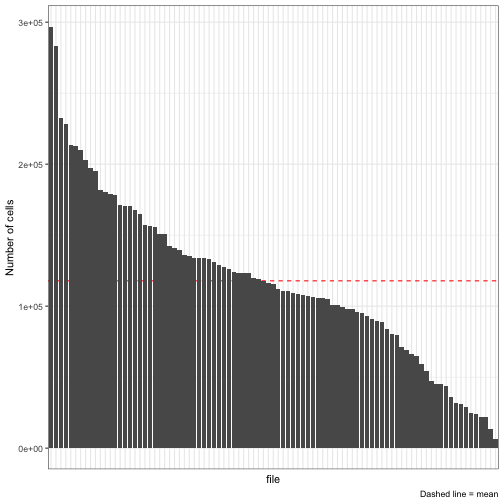

On average, we collected about 1.18 &times; 10<sup>5</sup> cells per sample, with the largest sample having 2.97 &times; 10<sup>5</sup> cells and the smallest sample having 7000 cells.


```r
num_samples <- 
  r21 %>% 
  distinct(file_name) %>% 
  nrow()

print(num_samples)
```

```
## [1] 91
```

And we have 91 unique samples.

However, these samples are derived from a smaller number of patients (from whom we have multiple samples, some of which are stimulated, some of which are not; some of which are from the diagnostic specimen, some of which are from the paired eoi specimen).

## Data annotation

We can store this additional information for each cell by parsing the names of the files that were read in using `tof_read_data`


```r
r21 <- 
  r21 %>% 
  mutate(
    condition = 
      case_when(
        str_detect(file_name, "Dx|DX") ~ "diagnosis", 
        str_detect(file_name, "Rx|RX") ~ "eoi", 
        str_detect(file_name, "Healthy") ~ "healthy"
      ), 
    stimulation = 
      if_else(str_detect(file_name, "basal|Basal"), "basal", "stimulation"), 
    patient = 
      str_remove(file_name, "^[:alnum:]+_") %>% 
      str_extract("[:alnum:]+(?=_|[:space:])"), 
    patient = if_else(patient == "Healthy", "Healthy0", patient)
  )
```

<div style="page-break-before: always;" />

# Preprocessing and data cleaning

We can also perform some preprocessing on the input data to make it analysis-ready.

## Removing junk columns

There are some columns in the original data that we don't need (because they are empty, they encode non-biological information, etc.). We can remove them:


```r
r21 <- 
  r21 %>% 
  select(
    -matches("BC[123456]", ignore.case = FALSE),
    -Time,
    -Event_length,
    -contains("empty"),
    -`Caspase3|Dy161`,
    -contains("DNA"),
    -Center,
    -Offset,
    -Width,
    -Residual
  ) %>%
  relocate(file_name, patient, condition, stimulation, everything()) %>% 
  rename_with(
    .cols = contains("|"), 
    .fn = function(nm) str_to_lower(str_remove(nm, "\\|.+$"))
  )
```

The final columns we end up with are as follows:


```r
r21 %>% 
  colnames()
```

```
##  [1] "file_name"   "patient"     "condition"   "stimulation" "cd45"       
##  [6] "cd61"        "cd99"        "cd45ra"      "cll1"        "cd3_cd19"   
## [11] "cd44"        "cd117"       "cd123"       "cd93"        "cd90"       
## [16] "cd34"        "cd32"        "pstat5"      "cd11c"       "cd13"       
## [21] "pakt"        "tim3"        "cd56"        "bclxl"       "pu1"        
## [26] "cd33"        "pdl1"        "cd14"        "cd38"        "pstat3"     
## [31] "bcl2"        "cd16"        "cd68"        "mpo"         "pstat1"     
## [36] "cd47"        "cd135"       "cd244"       "ps6"         "cd49f"      
## [41] "hladr"       "cd71"        "pcreb"       "cd11b"
```

And we can perform similar column junk removal for the gated r21 cells. 


```r
r21_healthy <- 
  r21_healthy %>% 
  mutate(
    gated_cluster =
      file_name %>% 
      str_extract("_[:alpha:]+.fcs$") %>% 
      str_remove_all("_|\\.fcs")
  ) %>%     
  select(
    -matches("BC[123456]", ignore.case = FALSE), 
    -Time, 
    -Event_length, 
    -contains("empty"), 
    -`Caspase3|Dy161`, 
    -contains("DNA"), 
    -Center, 
    -Offset, 
    -Width, 
    -Residual
  ) %>% 
  rename_with(
    .cols = contains("|"), 
    .fn = function(nm) str_to_lower(str_remove(nm, "\\|.+$"))
  )

colnames(r21_healthy)
```

```
##  [1] "file_name"     "cd45"          "cd61"          "cd99"         
##  [5] "cd45ra"        "cll1"          "cd3_cd19"      "cd44"         
##  [9] "cd117"         "cd123"         "cd93"          "cd90"         
## [13] "cd34"          "cd32"          "pstat5"        "cd11c"        
## [17] "cd13"          "pakt"          "tim3"          "cd56"         
## [21] "bclxl"         "pu1"           "cd33"          "pdl1"         
## [25] "cd14"          "cd38"          "pstat3"        "bcl2"         
## [29] "cd16"          "cd68"          "mpo"           "pstat1"       
## [33] "cd47"          "cd135"         "cd244"         "ps6"          
## [37] "cd49f"         "hladr"         "cd71"          "pcreb"        
## [41] "cd11b"         "gated_cluster"
```


## Variance-stabilizing transformation and noise removal

We can then preprocess the numeric columns in the dataset using the standard arcsinh transformation and by undoing the noise that Fluidigm software adds to each cell:


```r
r21 <- 
  r21 %>% 
  tof_preprocess(undo_noise = FALSE)

r21_healthy <- 
  r21_healthy %>% 
  tof_preprocess(undo_noise = FALSE)
```

With that, the data are analysis-ready!

<div style="page-break-before: always;" />

# Analysis

The overall goal of this analysis will be to use the healthy samples to develop some kind of unsupervised strategy for identifying MRD+ patients in our cohort using their paired Dx and EOI specimens. The samples in our dataset are clinically annotated (with MRD status), but are blinded to it - in fact, we don't even know how many patients in our dataset are MRD+ and how many are MRD-. 

To solve this problem, we will take a 5-step approach. 

1) Partion the healthy myeloid phenotypic space into discrete subpopulations (using unsupervised clustering). 

2) Compute the distance between all cells in the R21 cohort and the centroids of each healthy myeloid subpopulation. 

3) Construct a (null) distribution of distances from healthy cells to each of the centroids (or to their closest centroid, or to the sum of their distances from all centroids). 

4) For EOI samples, identify MRD cells based on their distances from each (or their most similar, or the sum) healthy myeloid subpopulation compared to the healthy (null) distribution. The samples with a large number of highly aberrant cells can be suspected to be MRD+. 

5) After aberrant cells at the EOI timepoint are identified, look for similar cells in the (paired) diagnostic timepoint. 


## 1) Partitioning the healthy myeloid space (ddpr clustering)

We will use the developmental classifier to bin each cell in `r21` into a manually-gated healthy subpopulation in `r21_healthy`.

These are the markers we will use for clustering: 


```r
tibble(marker = CLASSIFIER_MARKERS) %>% 
  knitr::kable()
```


|marker |
|:------|
|CD45   |
|CD34   |
|CD38   |
|CD61   |
|CD14   |
|CD135  |
|CD45RA |
|CD90   |
|HLA-DR |
|CD41   |
|CD13   |
|CD11b  |
|CD11c  |


```r
flowsom_file_name <- 
  here::here("data", str_glue("r21_healthy_flowsom_{num_flowsom_clusters}.rds"))

# Identify 100 clusters among healthy r21 cells in an unsupervised fashion
if (file.exists(flowsom_file_name)) { 
  healthy_clusters <- 
    read_rds(flowsom_file_name)
  
} else { 
  set.seed(3030L)
  flowsom_dim <- floor(sqrt(num_flowsom_clusters))
  healthy_clusters <- 
    r21_healthy %>% 
    tof_cluster(
      cluster_cols = any_of(str_to_lower(CLASSIFIER_MARKERS)), 
      som_xdim = flowsom_dim, 
      som_ydim = flowsom_dim, 
      perform_metaclustering = FALSE, 
      method = "flowsom"
    )
  
  write_rds(x = healthy_clusters, file = flowsom_file_name)
}

healthy_clusters %>% 
  count(.flowsom_cluster, sort = TRUE)
```

```
## # A tibble: 25 × 2
##    .flowsom_cluster     n
##    <chr>            <int>
##  1 8                35080
##  2 15               34665
##  3 6                32989
##  4 10               29269
##  5 14               29113
##  6 19               27773
##  7 3                27547
##  8 7                27360
##  9 13               25278
## 10 9                24739
## # … with 15 more rows
```


```r
healthy_clusters %>% 
  count(.flowsom_cluster, sort = TRUE) %>% 
  mutate(.flowsom_cluster = fct_reorder(.flowsom_cluster, -n)) %>% 
  ggplot(aes(y = n, x = .flowsom_cluster)) + 
  geom_col() + 
  scale_y_continuous(
    labels = scales::label_number(scale = 1/1000, suffix = "K")
  ) + 
  theme_bw() + 
  theme(axis.text.x = element_text(size = 6)) + 
  labs(
    x = "FlowSOM cluster ID", 
    y = "Number of cells"
  )
```

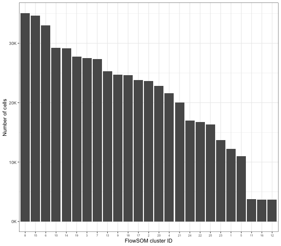


```r
if (file.exists(here::here("data", "r21_healthy_phenograph.rds"))) { 
  healthy_clusters_2 <- 
    read_rds(here::here("data", "r21_healthy_phenograph.rds"))
  
} else { 
  # takes about 16 minutes on 500K cells
  healthy_clusters_2 <- 
    r21_healthy %>% 
    tof_cluster(
      cluster_cols = any_of(str_to_lower(CLASSIFIER_MARKERS)), 
      method = "phenograph"
    )
}

healthy_clusters_2 %>% 
  count(.phenograph_cluster, sort = TRUE)
```

```
## # A tibble: 28 × 2
##    .phenograph_cluster     n
##    <chr>               <int>
##  1 1                   59394
##  2 2                   58016
##  3 3                   41196
##  4 4                   38485
##  5 5                   34873
##  6 6                   33868
##  7 7                   32713
##  8 8                   25265
##  9 9                   24796
## 10 10                  21267
## # … with 18 more rows
```


```r
healthy_clusters_2 %>% 
  count(.phenograph_cluster, sort = TRUE) %>% 
  mutate(.phenograph_cluster = fct_reorder(.phenograph_cluster, -n)) %>% 
  ggplot(aes(y = n, x = .phenograph_cluster)) + 
  geom_col() + 
  scale_y_continuous(
    labels = scales::label_number(scale = 1/1000, suffix = "K")
  ) + 
  theme_bw() + 
  theme(axis.text.x = element_text(size = 7)) + 
  labs(
    x = "PhenoGraph cluster ID", 
    y = "Number of cells"
  )
```

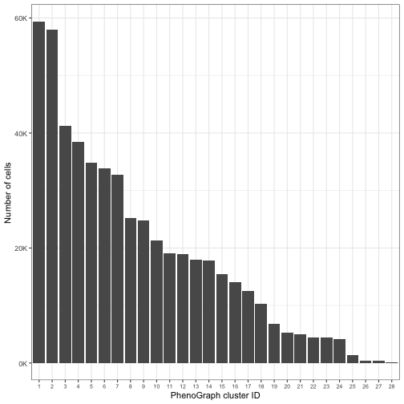


```r
### Annotate each healthy cluster with a manually-identified metacluster
healthy_metacluster_tibble <- 
  healthy_clusters %>% 
  tof_extract_central_tendency(
    cluster_col = .flowsom_cluster, 
    marker_cols = any_of(str_to_lower(SURFACE_MARKERS)), 
    format = "long"
  ) %>% 
  pivot_wider(
    names_from = channel, 
    values_from = values
  ) %>% 
  tof_cluster(
    healthy_tibble = r21_healthy, 
    healthy_label_col = gated_cluster, 
    cluster_cols = any_of(str_to_lower(SURFACE_MARKERS)), 
    return_distances = FALSE, 
    method = "ddpr"
  ) %>% 
  select(.flowsom_cluster, .mahalanobis_cluster) %>% 
  rename(
    .mahalanobis_metacluster = .mahalanobis_cluster
  )

healthy_metacluster_tibble %>% 
  count(.mahalanobis_metacluster)
```

```
## # A tibble: 7 × 2
##   .mahalanobis_metacluster     n
##   <chr>                    <int>
## 1 CMPs                         2
## 2 DCs                          2
## 3 GMPs                         2
## 4 macrophages                  4
## 5 megakaryocytes               9
## 6 MEPs                         1
## 7 monocytes                    5
```


```r
### Annotate each healthy cluster with a manually-identified metacluster
healthy_metacluster_tibble_2 <- 
  healthy_clusters_2 %>% 
  tof_extract_central_tendency(
    cluster_col = .phenograph_cluster, 
    marker_cols = any_of(str_to_lower(SURFACE_MARKERS)), 
    format = "long"
  ) %>% 
  pivot_wider(
    names_from = channel, 
    values_from = values
  ) %>% 
  tof_cluster(
    healthy_tibble = r21_healthy, 
    healthy_label_col = gated_cluster, 
    cluster_cols = any_of(str_to_lower(SURFACE_MARKERS)), 
    return_distances = FALSE, 
    method = "ddpr"
  ) %>% 
  select(.phenograph_cluster, .mahalanobis_cluster) %>% 
  rename(
    .mahalanobis_metacluster = .mahalanobis_cluster
  )

healthy_metacluster_tibble_2
```

```
## # A tibble: 28 × 2
##    .phenograph_cluster .mahalanobis_metacluster
##    <chr>               <chr>                   
##  1 1                   monocytes               
##  2 10                  megakaryocytes          
##  3 11                  megakaryocytes          
##  4 12                  megakaryocytes          
##  5 13                  macrophages             
##  6 14                  monocytes               
##  7 15                  megakaryocytes          
##  8 16                  monocytes               
##  9 17                  GMPs                    
## 10 18                  DCs                     
## # … with 18 more rows
```


```r
# classify healthy cells onto their own flowsom clusters

## using mahalanobis distance
classifier_result_flowsom <- 
  tof_cluster(
    tof_tibble = healthy_clusters,
    healthy_tibble = healthy_clusters, 
    healthy_label_col = .flowsom_cluster, 
    cluster_cols = any_of(str_to_lower(CLASSIFIER_MARKERS)), 
    parallel_cols = gated_cluster, 
    num_cores = 10L, 
    return_distances = FALSE, 
    method = "ddpr"
  )

## using cosine distance
cosine_classifier_result_flowsom <- 
    tof_cluster(
    tof_tibble = healthy_clusters,
    healthy_tibble = healthy_clusters, 
    healthy_label_col = .flowsom_cluster, 
    cluster_cols = any_of(str_to_lower(CLASSIFIER_MARKERS)), 
    distance_function = "cosine", 
    parallel_cols = gated_cluster, 
    num_cores = 10L, 
    return_distances = FALSE, 
    method = "ddpr"
  )

# accuracy by gated cluster
mahalanobis_cluster_accuracies_flowsom <- 
  classifier_result_flowsom %>%
  group_by(.flowsom_cluster) %>% 
  summarize(accuracy = mean(.flowsom_cluster == .mahalanobis_cluster)) %>% 
  arrange(-accuracy) %>% 
  mutate(cluster_type = "mahalanobis")

cosine_cluster_accuracies_flowsom <- 
  cosine_classifier_result_flowsom %>%
  group_by(.flowsom_cluster) %>% 
  summarize(accuracy = mean(.flowsom_cluster == .cosine_cluster)) %>% 
  arrange(-accuracy) %>% 
  mutate(cluster_type = "cosine")

# accuracy overall
mahalanobis_overall_accuracy_flowsom <- 
  classifier_result_flowsom %>% 
  summarize(accuracy = mean(.flowsom_cluster == .mahalanobis_cluster)) %>% 
  pull(accuracy)

cosine_overall_accuracy_flowsom <- 
  cosine_classifier_result_flowsom %>% 
  summarize(accuracy = mean(.flowsom_cluster == .cosine_cluster)) %>% 
  pull(accuracy)
```


```r
# classify healthy cells onto their own phenograph clusters

## using mahalanobis distance
classifier_result_phenograph <- 
  tof_cluster(
    tof_tibble = healthy_clusters_2,
    healthy_tibble = healthy_clusters_2, 
    healthy_label_col = .phenograph_cluster, 
    cluster_cols = any_of(str_to_lower(CLASSIFIER_MARKERS)), 
    parallel_cols = gated_cluster, 
    num_cores = 10L, 
    return_distances = FALSE, 
    method = "ddpr"
  )

# using cosine distance
cosine_classifier_result_phenograph <- 
    tof_cluster(
    tof_tibble = healthy_clusters_2,
    healthy_tibble = healthy_clusters_2, 
    healthy_label_col = .phenograph_cluster, 
    cluster_cols = any_of(str_to_lower(CLASSIFIER_MARKERS)), 
    distance_function = "cosine", 
    parallel_cols = gated_cluster, 
    num_cores = 10L, 
    return_distances = FALSE, 
    method = "ddpr"
  )

# accuracy by gated cluster
mahalanobis_cluster_accuracies_phenograph <- 
  classifier_result_phenograph %>%
  group_by(.phenograph_cluster) %>% 
  summarize(accuracy = mean(.phenograph_cluster == .mahalanobis_cluster)) %>% 
  arrange(-accuracy) %>% 
  mutate(cluster_type = "mahalanobis")

cosine_cluster_accuracies_phenograph <- 
  cosine_classifier_result_phenograph %>%
  group_by(.phenograph_cluster) %>% 
  summarize(accuracy = mean(.phenograph_cluster == .cosine_cluster)) %>% 
  arrange(-accuracy) %>% 
  mutate(cluster_type = "cosine")

# accuracy overall
mahalanobis_overall_accuracy_phenograph <- 
  classifier_result_phenograph %>% 
  summarize(accuracy = mean(.phenograph_cluster == .mahalanobis_cluster)) %>% 
  pull(accuracy)

cosine_overall_accuracy_phenograph <- 
  cosine_classifier_result_phenograph %>% 
  summarize(accuracy = mean(.phenograph_cluster == .cosine_cluster)) %>% 
  pull(accuracy)
```


```r
# plot all overall accuracies 
tibble(
  accuracy = 
    c(
      mahalanobis_overall_accuracy_flowsom, cosine_overall_accuracy_flowsom, 
      mahalanobis_overall_accuracy_phenograph, cosine_overall_accuracy_phenograph
    ), 
  distance_metric = rep(c("mahalanobis", "cosine"), 2), 
  clustering_algorithm = c(rep("flowsom", 2), rep("phenograph", 2))
) %>% 
  ggplot(aes(x = distance_metric, y = accuracy, fill = clustering_algorithm)) + 
  geom_col(position = "dodge") + 
  geom_text(aes(y = accuracy + 0.01, label = scales::label_percent(0.1)(accuracy)), position = position_dodge(width = 0.9, ), vjust = 0) + 
  theme_bw() + 
  labs(
    subtitle = "Overall classification accuracy", 
    x = NULL, 
    y = "(Cells correctly classified) / (Total cells)", 
    fill = "Clustering algorithm"
  )
```

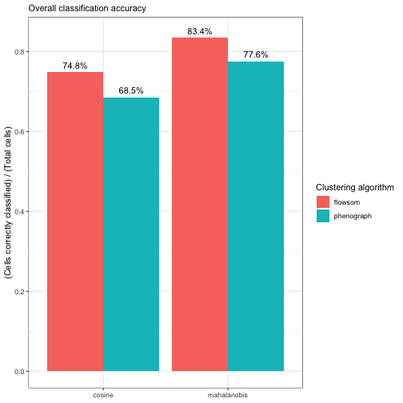


```r
# plot accuracies across clusters for both phenograph and flowsom on the healthy clusters
cosine_cluster_accuracies_phenograph %>% 
  mutate(clustering_algorithm = "phenograph") %>% 
  rename(cluster = .phenograph_cluster) %>% 
  bind_rows(
    cosine_cluster_accuracies_flowsom %>% 
      rename(cluster = .flowsom_cluster) %>% 
      mutate(clustering_algorithm = "flowsom")
  ) %>% 
  bind_rows(
    mahalanobis_cluster_accuracies_phenograph %>% 
      mutate(clustering_algorithm = "phenograph")
    %>% 
      rename(cluster = .phenograph_cluster) 
  ) %>% 
  bind_rows(
    mahalanobis_cluster_accuracies_flowsom %>% 
      rename(cluster = .flowsom_cluster) %>% 
      mutate(clustering_algorithm = "flowsom")
  ) %>% 
  ggplot(aes(x = clustering_algorithm, y = accuracy, fill = clustering_algorithm)) + 
  geom_violin(trim = FALSE) + 
  geom_boxplot(width = 0.1, fill = "white", outlier.shape = NA) + 
  geom_point(position = position_jitter(width = 0.1), size = 0.5, alpha = 0.6) + 
  facet_grid(cols = vars(cluster_type)) + 
  theme_bw() + 
  labs(
    x = "Clustering algorithm", 
    y = "Classification accuracy in each cluster",
    subtitle = "Cluster-by-cluster classification accuracy"
  )
```

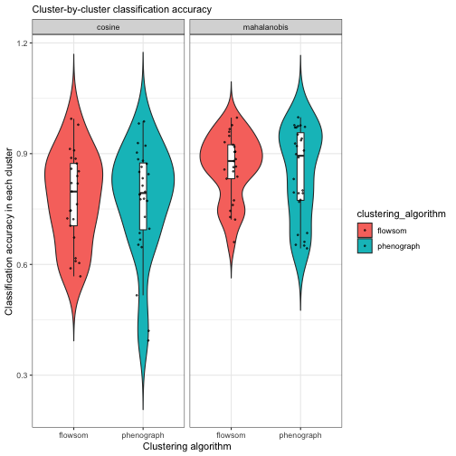


## 2) Calculate mahalanobis distance between all r21 cells and healthy clusters

Now that we have these clusters available, we can classify each cell from the larger `r21` cohort into these manually-identified subpopulations.

### Perform the classification 


```r
# classify into flowsom clusters
r21_distances_flowsom <-
  tof_cluster(
    tof_tibble = r21,
    healthy_tibble = healthy_clusters, 
    healthy_label_col = .flowsom_cluster, 
    cluster_cols = any_of(str_to_lower(CLASSIFIER_MARKERS)), 
    parallel_cols = file_name, 
    num_cores = 15L, 
    return_distances = TRUE, 
    method = "ddpr"
  )
```


```r
# classify into phenograph clusters
r21_distances_phenograph <-
  tof_cluster(
    tof_tibble = r21,
    healthy_tibble = healthy_clusters_2, 
    healthy_label_col = .phenograph_cluster, 
    cluster_cols = any_of(str_to_lower(CLASSIFIER_MARKERS)), 
    parallel_cols = file_name, 
    num_cores = 15L, 
    return_distances = TRUE, 
    method = "ddpr"
  )
```


```r
healthy_clusters_bulk <- 
  r21 %>% 
  mutate(bulk_cluster = "healthy")

# classify into healthy overall 
r21_distances_bulk <- 
  tof_cluster(
    tof_tibble = r21,
    healthy_tibble = healthy_clusters_bulk, 
    healthy_label_col = bulk_cluster, 
    cluster_cols = any_of(str_to_lower(CLASSIFIER_MARKERS)), 
    parallel_cols = file_name, 
    num_cores = 15L, 
    return_distances = TRUE, 
    method = "ddpr"
  )
```


### Profile classified cluster abundances in healthy and cancer samples 


```r
# plot depicting the distribution of clusters in healthy and cancer samples
r21_flowsom <- r21_distances_flowsom

r21_flowsom %>% 
  mutate(
    .mahalanobis_cluster = 
      factor(.mahalanobis_cluster, levels = unique(healthy_clusters$.flowsom_cluster))
  ) %>% 
  count(condition, .mahalanobis_cluster, .drop = FALSE) %>% 
  mutate(.mahalanobis_cluster = fct_reorder(.mahalanobis_cluster, -n)) %>%
  ggplot(aes(x = .mahalanobis_cluster, y = n)) + 
  geom_col() + 
  facet_grid(rows = vars(condition), scales = "free") + 
  theme_bw() + 
  theme(axis.text.x = element_text(size = 5)) + 
  labs(subtitle = "flowsom clusters", y = "Number of cells")
```

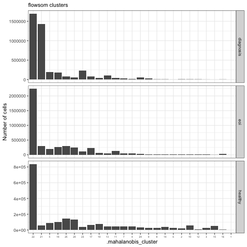


```r
# plot depicting the distribution of clusters in healthy and cancer samples
r21_phenograph <- r21_distances_phenograph

r21_phenograph %>% 
  count(condition, .mahalanobis_cluster) %>% 
  mutate(.mahalanobis_cluster = fct_reorder(.mahalanobis_cluster, -n)) %>% 
  ggplot(aes(x = .mahalanobis_cluster, y = n)) + 
  geom_col() + 
  facet_grid(rows = vars(condition), scales = "free") + 
  theme_bw() + 
  labs(subtitle = "phenograph clusters", y = "Number of cells")
```

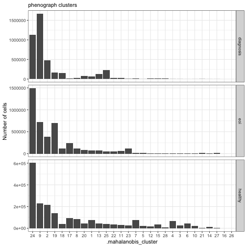

### Profile classified cluster abundances as percentage fold change of healthy 


```r
flowsom_fold_changes <- 
  r21_flowsom %>% 
  select(.mahalanobis_cluster, condition, patient, stimulation) %>% 
  count(.mahalanobis_cluster, condition) %>% 
  pivot_wider(names_from = condition, values_from = n) %>% 
  mutate(across(c(healthy, diagnosis, eoi), ~ .x / sum(.x, na.rm = TRUE))) %>% 
  mutate(
    across(c(healthy, diagnosis, eoi), ~ .x / healthy, .names = "fc_{.col}")
  ) 

flowsom_fold_changes %>% 
  mutate(
    mean_fc = rowMeans(select(flowsom_fold_changes, starts_with("fc"))), 
    .mahalanobis_cluster = fct_reorder(.mahalanobis_cluster, -mean_fc)
  ) %>% 
  pivot_longer(
    cols = starts_with("fc"), 
    names_to = "condition", 
    values_to = "fc", 
    names_prefix = "fc_"
  ) %>% 
  filter(condition != "healthy") %>% 
  mutate(log_fc = log(fc), .mahalanobis_cluster = fct_reorder(.mahalanobis_cluster, -log_fc)) %>% 
  ggplot(aes(x = .mahalanobis_cluster, y = log_fc)) + 
  geom_hline(yintercept = 0, linetype = "dashed", size = 0.5, color = "red") + 
  geom_col() + 
  facet_grid(rows = vars(condition)) + 
  theme_bw() + 
  labs(
    subtitle = "Overall fold change in AML samples relative to healthy (all cells aggregated); flowsom clusters", 
    y = "log fold change (relative to healthy)"
  )
```

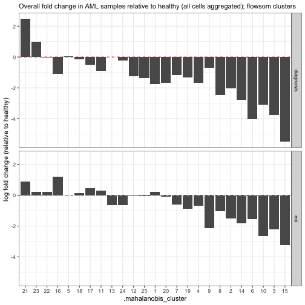


```r
phenograph_fold_changes <- 
  r21_phenograph %>% 
  select(.mahalanobis_cluster, condition, patient, stimulation) %>% 
  count(.mahalanobis_cluster, condition) %>% 
  pivot_wider(names_from = condition, values_from = n) %>% 
  mutate(across(c(healthy, diagnosis, eoi), ~ .x / sum(.x, na.rm = TRUE))) %>% 
  mutate(
    across(c(healthy, diagnosis, eoi), ~ .x / healthy, .names = "fc_{.col}")
  )

phenograph_fold_changes_overall <- 
  r21_phenograph %>% 
  select(.mahalanobis_cluster, condition, patient, stimulation) %>% 
  mutate(condition = if_else(condition == "healthy", "healthy", "aml overall")) %>% 
  count(.mahalanobis_cluster, condition) %>% 
  pivot_wider(names_from = condition, values_from = n) %>% 
  mutate(across(c(healthy, `aml overall`), ~ .x / sum(.x, na.rm = TRUE))) %>% 
  mutate(
    across(c(healthy, `aml overall`), ~ .x / healthy, .names = "fc_{.col}")
  ) %>%
  select(.mahalanobis_cluster, `aml overall`, `fc_aml overall`)
  

phenograph_fold_changes %>% 
  left_join(phenograph_fold_changes_overall) %>% 
  mutate(
    #mean_fc = rowMeans(select(phenograph_fold_changes, starts_with("fc"))), 
    .mahalanobis_cluster = fct_reorder(.mahalanobis_cluster, -`fc_aml overall`)
  ) %>% 
  pivot_longer(
    cols = starts_with("fc"), 
    names_to = "condition", 
    values_to = "fc", 
    names_prefix = "fc_"
  ) %>% 
  filter(condition != "healthy") %>% 
  mutate(log_fc = log(fc), .mahalanobis_cluster = fct_reorder(.mahalanobis_cluster, -log_fc)) %>% 
  ggplot(aes(x = .mahalanobis_cluster, y = log_fc)) + 
  geom_hline(yintercept = 0, linetype = "dashed", size = 0.5, color = "red") + 
  geom_col() + 
  facet_grid(rows = vars(condition)) + 
  theme_bw() + 
  labs(
    subtitle = "Overall fold change in AML samples relative to healthy (all cells aggregated; phenograph clusters)", 
    y = "fold change (relative to healthy)"
  )
```

```
## Joining, by = ".mahalanobis_cluster"
```

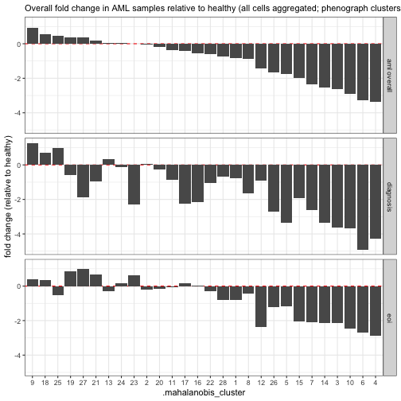

### Characterize distances from normal among healthy and cancer cells 

#### From healthy cells overall (bulk) 


```r
r21_bulk <- 
  r21_distances_bulk %>% 
  rename(distance_from_normal = .mahalanobis_healthy) %>% 
  select(-.mahalanobis_cluster)
```


```r
bulk_distance_medians <- 
  r21_bulk %>% 
  group_by(condition) %>% 
  summarize(distance_from_normal = median(distance_from_normal))

r21_bulk %>% 
  filter(
    distance_from_normal < quantile(distance_from_normal, 0.99), 
    distance_from_normal > quantile(distance_from_normal, 0.001)
  ) %>% 
  ggplot(aes(x = distance_from_normal, fill = condition)) + 
  geom_histogram(bins = 100) + 
  geom_vline(
    aes(xintercept = distance_from_normal), 
    data = bulk_distance_medians, 
    color = "black", 
    linetype = "dashed"
  ) + 
  facet_grid(rows = vars(condition), scales = "free") + 
  theme_bw() + 
  theme(legend.position = "none") + 
  labs(
    subtitle = "Distances from healthy cells (without clustering)", 
    x = "distance from normal", 
    y = "number of cells", 
    caption = "Dashed lines indicates distribution median"
  ) 
```

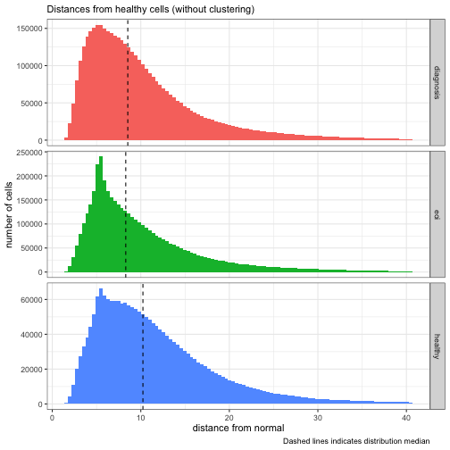


### From FlowSOM clusters 


```r
# flowsom clusters
shortest_distances_flowsom <- 
  r21_flowsom %>% 
  select(starts_with(".mahalanobis"), -contains("cluster")) %>% 
  as.matrix() %>%
  apply(1, FUN = min)

r21_flowsom <- 
  r21_flowsom %>% 
  mutate(distance_from_normal = shortest_distances_flowsom)
```


```r
flowsom_distance_medians <- 
  r21_flowsom %>% 
  group_by(condition) %>% 
  summarize(distance_from_normal = median(distance_from_normal))

r21_flowsom %>% 
  filter(
    distance_from_normal < quantile(distance_from_normal, 0.99), 
    distance_from_normal > quantile(distance_from_normal, 0.001)
  ) %>% 
  ggplot(aes(x = distance_from_normal, fill = condition)) + 
  geom_histogram(bins = 100) + 
  geom_vline(
    aes(xintercept = distance_from_normal), 
    data = flowsom_distance_medians, 
    color = "black", 
    linetype = "dashed"
  ) + 
  facet_grid(rows = vars(condition), scales = "free") + 
  theme_bw() + 
  theme(legend.position = "none") + 
  labs(
    subtitle = "Distances from nearest healthy flowsom cluster centroid", 
    x = "distance from normal", 
    y = "number of cells", 
    caption = "Dashed lines indicates distribution median"
  ) 
```

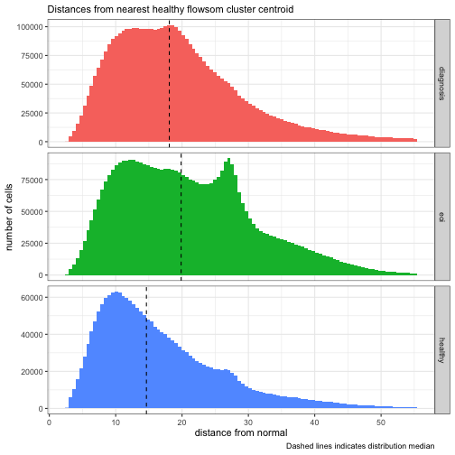


### From PhenoGraph clusters


```r
# phenograph clusters
## takes about 1 minute 
shortest_distances_phenograph <- 
  r21_phenograph %>% 
  select(starts_with(".mahalanobis"), -contains("cluster")) %>% 
  as.matrix() %>%
  apply(1, FUN = min)

length(shortest_distances_phenograph)
```

```
## [1] 10722100
```

```r
r21_phenograph <- 
  r21_phenograph %>% 
  mutate(distance_from_normal = shortest_distances_phenograph)
```


```r
phenograph_distance_medians <- 
  r21_phenograph %>% 
  group_by(condition) %>% 
  summarize(distance_from_normal = median(distance_from_normal))

r21_phenograph %>% 
  filter(
    distance_from_normal < quantile(distance_from_normal, 0.99), 
    distance_from_normal > quantile(distance_from_normal, 0.001)
  ) %>% 
  ggplot(aes(x = distance_from_normal, fill = condition)) + 
  geom_histogram(bins = 100) + 
  geom_vline(
    aes(xintercept = distance_from_normal), 
    data = phenograph_distance_medians, 
    color = "black", 
    linetype = "dashed"
  ) + 
  facet_grid(rows = vars(condition), scales = "free") + 
  theme_bw() + 
  theme(legend.position = "none") + 
  labs(
    subtitle = "Distances from nearest healthy phenograph cluster centroid", 
    x = "distance from normal", 
    y = "number of cells", 
    caption = "Dashed lines indicates distribution median"
  )
```

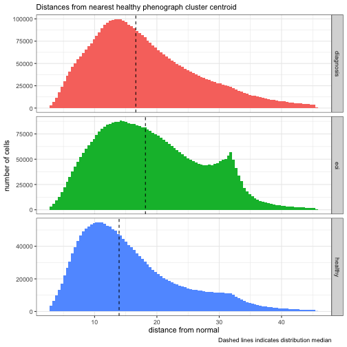


